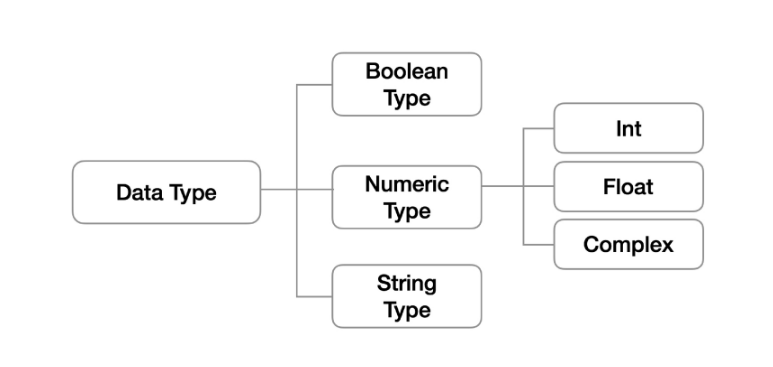

# 00.  Python 기초

[강의자료](https://edu.ssafy.com/data/upload_files/crossUpload/openLrn/ebook/unzip/A2022011415261192900/index.html)  2022-01-17

- **컴퓨터 프로그래밍 언어**

​	컴퓨터Computer: compute *calculation + remember*

​	프로그래밍Programming: *program => 일련의 명령어의 모음(집합)

​	언어: 자신의 생각을 나타내고 전달하기 위해 사용하는 체계

​		-> **컴퓨터에게 명령하기 위한 약속!**

* 선언적 지식 vs 명령적 지식

  * declarative knowledge: 사실에 대한 내용
  * imperative knowledge: How-to

    ex) 과자를 먹이기 위한 How-to -> 생각보다 자세한 명령을 해야 함

  
  

##  파이썬 개발 환경

> Python Environment

### - 파이썬이란?

- Easy to learn

  - 다른 프로그래밍 언어보다 문법이 간단하면서도 엄격하지 않음
    - ex) 변수에 별도의 **타입 지정**이 필요 없음

  - 문법 표현이 매우 간결하여 프로그래밍 경험이 없어도 짧은 시간 내에 마스터할 수 있음
    - ex) 문장을 구분할 때 중괄호({}) 대신 **들여쓰기** 사용

- Expressive Language: 같은 작업에 대해서도 타 언어에 비해 더 간결하게 작성 가능

- 크로스 플랫폼 언어

  - Windows, macOS, Linux, Unix 등 다양한 운영 체제에서 실행 가능

- Interpreter

  - 소스코드를 기계어로 변환하는 컴파일 과정 없이 바로 실행 가능
  - 코드를 대화하듯 한 줄 입력하고 실행한 후, 바로 확인할 수 있음

- Object Oriented Programming

  - 파이썬은 <u>객체지향 언어</u>이며, 모든 것이 객체로 구현되어 있음

    - 객체(object): 숫자, 문자, 클래스 등 값을 가지고 있는 모든 것

      


### - 파이썬 개발환경 종류

- 대화형 환경
  - 파이썬 기본 Interpreter
  - Jupyter Notebook (실습)
  
- 스크립트 실행 (금요일 / 평가)
  - .py 파일을 작성하고, IDE 또는 Text Editor 활용
    - 파이썬 프로그램 파일의 확장자명: .py
  
- 파이썬 기본 인터프리터: **IDLE** (Intergrated Development and Learning Environment)
  - 내장 프로그램으로 파이썬 설치 시 기본적으로 설치 -> 인터프리터가 대화형 모드로 동작함
    - 여러 줄의 코드가 작성되는 경우 보조 프롬프트(...)가 사용됨
    - 프롬프트(>>>)에 코드를 작성하면 해당 코드가 실행됨

  - Python이 설치된 환경에서는 기본적으로 활용 가능하나 디버깅 및 코드 편집, 반복 실행이 곤란

    
  
- **Jupyter Lab**
  - 웹 브라우저 환경에서 코드를 작성할 수 있는 오픈소스
    - Syntax Highlighting, Indentation, Tab completion 등 편의 기능 제공
    - 브라우저에서 코드를 실행하고 결과를 확인할 수 있음
    - HTML, LaTeX, PNG, SVG을 바탕으로 다양한 표현이 가능
    - Markdown을 기반으로 문서를 작성할 수 있음

  - 데이터 분석 / 머신 러닝 / 딥 러닝 시 많이 활용 가능하며, Google colab 등 유사한 환경의 서비스도 있음


- 파이썬 스크립트 실행: IDE(Pycharm 등), Text editor(VSC 등)에서 작성한 파이썬 스크립트 파일을 직접 실행

- 파이썬 수업

  - 알고리즘: Pycharm

  - 코딩

    - 파이썬: Jupyter Notebook & VSC 

      => 실시간으로 결과를 확인하며 학습하기 위함

    - 웹: VSCode

      => HTML / CSS, Django, Javascript, Vue 등 모두 개발하기 편한 환경

      

---


## **기초** 문법

###  - 코드 스타일 가이드

- 코드를 '<u>어떻게 작성할지'</u>에 대한 가이드라인

- 파이썬에서 제안하는 스타일 가이드
  - [pep8](https://www.python.org/dev/peps/pep-0008/)

- 기업, 오픈소스 등에서 사용되는 스타일 가이드
  - [Google style guide](https://google.github.io/styleguide/)

- 탭 등 *일관적인 코드 작성스타일*이 중요하다

  

### - 들여쓰기

> Indentation

- Space Sensitive : 문장 구분 시 {} 아닌 들여쓰기 사용

- 들여쓰기를 할 때는 space 4칸 (or 1Tab)
  - 한 코드 안에서는 반드시 한 종류의 들여쓰기 사용 -> 혼용하면 안됨
  
  - Tab으로 들여쓰면 계속 탭으로 들여써야함
  
  - 원칙적으로는 공백 (빈칸, space) 사용을 권장 (PEP8 권장사항)
  
    

### - 변수

> variable

- dust = 60 : 왼쪽에 이름을 지어주고 어떠한 값을 넣을 것 

- 변수란?

  - 컴퓨터 메모리 어딘가에 저장되어 있는 객체를 참조하기 위해 사용되는 이름

    - 객체(object): 숫자, 문자, 클래스 등 값을 가지고 있는 모든 것

      -> Things (어떠한 것, 어떠한 사물이다! 라고 일단 생각하자)

      -> 파이썬은 **객체지향 언어**이며, 모든 것이 객체로 구현되어 있음

- 동일 변수에 다른 객체를 언제든 할당하여 바뀔 수 있기 때문에, 즉 참조하는 객체가 바뀔 수 있기 때문에 변수라고 부름
- 변수는 할당 연산자(=)를 통해 값을 **할당**(assignment)
- type()
  - 변수에 할당된 값의 타입
  - 변수 활용에서 가장 핵심적인 것은 그 변수의 타입
- id()
  - 변수에 할당된 값(객체)의 고유한 identity 값이며, 메모리 주소

> 변수 연산

- 숫자 + 숫자 : 덧셈
- 문자 + 문자 : 문자를 연결
- 문자 * 숫자 : 문자를 여러번  ex) a * 3 = 파이썬파이썬파이썬

> 변수 할당

- 같은 값 동시에 할당 가능 

  ```python
  x = y = 1004
  print(x, y)
  ```

  1004 1004

- 다른 값 동시에 할당 가능(multiple assignment)

  ```python
  x, y = 1, 2
  print(x, y)
  ```

  1 2

> 실습 문제

- x = 10 y = 20일 때, 각각 값을 바꿔서 저장하는 코드를 작성하시오

```python
x, y = 10, 20
```

```python
# 임시 변수 활용 (가장 기본이 되는 방법)
tmp = x
x = y
y = tmp
print(x, y)
```
20 10

```python
# Pythonic!
y, x = x, y
print(x, y)
```

20 10

### - 식별자

>  Identifiers

- 변수(박스)의 이름을 어떻게 지을 수 있을까?

- 파이썬 객체(변수, 함수, 모듈, 클래스 등)를 식별하는 데 사용하는 이름

- 규칙
  - 식별자의 이름은 영문 알파벳, 언더스코어, 숫자로 구성
  
  - 첫 글자에 숫자가 올 수 없음
  
  - 길이제한이 없고, 대소문자를 구별
  
  - 다음의 키워드(keywords)는 예약어(reserved words)로 사용 불가능
  
    ```python
    # 불러오기 가능
    import keyword
    print(keyword.kwlist)
    ```
  
    - False, None, True, and, as, assert, async, await, break, class, continue, def, del, elif, else, except, finally, for, from, global, if, import, in, is, lambda, nonlocal, not, or, pass, raise, try, while, with, yield
  
  - **Snake case**: red_apple (파이썬에서 더 사용!)
  
  - Camel Case: RedApple


- 내장함수나 모듈 등의 이름으로도 만들면 안됨
  - 파이썬의 장점: 단단한 내장 함수! 
  
- 기존의 이름에 다른 값을 할당하게 되므로 더 이상 동작하지 않음

  

### - 사용자 입력

- `input([prompt])`
  
  - 사용자로부터 값을 즉시 입력 받을 수 있는 내장함수
  
  - 대괄호 부분에 문자열을 넣으면 입력 시, 해당 문자열 출력 가능
  
  - 반환값은 항상 문자열의 형태로 반환
  
    ```python
    name = imput('이름을 입력해주세요 : ')  # 이름을 입력해주세요 : 신선영
    print(name) 	# 신선영
    type(name)		# str
    ```
  
    
  
    

### - 주석

> Comment

- 코드에 대한 설명
  - 중요한 점이나 다시 확인하여야 하는 부분을 표시
  - 컴퓨터는 주석을 인식하지 않음! 사용자만을 위한 것


  - 가장 중요한 습관
    - 개발자에게 주석을 다루는 습관은 매우 중요
    - 쉬운 이해와 코드의 분석 및 수정이 용이
      - 주석은 코드 실행에 영향을 미치지 않을 뿐만 아니라
      - 프로그램의 속도를 느리게 하지 않으며, 용량을 늘리지 않음
    
  - 한 줄 주석: 주석으로 처리될 내용 앞에 `#` 입력

    - 한 줄을 온전히 사용할 수도 있고, 그 줄 코드 뒷부분에 작성할 수 있음

  - 여러 줄의 주석

    - 한 줄씩 `#`을 사용하거나 `"""` 또는 `'''`으로 표현

      - `"""` 또는 `'''`으로 표현하는 방법은 docstring을 위해 사용

    - or `Ctrl + /`

  - 특수한 형태의 주석: docstring

    - 함수/클래스의 설명을 작성 (03. 함수에서 후술)
    
      ```python
      def foo():
          """이 함수는 foo입니다.
          docstring으로 함수나 클래스의 기능을 설명합니다."""
      ```
    
      ```python
      foo.__ doo __
      # '이 함수는 foo입니다. /n	docstring으로 함수나 클래스의 기능을 설명합니다.'
      ```
    
      


---

 

##  파이썬 데이터 타입



### - 불린형

> Boolean Type

- True / False 값을 가진 타입은 **bool**

- 비교 / 논리 연산 수행 시 활용

- 다음은 모두 **False**로 변환
  - 0, 0.0, (), [], {}, ' ', None

- `bool()` 함수
  
  - 특정 데이터가 True인지 False인지 검증
  
  - 비어 있는 문자열이나 리스트는 모두 False
  
    

### - 수치형

> Numeric Type

#### 1) Int

- 모든 정수의 타입은 int

  - python 3부터는 long 타입은 없고, 모두 int로 표기됨
  - 여타 프로그래밍 언어, Python 2에서는 OS기준 32/64비트

- 매우 큰 수를 나타낼 때 오버플로우가 발생하지 않음
  - overflow: 데이터 타입별로 사용할 수 있는 메모리의 크기를 넘어서는 상황
  - Arbitrary precision arithmetic(임의 정밀도 산술)을 통해 고정된 메모리가 아닌 가용 메모리들을 활용하여 모든 수 표현에 활용

- 진수 표현
  - 2진수: 0b (binary)  `0b10` = 2
  - 8진수: 0o `0o30` = 24
  - 16진수: 0x `0x10` = 16

  

#### 2) Float

- **정수가 아닌 모든 실수**는 float 타입

- **부동소수점**

  - 실수를 컴퓨터가 표현하는 방법 - 2진수(비트)로 숫자를 표현
  - 이 과정에서 floating point rounding error가 발생하여, 예상치 못한 결과 발생

- **Floating Point Rounding Error**

  - 부동소수점에서 실수 연산 과정에서 발생 가능

  - 값 비교하는 과정에서 정수가 아닌 실수일 경우 주의할 것

    ```python
    # 왼쪽의 계산 결과와 오른쪽 값은 같은 값일까요?
    3.14 - 3.02 == 0.12
    ```

    False

    ```python
    3.14 - 3.02
    ```

    0.120000000000001

  - 매우 작은 수보다 작은지를 확인하거나 math 모듈 활용

    ```python
    #1. 임의의 작은 수
    abs(a - b) <= 1e-10
    ```

    True

    ```python
    #2. system상의 machine epsilon
    import sys
    print(abs(a-b) <= sys.float_info.epsilon)
    print(sys.float_info.epsilon)
    ```

    True

    2.220446049250313e-16

    ``` python
    #3. Python 3.5이상
    import math
    math.isclose(a, b)
    ```

    True	

#### 3) Complex

> 복소수

- 실수부와 허수부로 구성된 복소수는 모두 complex 타입

  - 허수부를 j로 표현

    

### - 문자열

> String Type

- 모든 문자는 str 타입

- 문자열은 작은 따옴표(') 나 큰 따옴표(") 활용하여 표기
  - 문자열 묶을 때 동일한 문장부호 활용
  - PEP8에서는 소스코드 내에서 하나의 문장부호를 선택하여 유지하도록 함

- **Immutable**: 특정 값 하나만 바꿀 수 없다

- **Iterable**: 특정 문자열 반복 가능

  ```python
  a = '123'
  for char in a:
      print(char)
  ```

  1

  2

  3

- **중첩 따옴표 Nested Quotes**

  - 따옴표 안에 따옴표를 표현할 경우
    - 작은 따옴표가 들어 있는 경우는 큰 따옴표로 문자열 생성
    - 큰 따옴표가 들어 있는 경우는 작은 따옴표로 문자열 생성

- **삼중 따옴표 Triple Quotes**

  - 작은 따옴표나 큰 따옴표를 삼중으로 사용
    - 따옴표 안에 따옴표를 넣을 때, 여러 줄을 나눠 입력할 때 편리하다


- **Escape sequence**

  - 문자열 내에서 특정 문자나 조작을 위해서 역슬래시`\`를 활용하여 구분

    - `\n`: 줄바꿈

      `\t`: 탭

      `\r`: 캐리지리턴

      `\0`: Null

      `\\`: \

      `\'`: '

      `\"`: "

    ```python
    print('철수 \'안녕\'')
    ```

    철수 '안녕'

    

- **String Interpolation** -> 문자열 사이에 변수를 넣고 싶다!

  - 문자열을 변수를 활용하여 만드는 법

    - **%-formatting** -> 거의 대부분 타 프로그래밍 언어에서 사용

      ```python
      print('Hello, %s' % name)
      print('내 성적은 %d' % score)
      print('내 성적은 %f' % score)
      ```

      Hello, Kim

      내 성적은 4

      내 성적은 4.5000000
    
    - **str.format()**

      ```python
      print('Hello, {}! 성적은 {}'.format(name, score))
      ```
    
      Hello, Kim! 성적은 4.5
    
    - **f-strings**: python 3.6 +
    
      ```python
      print (f'Hello, {name}! 성적은 {score}')
      ```
    
      Hello, Kim! 성적은 4.5


### - None

- 파이썬 자료형 중 하나

- 값이 없음을 표현하기 위한 타입

- 일반적으로 반환 값이 없는 함수에서 사용하기도 함

  ```python
  print(type(None))
  ```

  <class 'Nonetype'>

  ```python
  a = None
  print(a)
  ```

  None

  

## Container

- 컨테이너란?
  - 여러 개의 값을 담을 수 있는 것(객체)으로, <u>서로 다른 자료형을 저장</u>할 수 있음
    - ex) List, tuple

- 컨테이너의 분류
  - Ordered vs. Unordered
  - 순서가 있다 != 정렬되어 있다

  - 시퀀스형
    - 리스트 (가변)
    - 튜플 (불변)
    - 레인지 (불변)
  - 비시퀀스형
    - 세트 (가변)
    - 딕셔너리 (가변)


### - Sequence Container

#### 1)  List

- 순서를 가지는 0개 이상의 객체를 참조하는 자료형
  - 생성된 이후 내용 변경이 가능 -> **가변자료형**
  - 유연성 때문에 파이썬에서 가장 흔히 사용

- 항상 대괄호[] 형태로 출력

- 리스트는 대괄호([]) 혹은 list()를 통해 생성

  ```python
  my_list = []
  another_list = list()
  print(type(my_list))
  print(type(another_list))
  ```
  <class 'list'>

  <class 'list'>

  ```python
  location = ['서울', '대전']
  print(location)
  print(type(location))
  ```
  [서울, 대전]

  <class 'list'>

  ```python
  location[0]
  ```

  ​	서울

  

- 순서가 있는 시퀀스로 인덱스 통해 접근 가능

  - 시작은 0, 끝은 -1 부터

    ```python
    boxes = ['A', 'B', ['apple', 'banana', 'cherry']]  # 2차원 리스트
    len(boxes)
    ```

    ​	3

    ```python 
    boxes[2]
    ```

    ['apple', 'banana', 'cherry']

    ```python
    boxes[2][-1]
    ```

    ​	cherry

    ```python
    boxes[-1][1][0]
    ```

    ​	b


#### 2) Tuple

- **순서**를 가지는 0개 이상의 객체를 참조하는 자료형
  - 생성 후, 담고 있는 객체 변경 불가 -> 불변 자료형 (immutable) (List와의 차이점)
- 항상 소괄호() 형태로 출력

- 소괄호(()) 혹은 tuple()을 통해 생성

- 수정 불가능한 시퀀스로 인덱스로 접근 가능
  - 값에 대한 접근은 my_tuple[i]

- 생성 주의사항

  - 단일 항목의 경우

    - 하나의 항목으로 구성된 튜플은 생성 시 값 뒤에 **쉼표**를 붙여야 함


  - 복수 항목의 경우

    - 마지막 항목에 붙은 쉼표는 불필요

      ```python
      a = 1,
      print(a)
      print(type(a))
      ```

      (1,)

      <class 'tuple'>


- 튜플 대입 Tuple assignment
  - 우변의 값을 좌변의 변수에 한번에 할당하는 과정

- 튜플은 일반적으로 파이썬 내부에서 활용
  - 추후 함수에서 복수의 값을 반환하는 경우에도 활용


#### 3) Range

- 숫자의 시퀀스를 나타내기 위해 사용

  - 기본형: range(n)
    - 0부터 n-1까지의 숫자의 시퀀스
  - 범위 지정: range(n, m)
    - n부터 **m-1**까지의 숫자의 시퀀스
  - 범위 및 스텝 지정: range(n, m, s)
    - n부터 m-1까지 s만큼 증가시키며 숫자의 시퀀스

  ```python
  list(range(3))
  list(range(1, 5))
  list(range(1, 5, 2))
  ```

  [0, 1, 2]

  [1, 2, 3, 4]

  [1, 3]

  ```python
  list(range(6, 1, -1))
  list(range(1, 3, -1))
  list(range(6, 1, 1))
  ```

  [6, 5, 4, 3, 2]

  []

  []

#### 4)  Packing / Unpacking

- 모든 시퀀스형(리스트, 튜플) 등은 패킹/언패킹 연산자 `*`를 사용하여 객체의 패킹 또는 언패킹이 가능

- **패킹**

  - 대입문의 좌변 변수에 위치

  - 우변의 객체 수가 좌변의 변수 수보다 많을 경우 객체를 순서대로 대입

  - 나머지 항목들은 모두 별 기호 표시된 변수에 **리스트**로 대입

    ```python
    x, *y = 1, 2, 3, 4
    print(x)
    type(x)
    print(y)
    type(y)
    ```

    1

    int

    [2, 3, 4]

    list

- **언패킹**

  - argument 이름이 *로 시작하는 경우, argument unpacking이라 함

    - \*  패킹의 경우,  리스트로 대입
    - \* 언패킹의 경우, 튜플 형태로 대입

    ```python
    def multiply(x, y, z):
        return x * y * z
    numbers = [1, 2, 3]
    multiply(*numbers)
    ```

    6

- 별표 연산자(\*)가 곱셈을 의미하는지, 패킹/언패킹 연산자인지 구분

  - 패킹/언패킹 연산자

    - \*가 대입식의 좌측에 위치하는 경우
    - \*가 단항 연산자로 사용되는 경우
      - 단항 연산자: 하나의 항을 대상으로 연산이 이루어지는 연산자

  - 산술연산자로서의 \*

    - \*가 이항연산자로 사용되는 경우

      - 이항 연산자: 두 개의 항을 대상으로 연산이 이루어지는 연산자

        

### - Associative Container

> 비시퀀스형 컨테이너

#### 1) Set

- 순서 없이 0개 이상의 해시 가능한 객체를 참조하는 자료형
  - 해시 가능한 객체(immutable)만 담을 수 있음
  
- 담고 있는 객체를 삽입 변경, 삭제 가능 -> **가변자료형** (mutable)

- 수학에서의 집합과 동일한 구조

  - 집합 연산이 가능
  - 중복된 값이 존재하지 않음

- **중복 없이** **순서가 없는** 자료구조

  - 중괄호({}) 혹은 set()을 통해 생성
    - 빈 Set를 만들기 위해서는 set()를 반드시 활용해야 함
    
      => 빈 중괄호는 dictionary
    
  - **순서가 없어** 인덱스 접근 등 별도의 값에 접근할 수 없음

    ```python
    {1, 2, 3, 1, 2}
    ```

    {1, 2, 3}

- 셋 활용시 다른 컨테이너에서 중복된 값 쉽게 제거 가능
  - 단, 이후 순서가 무시되므로 순서가 중요한 경우 사용할 수 없음
  
    ```python
    my_list = {'서울', '서울', '광주', '대전', '광주', '부산', '부산'}
    len(set(my_list))
    set(my_list)
    ```
  
    4
  
    {'광주', '대전', '부산', '서울'}  ` Set를 사용하는 순간 순서가 사라짐`

#### 2) Dictionary

- 순서 없이 키-값(key-value) 쌍으로 이뤄진 객체를 참조하는 자료형
- key와 value가 쌍으로 이뤄진 자료구조
- 중괄호{} 혹은 dict()을 통해 생성
- Dictionary의 key
  - 해시가능한 **불변** 자료형만 가능
  - 변경 불가능한 데이터(immutable)만 활용 가능
    - string, integer, float, boolean, tuple, range
- 각 키의 values
  - 어떠한 형태든 관계 없음
  - 모든 값으로 설정 가능 (List, Dictionary 등)


- key를 통해 value에게 접근

  

### - Typecasting

#### + 자료형 변환

- 파이썬에서 데이터 형태는 서로 변환할 수 없음

  - 암시적 형 변환 (Implicit)

    - 사용자가 의도하지 않고, 파이썬 내부적으로 자료형을 변환하는 경우

      - bool
      - Numeric type (int, float, complex)
  
      ```python
      True + 3
      3 + 5.0
      3 + 4j + 5
      ```
  
      4
  
      8.0
  
      (8 + 4j)
  
  - 명시적 형 변환 (Explicit)
  
    - 사용자가 특정 함수를 활용하여 **의도적으로** 자료형을 변환하는 경우
  
    - int
  
      - str, float
      - 단, 형식에 맞는 문자열만 정수로 변환 가능
  
      ```python
      # 명시적 타입 변환이 필요함
      int('3') + 4
      
      # 정수 형식이 아닌 경우 타입 변환할 수 없음
      int('3.5') + 5
      ```
  
      7
  
      !ValueError
  
    - float
  
      - str, int
      - 단, 형식에 맞는 문자열만 정수로 변환 가능
  
    - str
  
    ```python
    int('3') + 4
    ```
  
    7

#### + 컨테이너 형 변환

- range로 변형 불가능, dictionary로 변형 불가능

|            | string |   list   |  tuple   | range |   set    | dictionary |
| :--------: | :----: | :------: | :------: | :---: | :------: | :--------: |
|   string   |   -    |    o     |    o     |   x   |    o     |     x      |
|    list    |   o    |    -     |    o     |   x   |    o     |     x      |
|   tuple    |   o    |    o     |    -     |   x   |    o     |     x      |
|   range    |   o    |    o     |    o     |   -   |    o     |     x      |
|    set     |   o    |    o     |    o     |   x   |    -     |     x      |
| dictionary |   o    | o(key만) | o(key만) |   x   | o(key만) |     -      |


## 연산자

### - 산술 연산자

> Arithmetic Operator: 기본적인 사칙연산 및 수식 계산

| 연산자 |                내용                 |
| :----: | :---------------------------------: |
|   +    |                덧셈                 |
|   -    |                뺄셈                 |
|   *    |                곱셈                 |
|   /    | 나눗셈 (나눗셈은 항상 결과가 float) |
|   //   |                 몫                  |
|   **   |              거듭제곱               |


### - 비교 연산자

> Comparison Operator: 값을 비교하며, True / False 값을 리턴함


### - 논리 연산자

> Logical Operator: 일반적으로 비교연산자와 함께 사용됨

- 논리 연산자 단축평가
  - 결과가 확실한 경우 두 번째 값은 확인하지 않음
    - and 연산에서 첫번째 값이 False인 경우 무조건 False -> 첫번째 값 반환
    - or 연산에서 첫번째 값이 True인 경우 무조건 True -> 첫번째 값 반환


### - 복합 연산자

>  In-Place Operator: 연산과 대입이 함께 이루어짐

​	ex) 반복문을 통해서 개수를 카운트 하는 경우

```python
cnt = 100
cnt += 1
print(cnt)
```

101


### - 식별 연산자

>  Identity Operator: is 연산자를 통해 동일한 객체(obj)인지 확인 가능함

- OOP에서 추가 학습

  

### - 멤버십 연산자

>  Membership Operator: 포함 여부 확인

- in 
- not in 


### - Sequence Type Operator

- 산술연산자 (+)
  - 시퀀스 간의 concatenation (연결 / 인쇄)

- 반복연산자 (*)

  - 시퀀스를 반복

    

### + etc) Indexing

- 시퀀스의 특정 인덱스 값에 접근
  - 해당 인덱스가 없는 경우 IndexError


### + etc) Slicing

- 시퀀스를 특정 단위로 슬라이싱

  ```python
  #리스트
  [1, 2, 3, 5][1:4] # [포함:미포함]
  [1, 2, 3, 5][0:4:2]
  #튜플
  (1, 2, 3)[:2]
  ```

  [2, 3, 5]

  [1, 3]

  (1, 2)

- 앞에서 0부터, 뒤에서 -1부터

  

### + etc) Set 연산자

- ㅣ : 합집합

- $ : 교집합

- \- : 여집합

- ^ : 대칭차

  

### + etc) 연산자 우선 순위

- ()
- Slicing
- Indexing
- \**
- 단항 연산자(=, -): 부호
- 산술 연산자(*, /, %)
- 산술 연산자(+, -)
- 비교 연산자, in, is
- not
- and
- or


---


## 파이썬 프로그램 구성 단위

### - identifier

> 식별자

- 변수, 함수, 클래스 등 프로그램이 실행되는 동안 다양한 값을 가질 수 있는 이름
- 예약어
  - 파이썬 키워드 (명령어)

### - literal

- 읽혀지는 대로 쓰여있는 값 그 자체

```python
# name은 식별자, 즉 변수
# literal은 '신선영'
name = '신선영'
```


### - Expression

> 표현식

- 새로운 데이터 값을 생성하거나 계산하는 코드 조각


### - Statement

> 문장

- 특정한 작업을 수행하는 코드 전체
- 파이썬이 실행 가능한 최소한의 코드 단위
- 표현식은 값을 생성하는 일부분이고, 문장은 특정작업을 수행하는 코드 전체

​	모든 표현식(expression)은 문장(statement)이다


### - Function

- 특정 명령을 수행하는 함수 묶음


### - Module

- 함수/클래스의 모음 또는 하나의 프로그램을 구성하는 단위


### - Package

- 프로그램과 모듈 묶음
  - 프로그램: 실행하기 위한 것
  - 모듈: 다른 프로그램에서 불러와 사용하기 위한 것


### - Library

- 패키지 모음
