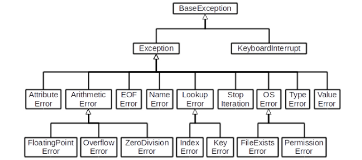
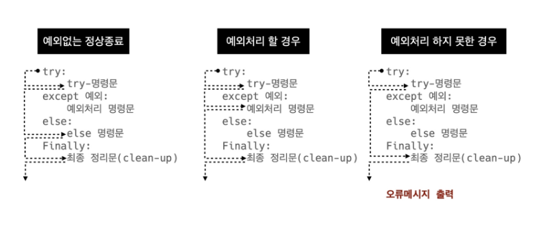
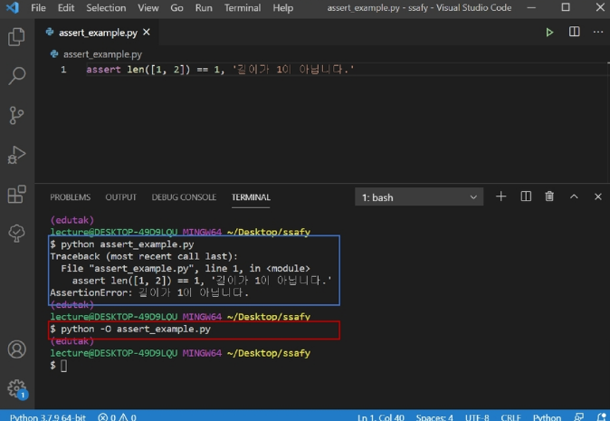

# 03_02. 에러/예외 처리

> Error / Exception Handling

[강의자료](https://edu.ssafy.com/data/upload_files/crossUpload/openLrn/ebook/unzip/A2022011415283390800/index.html) 2022-01-24


## 디버깅

>  ***"코드의 상태를 신중하게 출력해가며 심사숙고하는 것보다 효과적인 디버깅 도구는 없습니다."***      - 브라이언 커니핸, Unix for Beginners

- 조건문에서 중점적으로 봐야 할 부분은?

  -> 내가 작성한 조건문이 모든 조건을 커버하는가?

  -> **Syntax Error, Indentation Error** => 문제를 많이 풀자!

  - branches : 모든 조건이 원하는 대로 동작하는지

  - foo loops : 반복문에 진입하는지, 원하는 횟수만큼 실행되는지

  - while loops : for loops와 동일, 종료조건이 제대로 동작하는지

  - function : 함수 호출 시, 함수 파라미터, 함수 결과

    

- print 함수 활용
  - 특정 함수 결과, 반복 / 조건 결과 등 나눠서 생각, 코드를 bisection으로 나눠서 생각
  
- 개발 환경(text editor, IDE) 등에서 제공하는 기능 활용
  - breakpoint, 변수 조회 등
  
- Python tutor 활용 (단순 파이썬 코드인 경우)

- 뇌 컴파일, 눈 디버깅

  

- 에러 메시지가 발생하는 경우
  - 해당하는 위치를 찾아 메시지를 해결

- 로직 에러가 발생하는 경우
  - 명시적인 에러 메시지 없이 예상과 다른 결과가 나온 경우
    - 정상적으로 동작하였던 코드 이후 작성된 코드를 생각해봄
    
    - 전체 코드를 살펴봄
    
    - 휴식을 가져봄
    
    - 누군가에게 설명해봄
    
    - …
    
      

## 에러와 예외

### - 문법 에러 Syntax Error

- Syntax Error가 발생하면, 파이썬 프로그램은 실행이 되지 않음

- 파일 이름, 줄 번호, ＾문자를 통해 파이썬이 코드를 읽어 나갈 때(parser) 문제가 발생한 위치를 표현

- 줄에서 에러가 감지된 가장 앞의 위치를 가리키는 캐럿(caret)기호(^)를 표시

- **Invalid syntax**

  ```python
  while
  # SyntaxError: invalid syntax
  ```

- **assign to literal**

  ```python
  5 = 3
  # SyntaxError: cannot assign to literal
  ```

- **EOL (End of LIne)**

  ```python
  print('hello
  # SyntaxError: EOL while scanning string literal
  ```


- **EOF (End of File)**

  ```python
  print(
  # SyntaxError: unexpected EOF while parsing
  ```

  

### - 예외 Exception

- 실행 도중 예상치 못한 상황을 맞이하면, 프로그램 실행을 멈춤

  - 문장이나 표현식이 문법적으로 올바르더라도 발생하는 에러
- 실행 중에 감지되는 에러들을 예외(Exception)라고 부름

- 예외는 여러 타입(type)으로 나타나고, 타입이 메시지의 일부로 출력됨
  - NameError, TypeError 등은 발생한 예외 타입의 종류(이름)
- 모든 내장 예외는 Exception Class를 상속받아 이루어짐
- 사용자 정의 예외를 만들어 관리할 수 있음


- **ZeroDivisionError** : 0으로 나누고자 할 때 발생

  ```python
  10/0
  # ZeroDivisionError: division by zero
  ```

- **NameError** : namespace 상에 이름이 없는 경우

  ```python
  print(name_error)
  # NameError: name 'name_error' is not defined
  ```

- **TypeError** : 타입 불일치

  ```python
  1 + '1'
  # TypeError :unsupported operand type(s) for +: 'int' and 'str'
  ```

  - argument 누락

  ```python
  divmod()
  # TypeError : divmod expected 2 arguments, got 0
  ```

  ```python
  import random
  random.sample()
  # TypeError: sample() missing 2 required positional arguments: 'population' and 'k'
  ```

  - argument 개수 초과

  ```python
  divmod(1, 2, 3)
  # TypeError: divmod expected 2 arguments, got 3
  ```

  ```python
  import random
  random.sample(range(3), 1, 2)
  # TypeError: sample() takes 3 positional arguments but 4 were given
  ```

  - argument type 불일치

  ```python
  import random
  random.sample(1, 2)
  # TypeError: Population must be a sequence or set. For dicts, use list(d).
  ```

- **ValueError** : 타입은 올바르나 값이 적절하지 않거나 없는 경우

  ```python
  int('3.5')
  # ValueError: invalid literal for int() with base 10: '3.5'
  ```

- **IndexError** : 인덱스가 존재하지 않거나 범위를 벗어나는 경우

  ```python
  empty_list = []
  empty_list[2]
  # IndexError: list index out of range
  ```

- **KeyError** : 해당 키가 존재하지 않는 경우

  ```python
  song = {'IU' : '좋은날'}
  song['BTS']
  # KeyError: 'BTS'
  ```

- **ModuleNotFoundError** : 존재하지 않는 모듈을 import하는 경우

  ```python
  import ssafy
  # ModuleNotFoundError: No Module named 'ssafy'
  ```

- **ImportError** : Module은 있으나 존재하지 않는 클래스 / 함수를 가져오는 경우

  ```python
  from random import samp
  # ImportError: cannot import name 'samp' from 'random' 
  ```

- KeyboardInterrupt: 임의로 프로그램을 종료하였을 때

  ```python
  while True:
      continue
  # KeyboardInterrupt: 
  ```

- **IndentationError** : Indentation이 적절하지 않은 경우

  ```python
  for i in range(3):
  print(i)
  # IndentationError: expected an indented block
  ```

- 파이썬 내장 예외 (built-in-exceptions)
  - 파이썬 내장 예외의 클래스 계층 구조

    


## 예외 처리

- try 문(statement) / except 절(clause)을 이용하여 예외 처리를 할 수 있음

- try문

  - 오류가 발생할 가능성이 있는 코드를 실행
  - 예외가 발생되지 않으면, except 없이 실행 종료

- exept문

  - 예외가 발생하면, except 절이 실행
  - 예외 상황을 처리하는 코드를 받아서 적절한 조치를 취함

- 작성 방법

  ```python
  try:
      try 명령문
  except 예외그룹-1 as 변수-1:
      예외처리 명령문 1
  except 예외그룹-2 as 변수-2:
      예외처리 명령문 2
  finally: #선택사항
      finally명령문
  ```

  ```python
  try:
      num = input('숫자 입력 : ')
      print(int(num))
  except ValueError:
      print('숫자가 입력되지 않았습니다.')
  ```




- 복수의 예외 처리 실습

  - 100을 사용자가 입력한 값으로 나누고 출력하는 코드를 작성해보시오

    - 먼저, 발생 가능한 에러가 무엇인지 예상해보시오.

    ```python
    num = input('100으로 나눌 값을 입력하시오 : ')
    print(100/int(num))
    ```

    ```python
    # 발생 가능한 에러를 모두 명시
    try:
        num = input('100으로 나눌 값을 입력하시오 : ')
    	(100/int(num))
    except (ValueError, ZeroDivisionError):
        print('제대로 입력해줘')
    ```

    ```python
    # 에러 별로 별도의 에러처리
    try:
        num = input('100으로 나눌 값을 입력하시오 : ')
    	(100/int(num))
    except ValueError:
        print('숫자를 넣어주세요')
    except ZeroDivisionError:
        print('0으로 나눌 수 없습니다.')
    except:
        print('에러는 모르지만 에러가 발생하였습니다.')
    ```

    ```python
    # 순차적으로 수행되므로 가장 작은 범주부터 예외 처리를 해야함
    try:
        num = input('100으로 나눌 값을 입력하시오 : ')
    	(100/int(num))
    except Exception: # Exception은 가장 큰 범주
        print('에러는 모르지만 에러가 발생하였습니다.')
    except ValueError:
        print('숫자를 넣어주세요')
    ```

    

- 예외 처리 종합

  - **try**
    - 코드를 실행함
    
  - **except**

    - try문에서 예외가 발생 시 실행함

  - **else**

    - try문에서 예외가 발생하지 않으면 실행함

  - **finally**

    - 예외 발생 여부와 관계없이 항상 실행함

    

- 예외 처리 종합 예시

  - 파일을 열고 읽는 코드를 작성하는 경우
    - 파일 열기 시도
      - 파일 없는 경우 => '해당 파일이 없습니다.' 출력
      - 파일 있는 경우 -=> 파일 내용을 출력
    - 해당 파일 읽기 작업 종료 메시지 출력
    
    

- 에러 메시지 처리 (as)

  - as 키워드를 활용하여 원본 에러 메시지를 사용할 수 있음

    - 예외를 다른 이름에 대입

    ```python
    try:
        empty_list = []
        print(empty_list[-1])
    except IndexError as err:
        print(f'{err}, 오류가 발생했습니다.')
    ```

    list index out of range, 오류가 발생했습니다.

## 예외 발생시키기

- **raise** statement

  - raise를 통해 예외를 강제로 발생

    ```
    raise <표현식> (메시지)
    ```

    표현식 => 예외 타입 지정 (주어지지 않을 경우 현재 스코프에서 활성화된 마지막 예외를 다시 일으킴)

    ```python
    raise ValueError('값 에러 발생')
    # ValueError: 값 에러 발생
    ```

    

- **assert** statement

  - assert를 통해 예외를 강제로 발생

  - assert는 상태를 검증하는데 사용되며, 무조건 AssertionError가 발생

  - 일반적으로 디버깅 용도로 사용

    ```
    assert <표현식>, <메시지
    ```

    표현식 => False인 경우 Assertion Error

    ```python
    assert len([1, 2]) == 1, '길이가 1이 아닙니다'
    # AssertionError: 길이가 1이 아닙니다
    ```

  - 파이썬 실행

    - -O 옵션으로 실행하는 경우, assert문과 __ debug __ 에 따른 조건부 코드를 제거 후 실행

    

  

- raise vs assert

  - raise : 실제 프로덕션 코드에서 활용
  - assert : 특정 조건이 거짓이면 발생, 디버깅 및 테스트에서 활용
