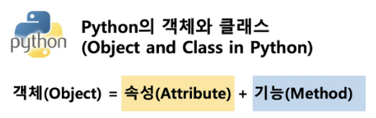
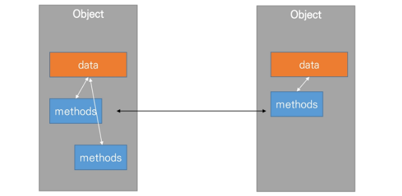
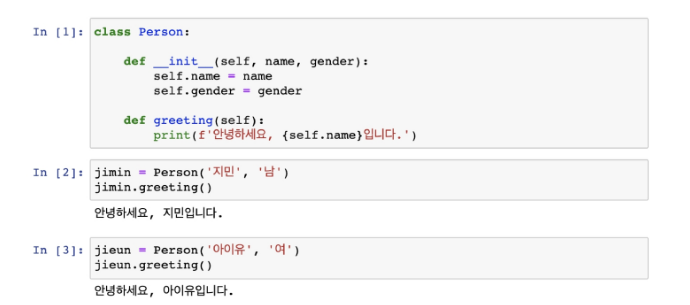
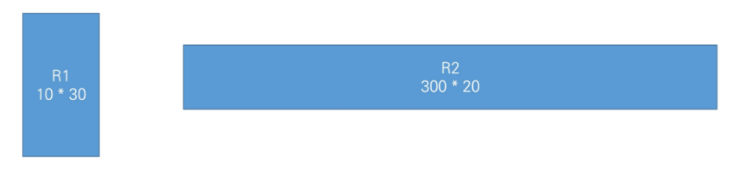
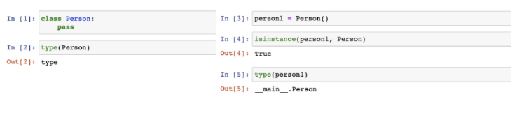
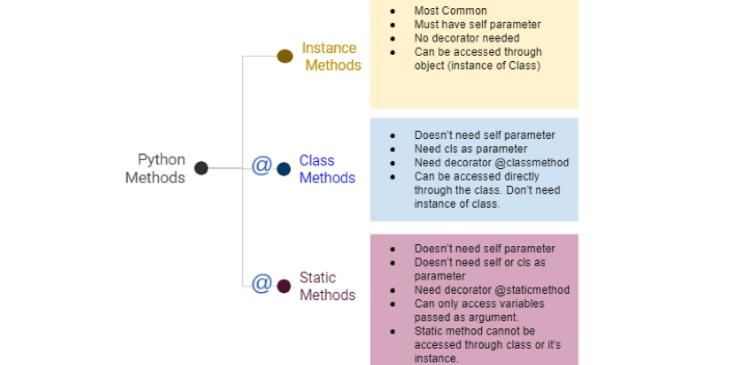
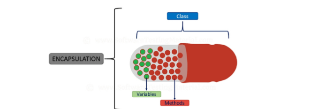

# 04. OOP

  [강의자료](https://edu.ssafy.com/data/upload_files/crossUpload/openLrn/ebook/unzip/A2022011415285732200/index.html)  2022-01-26

----

> 지난 시간

- 파이썬 : 파이썬은 모든 것이 **객체(object)**

- 컴퓨터 프로그래밍 언어
  - computer = calculation + remember

- 함수 (function)

- 데이터 구조 : 메서드

  

> 객체란?

- 객체(컴퓨터 과학)

  컴퓨터 과학에서 객체 또는 오브젝트(object)는 **클래스에서 정의한 것을 토대로 메모리(실제 저장공간)에 할당된 것**으로 프로그램에서 사용되는 데이터 또는 식별자에 의해 참조되는 공간을 의미하며, 변수, 자료 구조, 함수 또는 메소드가 될 수 있다.

- 객체 지향 프로그래밍

  객체 지향 프로그래밍(영어: Object-Oriented Programming, OOP)은 컴퓨터 프로그래밍의 패러다임 중 하나이다. 객체 지향 프로그래밍은 컴퓨터 프로그램을 명령어의 목록으로 보는 시각에서 벗어나 여러 개의 독립된 단위, 즉 '객체'들의 모임으로 파악하고자 하는 것이다. 각각의 객체는 메시지를 주고받고, 데이터를 처리할 수 있다.

- 파이썬은 모든 것이 객체
  - 대상의 정보와 동작 
  - S + V  => 객체가 바로 주어
  - (3+4j).real => 복소수.실수
  - [3, 2, 1].sort() => 리스트.정렬()
- 타입과 실제 사례(값)
  - [1, 2, 3] [] ['a'] : 모두 리스트


## 객체 지향 프로그래밍 (OOP)

- 파이썬은 모두 객체(object)로 이루어져 있다.

- 객제(object)는 특정 타입의 인스턴스(instance)이다.  => 사례!
  - 123, 900, 5는 모두 int의 인스턴스
  - 'hello', 'bye'는 모두 string의 인스턴스
  - [232, 89, 1], []은 모두 list의 인스턴스

- 객체의 특징

  - 타입(type) : 어떤 연산자(operator)와 조작(method)이 가능한가?
  - 속성(attribute) : 어떤 상태(데이터)를 가지는가?
  - 조작법(method) : 어떤 행위(함수)를 할 수 있는가?

  

- 객체 지향 프로그래밍이란?

  - 객체를 지향하겠다, 바라보겠다! (oriented) -> 결국 객체가 중심이 됨
  - 컴퓨터 프로그램을 명령어의 목록으로 보는 시각에서 벗어나 로그램을 여러 개의 독립된 객체들과 그 객체들 간의 상호작용으로 파악하는 프로그래밍 방법
  - 예시) 콘서트 : 가수 객체 / 감독 객체 / 관객 객체
  - 데이터와 기능(메소드) 분리, 추상화된 구조(인터페이스)
  - 기능을 분리시키고 데이터를 직접적으로 조작
  - a.sort()
    - 직접 sort와 reverse되어 변화 가능

  

- cf) 절차 지향 프로그래밍

  - 데이터와 함수로 인한 변화
  - a = sorted(a)
    - a가 무엇을 직접적으로 할 수는 없음, 함수 안에 들어갔다가 결과로 반환될 뿐

  

- 객체 지향 프로그래밍이 필요한 이유

  - 현실 세계를 프로그램 설계에 반영(추상화)

  

  

  - 예시) 사각형 넓이 구하기 코드

    

    - 절차 지향 프로그래밍

      ```python
      # 단순 변수
      a = 10
      b = 30
      square1_area = a * b
      square1_circumference = 2 * (a + b)
      
      c = 300 
      d = 20
      squar2_area =  c * d
      square2_circumference = 2 * (c + d)
      ```

      ```python
      # 함수
      def area(x, y):
          return x * y
      
      def circumference(x, y):
          return 2 (x + y)
      
      square1_area = area(a, b)
      square1_circumference = circumference(a, b)
      ```

    - 객체 지향 프로그래밍

      ```python
      # 객체
      class Rectangle:
          def __init__(self, x, y):
              self.x = x
              self.y = y
              
          def area(self):
              return self.x * self.y
          
          def circumference(self):
              return 2 * (self.x + self.y)
          
      r1 = Rectangle(10, 30)
      r1.area()
      r1.circumference()
      ```

      - 사각형 - **클래스(class)**

      - 각 사각형(R1, R2) - **인스턴스(instance)**

      - 사각형의 정보 - **속성(attribute)**
        - 가로 길이, 세로 길이

      - 사각형의 행동 - **메소드(method)**

        - 넓이를 구한다. 높이를 구한다.

          

- 객체 지향의 장점(위키피디아)
  - 객체 지향 프로그래밍은 <u>프로그램을 유연하고 변경이 용이</u>하게 만들기 때문에 대규모 소프트웨어 개발에 많이 사용된다.
  - 또한, 프로그래밍을 더 배우기 쉽게 하고 소프트웨어 개발과 보수를 간편하게 하며, 보다 <u>직관적인 코드 분석</u>을 가능하게 하는 장점을 가지고 있다.


### - OOP 기초

- 기본 문법
  - 클래스 정의       class MyClass:
  
  - 인스턴스 생성    my_instance = Myclass()              ex) result = list()
  
  - 메소드 호출        my_instance.my_method()
  
  - 속성	                my_instance.my_attribute
  
    
  
- 클래스와 인스턴스

  - 객체의 틀(클래스)을 가지고, 객체(인스턴스)를 생성한다.

  - 클래스 : 객체들의 분류(class)

  - 인스턴스 : 하나하나의 실체/예 (instance)

  - *파이썬은 모든 것이 객체, 모든 객체는 특정 타입의 인스턴스*

    

  

- **속성**
  
  - 특정 데이터 타입/클래스의 객체들이 가지게 될 상태/데이터를 의미
  
    
  
- **메소드**
  
  - 특정 데이터 타입/클래스의 객체에 공통적으로 적용 가능한 행위(함수)
  
    
  
- 객체 비교하기
  - **==**
    - 동등한(equal)
    - 변수가 참조하는 객체가 동등한(내용이 같은) 경우 True
    - 두 객체가 같아 보이지만 실제로 동일한 대상을 가리키고 있다고 확인해 준 것은 아님
  - **is**
    - 동일한(identical)
    - 두 변수가 동일한 객체를 가리키는 경우 True
    - if a -- None: 을 쓰는 경우 is가 더 자연스러움


### - 인스턴스

- 인스턴스 변수?
  - 인스턴스가 개인적으로 가지고 있는 속성(attribute)
  
  - 각 인스턴스들의 고유한 변수
  
  - 생성자 메소드에서 self.< name>으로 정의
  
  - 인스턴스가 생성된 이후 < instance>, < name>으로 접근 및 할당
  
    
  
- 인스턴스 메소드

  - 인스턴스 변수를 사용하거나, 인스턴스 변수에 값을 설정하는 메소드

  - 클래스 내부에 정의되는 메소드의 기본

  - 호출 시, 첫 번째 인자로 인스턴스 자기자신(self)이 전달됨

    ```python
    class Myclass:
        def instance_method(self, arg1, ...):
    
    my_instance = MyClass
    my_instance.instance_method(...)
    ```

  

- **self**
  
  - 인스턴스 자기 자신
  
  - 파이썬에서 인스턴스 메소드는 호출 시 첫번째 인자로 인스턴스 자신이 전달되게 설계
    - 매개변수 이름으로 self를 첫번째 인자로 정의
    
    - 다른 단어를 써도 작동하지만, 파이썬의 암묵적인 규칙
    
      
  
- **생성자(constructor) 메소드**
  
  - 인스턴스 객체가 생성될 때 자동으로 호출되는 메소드
  
  - 인스턴스 변수들의 초기값을 설정
    - 인스턴스 생성
    - __ init __ 메소드 자동 호출
  
    ```python
    class Person:
        def __init__(self):
            print('인스턴스가 생성되었습니다.')
    ```
  
    ```python
    person1 = Person()
    ```
  
    인스턴스가 생성되었습니다.


- **소멸자(destructor) 메소드**

  - 인스턴스 객체가 소멸(파괴)되기 직전에 호출되는 메소드

    ```python
    class Person:
        def __del__(self):
            print('인스턴스가 사라졌습니다.')
    ```

    ```python
    person1 = Person()
    del person1
    ```

    인스턴스가 사라졌습니다.


- 매직 메소드

  - Double underscore(_ _)가 있는 메소드는 특수한 동작을 위해 만들어진 메소드로, 스페셜 메소드 혹은 매직 메소드라고 불림

  - 특정 상황에 자동으로 불리는 메소드

  - 예시

    _ _ str _ _ (self), _ _ len(self) _ _ , _ _ repr _ _ (self), _ _ lt _ _ (self, other), _ _ le _ _ (self, other) , 

    _ _ eq _ _ (self, other), _ _ gt _ _ (self, other), _ _ ge _ _ (self, other), _ _ ne _ _ (self, other)


- 매직 메소드 예시

  - 객체의 특수 조작 행위를 지정 (함수, 연산자 등)

    - _ _ str_ _ : 해당 객체의 출력 형태를 지정
      - 프린트 함수를 호출할 때, 자동으로 호출
      - 어떤 인스턴스를 출력하면 _ _ str _ _ 의 return 값이 출력
    - _ _ gt _ _ : 부등호 연산자 (>, greater than)

    ```python
    class Circle:
        
        def __init__(self, r):
            self.r = r
            
        def area(self):
            return 3.14 * self.r * self.r
        
        def __str__(self):
            return f'[원] radius: {self.r}'
        
        def __gt__(self, other):
            return self.r > other.r
    ```

    ```python
    c1 = Circle(10)
    c2 = Circle(1)
    print(c1)  # [원] radius = 10
    print(c2)  # [원] radius = 1
    c1 > c2  # True
    c1 < c2  # False
    ```

    

### - 클래스

- **클래스 변수**
  
  - 한 클래스의 모든 인스턴스라도 똑같은 값을 가지고 있는 속성
  
  - 클래스 이름 대신 인스턴스 이름을 쓰면?
  
    - 인스턴스 변수
  
  - 클래스 속성(attribute)
  
    - 한 클래스의 모든 인스턴스라도 똑같은 값을 가지고 있는 속성
  
  - 클래스 선언 내부에서 정의
  
  - < classname >.< name >으로 접근 및 할당
  
    ```python
    class Circle:
        pi = 3.14   # 클래스 변수 정의
        
    c1 = Circle()
    print(circle.pi)    # 3.14
    print(cl.pi)		# 3.14
    ```


- **클래스 메소드**

  - 클래스가 사용할 메소드

  - @classmethod 데코레이터를 사용하여 정의

    - 데코레이터 : 함수를 어떤 함수로 꾸며서 새로운 기능을 부여

  - 호출 시, 첫 번째 인자로 클래스(cls)가 전달됨

    ```python
    class MyClass:
        
        @classmethod
        def class_method(cls, arg1, ...):
            
    Myclass.class_method(...)
    ```


- **스태틱 메소드**

  - 인스턴트 변수, 클래스 변수를 전혀 다루지 않는 메소드

  - 언제 사용하는가?

    - 속성을 다루지 않고 단지 기능(행동)만을 하는 메소드를 정의할 때, 사용

  - 클래스가 사용할 메소드

  - @staticmethod 데코레이터를 사용하여 정의

  - 호출 시, 어떠한 인자도 전달되지 않음 (클래스 정보에 접근 / 수정 불가)

    ```python
    class Myclass:
        
        @staticmethod
        def class_method(arg1, ...):
            
    MyClass.static_method(...)
    ```

    

- 인스턴스와 클래스 간의 이름 공간 (namespace)
  - 클래스를 정의하면, 클래스와 해당하는 이름 공간 생성
  - 인스턴스를 만들면, 인스턴스 객체가 생성되고 이름 공간 생성
  - 인스턴스에서 특정 속성에 접근하면, 인스턴스-클래스 순으로 탐색


- 정리

  - 클래스 구현
    - 클래스 정의
    - 데이터 속성 정의 (객체의 정보는 무엇인지)
    - 메소드 정의 (객체를 어떻게 사용할 것인지)

  - 클래스 활용
    - 해당 객체 타입의 인스턴스 생성 및 조작


### - 메소드 정리



- **인스턴스 메소드**

  - self 매개변수를 통해 동일한 객체에 정의된 속성 및 다른 메소드에 자유롭게 접근 가능

  - 클래스 자체에도 접근 가능 -> <u>인스턴스 메소드가 클래스 상태를 수정</u>할 수도 있음

    

- **클래스 메소드**

  - 클래스를 가리키는 cls 매개 변수를 받음

  - cls 인자에만 접근할 수 있기 때문에 객체 인스턴스 상태를 수정할 수 있음

    

- **스태틱 메소드**

  - 임의개수의 매개변수를 받을 수 있지만, self나 매개변수는 사용하지 않음

  - 객체 상태나 클래스 상태를 수정할 수 없음

  - 일반 함수처럼 동작하지만 클래스의 이름공간에 귀속됨
    - 주로 해당 클래스로 한정하는 용도로 사용 (-> 클래스 종속적인 모습을 보임)
    
      

- 예시

  ```python
  class Myclass:
      
      def method(self):
          return 'instance method', self
      
      @classmethod
      def classmethod(cls):
          return 'class method', cls
      
      @staticmethod
      def staticmethod():
          return 'static metod'
  ```

  - 인스턴스 메소드를 호출한 결과

  ```python
  obj = MyClass()
  obj.method()   # ('instance method', <__main__.Myclass at 0x185fd086a00)
  MyClass.method(obj)  # ('instance method', <__main__.Myclass at 0x185fd086a00)
  ```

  - 클래스 자체에서 각 메소드를 호출하는 경우
    - 인스턴스 메소드는 호출할 수 없음

  ```python
  MyClass.classmethod()  # ('class method', __main__.MyClass)
  MyClass.staticmethod()	# 'static method'
  MyClass.method()  # TypeError: method() missing 1 required positional argument: self
  ```

  - 인스턴스는 클래스 메소드와 스태틱 메소드 모두 접근할 수 있음

  ```python
  obj.classmethod() # ('class method', __main__.MyClass)
  MyClass.classmethod()  # ('class method', __main__.MyClass)
  obj.staticmethod()  # 'static method'
  ```

  

​	

##   

## 객체 지향의 핵심 개념

### - 추상화

- 현실 세계를 프로그램 설계에 반영

- 클래스로 나눌 수 있다!
- 행동도 각자 정의해줄 수 있다.
- 내부 로직을 모르더라도 사용자는 추상화된 프로그램 사용 가능


### - 상속

- 상속이란
  - 두 클래스 사이 부모-자식 관계를 정립하는 것

- 클래스는 상속이 가능함

  - 모든 파이썬 클래스는 object를 상속 받음

    ```python
    class ChildClass(ParentClass):
        pass
    ```

- 하위 클래스는 상위 클래스에 정의된 속성, 행동, 관계 및 제약 조건을 모두 상속 받음

- 부모 클래스의 속성, 메소드가 자식 클래스에 상속되므로, 코드 재사용성이 높아짐

- 상속을 통한 메소드 재사용


- 상속 관련 함수와 메소드

  - **isinstance(object, classinfo)**

    - classinfo의 instance거나 subclass인 경우 True

      ```python
      class Person:
          pass
      
      class Student(Person):
          pass
      
      class Professor(Person):
          pass
      ```

      ```python
      p1 = Person()
      s1 = Student()
      prof1 = Professor()
      ```

      ```python
      isinstance(p1, Person)  # True
      isinstance(s1, Person)  # True
      isinstance(p1, Student) # False
      ```

  - **issubclass(class, classinfo)**

    - class가 classinfo의 subclass이면 True

    - classinfo는 클래스 객체의 튜플일 수 있으며, classinfo의 모든 항목을 검사

      ```python
      issubclass(Student, Person) # True
      issubclass(bool, int)  # True     (bool : 0, 1 / int : 1, 2, 3, 4, ...)
      issubclass(float, int)  # False   (float : 실수.. 정수 + 소수)
      ```

  - **super()**

    - 자식 클래스에서 부모 클래스를 사용하고 싶은 경우

      ```python
      class Person:
          
          def __init__(self, name, age):
              self.name = name
              self.age = age
              
          def talk(self):
              print(f'반갑습니다. {self.name}입니다.')
              
      class Student(Person):
          
          def __init__(self, name, age, student_id):
              super().__init__(name, age)
              self.student_id = student_id
      ```

      ```python
      s1 = Student('영주', 26, '20220101')
      s1.name # '영주'
      s1.age  # 26
      ```

    

- 상속 정리
  - 파이썬의 모든 클래스는 object로부터 상속됨

  - 부모 클래스의 모든 요소(속성, 메소드)가 상속됨

  - super()를 통해 부모 클래스의 요소를 호출할 수 있음

  - 메소드 오버라이딩을 통해 자식 클래스에서 재정의 가능함

  - 상속관계에서의 이름 공간은 인스턴스, 자식 클래스, 부모 클래스 순으로 탐색

    

- **다중 상속**

  - 두 개 이상의 클래스를 상속받는 경우

  - 상속받은 모든 클래스의 요소를 활용 가능함

  - 중복된 속성이나 메서드가 있는 경우 상속 순서에 의해 결정됨

    ```python
    class Person:
        def __init__(self, name, age):
            self.name = name
            
        def greeting(self):
            return f'안녕, {self.name}'
    ```

    ```python
    class Mom(Person):
        gene = 'XX'
        
        def swim(self):
            return '엄마가 수영'
    ```

    ```python
    class Dad(Person):
        gene = 'XY'
        
        def walk(self):
            return '아빠가 걷기'
    ```

    ```python
    class Firstchild(Dad, Mom):
        def swim(self):
            return '첫째가 수영'
        
        def cry(self):
            return '첫째가 응애'
    ```
    
    ```python
    baby1 = Firstchild('아가')
    baby1.cry()	# '쳣째가 응애'
    baby1.swim()  # '첫째가 수영'
    baby1.walk()  # '아빠가 걷기'
    baby1.gene  # 'XY'
    ```
    
    ```python
    class SecondChild(Mom, Dad):
        def walk(self):
            return '둘째가 걷기'
        
        def cry(self):
            return '둘째가 응애'
    ```
    
    ```python
    baby2 = SecondChild('애기')
    baby2.cry() # '둘째가 응애'
    baby2.walk()  # '둘째가 걷기'
    baby2.swim()  # '엄마가 수영'
    baby2.gene  # 'XX'
    ```
    
    

- **mro 메소드 (Method Resolution Order)**

  - 해당 인스턴스의 클래스가 어떤 부모 클래스를 가지는지 확인하는 메소드


  - 기존의 인스턴스 -> 클래스 순으로 이름 공간을 탐색하는 과정에서 상속 관계에 있으면 인스턴스 -> 자식 클래스 -> 부모 클래스로 확장


  - 다중 상속인 경우 먼저 상속받은 것

    ```python
    FirstChild.mro()
    # [__main__.Firstchild, __main__.Dad, __main__.Mom, __main.__.person, object]
    
    SecondChild.mro()
    # [__main__.SecondChild, __main__.Mom, __main__.Dad, __main__.person, object]
    ```

    

### - 다형성

- 다형성(Polymorphism)이란:
  - 여러 모양을 뜻하는 그리스어
  
  - 동일한 메소드가 클래스에 따라 다르게 행동할 수 있음을 의미
  
  - 즉, 서로 다른 클래스에 속해 있는 객체들이 <u>동일한 메시지에 대해 다른 방식으로 응답</u>될 수 있음
  
    
  
- 메소드 오버라이딩
  - 상속 받은 메소드를 재정의
    - 클래스 상속 시, 부모 클래스에서 정의한 메소드를 자식 클래스에서 변경
    - 부모 클래스의 메소드 이름과 기본 기능은 그대로 사용하지만, 특정 기능을 바꾸고 싶을 때 사용
    - 상속받은 클래스에서 같은 이름의 메소드로 덮어씀
    - 부모 클래스의 메소드를 실행시키고 싶은 경우 super를 활용


### - 캡슐화

- 객체의 일부 구현 내용에 대해 외부로부터의 직접적인 액세스를 차단

  - 예시 : 주민등록번호

- 파이썬에서 암묵적으로 존재하지만, 언어적으로는 존재하지 않음

  

- 접근제어자 종류
  - Public Access Modifier : 어디서나
  - Protected Access Modifier : 상속 관계에 있는 클래스
  - Private Access Modifier : 본인


- **Public Member**

  - 언더바 없이 시작하는 메소드나 속성

  - 어디서나 호출이 가능, 하위 클래스 override 허용

  - 일반적으로 작성되는 메소드와 속성의 대다수를 차지

    

- **Protected Member**

  - 언더바 1개로 시작하는 메소드나 속성

  - 암묵적 규칙에 의해 부모 클래스 내부와 자식 클래스에서만 호출 가능

  - 하위 클래스 override 허용

    

- **Private Member**

  - 언더바 2개로 시작하는 메소드나 속성
  - 본 클래스 내부에서만 사용이 가능
  - 하위클래스 상속 및 호출 불가능 (오류)
  - 외부 호출 불가능 (오류)

  

- getter 메소드와 setter 메소드

  - 변수에 접근할 수 있는 메소드를 별도로 생성

    - getter 메소드 : 변수의 값을 읽는 메소드
      - @property 데코레이터 사용
    - setter 메소드 : 변수의 값을 설정하는 성격의 메소드
      - @변수.setter 사용

    ```python
    class Person:
        def __init__(self, age):
            self._age = age
            
        @property
        def age(self):
            return self_age
        
        @age.setter
        def age(self, new_age):
            if new_age <= 19:
                raise ValueError('Too Young For It')
                return
            
            self._age = new_age
    ```

    ```python
    p1 = Person(20)
    print(p1.age)  # 20 (Person의 인스턴스를 만들어 나이에 접근하면 정상적으로 출력)
    p1.age = 33
    print(p1.age)  # 33 (p1 인스턴스의 나이를 다른 값으로 바꿔도 정상적 반영)
    p1.age = 19
    print(p1.age)  # ValueError: To Young For It  (setter 함수의 조건문 때문)
    ```

    