# 02_Web

> [강의자료](https://edu.ssafy.com/data/upload_files/crossUpload/openLrn/ebook/unzip/A2022012810325778600/index.html)  2022-02-07

## CSS Layout

- CSS Layout techniques
  - Display
  - Position
  - Float (CSS1, 1996)
  - Flexbox (2012) --> 많은 변화를 가져옴!
  - Grid (2017)
  - 기타
    - Responsive Web Design(2010), Media Queries (2012)

### float

- **CSS 원칙 1**

  *모든 요소는 **네모(박스모델)**이고, 위에서부터 아래로, 왼쪽에서 오른쪽으로 쌓인다. **(좌측 상단에 배치)***

  

- **float**
  
  - 박스를 왼쪽 혹은 오른쪽으로 이동시켜 텍스트를 포함한 인라인요소들이 주변을 wrapping 하도록 함
  
  - 요소가 <u>Normal flow를 벗어나도록</u> 함
  
     (cf. positioning(absolute_static이 아닌 부모, fixed_브라우저(viewport) 기준))
  
    
  
- **float 속성**
  
  - none : 기본값
  
  - left : 요소를 왼쪽으로 띄움
  
  - right : 요소를 오른쪽으로 띄움
  
    
  
- float 예시

  - Lorem Ipsum : dummy text 제작 (Lorem 300)
  
  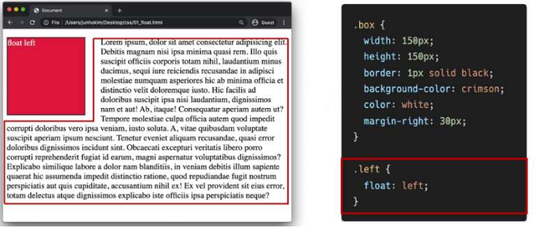


- **Clearing Float**
  
  - Float는 Normal Flow에서 벗어나 부동 상태 (떠 있음)
  
  - 따라서, 이후 요소에 대하여 Float 속성이 적용되지 않도록 Clearing이 필수적임
    - ::after : 선택한 요소의 맨 마지막 자식으로 가상 요소를 하나 생성
      - 보통 content 속성과 함께 짝지어, 요소에 장식용 콘텐츠를 추가할 때 사용
    - clear 속성 부여 --> 부모 요소에게!
    
    ```css
    .clearfix::after {
    	content: "";
    	display: block;
    	clear: both;
    }
    ```
    
    

- **Float 정리**

  - Float는 레이아웃을 구성하기 위해 필수적으로 활용되었으며, 최근엔 Flexbox, Grid 등장과 함께 사용도가 낮아짐

  - Float 활용 전략 - Normal Flow에서 벗어난 레이아웃 구성

    - 원하는 요소들을 Float로 지정하여 배치

    - 부모 요소에 반드시 Clearing Float를 하여 이후 요소부터 Normal Flow를 가지도록 지정

      

### Flexbox

- **Why Flexbox?**

  - 이전까지 Normal Flow를 벗어나는 수단은 Float 혹은 Position

  - 하기 어려웠던 것? 

    -> (수동 값 부여 없이) 1. <u>수직 정렬</u>  2. 아이템의 너비와 높이 혹은 간격을 동일하게 배치


- **CSS Flexible Box Layout**

  - 행과 열 형태로 아이템들을 배치하는 <u>1차원 레이아웃 모델</u>

  - 축

    - main axis (메인 축)
    - cross axis (교차 축)

  - 구성 요소

    - Flex Container (부모 요소)
    - Flex Item (자식 요소)

    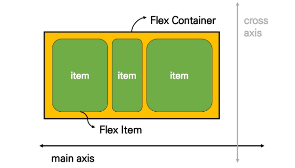

- **Flexbox 축**

  - flex-direction : row


- **Flexbox 구성 요소**
  
  - Flex Container (부모 요소)
    - flexbox 레이아웃을 형성하는 <u>가장 기본적인 모델</u>
    - Flex Item들이 놓여있는 영역
    - display 속성을 flex 혹은 inline-flex로 지정
    
    ```css
    .flex-container {
        display: flex;
    }
    ```
    
  - Flex Item (자식 요소)
    - 컨테이너에 속해 있는 컨텐츠(박스)


- **flexbox 시작**

  ```css
  .flex-container {
  	display: flex;
  }
  /* 부모 요소에 display: flex 혹은 inline-flex */
  ```

#### - Flex 속성

- 배치 설정
  - flex-direction
  - flex-wrap
  
- 공간 나누기
  - justify-content (main axis)
  - align content (cross axis)
  
- 정렬
  - align-items (모든 아이템을 cross axis 기준으로)
  
  - align-self (개별 아이템)
  
    

##### + flex-direction

- main axis 기준 방향 설정
- 역방향의 경우 HTML 태그 선언 순서와 시각적으로 다르니 유의 (웹 접근성에 영향) --> 마크업 자체는 1, 2, 3 순서로 되어 있음

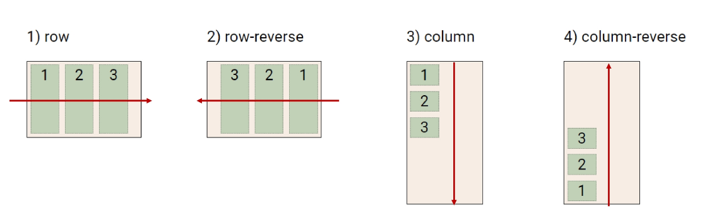

##### + flex-wrap

- 02_Web아이템이 컨테이너를 벗어나는 경우 해당 영역 내에 배치되도록 설정
- 즉, 기본적으로 <u>컨테이너 영역을 벗어나지 않도록</u> 함
  - nowrap (기본 값) : 한 줄에 배치
  - wrap : 넘치면 그 다음 줄로 배치

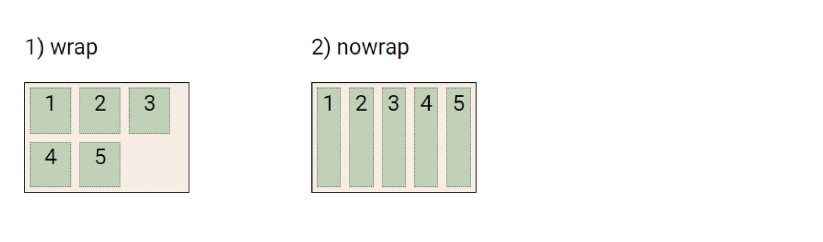

##### + flex-flow

- flex-direction과 flex-wrap의 shorthand
- flex-direction과 flex-wrap에 대한 설정 값을 차례로 작성

- 예시) flex-flow: row nonrap;


**+ justify-content & align content**

- flex-start (기본 값) : 아이템들을 axis 시작점으로

- flex-end : 아이템들을 axis 끝 쪽으로

- center : 아이템들을 axis 중앙으로

- space-<u>between</u> : 아이템 사이 간격을 균일하게

- space-<u>around</u> : 아이템을 둘러싼 영역을 균일하게 분배 (가질 수 있는 영역을 반으로 나눠서 양쪽에)

- space-<u>evenly</u> : 전체 영역에서 아이템 간 간격을 균일하게 (양쪽 여백 공간까지 동일하게)


##### + justify-content

- Main axis를 기준으로 공간 배분

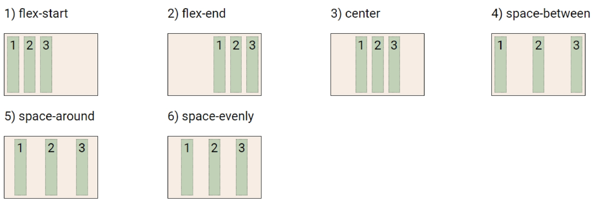


##### + align-content

- Cross axis를 기준으로 공간 배분 (아이템이 한 줄로 배치되는 경우 확인할 수 없음)

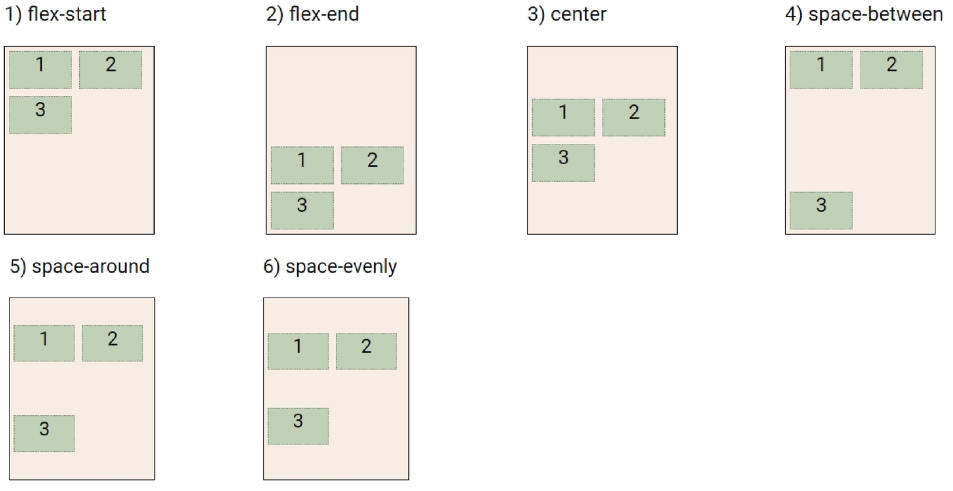


**+ align-items & align-self**

- Cross axis를 중심으로

  - stretch (기본 값) : 컨테이너를 가득 채움

  - flex-start : 위

  - flex-end : 아래

  - center : 가운데

  - baseline : 텍스트 baseline에 기준선을 맞춤

    

##### + align-items

- 모든 아이템을 Cross axis를 기준으로 정렬

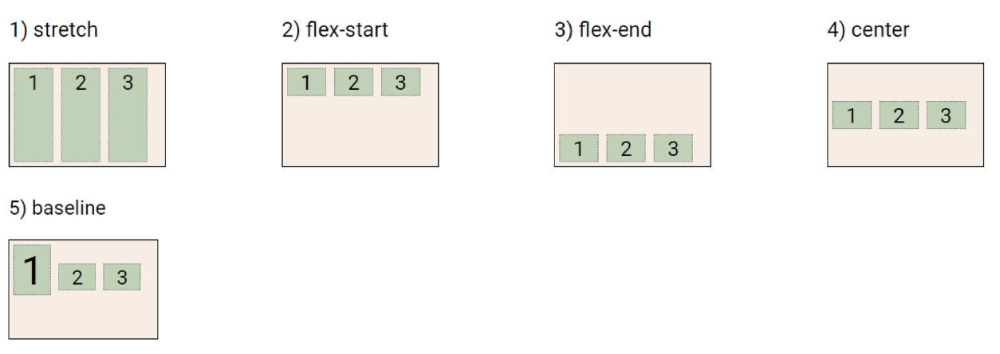


##### + align-self

- 개별 아이템을 Cross axis 기준으로 정렬
  - 주의! 해당 속성은 컨테이너에 적용하는 것이 아니라 <u>개별 아이템에 적용</u>

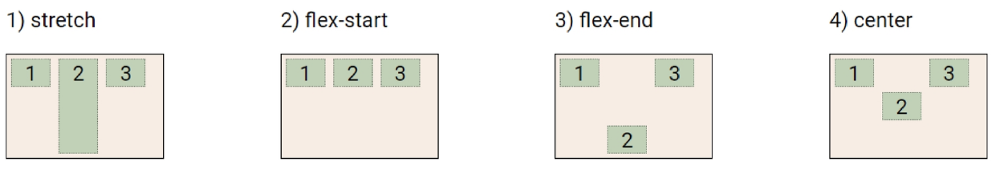


##### + 기타 속성

- **flex-grow**  : 남은 영역을 아이템에 분배
- **order** : 배치 순서

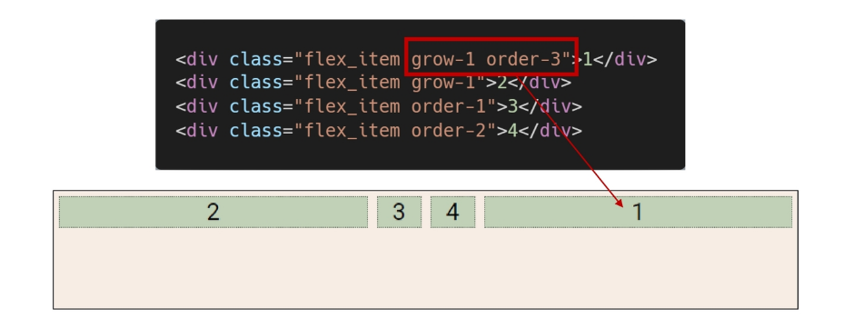


- 활용 레이아웃 - 수직 수평 가운데 정렬

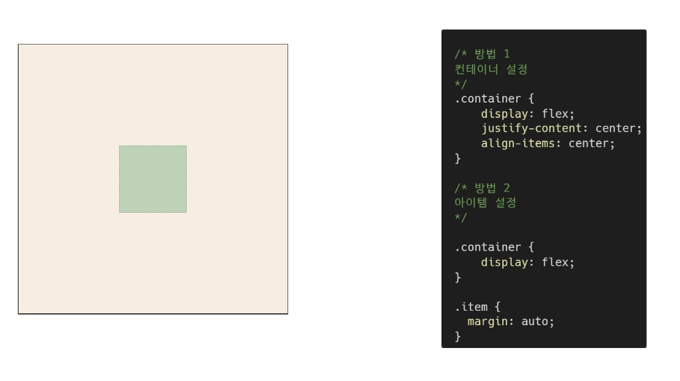

- 활용 레이아웃 - 카드 배치

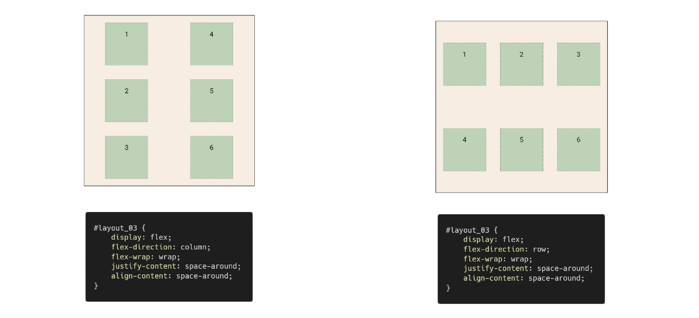


## Bootstrap

> https://getbootstrap.com/docs/5.0/getting-started/download/

- **Bootstrap**

  Build fast, responsive sites with Bootstrap

  <u>Quickly</u> design and customize <u>responsive</u> mobile-first sites with Bootstrap, <u>the world's most popular</u> front-end open source toolkit, featuring Sass variables and mixins, <u>responsive grid system</u>, extensive <u>prebuilt components</u>, and powerful JavaScript plugins.


- CDN

  Content Delivery(Distribution) Network

  컨텐츠(CSS, JS, Image, Text 등)을 효율적으로 전달하기 위해 여러 노드에 가진 네트워크에 데이터를 제공하는 시스템

  개별 end-user의 가까운 서버를 통해 빠르게 전달 가능 (지리적 이점)

  외부 서버를 활용함으로써 본인 서버의 부하가 적어짐


- spacing

  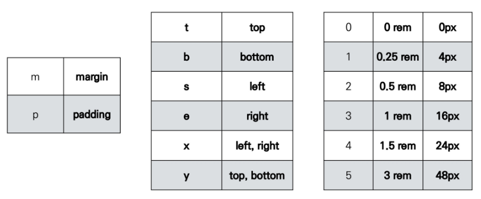


## Responsive Web

> 같은 컨텐츠를 보는 각기 다른 디바이스


- Responsive Web Design
  - 다양한 화면 크기를 가진 디바이스들이 등장함에 따라 responsive web design 개념이 등장
  - 반응형 웹은 별도의 기술 이름이 아닌 웹 디자인에 대한 접근 방식, 반응형 레이아웃 작성에 도움이 되는 사례들의 모음 등을 기술하는 데 사용되는 용어
  - 예시
    - Medai Queries, Flexbox, Bootstrap Grid System, The viewport meta tag

### bootstrap grid system

- Grid system (web design)

  - 요소들의 디자인과 배치에 도움을 주는 시스템

  - 기본 요소

    - Column : 실제 컨텐츠를 포함하는 부분

    - Gutter : 칼럼과 칼럼 사이의 공간 (사이 간격)

    - Container : Column들을 담고 있는 공간

      

- **Bootstrap grid System**

  - Bootstrap Grid System은 flexbox로 제작됨

  - container, rows, column으로 컨텐츠를 배치하고 정렬

  - 반드시 기억해야 할 2가지 !

    1. <u>12개의 column</u>

    2. <u>6개의 grid breakpoints</u>

       


