# Stack 2

>[강의자료](https://edu.ssafy.com/data/upload_files/crossUpload/openLrn/ebook/unzip/A2022020911032106400/index.html)  2022-02-23


## 계산기

문자열로 된 계산식이 주어질 때, 스택을 이용하여 이 계산식의 값을 계산할 수 있다.

- 문자열 수식 계산의 일반적 방법

  step1. 중위 표기법의 수식을 후위 표기법으로 변경한다. (스택 이용)

  step2. 후위 표기법의 수식을 스택을 이용하여 계산한다.

  

  - **중위 표기법(infix notation)**

    연산자를 피연산자의 가운데 표기하는 방법  (ex. A+B)

  - **후위 표기법(postfix notation)**

    연산자를 피연산자 뒤에 표기하는 방법 (ex. AB+)

    

- **step 1. 중위표기식의 후위표기식 변환 방법 1**

  - 수식의 각 연산자에 대해서 우선순위에 따라 괄호를 사용하여 다시 표현한다.
  - 각 연산자를 그에 대응하는 오른쪽 괄호의 뒤로 이동시킨다.
  - 괄호를 제거한다.

  


- **step 1. 중위 표기법에서 후위 표기법으로의 변환 알고리즘(스택 이용) 2**

  (토큰 : 최소 단위 (여기서는 연산자나 피연산자 한 개))

  1. 입력 받은 중위 표기식에서 토큰을 읽는다.

  2. 토큰이 피연산자이면 토큰을 출력한다.

  3. 토큰이 연산자(괄호포함)일 때, 이 토큰이 스택의 top에 저장되어 있는 연산자보다 우선순위가 높으면 스택에 push하고, 그렇지 않다면 스택 top의 연산자의 우선순위가 토큰의 우선순위보다 작을 때까지 스택에서 pop한 후 토큰의 연산자를 push한다. 만약 top에 연산자가 없으면 push한다.

  4. 토큰이 오른쪽 괄호 ')'이면 스택 top에 왼쪽 괄호 '('가 올 때까지 스택에 pop 연산을 수행하고 pop한 연산자를 출력한다. 왼쪽 괄호를 만나면 pop만 하고 출력하지는 않는다.

  5. 중위 표기식에 더 읽을 것이 없다면 중지하고, 더 읽을 것이 있다면 1부터 다시 반복한다.

  6. 스택에 남아 있는 연산자를 모두 pop하여 출력한다.

     \- 스택 밖의 왼쪽 괄호는 우선 순위가 가장 높으며, 스택 안의 왼쪽 괄호는 우선 순위가 가장 낮다.


- **중위 표기법에서 후위 표기법으로의 변환**

  (6 + 5 * (2 - 8) / 2)

​	


- [연습문제 1]

  수식 문자열을 읽어서 피연산자는 바로 출력하고 연산자는 스택에 push하여 수식이 끝나면 스택의 남아있는 연산자를 모두 pop하여 출력하시오. 연산자는 사칙 연산만 사용하시오.

  예를 들어 2 + 3 * 4 / 5 인 수식의 경우

  ​	\- 2 3 4 5 / * + 가 출력될 것이다.	 

  

- **step2. 후위 표기법의 수식을 스택을 이용하여 계산**
  1. 피연산자를 만나면 스택에 push한다.
  2. 연산자를 만나면 필요한 만큼의 피연산자를 스택에서 pop하여 연산하고, 연산결과를 다시 스택에 push한다.
  3. 수식이 끝나면, 마지막으로 스택을 pop하여 출력한다.


## 백트래킹

- 백트래킹(Backtracking) 기법은 해를 찾는 도중에 '막히면' (즉, 해가 아니면) 되돌아가서 다시 해를 찾아 가는 기법이다.
- 백트래킹 기법은 최적화(optimization) 문제와 결정(decision) 문제를 해결할 수 있다.
- 결정 문제 : 문제의 조건을 만족하는 해가 존재하는지의 여부를 'yes' 또는 'no'가 답하는 문제
  - 미로 찾기
  - n-Queen 문제
  - Map coloring
  - 부분 집합의 합(Subset Sum) 문제 등


- **미로 찾기**

  아래 그림과 같이 입구와 출구가 주어진 미로에서 입구부터 출구까지의 경로를 찾는 문제이다.

  이동할 수 있는 방향은 4방향으로 제한한다.

  

  - 미로 찾기 알고리즘

  

  스택을 이용하여 지나온 경로를 역으로 되돌아 간다.

  

  스택을 이용하여 다시 경로를 찾는다.

  


- 백트래킹과 깊이우선탐색의 차이

  어떤 노드에서 출발하는 경로가 해결책으로 이어질 것 같지 않으면 더 이상 그 경로를 따라가지 않음으로써 시도의 횟수를 줄임. (Prunning 가지치기)

  깊이우선탐색이 모든 경로를 추적하는데 비해 백트래킹은 불필요한 경로를 조기에 차단.

  깊이우선탐색을 가하기에는 경우의 수가 너무나 많음. 즉 N!가지의 경우의 수를 가진 문제에 대해 깊이우선탐색을 가하면 당연히 처리 불가능한 문제.

  백트래킹 알고리즘을 적용하면 일반적으로 경우의 수가 줄어들지만 이 역시 최악의 경우에는 여전히 지수함수 시간(Exponential Time)을 요하므로 처리 불가능


- 모든 후보를 검사?

  ***No!***


- 백트래킹 기법

  어떤 노드의 유망성을 점검한 후에 유망(promising)하지 않다고 결정되면 그 노드의 부모로 되돌아가(backtracking) 다음 자식 노드로 감

  어떤 노드를 방문하였을 때 그 노드를 포함한 경로가 해답이 될 수 없으면 그 노드는 유망하지 않다고 하며, 반대로 해답의 가능성이 있으면 유망하다고 한다.

  가지치기(pruning) : 유망하지 않은 노드가 포함되는 경로는 더 이상 고려하지 않는다.


- 백트래킹을 이용한 알고리즘은 다음과 같은 절차로 진행된다.
  1. 상태 공간 트리의 깊이 우선 검색을 실시한다.
  2. 각 노드가 유망한지를 점검한다.
  3. 만일 그 노드가 유망하지 않으면, 그 노드의 부모 노드로 돌아가서 검색을 계속한다.


- 일반 백트래킹 알고리즘

  


- 깊이 우선 검색 vs. 백트래킹
  - 순수한 깊이 우선 검색 = 155노드
  - 백트래킹 = 27노드


- 부분집합 구하기

  어떤 집합의 공집합과 자기자신을 포함한 모든 부분집합을 powerset이라고 하며 구하고자 하는 어떤 집합의 원소 개수가 n일 경우 부분집합의 개수는 2^n개 이다.

  

  - 백트래킹 기법으로 powerset을 구해보자

    앞에서 설명한 일반적인 백트래킹 접근 방법을 이용한다.

    n개의 원소가 들어있는 집합의 2^n개의 부분집합을 만들 때는, true 또는 false값을 가지는 항목들로 구성된 n개의 배열을 만드는 방법을 이용

    여기서 배열의 i번째 항목은 i번째의 원소가 부분집합의 값인지 아닌지를 나타내는 값이다.

    

  - 각 원소가 부분집합에 포함되었는지를 loop 이용하여 확인하고 부분집합을 생성하는 방법

    ```python
    bit = [0, 0, 0, 0]
    for i in range(2):
        bit[0] = i					# 0번째 원소
        for j in range(2):
            bit[1] = j				# 1번째 원소
            for k in range(2):
                bit[2] = k			# 2번째 원소
                for l in range(2):
                    bit[3] = 1		# 3번째 원소
                    print(bit)		# 생성된 부분집합 출력
    ```


- powerset을 구하는 백트래킹 알고리즘

  ```python
  def backtrack(a, k, input):
      global MAXCANDIDATES
      c = [0] * MAXCANDIDATES
      	
      if k == input:
          process_solution(a, k)	# 답이면 원하는 작업을 한다
      else:
          k += 1
          ncandidates = construct_candidates(a, k, input, c)
          for i in range(ncandidates):
              a[k] = c[i]
              backtrack(a, k, input)
              
  def construct_candidates(a, k, input, c):
      c[0] = True
      c[1] = False
      return 2
  
  MAXCANDIDATES = 2
  NMAX = 4
  a = [0] * NMAX
  backtrack(a, 0, 3)
  ```

  

- 예) {1, 2, 3}을 포함하는 모든 순열을 생성하는 함수

  동일한 숫자가 포함되지 않았을 때, 각 자리수별로 loop를 이용해 아래와 같이 구현할 수 있다.

  ```python
  for i1 in range(1, 4):
      for i2 in range(1, 4):
          if i2 != i1:
              for i3 in range(1, 4):
                  if i3 != i1 and i3 != i2:
                      print(i1, i2, i3)
  ```

​	

- 백트래킹을 이용하여 순열 구하기

  접근 방법은 앞의 부분집합 구하는 방법과 유사하다

  ```python
  def backtrack(a, k, input):
      global MAXCANDIDATES
      c = [0] * MAXCANDIDATES
      
      if k == input:
          for i in range(1, k+1):
              print(a[i], end=" ")
          print()
      else:
          k += 1
          ncandidates = construct_candidates(a, k, input, c)
          for i in range(ncandidates):
              a[k] = c[i]
              backtrack(a, k, input)
              
  def construct_candidates(a, k, input, c):
      in_perm = [False] * NMAX
      
      for i in range(1, k):
          in_perm[a[i]] = True
          
      ncandidates = 0
      for i in range(1, input+1):
          if in_perm[i] == False:
              c[ncandidates] = i
              ncandidates += 1
      return ncandidates
  ```
  
  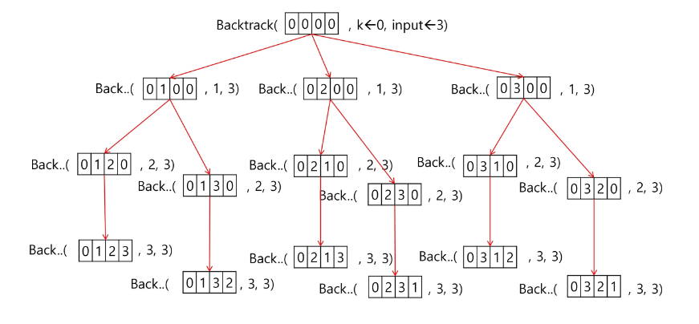


- [연습문제 2] {1, 2, 3, 4, 5, 6, 7, 8, 9, 10}의 powerset 중 원소의 합이 10인 부분집합을 구하시오.


### - 부분 집합의 합

```python
# subset1

def f(i, N):	# i: 부분집합에 포함될지 결정할 원소의 인덱스, N: 전체 원소 개수
    if i == N:	# 한 개의 부분집합 완성
        for j in range(N):
            if bit[j]:
                print(a[j], end=' ')
        print() # 한 개의 부분집합 출력 후에 줄 바꿈
    else:
        bit[i] = 1
        f(i+1, N)
        bit[i] = 0
        f(i+1, N)
    return

a = [1, 2, 3]
bit = [0, 0, 0]
f(0, 3)	# 0번째 인자부터 3개의 인자를 들어갈지 말지 결정
```

```python
# subset2

def f(i, N, s, t):	# s: 이전까지 고려된 원소의 합, t: 목표값
    if s == t: 	# 목표값을 찾은 경우
        for j in range(N):
            if bit[j] == 1:
                print(a[j], end=" ")
       	print()
    elif i == N:	# 찾지 못했는데 더 이상 고려할 원소가 없으면
        return
    elif s > t:		# 고려한 원소의 합 s가 이미 목표를 초과
        return        
    else:
        bit[i] = 1
        f(i+1, N, s+a[i], t)
        bit[i] = 0
        f(i+1, N, s, t)

N = 10
a = [x for x in range(1, N+1)]
bit = [0] * N
t = 10	# t가 되는 경우가 있는가?
f(0, N, 0, t)
```


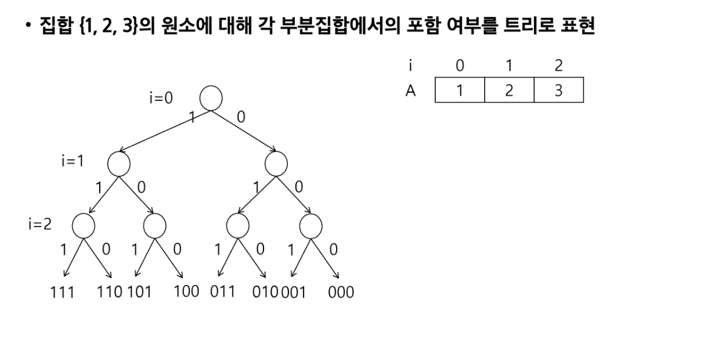

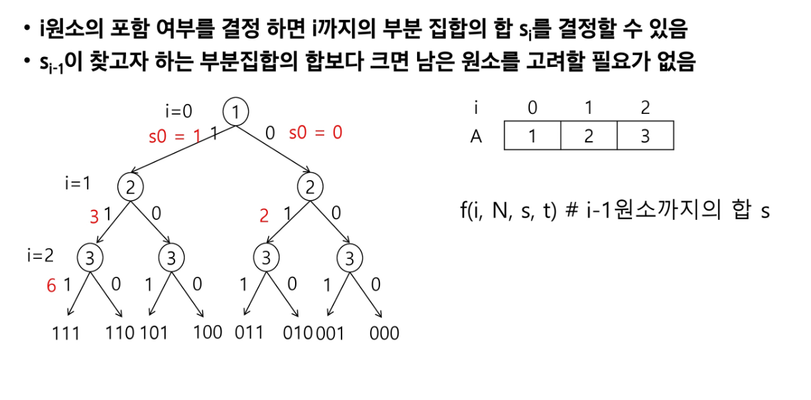

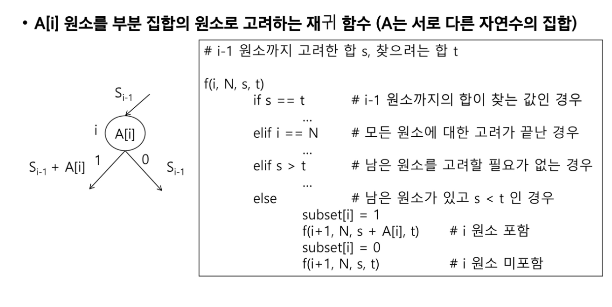

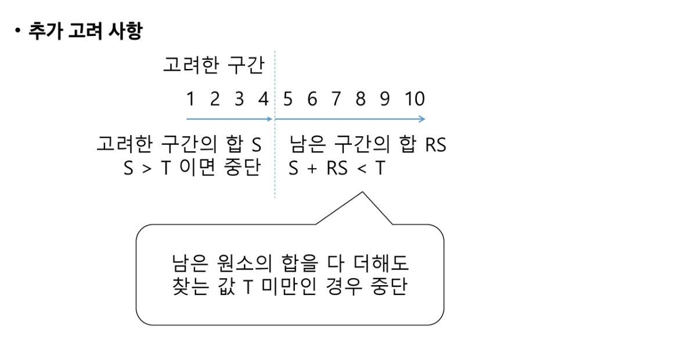

```python
# subset3

def f(i, N, s, t, rs):	# s: 이전까지 고려된 원소의 합, t: 목표값
    if s == t: 	# 목표값을 찾은 경우
        for j in range(N):
            if bit[j] == 1:
                print(a[j], end=" ")
       	print()
    elif i == N:	# 찾지 못했는데 더 이상 고려할 원소가 없으면
        return
    elif s > t:		# 고려한 원소의 합 s가 이미 목표를 초과
        return   
    elif s + rs < t:
        return
    else:
        bit[i] = 1
        f(i+1, N, s+a[i], t, rs-a[i])	# a[i]에 대한 고려 끝남
        bit[i] = 0
        f(i+1, N, s, t, rs-a[i])

N = 10
a = [x for x in range(1, N+1)]
bit = [0] * N
t = 10	# t가 되는 경우가 있는가?
f(0, N, 0, t, sum(a))
```


### - 순열

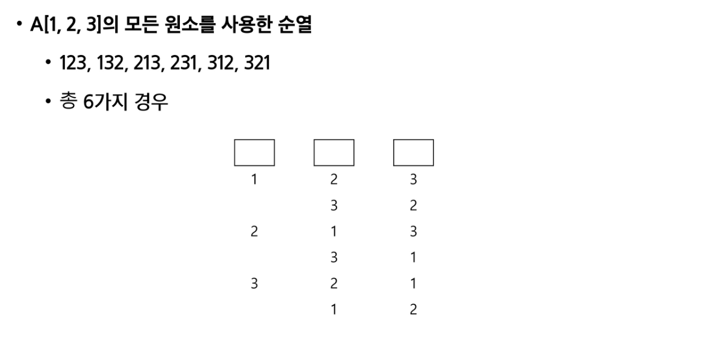

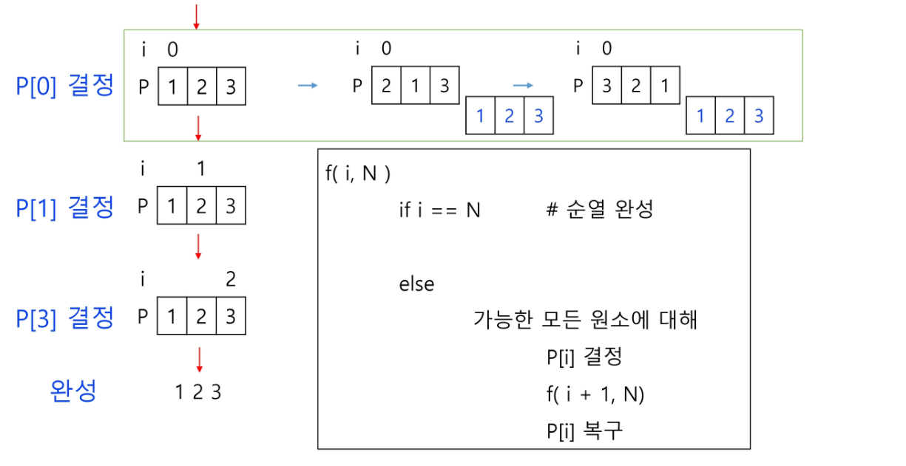

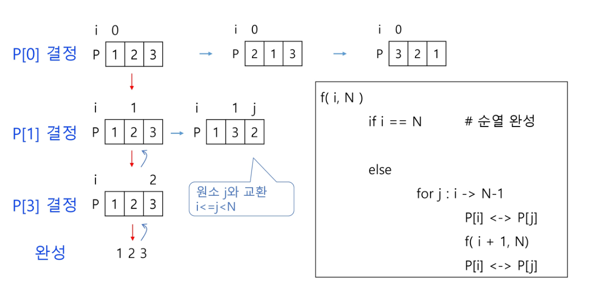

```python
# 순열
def f(i, N):
    if i == N:
        print(p)
    else:
        for j in range(i, N):
            p[i], p[j] = p[j], p[i]
            f(i+1, N)
            p[i], p[j] = p[j], p[i]

p = [1, 2, 3]
N = 3
f(0, 3)
```


## 분할 정복 알고리즘

- 유래
  - 1805년 12월 2일 아우스터리츠 전투에서 나폴레옹이 사용한 전략
  - 전력이 우세한 연합군을 공격하기 위해 나폴레옹은 연합군의 중앙부로 쳐들어가 연합군을 둘로 나눔
  - 둘로 나뉜 연합군을 한 부분씩 격파함


- 설계 전략
  - 분할(Divide): 해결할 문제를 여러 개의 작은 부분으로 나눈다.
  - 정복(Conquer): 나눈 작은 문제를 각각 해결한다.
  - 통합(Combine): (필요하다면) 해결된 해답을 모은다.


- 거듭 제곱(Exponentiation)

  - O(n)

  ```python
  def Power(Base, Exponent):
      if Base == 0:
          return 1
      result = 1 	# Base^0은 1이므로
      for i in range(Exponent):
          result *= Base
      return result
  ```

  

- 분할 정복 기반의 알고리즘 : O(log2n)

  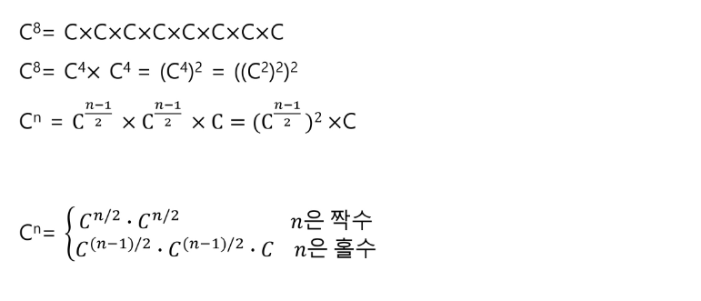

  ```python
  def Power(Base, Exponent):
      if Exponent == 0 or Base == 0:
          return 1
      
      if Exponent % 2 == 0:
          NewBase = Power(Base, Exponent/2)
          return NewBase * NewBase
      else:
          NewBase = Power(Base, (Exponent-1)/2)
          return (NewBase * NewBase) * Base
  ```

  

### - 퀵 정렬

- 주어진 배열을 두 개로 분할하고, 각각을 정렬한다.
  - 합병 정렬과 동일?
  - 다른 점 1. 합병 정렬은 그냥 두 부분으로 나누는 반면에, 퀵 정렬은 분할할 때, 기준 아이템(pivot item) 중심으로, 이보다 작은 것은 왼편, 큰 것은 오른 편에 위치시킨다.
  - 다른 점 2: 각 부분 정렬이 끝난 후, 합병 정렬은 "합병"이란 후처리 작업이 필요하나, 퀵 정렬은 필요로 하지 않는다.


- 알고리즘

  ```python
  def quickSort(a, begin, end):
      if begin < end:		# 비교할 대상이 남아 있는 동안에만 
          p = partition(a, begin, end)	# 피봇을 정하면
          quickSort(a, begin, p-1)	# 왼쪽에도
          quickSort(a, p+1, end)		# 오른쪽에도 같은 작업 수행
  ```

  ```python
  def partition(a, begin, end):
      pivot = (begin + end) // 2 
      L = begin
      R = end
      while L < R:	# 만나지 않으면 계속 움직여야 함 
          while (L < R and a[L] < a[pivot]):
              L += 1
          while (L < R and a[R] >= a[pivot]):
              R -= 1
          if L < R:
              if L == pivot:
                  pivot = R
              a[L], a[R] = a[R], a[L]
      a[pivot], a[R] = a[R], a[pivot]
      return R
  ```


- 퀵 정렬 수행 과정

  예제: {69, 10, 30, 2, 16, 8, 31, 22}

  원소의 개수가 8개이므로 네 번째 자리에 있는 원소 2를 첫 번째 피봇으로 선택하고 퀵 정렬 시작

  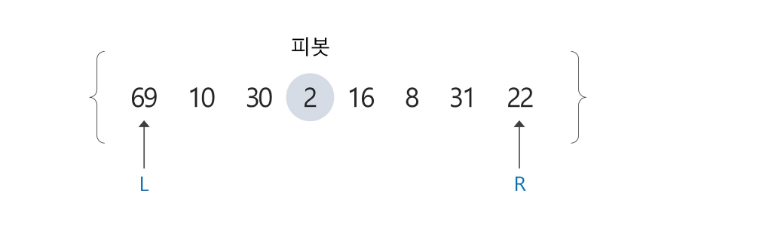

  1) 원소 2를 피봇으로 선택하고 퀵 정렬 시작

     - L이 오른쪽으로 이동하면서 피봇보다 크거나 같은 원소를 찾고, R은 왼쪽으로 이동하면서 피봇보다 작은 원소를 찾는다.
     - L은 원소 69를 만났지만, R은 피봇보다 작은 원소를 찾지 못한 채로 원소 69에서 L과 만나게 된다.
     - L과 R이 만났으므로, 원소 69를 피못과 교환하여 피봇 원소 2의 위치를 확정한다.

     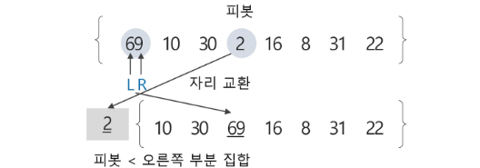

     

  2. 피봇 2의 왼쪽 부분집합은 공집합이므로 퀵 정렬을 수행하지 않고, 오른쪽 부분 집합에 대해서 퀵 정렬 수행

     - 오른쪽 부분 집합의 원소가 7개이므로 가운데 있는 원소 16을 피봇으로 선택

     

     - L이 찾은 30과 R이 찾은 8을 서로 교환한다

     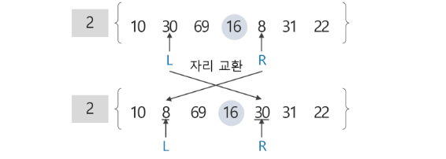

     - 현재 위치에서 L과 R의 작업을 반복한다.

     - L은 원소 69를 찾았지만, R은 피봇보다 작은 원소를 찾지 못한 채로 원소 69에서 L과 만나게 된다.

       L과 R이 만났으므로, 원소 69를 피봇과 교환하여 피봇 원소 16의 위치를 확정한다.

     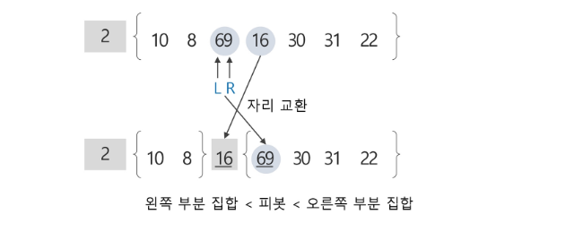

  3. 피봇 16의 왼쪽 부분집합에서 원소 10을 피봇으로 선택하여 퀵 정렬 수행

     

     - L의 원소 10과 R의 원소 8을 교환하는데, L의 원소가 피봇이므로 피봇 원소에 대한 자리 교환이 발생한 것이므로 교환한 자리를 피봇 원소 10의 위치로 확정한다.

       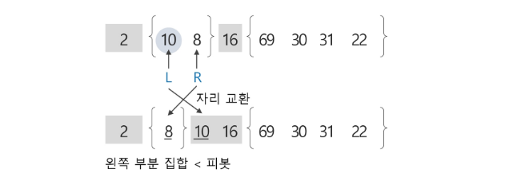

  4. 피봇 10의 확정된 위치에서의 왼쪽 부분집합은 원소가 한 개이므로 퀵 정렬을 수행하지 않고, 오른쪽 부분 집합은 공집합이므로 역시 퀵 정렬을 수행하지 않는다.

     - 이제 1단계의 피봇이었던 원소 16에 대한 오른쪽 부분 집합에 대해 퀵 정렬을 수행한다.

       오른쪽 부분 집합의 원소가 4개이므로 두 번째 원소 30을 피봇으로 선택한다.

       

       L이 찾은 69와 R이 찾은 22를 서로 교환한다.

       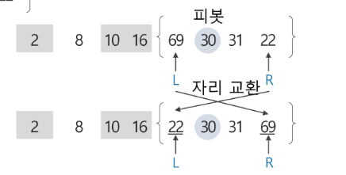

     - 현재 위치에서 L과 R의 작업을 반복한다. L은 오른쪽으로 이동하면서 피봇보다 크거나 같은 원소인 30을 찾고, R은 왼쪽으로 이동하면서 피봇보다 작은 원소를 찾다가 못 찾고 원소 30에서 L과 만난다.

     - L과 R이 만났으므로 피봇과 교환한다. 이 경우는 R의 원소가 피봇이므로 피봇에 대한 자리교환이 발생한 것이므로 교환한 자리를 피봇의 자리로 확정한다.

     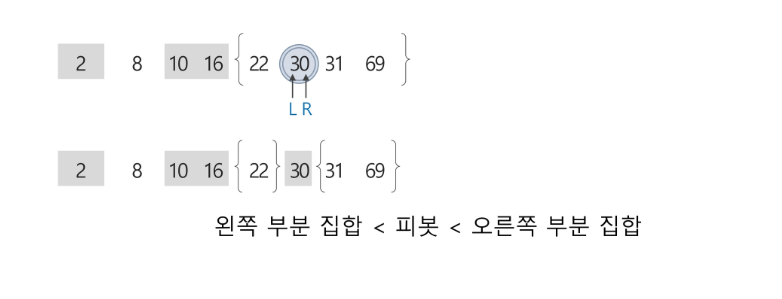

  5. 피봇 30의 확정된 위치에서의 왼쪽 부분 집합의 원소가 한 개이므로 퀵 정렬을 수행하지 않고, 오른쪽 부분 집합에 대해서 퀵 정렬 수행

     - 오른쪽 부분 집합의 원소 2개 중에서 원소 31을 피봇으로 선택한다.

     

     - L은 오른쪽으로 이동하면서 원소 31을 찾고, R은 왼쪽으로 이동하면서 피봇보다 작은 원소를 찾다가 못 찾은 채로 원소 31에서 L과 만난다. L과 R이 만났으므로 피봇과 교환하는 데 R의 원소가 피봇이므로 결국 제자리가 확정된다.

       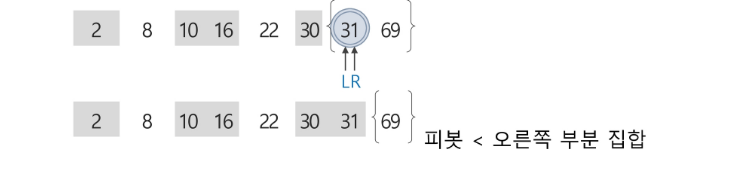

     - 피봇 31의 오른쪽 부분 집합의 원소가 한 개 이므로 퀵 정렬을 수행하지 않는다. 이것으로 전체 퀵 정렬이 모두 완성되었다.


- 시간 복잡도

  퀵 정렬의 시간 복잡도는 O(n^2)로, 합병 정렬에 비해 좋지 못하다.

  그런데, 왜 "빠른" 정렬이라고 했을까?

  이는 퀵 정렬의 평균 복잡도는 nlogn이기 때문이다.

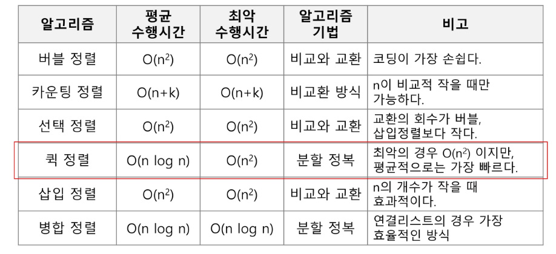


## 인접행렬 만들기

```python
# graph1

'''
7(정점의 수) 8(간선의 수)
1 2 1 3 2 4 2 5 4 6 5 6 6 7 3 7 
'''

V, E = map(int, input().split())
arr = list(map(int, input().split()))
adj = [[0] * (V+1) for _ in range(V+1)] 
adjList = [[] for _ in range(V+1)]	# 인접 리스트
for i in range(E):
    n1, n2 = arr[i*2], arr[i*2+1]
    adj[n1][n2] = 1		# n1과 n2는 인접(이어져 있다)
    adj[n2][n1] = 1		# 방향 표시가 없는 경우(양 방향 다 찍기)
    
    adjList[n1].append(n2)
    adjList[n2].append(n1)
```


