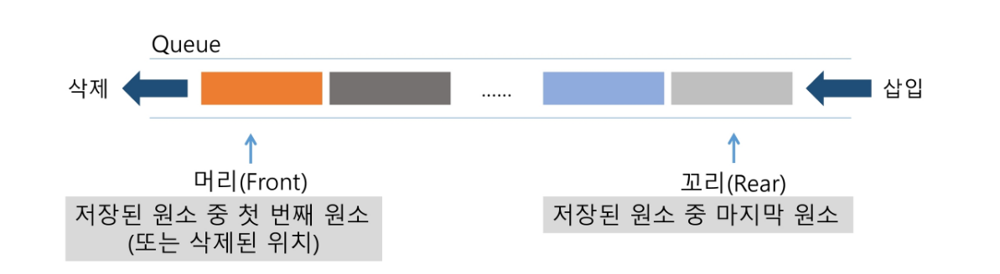

# 큐

> [강의자료](https://edu.ssafy.com/data/upload_files/crossUpload/openLrn/ebook/unzip/A2022022411344381700/index.html)  2022-02-25


## 큐(Queue)

- 큐의 특성
  - 스택과 마찬가지로 삽입과 삭제의 위치가 제한적인 자료구조
    - 큐의 뒤에서는 삽입만 하고, 큐의 앞에서는 삭제만 이루어지는 구조
  - 선입선출구조(FIFO: First In First Out)
    - 큐에 삽입한 순서대로 원소가 저장되어, 가장 먼저 삽입(First In)된 원소는 가장 먼저 삭제(First Out)된다.


- 큐의 선입선출 구조




- 큐의 기본 연산
  - 삽입: `enQueue`
  - 삭제: `deQueue`


- 큐의 사용을 위해 필요한 주요 연산

  | 연산          | 기능                                                |
  | :------------ | --------------------------------------------------- |
  | enQueue(item) | 큐의 뒤쪽(rear 다음)에 원소를 삽입하는 연산         |
  | deQueue()     | 큐의 앞쪽(front)에서 원소를 삭제하고 반환하는 연산  |
  | createQueue() | 공백 상태의 큐를 생성하는 연산                      |
  | isEmpty()     | 큐가 공백상태인지를 확인하는 연산                   |
  | isFull()      | 큐가 포화상태인지를 확인하는 연산                   |
  | Qpeek()       | 큐의 앞쪽(front)에서 원소를 삭제 없이 반환하는 연산 |

  

- 큐의 연산 과정


 

### - 큐의 구현

#### + 선형 큐

- 1차원 배열을 이용한 큐
  - 큐의 크기 = 배열의 크기
  - `front`: 저장된 첫 번째 원소의 인덱스(마지막으로 꺼내진, deQue된 위치)
  - `rear`: 저장된 마지막 원소의 인덱스(마지막으로 enQueue된)
- 상태 표현
  - 초기 상태: front = rear = -1
  - 공백 상태: front == rear
  - 포화 상태: rear == n-1 (n: 배열의 크기, n-1: 배열의 마지막 인덱스)


- 초기 공백 큐 생성
  - 크기 n인 1차원 배열 생성
  - front와 rear를 -1로 초기화


- 삽입: enQueue(item)

  - 마지막 원소 뒤에 새로운 원소를 삽입하기 위해

    1. rear 값을 하나 증가시켜 새로운 원소를 삽입할 자리를 마련
    2. 그 인덱스에 해당하는 배열 원소 Q[rear]에 item을 저장

    ```python
    def enQueue(item):
        global rear 	# front와 rear는 global로 사용
        if isfull():	# 꽉 차 있는지 검사
            # 꽉 차 있는 경우
            # 1. 큐를 너무 작게 만들었거나
            # 2. 너무 많이 넣었거나
            print("Queue_Full")		# 디버깅 목적
        else:
            rear <- rear + 1;	# rear값 하나 증가시키고
            Q[rear] <- item		# 그 자리에 넣기
            
    # 꼭 함수를 만들지 않고 가장 아래 두 줄만 이용해도 가능
    ```


- 삭제: deQueue()

  - 가장 앞에 있는 원소를 삭제하기 위해

    1. front 값을 하나 증가시켜 큐에 남아 있게 될 첫 번째 원소 이동
    2. 새로운 첫 번째 원소를 리턴함으로써 삭제와 동일한 기능

    ```python
    def deQueue():
        if (isempty()) then Queue_Empty();
        else{
            front <- front + 1'
            return Q[front];
        }
    ```

    

- 공백 상태 및 포화 상태 검사: isEmpty(), isFull()

  - 공백 상태: front == rear

  - 포화 상태: rear == n - 1 (n: 배열의 크기, n-1: 배열의 마지막 인덱스)

    ```python
    def isEmpty():
        return front == rear
    
    def Full():
        return rear == len(Q) - 1
    ```

    

- 검색: Qpeek()

  - 가장 앞에 있는 원소를 검색하여 반환하는 연산

  - 현재 front의 한자리 뒤(front +1)에 있는 원소, 즉 큐의 첫 번째에 있는 원소를 반환

    ```python
    def Qpeek():
        if isEmpty():
            print("Queue_empty")
        else:
            return Q[front+1]
    ```

    

- [연습문제1]

  큐를 구현하여 다음 동작을 확인해 봅시다.

    \- 세 개의 데이터 1, 2, 3을 차례로 큐에 삽입하고

    \- 큐에서 세 개의 데이터를 차례로 꺼내서 출력한다.

  ```python
  front = -1
  rear = -1
  Q = [0] * 10
  
  # enQueue(1)
  rear += 1
  Q[rear] = 1
  
  # deQueue
  front += 1
  print(Q[front])
  ```

  

- 선형 큐 이용시의 문제점

  - 잘못된 포화상태 인식

    - 선형 큐를 이용하여 원소의 삽입과 삭제를 계속할 경우, 배열의 앞부분에 활용할 수 있는 공간이 있음에도 불구하고, rear=n-1인 상태, 즉 포화상태로 인식하여 더 이상의 삽입을 수행하지 않게 됨

      

  - 해결 방법 1

    - 매 연산이 이루어질 때마다 저장된 원소들을 배열의 앞부분으로 모두 이동시킴

    - 원소 이동에 많은 시간이 소요되어 큐의 효율성이 급격히 떨어짐

      

  - 해결 방법 2

    - 1차원 배열을 사용하되, 논리적으로는 배열의 처음과 끝이 연결되어 원형 형태의 큐를 이룬다고 가정하고 사용

    - 원형 큐의 논리적 구조

      


## 원형 큐

- 구조

  - 초기 공백 상태

    - front = rear = 0

  - Index의 순환

    - front와 rear의 위치가 배열의 마지막 인덱스인 n-1을 가리킨 후, 그 다음에는 논리적 순환을 이루어 배열의 처음 인덱스인 0으로 이동해야 함
    - 이를 위해 나머지 연산자 mod를 사용함

  - front 변수

    - 공백  상태와 포화 상태 구분을 쉽게 하기 위해 front가 있는 자리는 사용하지 않고 항상 빈자리로 둠

  - 삽입 위치 및 삭제 위치

    |         |        삽입 위치        |         삭제 위치         |
    | :-----: | :---------------------: | :-----------------------: |
    | 선형 큐 |     rear = rear + 1     |     front = front + 1     |
    | 원형 큐 | rear = (rear + 1) mod n | front = (front + 1) mod n |


- 연산 과정


- 초기 공백 큐 생성
  - 크기 n인 1차원 배열 생성
  - front와 rear를 0으로 초기화

- 공백 상태 및 포화 상태 검사: isEmpty(), isFull()

  - 공백 상태: front = rear

  - 포화 상태: 삽입할 rear의 다음 위치 == 현재 front

    \- (rear + 1) mod n == front

  ```python
  def isEmpty():
      return front == rear
  
  def isFull():
      return (rear + 1) % len(cQ) == front
  ```

  

- 삽입: enQueue(item)

  - 마지막 원소 뒤에 새로운 원소를 삽입하기 위해

    1. rear값을 조정하여 새로운 원소를 삽입할 자리를 마련함

       rear <- (rear + 1) mod n;

    2. 그 인덱스에 해당하는 배열원소 cQ[rear]에 item을 저장

  ```python
  def enQueue(item):
      global rear
      if isFull():
          print("Queue_Full")
      else:
          rear = (rear + 1) % len(cQ)
          cQ[rear] = item
  ```

  

- 삭제: deQueue(), delete()

  - 가장 앞에 있는 원소를 삭제하기 위해
    1. front값을 조정하여 삭제할 자리를 준비함
    2. 새로운 front 원소를 리턴함으로써 삭제와 동일한 기능함

  ```python
  def deQueue():
      global front
      if isEmpty():
          print("Queue_Empty")
      else:
          front = (front + 1) % len(cQ)
          return cQ[front]
  ```

  ```python
  def delete():
     global front
      if isEmpty():
          print("Queue_Empty")
      else:
          front = (front + 1) % len(cQ) 
  ```

  

## 우선순위 큐

- 우선순위 큐 (Prioty Queue)

  - 특성

    - 우선순위를 가진 항목들을 저장하는 큐
    - FIFO 순서가 아니라 우선순위가 높은 순서대로 먼저 나가게 된다

  - 적용 분야

    - 시뮬레이션 시스템
    - 네트워크 트래픽 제어
    - 운영체제의 태스크 스케줄링

  - 구현

    - 배열을 이용한 우선순위 큐
    - 리스트를 이용한 우선순위 큐

  - 기본 연산

    - 삽입: `enQueue`
    - 삭제: `deQueue`

    


- 배열을 이용한 우선순위 큐
  - 배열을 이용하여 자료 저장
  - 원소를 삽입하는 과정에서 우선순위를 비교하여 적절한 위치에 삽입하는 구조
  - 가장 앞에 최고 우선순위의 원소가 위치하게 됨
  - 문제점
    - 배열을 사용하므로, 삽입이나 삭제 연산이 일어날 때 원소의 재배치가 발생함
    - 이에 소요되는 시간이나 메모리 낭비가 큼


## 큐의 활용: 버퍼

- 버퍼(Buffer)
  - 데이터를 한 곳에서 다른 한 곳으로 전송하는 동안 일시적으로 그 데이터를 보관하는 메모리의 영역
  - 버퍼링: 버퍼를 활용하는 방식 또는 버퍼를 채우는 동작을 의미한다.


- 버퍼의 자료 구조
  - 버퍼는 일반적으로 입출력 및 네트워크와 관련된 기능에서 이용된다.
  - 순서대로 입력/출력/전달되어야 하므로 FIFO 방식의 자료구조인 큐가 활용된다. 


- 키보드 버퍼

  

  

  - 마이쮸 나눠주기 시뮬레이션

  

  

  

  

  

  ```python
  p = 1  # 처음 줄 설 사람 번호
  
  q = []
  N = 1000000  # 초기 마이쮸 개수
  m = 0   # 나눠준 개수
  v = 0
  
  while m<N:
      #input()
      q.append((p, 1, 0))     # 처음 줄 서는 사람
      #print(q)
      v, c, my  = q.pop(0)
      #print(f'큐에 있는 사람 수 {len(q)+1}, 받아갈 사탕 수{c}, 나눠준 사탕 수{m}')
      m += c
      q.append((v, c+1, my+c))    # 마이쮸를 받고 다시 서는 사람
      p += 1                  # 처음 줄서는 사람 번호
  print(f'마지막 받은 사람 : {v}')
  ```

  ```python
  from collections import deque
  p = 1  # 처음 줄 설 사람 번호
  #q = []
  q = deque()
  N = 1000000  # 초기 마이쮸 개수
  m = 0   # 나눠준 개수
  v = 0
  
  while m<N:
      #input()
      q.append((p, 1, 0))     # 처음 줄 서는 사람
      #print(q)
      v, c, my  = q.popleft()
      #print(f'큐에 있는 사람 수 {len(q)+1}, 받아갈 사탕 수{c}, 나눠준 사탕 수{m}')
      m += c
      q.append((v, c+1, my+c))    # 마이쮸를 받고 다시 서는 사람
      p += 1                  # 처음 줄서는 사람 번호
  print(f'마지막 받은 사람 : {v}')
  ```

  

## BFS

- BFS (Breadth First Search)

  - 그래프를 탐색하는 방법에는 크게 두 가지가 있음

    - 깊이 우선 탐색(Depth First Search, DFS)
    - 너비 우선 탐색(Breadth First Search, BFS)

  - 너비 우선 탐색은 탐색 시작점의 인접한 정점들을 먼저 모두 차례로 방문한 후에, 방문했던 정점을 시작점으로 하여 다시 인접한 정점들을 차례로 방문하는 방식

  - 인접한 정점들에 대해 탐색을 한 후, 차례로 다시 너비 우선 탐색을 진행해야 하므로 선입선출 형태의 자료구조인 큐를 활용함

  - 예제 그래프를 아래와 같은 순서로 탐색한다

    


- 알고리즘

  ```python
  def BFS(G, v):	# 그래프 G, 탐색 시작점 v
      # 방문한 곳 기록하기 위한 리스트 
  	visited = [0] * (n + 1)	# n: 정점의 개수
  	queue = []			# 큐 생성
      queue.append(v)		# 시작점 v를 큐에 삽입
      while queue:		# 큐가 비어있지 않은 경우
          t = queue.pop(0)	# 큐의 첫번째 원소 반환
          if not visited[t]:	# 방문되지 않은 곳이라면
              visited[t] = True	# 방문한 곳으로 표시
              visit(t)		# 정점 t에서 할 일
          for i in G[t]:	# t와 연결된 모든 정점에 대해
              if not visited[i]:	# 방문되지 않은 곳이라면
                  queue.append(i)	# 큐에 넣기
  ```

  

  

  

  

  

  

  

  

  

  

  


[참고] BFS 예제


```python
def BFS(G, v, n):	# 그래프 G, 탐색 시작점 v
    visited = [0] * (n + 1)		# n: 정점의 개수
    queue = []			# 큐 생성
    queue.append(v)		# 시작점 v를 큐에 삽입
    visited[v] = 1
    while queue:		# 큐가 비어있지 않은 경우
        t = queue.pop(0)	# 큐의 첫번째 원소 반환
        visit(t)
        for i in G[t]:	# t와 연결된 모든 정점에 대해
            if not visited[i]:	# 방문되지 않은 곳이라면
                queue.append(i)	# 큐에 넣기
                visited[i] = visited[n] + 1	
                	# n으로부터 1만큼 이동
```


- 연습문제 3

  


