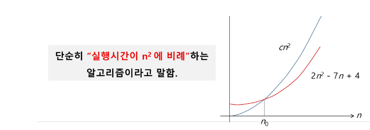
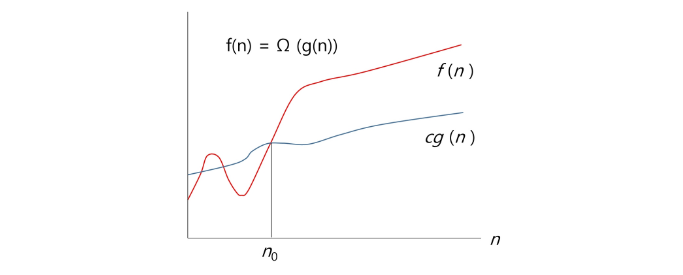
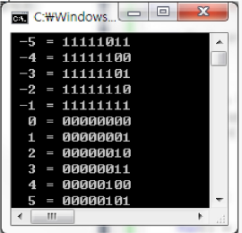
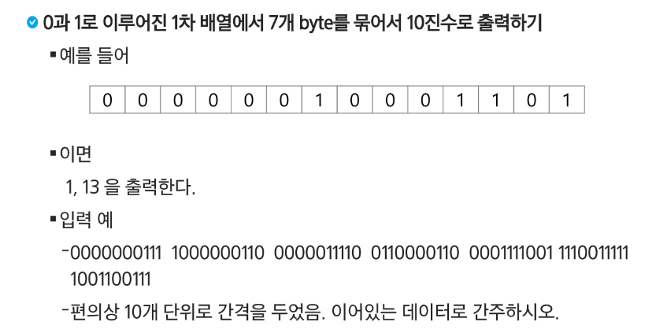
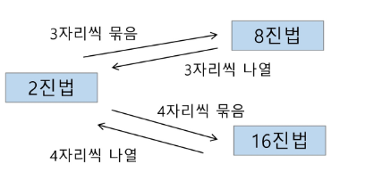
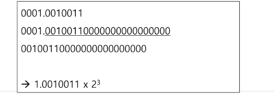
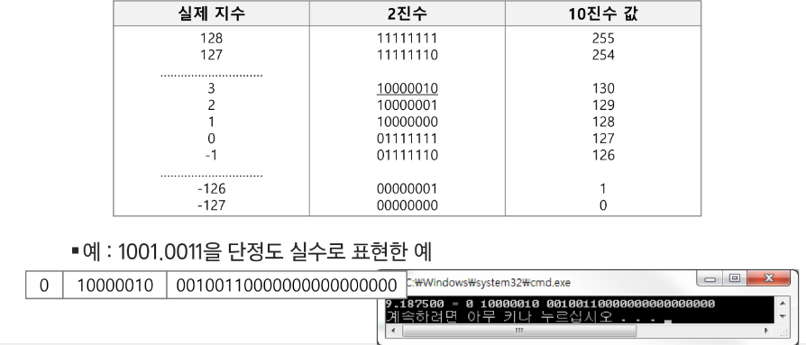
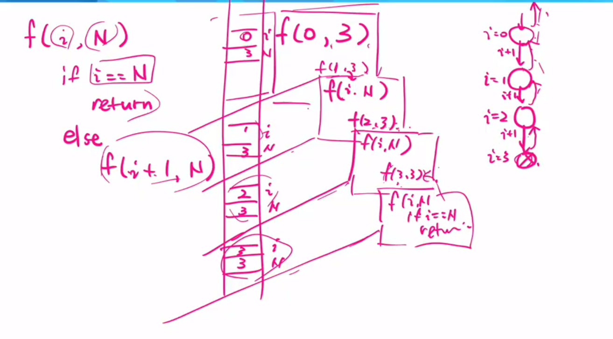

# Start

[강의자료](https://edu.ssafy.com/data/upload_files/crossUpload/openLrn/ebook/unzip/A2022031810410896100/index.html)  2022-03-23

- **학습목표**
  - SW 문제 해결 역량이란 무엇인가를 이해하고 역량을 강화하는 방법을 이해한다.
  - 효율적인 알고리즘의 필요성을 이해하고 알고리즘의 성능 측정 방법 중 하나인 시간복잡도에 대해 이해한다.
  - 프로그램을 작성하기 위한 기본 중 표준 입출력 방법에 대해 이해한다.
  - 비트 수준의 연산과 알고리즘에 대해 이해한다.
  - 컴퓨터에서의 실수 표현 방법에 대해 이해한다.


## SW 문제 해결

- **코딩 교육 이슈**

  - 오바마 대통령이 주장한 모든 학생들이 코딩을 배우라는 기사

  - 오바마 미국 대통령의 소프트웨어 강조 영상

    http://www.youtube.com/watch?v=aGAJJFpHq3Y&feature=youtu.be

  - 핀란드, 초등학교 SW코딩 교육 도입... 왜?
  - 빌 게이츠도 강조한 코딩 조기 교육 실시하는 나라는?
  - 핀란드 이웃국가인 에스토니아는 지난 2012년 전국 20개 초등학교 학생들에게 'Proge Tiiger'라고 불리는 소프트웨어 교육 프로그램을 실시한 바 있다. 학생들은 프로그램을 통해 기초 로직부터 자바, C++까지 배웠다.
  - 2013년의 베트남, 1988년의 대한민국의 코딩 교육
  - 프로그래밍··· "잘하는 사람과 못하는 사람의 생산성 차이가 스무 배" ··· [Thinking in java]의 저자 브루스 에켈


- **프로그래밍하기 위한 제약 조건과 요구사항**
  - 프로그래밍 언어의 특성
  - 프로그램이 동작할 HW와 OS에 관한 지식
  - 라이브러리들의 유의 사항들
  - 프로그램이 사용할 수 있는 최대 메모리
  - 사용자 대응 시간 제한
  - 재사용성이 높은 간결한 코드
  - ···.


- **SW 문제 해결 역량이란 무엇인가?**
  - 프로그램을 하기 위한 많은 제약 조건과 요구사항을 이해하고 최선의 방법을 찾아내는 능력
  - 프로그래머가 사용하는 언어나 라이브러리, 자료구조, 알고리즘에 대한 지식을 적재적소에 퍼즐을 배치하듯 이들을 연결하여 큰 그림을 만드는 능력이라 할 수 있다.
  - 문제 해결 역량은 추상적인 기술이다.
    - 프로그래밍 언어, 알고리즘처럼 명확히 정의된 실체가 없다.
    - 무작정 알고리즘을 암기하고 문제를 풀어본다고 향상되지 않는다.
  - 문제 해결 역량을 향상시키기 위해서 훈련이 필요하다.


- **문제 해결 능력을 훈련하기 위해서는**
  - 일부 새로운 언어, 프레임워크, 개발 방법론만을 배워나가는 것만으로 충분하지 않다. 이들을 조합해 나가는 방법을 배워야 하지만 쉽지 않다.
  - 경험을 통해서 나아지리라 막연히 짐작만 한다. 그러나 경험에서는 문제 해결 능력을 개발할 수 있는 상황이 항상 주어지는 것이 아니며 또한 그런 상황에서 자기 개발을 하기는 쉽지 않다.
  - 상황을 인위적으로 만들어 훈련해야 한다. 즉 잘 정제된 추상적인 문제를 제시하고 이를 해결해 가면서 문제 해결 능력을 향상시킬 수 있는 훈련이 필요하다.


- **문제 해결 과정**

  ① 문제를 읽고 이해한다.

  ② 문제를 익숙한 용어로 재정의한다.

  ③ 어떻게 해결할지 계획을 세운다.

  ④ 계획을 검증한다.

  ⑤ 프로그램으로 구현한다.

  ⑥ 어떻게 풀었는지 돌아보고, 개선할 방법이 있는지 찾아본다.


- **문제 해결 전략**
  - 직관과 체계적인 접근


- **체계적인 접근을 위한 질문들**
  - 비슷한 문제를 풀어본 적이 있던가?
  - 단순한 방법에서 시작할 수 있을까?
  - 문제를 단순화할 수 있을까?
  - 그림으로 그려 볼 수 있을까?
  - 수식으로 표현할 수 있을까?
  - 문제를 분해할 수 있을까?
  - 뒤에서부터 생각해서 문제를 풀 수 있을까?
  - 특정 형태의 답만을 고려할 수 있을까?
  - ···


## 복잡도 분석

- **알고리즘?**

  - (명) 알고리즘: 유한한 단계를 통해 <u>문제를 해결하기 위한 절차나 방법</u>이다. 주로 컴퓨터용어로 쓰이며, 컴퓨터가 어떤 일을 수행하기 위한 단계적 방법을 말한다.

  - 간단하게 다시 말하면 어떠한 문제를 해결하기 위한 절차라고 볼 수 있다.

  - 예를 들어 1부터 100까지의 합을 구하는 문제를 생각해 보자.

    


- **알고리즘의 효율**

  - 공간적 효율성과 시간적 효율성

    - 공간적 효율성은 <u>연산량 대비 얼마나 적은 메모리 공간을 요하는가</u>를 말한다.
    - 시간적 효율성은 연산량 대비 얼마나 적은 시간을 요하는가를 말한다.
    - 효율성을 뒤집어 표현하면 복잡도(Complexity)가 된다. 복잡도가 높을수록 효율성은 저하된다. 

  - <u>시간적 복잡도</u> 분석

    - 하드웨어 환경에 따라 처리시간이 달라진다.

      \- 부동소수 처리 프로세서 존재 유무, 나눗셈 가속기능 유무

      \- 입출력 장비의 성능, 공유 여부

    - 소프트웨어 환경에 따라 처리시간이 달라진 다.

      \- 프로그램 언어의 종류 (C vs. Python)

      \- 운영체제, 컴파일러의 종류

    - 이러한 환경적 차이로 인해 분석이 어렵다.


- **복잡도의 점근적 표기**
  - 시간 (또는 공간)복잡도는 입력 크기에 대한 함수로 표기하는데, 이 함수는 주로 여러 개의 항을 가지는 다항식이다.
  - 이를 단순한 함수로 표현하기 위해 점근적 표기(Asymptotic Notation)를 사용한다. 
  - 입력 크기 n이 무한대로 커질 때의 복잡도를 간단히 표현하기 위해 사용하는 표기법이다
    - O(Big-Oh)- 표기
    - Ω (Big-Omega)- 표기
    - Θ (Big-Theta)- 표기


### - O(Big-Oh)- 표기

- O- 표기는 복잡도의 <u>점근적 상한</u>을 나타낸다.

- 복잡도가 f(n) = 2n² - 7n + 4이라면, f(n)의 O- 표기는 O(n²)이다.

- 먼저 f(n)의 단순화된 표현은 n²이다.

- 단순화된 함수 n²에 임의의 상수 c(충분히 큰)를 곱한 cn²이 n이 증가함에 따라 f(n)의 상한이 된다.(단, c > 0)

  

- 복잡도 f(n)과 O- 표기를 그래프로 나타내고 있다.

- n이 증가함에 따라 O(g(n))이 점근적 상한이라는 것 (즉, g(n)이 n0보다 큰 모든 n에 대해서 항상 f(n)보다 크다는 것)을 보여 준다.

  


### - **Ω** (Big-Omega)- 표기

- 복잡도의 점근적 하한을 의미한다.

- f(n) = 2n² - 7n + 4의 Ω- 표기는 Ω(n²)이다.

- f(n) = Ω(n²)은 "n이 증가함에 따라 2n² - 7n + 4이 cn²보다 작을 수 없다"라는 의미이다. 이때 상수 c=1로 놓으면 된다.

- O- 표기 때와 마찬가지로, Ω- 표기도 복잡도 다항식의 최고차항만 계수 없이 취하면 된다.

- "최소한 이만한 시간은 걸린다"

- 복잡도 f(n)과 Ω- 표기를 그래프로 나타낸 것인데, n이 증가함에 따라 Ω(g(n))이 점근적 하한이라는 것 (즉, g(n)이 n0보다 큰 모든 n에 대해서 항상 f(n)보다 작다는 것)을 보여준다.

  


### - Θ (Theta)- 표기

- O- 표기와 Ω 표기가 같은 경우에 사용한다.

- f(n) = 2n² + 8n + 3 = O(n²) = Ω(n²)이므로, f(n) = Θ(n²)이다.

- "f(n)은 n이 증가함에 따라 <u>n²과 동일한 증가율을 가진다</u>"라는 의미이다.

  


- 자주 사용하는 O- 표기

  - `O(1)`    상수 시간 (Constant time)  : 입력에 관계 없이

  - `O(logn)`    로그(대수) 시간 (Logarithmic time)  : 이진 탐색 등

  - `O(n)`    선형 시간 (Linear time)  : 입력이 늘어나는 만큼 연산도

  - `O(nlogn)`    로그 선형 시간 (Log-linear time)  

  - `O(n²)`    제곱 시간 (Quadratic time)

  - `O(n³)`    세제곱 시간 (Cubic time)

    -----------------------------------------------------------------------------------------

  - `O(2ⁿ)`    지수 시간 (Exponential time)


- 왜 효율적인 알고리즘이 필요한가

  - 10억 개의 숫자를 정렬하는 데 PC에서 O(n²) 알고리즘은 300여년이 걸리는 반면에 O(nlogn) 알고리즘은 5분 만에 정렬한다.

    |    O(n²)     |   1000   |   1백만   |   10억   |
    | :----------: | :------: | :-------: | :------: |
    |      PC      |  < 1초   |   2시간   |  300년   |
    |    슈퍼컴    |  < 1초   |    1초    |  1주일   |
    | **O(nlogn)** | **1000** | **1백만** | **10억** |
    |      PC      |  < 1초   |   < 1초   |   5분    |
    |    슈퍼컴    |  < 1초   |   < 1초   |  < 1초   |

  

  - 효율적인 알고리즘은 슈퍼컴퓨터보다 더 큰 가치가 있다.
  - 값비싼 H/W의 기술 개발보다 효율적인 알고리즘 개발이 훨씬 더 경제적이다.


## 표준 입출력 방법

- **Python3 표준입출력**

  - 입력

    - Raw 값의 입력: `input()`

      \- 받은 입력값을 문자열로 취급

    - Evaluated된 값 입력: `eval(input())`  -- 거의 사용 x

      \- 받은 입력값을 평가된 데이터 형으로 취급

  - 출력

    - `print()`

      \- 표준 출력 함수. 출력값의 마지막에 개행 문자 포함

    - `print('text', end='')`

      \- 출력 시 마지막에 개행문자 제외할 시

    - `print('%d' % number)`

      \- Formatting 된 출력


- 문제 제시: 다음 내용을 표준 입력으로 읽어들여 변수에 저장 후 출력하시오.

  


- **파일의 내용을 표준 입력으로 읽어오는 방법**

  - input 파일 용량이 1M 이상인 경우 사용

  - import sys

  - sys.stdin = open("a.txt", "r")

    ```python
    import sys
    sys.stdin = open("input.txt", "r")
    sys.stdout = open("output.txt", "w")
    
    text = input()
    print(text)
    ```

    

- **python3 소스 코드**

  


## 비트 연산

- **비트 vs. 바이트**

  - 비트: 정보를 구분할 수 있는 최소 단위
  - 바이트: 메모리에서 위치를 구분할 수 있는 최소 단위

  

- **비트 연산자**

  | 연산자 | 연산자의 기능                                           |
  | :----: | ------------------------------------------------------- |
  |   &    | 비트 단위로 AND 연산을 한다                             |
  |   \|   | 비트 단위로 OR 연산을 한다                              |
  |   ^    | 비트 단위로 XOR 연산을 한다 (같으면 0 다르면 1)         |
  |   ~    | 단항 연산자로서 피연산자의 모든 비트를 반전시킨다       |
  |   <<   | 피연산자의 비트 열을 왼쪽으로 이동시킨다                |
  |   >>   | 피연산자의 비트 열을 오른쪽으로 이동시킨다 (//2와 같음) |


- **[AND] 비트 검사**

  ```
    10110001
  & 00010000
  ---------- 
    00010000   =>  찾는 자리가 0이 아니면 그 자리가 1
  ```

  

- **[AND] 비트 클리어** (a &= 1<<4)

  ```
    10110001
  & 11101111
  ----------
    10100001   =>  나머지 자리는 다 그대로 내려옴
  ```

  

- **[OR] 비트 셋: 특정 비트를 1로**

  ```
    10000001
  | 00010000
  ----------
    10010001  =>  원하는 자리 빼고 유지
  ```


- **[XOR] 같은 비트인지 검사**

  ```
    10110001
  ^ 10111001 
  ----------
    00001000  =>  결과가 0이 아닌 곳이 다른 것
  ```


- **[XOR] 비트 토글** (a ^= 1)

  ```
    10110001
  ^ 01110000
  ----------
    11000001  =>  1로 XOR 한 곳 뒤집어짐
  ```

  


- **1 << n**
  - 2ⁿ의 값을 갖는다.
  - 원소가 n개일 경우의 모든 부분집합의 수를 의미한다.
  - Power set (모든 부분집합)
    - 공집합과 자기 자신을 포함한 모든 부분집합
    - 각 원소가 포함되거나 포함되지 않는 2가지 경우의 수를 계산하면 모든 부분집합의 수가 계산된다.


- **i & (1 << j)**
  - 계산 결과는 i의 j번째 비트가 1인지 아닌지를 의미한다.


- **비트 연산 예제 1**

  

  ```python
  def Bbit_print(i):
      output = ""
      for j in range(7, -1, -1):
          output += "1" if i & (i << j) else "0"
      print(output)
  
  for i in range(-5, 6):
      print("%3d = " % i, end="")
      Bbit_print(i)
  ```

  

- [연습문제 1]

  

  ```python
  # [풀이 1]
  
  arr = list(map(int, input()))
  n = 6
  dec = 0
  for x in arr:
      dec += x * (2**n)
      n -= 1
      if n == -1:
          n = 6
          print(dec, end=" ")
          dec = 0
  ```

​		

- 비트 연산 예제2

  ```python
  def Bbit_print(i):
      output = ""
      for j in range(7, -1, -1):
          output += "1" if i & (i << j) else "0"
      print(output, end=" ")
  a = 0x10 (16진수)	   # 16진수 한자리 = 2진수 네자리
  x = 0x01020304
  print("%d = " % a, end="")
  Bbit_print(a)
  print()
  print("0%X = " % x, end="")
  for i in range(0, 4):
      Bbit_print((x >> i*8) & 0xff)       
  ```

  


- **엔디안(Endianness)**

  - 컴퓨터의 메모리와 같은 1차원의 공간에 여러 개의 연속된 대상을 배열하는 방법을 의미하며 HW 아키텍처마다 다르다.

  - 주의: 속도 향상을 위해 바이트 단위와 워드 단위를 변환하여 연산할 때 올바로 이해하지 않으면 오류를 발생 시킬 수 있다. 

  - 엔디안은 크게 두 가지로 나뉨

    - <u>빅 엔디안(Big-endian)</u>

      \- 보통 큰 단위가 앞에 나옴. 네트워크

    - <u>리틀 엔디안(Little-endian)</u>

      \- 작은 단위가 앞에 나옴. 대다수 데스크탑 컴퓨터

      |    종류     | 0x1234의 표현 | 0x12345678의 표현 |
      | :---------: | :-----------: | :---------------: |
      |  빅 엔디안  |     12 34     |    12 34 56 78    |
      | 리틀 엔디안 |     34 12     |    78 56 34 12    |

  - 엔디안 확인 코드

    ```python
    import sys 
    print(sys.byteorder)
    ```


- 비트 연산 예제 3

  ```python
  def ce(n):	# change endian
      p = []
      for i in range(0, 4):
          p.append((n >> (24 - i*8)) & 0xff)
      return p
  ```

  ```python
  x = 0x01020304
  p = []
  for i in range(0, 4):
      p.append((x >> (i * 8)) & 0xff)
      
  print("x = %d%d%d%d" & (p[0], p[1], p[2], p[3]))
  p = ce(x)
  print("x = %d%d%d%d" & (p[0], p[1], p[2], p[3]))
  ```

  

- 비트 연산 예제 4

  ```python
  def ce1(n):
      return (n << 24 & 0xff000000) | (n << 8 & 0xff0000)
  		| (n >> 8 & 0xff00) | (n >> 24 & 0xff)
  ```


- 비트 연산 예제 5

  비트 연산자 ^를 두 번 연산하면 처음 값을 반환한다.

  ```python
  def Bbit_print(i):
      output = ''
      for j in range(7, -1, -1):
          output += '1' if i & (i << j) else "0"
      print(output)
  a = 0x86
  key = 0xAA
  
  print("a       ==> ", end="")
  Bbit_print(a)
  
  print("a^=key  ==> ", end="");
  a ^= key;
  Bbit_print(a)
  
  print("a^=key  ==> ", end="");
  a ^= key;
  Bbit_print(a)
  ```

  


## 진수

- 2진수, 8진수, 10진수, 16진수


- 10진수 → 타 진수로 변환

  - 원하는 타진법의 수로 나눈 뒤 나머지를 거꾸로 읽는다

  


- 타 진수 → 10진수로 변환

  


- 2진수, 8진수, 16진수간 변환

  


- 컴퓨터에서의 음의 정수 표현 방법
  - 1의 보수: 부호와 절대값으로 표현된 값을 부호 비트를 제외한 나머지 비트들을 0은 1로, 1은 0으로 변환한다.
    - -6: 1 0 0 0 0 0 0 0 0 0 0 0 0 1 1 0 - 부호와 절대값 표현
    - -6: 1 1 1 1 1 1 1 1 1 1 1 1 1 0 0 1 - 1의 보수 표현 (1' s complement)
  - 2의 보수: 1의 보수방법으로 표현된 값의 최하위 비트에 1을 더한다.
    - -6: 1 1 1 1 1 1 1 1 1 1 1 1 1 0 1 0 - 2의 보수 표현


- [연습문제2]

  


## 실수

- 실수의 표현

  - 소수점 이하 4자리를 10진수로 나타내보면

  


- 2진 실수를 10진수로 변환하는 방법

  ex. 1001.0011

  


- 실수의 표현

  - 컴퓨터는 실수를 표현하기 위해 부동 소수점(floating-point) 표기법을 사용한다

  - 부동 소수점 표기 방법은 소수점의 위치를 고정시켜 표현하는 방식이다.

    - 소수점의 위치를 왼쪽의 가장 유효한 숫자 다음으로 고정시키고 밑수의 지수승으로 표현

      ```
      1001.0011 => 1.0010011 x 2³
      ```

      

- 실수를 저장하기 위한 형식

  - 단정도 실수(32비트)

  - 배정도 실수(64비트)

    

    - 가수부(mantissa): 실수의 유효 자릿수들을 부호화된 고정 소수점으로 표현한 것
    - 지수부(exponent): 실제 소수점의 위치를 지수 승으로 표현한 것


- 단정도 실수의 가수 부분을 만드는 방법

  - ex. 1001.0011

    - 정수부의 첫 번째 자리가 1이 되도록 오른쪽으로 시프트

    - 소수점 이하를 23비트로 만든다

    - 소수점 이하만을 가수 부분에 저장

    - 지수 부분은 시프트한 자릿수만큼 증가 또는 감소

      


- 단정도 실수의 지수 부분을 만드는 방법
  - 지수부에는 8비트가 배정(256개의 상태를 나타낼 수 있음)
  - 숫자로는 0-255까지 나타낼 수 있지만, 음수 값을 나타낼 수 있어야 하므로 익세스(excess) 표현법을 사용
    - 익세스 표현법: 지수부의 값을 반으로 나누어 그 값을 0으로 간주하여 음수지수와 양수지수를 표현하는 방법


- 단정도 표현에서의 지수부 익세스 표현

  


- 컴퓨터는 실수를 근사적으로 표현한다.
  - 이진법으로 표현할 수 없는 형태의 실수는 정확한 값이 아니라 근사값으로 저장되는데 이때 생기는 작은 오차가 계산 과정에서 다른 결과를 가져온다.


- 실수 자료형의 유효 자릿수를 알아 두자
  - 32비트 실수형 유효자릿수(십진수) → 6
  - 64비트 실수형 유효자릿수(십진수) → 15


- 파이썬에서의 실수 표현 범위를 알아보자
  - 파이썬에서는 내부적으로 더 많은 비트를 사용해서 훨씬 넓은 범위의 실수를 표현할 수 있다.
  - 최대로 표현할 수 있는 값은 약 1.8 x 10^308이고 이 이상은 inf로 표현
  - 최소로 표현할 수 있는 값은 약 5.0 x 10^-324이며, 이 이하는 0으로 표현


- [연습문제3]

  

  

## 재귀




```python
# 복사 - 재귀함수

def f(i, N):
    if i == N:
        return
    else:
        B[i] = A[i]
        f(i+1, N)
        
N = 3
A = [10, 20, 30]
B = [0] * N
f(0, N)
print(B) 	# [10, 20, 30]
```

```python
# 결정된 리턴값을 이전 단계에 전달

def f(i, N, v):
    if i == N:	# 배열을 벗어난 경우, 검색 실패
        return -1
   	elif A[i] == v:
        return 1
	else:	# 배열을 벗어나지 않고 검색 실패
        return f(i+1, N, v)	  # 리턴값을 다시 리턴

A = [7, 2, 5, 4, 1, 3]
N = len(A)
v = 5
print(f(0, N, v))	# 배열 A에 v가 있으면 1, 없으면 -1 리턴
```

```python
# A[i]에 0 또는 1을 채우는 함수

def f(i, N):
    if i == N:	# A가 모두 채워진 경우
        print(A)
    else:
        A[i] = 0
        f(i+1, N)
        A[i] = 1
        f(i+1, N)
    return

def f(i, N):
    if i == N:
        print(A)
    else:
        for j in range(2):
            A[i] = j
            f(i+1, N)
    return
N = 3
A = [0] * N
f(0, N)
```

```python
# 1, 2, 3 중복 사용해 3자리수 만들기

def f(i, N):
    if i == N:
        print(A)
    else:
        for j in range(1, 4):
            A[i] = j
            f(i+1, N)
    return

N = 3
A = [0] * N
f(0, N)
```

```python
# 1~K를 중복 사용해 3자리수 만들기

def f(i, N, k):
    if i == N:
        print(A)
    else:
        for j in range(1, K+1):
            A[i] = j
            f(i+1, N, K)
    return

N = 3
K = 5
A = [0] * N
f(0, N, K)
```

```python
# 1~k 중복 사용, 3자리 수 만들기 - v 만들면 중단, 1 리턴, 없으면 0 리턴
def f(i, N, K, v):
	if i == N:
        s = A[0] * 100 + A[1] * 10 + A[2]
        if s == v:
            return 1
       	else:
            return 0
     else:
        for j in range(1, K+1):
            A[i] = j
            f(i+1, N, K, v):
                return 1
        return 0
        
N = 3
K = 5
A = [0] * N
v = 111
f(0, N, k, v)
```

