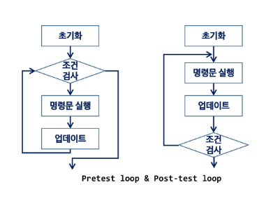
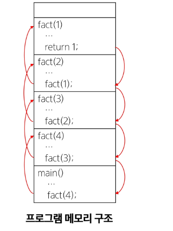
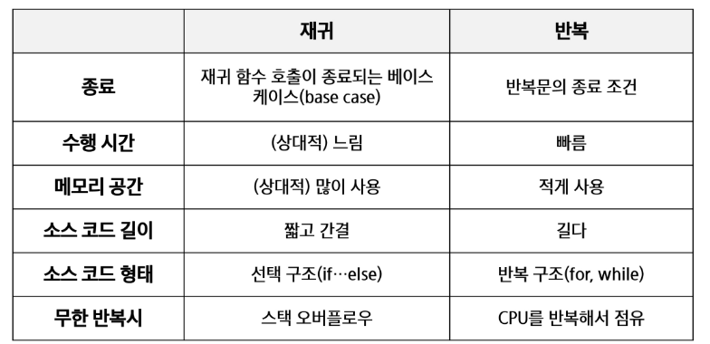
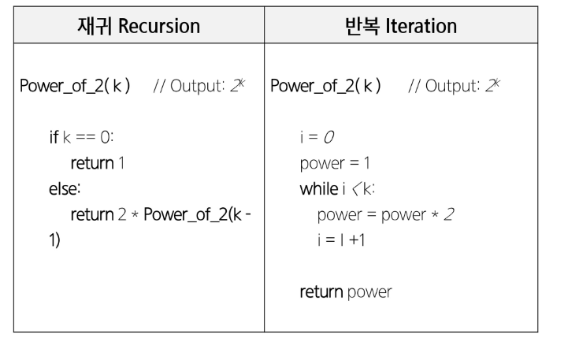
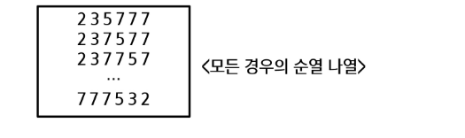
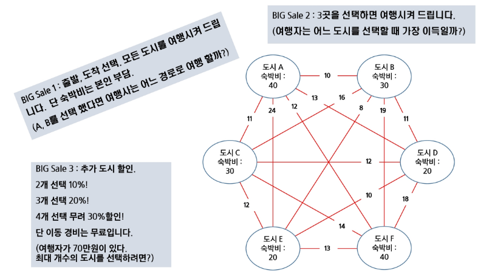
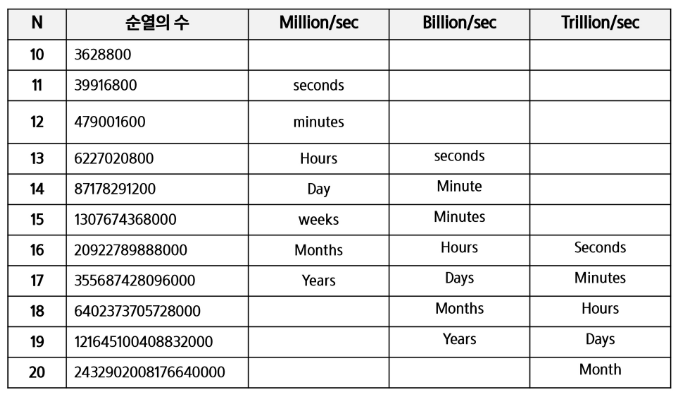

# Exhaustive Search & Greedy

- 학습목표
  - 재귀적 알고리즘의 특성을 이해하고 이를 구현하기 위한 재귀 호출에 대해 학습한다.
  - 완전 검색의 개념을 이해하고 완전 검색을 통한 문제 해결 방법에 대해 학습한다.
  - 조합적 문제(Combinatorial Problems)에 대한 완전 검색 방법에 대해 이해한다.
    - 순열, 조합, 부분집합을 생성하는 알고리즘을 학습한다.

  - 탐욕 알고리즘 기법의 개념과 주요 특성을 이해한다.


## 반복(Iteration)과 재귀(Recursion)

- 반복과 재귀는 유사한 작업을 수행할 수 있다.
- 반복은 수행하는 작업이 완료될 때 까지 계속 반복
  - 루프(for, while 구조)
- 재귀는 주어진 문제의 해를 구하기 위해 동일하면서 더 작은 문제의 해를 이용하는 방법
  - 하나의 큰 문제를 해결할 수 있는 (해결하기 쉬운) 더 작은 문제로 쪼개고 결과들을 결합한다.
  - 재귀 함수로 구현


- **반복구조**

  - 초기화
    - 반복되는 명령문을 실행하기 전에 (한번만) 조건 검사에 사용할 변수의 초기값 설정

  - 조건 검사 (check control expression)

  - 반복할 명령문 실행 (action)

  - 업데이트 (loop update)

    - 무한 루프(infinite loop)가 되지 않게 조건이 거짓(false)이 되게 한다.

      


- **반복을 이용한 선택 정렬**

  ```python
  def SelectionSort(A):
      n = len(A)
      for i in range(0, n-1):
          # 맨 앞자리가 가장 작다고 가정
          minI = i
          for j in range(i+1, n):
              if A[j] < A[minI]:
                  minI = j
          A[minI], A[i] = A[i], A[minI]
  ```

  

- **재귀적 알고리즘**
  
  - 재귀적 정의는 두 부분으로 나뉜다.
  - 하나 또는 그 이상의 기본 경우 (basis case or rule)
    - 집합에 포함되어 있는 원소로 induction을 생성하기 위한 시드(seed) 역할
  - 하나 또는 그 이상의 유도된 경우 (inductive case or rule)
    - 새로운 집합의 원소를 생성하기 위해 결합되어지는 방법


- **재귀 함수 (recursive function)**
  - 함수 내부에서 직접 혹은 간접적으로 자기 자신을 호출하는 함수
  - 일반적으로 재귀적 정의를 이용해서 재귀 함수를 구현한다.
  - 따라서, 기본 부분(basis part)와 유도 부분(inductive part)로 구성된다.
  - 재귀적 프로그램을 작성하는 것은 반복 구조에 비해 간결하고 이해하기 쉽다.
    - 그러나, 재귀에 대해 익숙하지 않은 개발자들은 재귀적 프로그램이 어렵다고 느낀다.

  - 함수 호출은 프로그램 메모리 구조에서 스택을 사용한다. 따라서 재귀 호출은 반복적인 스택의 사용을 의미하며 메모리 및 속도에서 성능저하가 발생한다.


- **팩토리얼 재귀 함수**

  - 재귀적 정의
  
    ```
    Basis rule: N <= 1 경우, n = 1
    Inductive rule: N > 1, n! = n X (n - 1)!
    ```
  
  - n! 에 대한 재귀함수
  
    ```python
    def fact(n):
        if n <= 1:		# Basis part
            return 1
        else:			# Inductive part
            return n * fact(n - 1)
    ```
  
  - 팩토리얼 재귀 함수의 호출
  
    ```python
    fact(n)
    	IF n <= 1
        	RETURN 1
        ELSE
        	RETURN n * fact(n - 1)
    ```
  
    


- **반복 또는 재귀?**
  - 해결할 문제를 고려해서 반복이나 재귀의 방법을 선택
  - 재귀는 문제 해결을 위한 알고리즘 설계가 간단하고 자연스럽다.

    - 추상 자료형(List, tree 등)의 알고리즘은 재귀적 구현이 간단하고 자연스러운 경우가 많다.
  - 일반적으로, 재귀적 알고리즘은 반복(Iterative) 알고리즘보다 더 많은 메모리와 연산을 필요로 한다.
  - 입력 값 n이 커질수록 재귀 알고리즘은 반복에 비해 비효율적일 수 있다.


- 반복과 재귀의 비교

  


- 2^k 연산에 대한 재귀와 반복

  


## 완전 검색 기법

- **Baby-gin Game**
  - 설명
    - 0~9 사이의 숫자 카드에서 임의의 카드 6장을 뽑았을 때, 3장의 카드가 연속적인 번호를 갖는 경우를 `run`이라 하고, 3장의 카드가 동일한 번호를 갖는 경우를 `triplet`이라고 한다.
    - 그리고, 6장의 카드가 `run`과 `triplet`로만 구성된 경우를 `baby-gin`으로 부른다.
    - 6자리의 숫자를 입력 받아 `baby-gin` 여부를 판단하는 프로그램을 작성한다.

  - 입력 예
    - 667767은 두 개의 triplet이므로 baby-gin이다. (666, 777)
    - 054060은 한 개의 run과 한 개의 triplet이므로 역시 baby-gin이다. (456, 000)
    - 101123은 한 개의 triplet가 존재하나, 023이 run이 아니므로 baby-gin이 아니다.
    - (123을 run으로 사용하더라도 011이 run이나 triplet가 아님)
  - 6자리의 숫자를 입력 받아 어떻게 Baby-gin 여부를 찾을 것인가?


### - 고지식한 방법(brute-force)

- brute-force는 문제를 해결하기 위한 간단하고 쉬운 접근법이다.
  - "Just-do-it"
  - force의 의미는 사람(지능)보다는 컴퓨터의 force를 의미한다.
- brute-force 방법은 대부분의 문제에 적용 가능하다.
- 상대적으로 빠른 시간에 문제 해결(알고리즘 설계)을 할 수 있다.
- 문제에 포함된 자료(요소, 인스턴스)의 크기가 작다면 유용하다.
- 학술적 또는 교육적 목적을 위해 알고리즘의 효율성을 판단하기 위한 척도로 사용된다.


- **Brute-force 탐색 (sequential search)**

  - 자료들의 리스트에서 키 값을 찾기 위해 첫 번째 자료부터 비교하면서 진행한다.

    ```pseudocode
    SequentialSearch(A[0 .. n], k)
    	A[n] <- k
    	i <- 0
    	WHILE i < n and A[i] != K
    		i++
    	IF i < n: RETURN i
    	ELSE 	: RETURN -1
    ```

    

- **완전 검색으로 시작하라**

  - 모든 경우의 수를 생성하고 테스트하기 때문에 수행 속도는 느리지만, 해답을 찾아내지 못할 확률이 작다.

    - 완전검색은 입력의 크기를 작게 해서 간편하고 빠르게 답을 구하는 프로그램을 작성한다.

  - 이를 기반으로 그리디 기법이나 동적 계획법을 이용해서 효율적인 알고리즘을 찾을 수 있다.

  - 검정 등에서 주어진 문제를 풀 때, 우선 완전 검색으로 접근하여 해답을 도출한 후, 성능 개선을 위해 다른 알고리즘을 사용하고 해답을 확인하는 것이 바람직하다.

    

- **완전 검색을 통한 Baby-gin 접근**

  - 고려할 수 있는 모든 경우의 수 생성하기

    - 6개의 숫자로 만들 수 있는 모든 숫자 나열 (중복 포함)
    - 예) 입력으로 {2, 3, 5, 7, 7, 7}을 받았을 경우, 아래와 같이 순열을 생성할 수 있다.

    

  - 해답 테스트하기

    - 앞의 3자리와 뒤의 3자리를 잘라, run와 triplet 여부를 테스트하고 최종적으로 baby-gin을 판단한다.

      


- **완전 검색**
  - 많은 종류의 문제들이 특정 조건을 만족하는 경우나 요소를 찾는 것이다.
  - 또한, 이들은 전형적으로 순열(permutation), 조합(combination), 그리고 부분집합(subset)과 같은 조합적 문제들(Combinatorial Problems)과 연관된다.
  - 완전 검색은 조합적 문제에 대한 brute-force 방법이다.


## 조합적 문제

- 문제 제시: 여행사 BIG sale!

  


### - 순열 (Permutation)

- 서로 다른 것들 중 몇 개를 뽑아서 한 줄로 나열하는 것

- 서로 다른 n개 중 r개를 택하는 순열은 아래와 같이 표현한다.  nPr

- 그리고 nPr은 다음과 같은 식이 성립한다.

  ```
  nPr = n x (n - 1) x (n - 2) x ... x (n - r + 1)
  ```

- nPn = n!이라고 표기하며 Factorial이라 부른다.

  ```
  n! = n x (n - 1) x (n - 2) x ... x 2 x 1
  ```

- 다수의 알고리즘 문제들은 순서화된 요소들의 집합에서 최선의 방법을 찾는 것과 관련 있다.
  - ex. TSP (Traveling Salesman Problem)
- N개의 요소들에 의해서 n!개의 순열들이 존재한다.
  - 12! = 479,001,600
  - n > 12인 경우, 시간 복잡도 폭발적으로 ↑

- 10 <= N <= 20

  

- 단순하게 순열을 생성하는 방법

  ex. {1, 2, 3}을 포함하는 모든 순열을 생성하는 함수

  \- 동일한 숫자가 포함되지 않았을 때, 각 자리 수 별로 loop을 이용해 아래와 같이 구현할 수 있다.

```python
# 순열 p[n]을 채우는 함수, k: 배열의 크기
def f(n, k):
    if n == k:
        print(p)
    else:
        # used에서 사용하지 않은 숫자 검색
        for i in range(k):
            # 앞에서 사용하지 않은 숫자인 경우
            if used[i] == 0:
            	used[i] = 1
                # p[n] 결정
                p[n] = a[i]
                # 다음 자리 결정하러 이동
                f(n+1, k)
                # a[i]를 다른 위치에서 사용할 수 있도록 함
                used[i] = 0           
        
a = [1, 2, 3]
p = [0] * 3
used = [0] * 3
f(0, 3)
```

```python
# 순열 p[n]을 채우는 함수, k: 고를 개수, m: 주어진 숫자 개수
def f(n, k, m):
    if n == k:
        print(p)
    else:
        for i in range(m):
            # 앞에서 사용하지 않은 숫자인 경우
            if used[i] == 0:
            	used[i] = 1
                # p[n] 결정
                p[n] = a[i]
                # 다음 자리 결정하러 이동
                f(n+1, k)
                # a[i]를 다른 위치에서 사용할 수 있도록 함
                used[i] = 0
            
a = [1, 2, 3, 4, 5]
p = [0] * 3
used = [0] * 5
f(0, 3, 5)
```


### - 부분 집합

- 집합에 포함된 원소들을 선택하는 것이다
- 다수의 중요 알고리즘들이 원소들의 그룹에서 최적의 부분 집합을 찾는 것이다
  - ex. 배낭 짐싸기 (knapsack)
- N개의 원소를 포함한 집합
  - 자기 자신과 공집합 포함한 모든 부분집합(power set)의 개수는 2ⁿ개
  - 원소의 수가 증가하면 부분집합의 개수는 지수적으로 증가


- 단순하게 모든 부분 집합 생성하는 방법

  - 4개 원소를 포함한 집합에 대한 power set 구하기

  ```pseudocode
  FOR i1 in 0 → 1
  	bit[0] ← i1
  	FOR i2 in 0 → 1
  		bit[1] ← i2
  ```

  

- 바이너리 카운팅을 통한 사전적 순서(Lexicographic Order)
  - 부분집합을 생성하기 위한 가장 자연스러운 방법이다
  - 바이너리 카운팅(Binary Counting)은 사전적 순서로 생성하기 위한 가장 간단한 방법이다.


- **바이너리 카운팅(Binary Counting)**

  - 원소 수에 해당하는 N개의 비트열을 이용한다.

  - n번째 비트값이 1이면 n번째 원소가 포함되었음을 의미한다.

    

  - 바이너리 카운팅을 통한 부분집합 생성 코드 예

    ```python
    arr = [3, 6, 7, 1, 5, 4]
    n = len(arr)
    
    for i in range(0, (1 << n)): # 1 << n: 부분집합의 개수
        for j in range(0, n):	# 원소의 수만큼 비트를 비교함
            if i & (1 << j):	# i의 j번째 비트가 1이면 j번째 원소 출력
                print('%d' % arr[j], end='')
        print()
    ```

    

### - 조합

- 서로 다른 n개의 원소 중 r개를 순서 없이 골라낸 것을 조합(combination)이라고 부른다.

- 조합의 수식

  

- 재귀 호출을 이용한 조합 생성 알고리즘

  

- [참고] 10개의 원소 중 3개를 고르는 조합

  - i < j < k라고 하면

    

    ```pseudocode
    for i: 0 → 7		# j, k로 선택될 원소를 남김
    	for j: i+1 → 8		# k로 선택될 원소를 남김
    		for k: i+1 → 9
    			f(a[i], a[j], a[k])
    ```

  ```python
  def f(i, j, k):
      print(i, j, k)
      
  N = 10
  R = 3
  for i in range(N-2):
      for j in range(i+1, N-1):
          for k in range(j+1, N):
              f(i, j, k)
  ```

  

- [참고] n개에서 r개를 고르는 조합(재귀)

  

  ``` python
  def nCr(n, r, s):
      if r == 0:
          print(comb)
      else:
          for i in range(s, n-r+1):
              comb[r-1] = A[i]
              nCr(n, r-1, i+1)
              
  n = 5
  r = 3
  comb = [0] * 3
  A = [i for i in range(1, n + 1)]
  nCr(n, r, 0)
  ```

  