# Graph & Backtracking

> [강의자료](https://edu.ssafy.com/data/upload_files/crossUpload/openLrn/ebook/unzip/A2022040110222928500/index.html)  2022-04-01

- **학습목표**
  - 실 세계 문제를 그래프로 추상화해서 해결하는 방법을 학습한다.
    - 그래프 탐색 기법인 BFS와 DFS에 대해 학습한다.
    - 그래프 알고리즘에 활용되는 상호배타 집합(Disjoint-Sets)의 자료구조에 대해 학습한다.
    - 최소 신장 트리(Minimum Spanning Tree)를 이해하고 탐욕 기법을 이용해서 그래프에서 최소 신장 트리를 찾는 알고리즘을 학습한다.
    - 그래프의 두 정점 사이의 최단 경로(Shortest Path)를 찾는 방법을 학습한다.


## 그래프 기본

- **문제 제시: 친구관계**
  - A의 친구는 B다.
  - C의 친구는 E, F이다.
  - (D - E), (F - G), (N - B, I, L), (G - A, C, D, H), (I - J, H), (B - D, K, L), (M - I, J), (E - A, H), (C - B, I, L), (B - I), (J - A, G)
  - A의 친구 중에 친구가 가장 많은 친구는 누구인가?


- **그래프**

  - 그래프는 아이템(사물 또는 추상적 개념)들과 이들 사이의 연결 관계를 표현한다.

  - 그래프는 정점(Vertex)들의 집합과 이들을 연결하는 간선(Edge)들의 집합으로 구성된 자료구조

    - cf) 트리: V = E + 1  /  E = V - 1

    - `|V|`: 정점의 개수, `|E|`: 그래프에 포함된 간선의 개수

    - |V|개의 정점을 가지는 그래프는 최대 |V| * (|V| - 1) / 2 간선이 가능

       ex. 5개 정점이 있는 그래프의 최대 간선 수는 10 (= 5 * 4 / 2)개이다.
  
  - 선형 자료구조나 트리 자료구조로 표현하기 어려운 N : N 관계를 가지는 원소들을 표현하기에 용이하다.


- **그래프 유형**

  - `무향 그래프` (Undirected Graph)
  - `유향 그래프` (Directed Graph)
  - `가중치 그래프` (Weighted Graph)
  - `사이클 없는 방향 그래프` (DAG, Directed Acyclic Graph)

  

  - `완전 그래프`

    - 정점들에 대해 가능한 모든 간선들을 가진 그래프

      

  - `부분 그래프`
    - 원래 그래프에서 일부의 정점이나 간선을 제외한 그래프

  

- **인접 정점**

  - `인접` (Adjacency)

    - 두 개의 정점에 간선이 존재(연결됨)하면 서로 인접해 있다고 한다.

    - 완전 그래프에 속한 임의의 두 정점들은 모두 인접해 있다.

      

- **그래프 경로**

  - 경로란 간선들을 순서대로 나열한 것

    - 간선들: (0, 2), (2, 4), (4, 6)
    - 정점들: 0 - 2 - 4 - 6

  - 경로 중 한 정점을 최대한 한번만 지나는 경로를 `단순경로`라 한다.

    - 0 - 2 - 4 - 6, 0 - 1 - 6

  - 시작한 정점에서 끝나는 경로를 `사이클(Cycle)`이라고 한다.

    - 1 - 3 - 5 - 1

      

- **그래프 표현**
  - 간선의 정보를 저장하는 방식, 메모리나 성능을 고려해서 결정
  - 인접 행렬 (Adjacent matrix)
    - |V| x |V| 크기의 2차원 배열을 이용해서 간선 정보를 저장
    - 배열의 배열 (포인터 배열)
  - 인접 리스트 (Adjacent List)
    - 각 정점마다 해당 정점으로 나가는 간선의 정보를 저장
  - 간선의 배열
    - 간선(시작 정점, 끝 정점)을 배열에 연속적으로 저장


- **인접 행렬**

  - 두 정점을 연결하는 간선의 유무를 행렬로 표현

    - |V| x |V| 정방 행렬

    - 행 번호와 열 번호는 그래프의 정점에 대응

    - 두 정점이 인접되어 있으면 1, 그렇지 않으면 0으로 표현

    - 무향 그래프
      - i번째 행의 합 = i번째 열의 합 = Vi의 차수
      
        
      
        ```python
        '''
        마지막 정점 번호, 간선 수
        6 8
        0 1 0 2 0 5 0 6 5 3 4 3 5 4 6 4 
        '''
        
        V, E = map(int, input().split())	# V: 마지막 정점 번호, E: 간선 수
        arr = list(map(int, input().split()))
        adjM = [[0] * (V+1) for _ in range(V+1)] 	# 인접 행렬
        
        for i in range(E):
            n1, n2 = arr[i*2], arr[i*2+1]
            adjM[n1][n2] = 1
            adjM[n2][n1] = 1	# 방향이 없기 때문에 둘 다 표시
        ```
      
        
      
    - 유향 그래프
      - 행 i의 합 = Vi의 진출 차수
      
      - 열 i의 합 = Vi의 진입 차수
      
        
      
        ```python
        '''
        마지막 정점 번호, 간선 수
        6 8
        0 1 0 2 0 5 0 6 5 3 4 3 5 4 6 4 
        '''
        
        V, E = map(int, input().split())	# V: 마지막 정점 번호, E: 간선 수
        arr = list(map(int, input().split()))
        adjM = [[0] * (V+1) for _ in range(V+1)] 	# 인접 행렬
        
        for i in range(E):
            n1, n2 = arr[i*2], arr[i*2+1]
            adjM[n1][n2] = 1	# 출발 - 도착으로 주어진 경우
        ```
      
        

    

  - 인접 행렬의 단점은?

    - 비어 있는 0이 너무 많다!
    
    

- 인접 리스트

  - 각 정점에 대한 인접 정점들을 순차적으로 표현

  - 하나의 정점에 대한 인접 정점들을 각각 노드로 하는 연결 리스트로 저장

    

    
    
    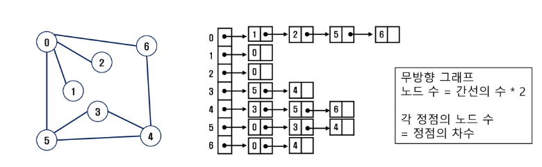
    
    ```python
    '''
    마지막 정점 번호, 간선 수
    6 8
    0 1 0 2 0 5 0 6 5 3 4 3 5 4 6 4 
    '''
    
    V, E = map(int, input().split())	# V: 마지막 정점 번호, E: 간선 수
    arr = list(map(int, input().split()))
    adjL = [[] for _ in range(V+1)]
    
    for i in range(E):
    	n1, n2 = arr[i*2], arr[i*2+1]
        adjL[n1].append(n2)
        adjL[n2].append(n2)		# 무향 그래프인 경우에만
    ```
    
    
    
    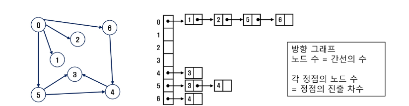
    
    ```python
    '''
    마지막 정점 번호, 간선 수
    6 8
    0 1 0 2 0 5 0 6 5 3 4 3 5 4 6 4 
    '''
    
    V, E = map(int, input().split())	# V: 마지막 정점 번호, E: 간선 수
    arr = list(map(int, input().split()))
    adjL = [[] for _ in range(V+1)]
    
    for i in range(E):
    	n1, n2 = arr[i*2], arr[i*2+1]
        adjL[n1].append(n2)		# n1(출발) n2(도착)인 경우
    ```
    
    


## 그래프 탐색

- **문제 제시: 친구 관계**

  - 다음과 같이 친구 관계를 그래프로 표현하였다.

  - A로부터 시작해서 한 명의 친구에게만 소식을 전달, 전달할 수 있다면 최대 몇 명의 친구가 소식을 전달 받을 수 있을까? (단 소식을 전달 받은 친구한테는 소식을 재 전달할 수 없다.)

  - A로부터 시작해서 친구들에게 동시에 소식을 전달할 수 있다고 할 때, 가장 늦게 전달 받는 사람은 누구일까? (단 친구에게 소식을 전달하는 속도는 동일하다)

    


- **그래프 순회(탐색)**
  - 그래프 순회는 비선형구조인 그래프로 표현된 모든 자료(정점)를 빠짐없이 탐색하는 것을 의미한다.
  - 두 가지 방법
    - 깊이 우선 탐색(Depth First Search, DFS)
    - 너비 우선 탐색(Breadth First Search, DFS)


### - DFS

- **DFS (깊이 우선 탐색)**
  - 시작 정점의 한 방향으로 갈 수 있는 경로가 있는 곳까지 깊이 탐색해 가다가 더 이상 갈 곳이 없게 되면, 가장 마지막에 만났던 갈림길 간선이 있는 정점으로 되돌아와서 다른 방향의 정점으로 탐색을 계속 반복하여 결국 모든 정점을 방문하는 순회 방법
  - 가장 마지막에 만났던 갈림길의 정점으로 되돌아가서 다시 깊이 우선 탐색을 반복해야 하므로 후입선출 구조의 스택 사용


#### + Stack

- **스택(stack)의 특성**
  - 물건을 쌓아 올리듯 자료를 쌓아 올린 형태의 자료구조이다.
  - 선형 구조: 자료 간의 관계가 1대1의 관계를 갖는다.
    - 비선형 구조: 자료 간의 관계가 1대N의 관계를 갖는다. (ex. 트리)
  - 마지막에 삽입한 자료를 가장 먼저 꺼낸다.
    - 후입선출(LIFO, Last-In-First-Out)이라고 부른다.


- **스택의 구현**
  - 스택을 구현하기 위해서 필요한 저장소와 연산
    - 자료를 선형으로 저장할 저장소
      - C언어에서는 배열을 사용할 수 있다.
      - 저장소 자체를 스택이라 부르기도 한다.
      - 스택에서 마지막 삽입된 원소의 위치를 top이라 부른다.
  - 연산
    - `push`: 저장소에 자료를 삽입(저장)한다.
    - `pop`: 저장소에서 자료를 꺼낸다. (삽입한 자료의 역순)
    - `isEmpty`: 스택이 공백인지 아닌지를 확인하는 연산
    - `peek`: 스택의 top에 있는 item(원소)을 반환하는 연산


- 스택의 삽입/삭제 과정

  - 빈 스택에 원소 A, B, C를 차례로 삽입 후 한번 삭제하는 연산 과정

    

- **스택의 push 알고리즘**

  - top은 스택에서 마지막 자료의 위치를 가리킨다.

  ```pseudocode
  push(S, x)
  	top <- top + 1;
  	
  	if top >= STACK_SIZE
  		error overflow;
  	else
  		S[top] <- x;
  ```


- **스택의 pop 알고리즘**

  ```pseudocode
  pop(S)
  	if top < 0
  		error underflow;
  	else
  		top <- top - 1;
  		return S[top + 1];


- **DFS 알고리즘 - 재귀**

  ```pseudocode
  DFS_Recursive(G, v)
  	visited[v] <- TRUE  // v 방문 설정
  	
  	FOR each all w in adjacancy(G, v)
  		IF visited[w] !- TRUE
  			DFS_Recursive(G, w)
  ```


- **DFS 알고리즘 - 반복**

  ```pseudocode
  STACK s
  visited[]
  DFS(v)
  	push(s, v)
  	WHILE NOT isEmpty(s)
  		v <- pop(s)
  		IF NOT visited[v]
  			visit(v)
  			FOR each w in adjacency(v)
  				IF NOT visited[w]
  				push(s, w)
  ```

  ```pseudocode
  STACK s
  visited[]
  DFS(v)
  	push(s, v)
  	visited[v] = True
  	WHILE NOT isEmpty(s)
  		v <- pop(s)
  		visit(v)
  		FOR each w in adjacency(v)
  			IF NOT visited[w]
  			push(s, w)
  			visited[v] = True
  ```

  

- **[연습문제1] DFS**

  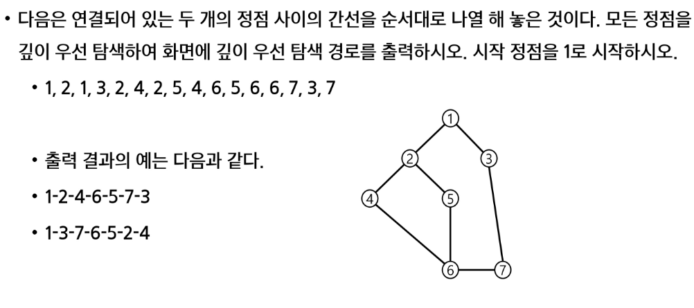

  ```python
  '''
  7 8
  1 2 1 3 2 4 2 5 4 6 5 6 6 7 3 7
  '''
  
  def dfs(v, V):
      visited[v] = 1
      print(v, end = ' ')		# 방문 순서대로 출력
      for w in range(1, V+1):		# v에 인접한 모든 노드에 대해
          if adjM[v][w]==1 and visited[w]==0:
              dfs(w, V)
  
  def dfs2(v, V):
      stack = [v]             # 스택생성 + 시작정점 push
      visited = [0]*(V+1)
      visited[v] = 1          # push됨 표시
      while stack:
          v = stack.pop()
          print(v)            # visit()
          for w in range(1, V+1):
              if adjM[v][w]==1 and visited[w]==0: # 인접하고 미방문 w
                  stack.append(w)         # 갈림길 목록
                  visited[w] = 1
  
  def dfs2_adjL(v, V):    # 인접 리스트인 경우
      stack = [v]             # 스택생성 + 시작정점 push
      visited = [0]*(V+1)
      visited[v] = 1          # push됨 표시
      while stack:
          v = stack.pop()
          print(v)            # visit()
          for w in adjL[v]:   # v에 인접한 정점 w
              if visited[w]==0: # 인접하고 미방문 w
                  stack.append(w)         # 갈림길 목록
                  visited[w] = 1
  
  def dfs3(v, V):
      stack = [v]             # 스택생성 + 시작정점 push
      visited = [0]*(V+1)
      while stack:
          v = stack.pop()
          if visited[v]==0:
              print(v)            # visit()
              visited[v] = 1
              for w in range(1, V+1):
                  if adjM[v][w]==1 and visited[w]==0: # 인접하고 미방문 w
                      stack.append(w)         # 갈림길 목록
  
  
  V, E = map(int, input().split())
  arr = list(map(int, input().split()))
  adjM = [[0]*(V+1) for _ in range(V+1)]
  adjL = [[] for _ in range(V+1)]
  
  for i in range(E):
      n1, n2 = arr[i*2], arr[i*2+1]
      adjM[n1][n2] = 1
      #adjM[n2][n1] = 1
  
  for i in range(E):
      n1, n2 = arr[i*2], arr[i*2+1]
      adjL[n1].append(n2)
      adjL[n2].append(n1)
  
  # visited = [0]*(V+1)
  # dfs(1, V)
  #dfs3(1, V)
  dfs2_adjL(1, V)
  print()
  ```

  ```python
  # DFS - 인접 리스트
  
  def dfs2(v):
      visited[v] = 1
      print(v, end=' ')
      for w in adjL[v]:
          if visited[w] == 0:
          	dfs2(w)
  ```

  

### - BFS

- **BFS (Breadth First Search)**
  - 너비 우선 탐색은 탐색 시작점의 인접한 정점들을 먼저 모두 차례로 방문한 후에, 방문했던 정점을 시작점으로 하여 다시 인접한 정점들을 차례로 방문하는 방식
  - 인접한 정점들에 대해 탐색을 한 후, 차례로 다시 너비우선탐색을 진행해야 하므로, 선입선출 형태의 자료구조인 큐를 활용함


#### + Queue

- **큐(Queue)의 특성**
  - 스택과 마찬가지로 삽입과 삭제의 위치가 제한적인 자료구조
    - 큐의 뒤에서는 삽입만 하고, 큐의 앞에서는 삭제만 이루어지는 구조
  - 큐에 삽입한 순서대로 원소가 저장되어, 가장 먼저 삽입된 원소는 가장 먼저 삭제된다.
    - 선입선출구조(FIFO: First In First Out)


- **큐의 구조 및 기본 연산**

  - 큐의 선입선출 구조

    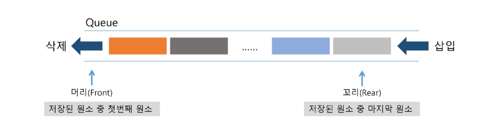

  - 큐의 기본 연산 

    - 삽입: enQueue
    - 삭제: deQueue


- **큐의 연산 과정**

  ① 공백 큐 생성: createQueue()	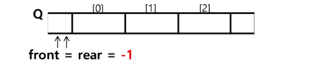

  ② 원소 A 삽입: enQueue(A)	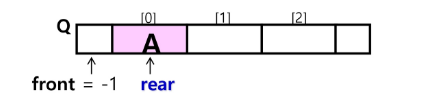

  ③ 원소 B 삽입: enQueue(B)		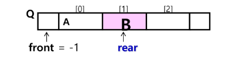

  ④ 원소 반환 / 삭제: deQueue()		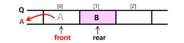

  ⑤ 원소 C 삽입: enQueue(C)		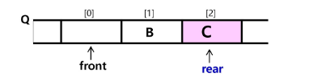

  ⑥ 원소 반환 / 삭제: deQueue()		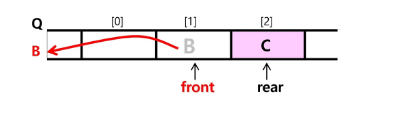

  ⑦ 원소 반환 / 삭제: deQueue()	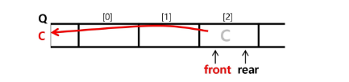


- **큐의 구현**

  - 삽입: `enQueue(item)`

    - 마지막 원소 뒤에 새로운 원소를 삽입하기 위해

      ① rear 값을 하나 증가시켜 새로운 원소를 삽입할 자리를 마련

      ② 그 인덱스에 해당하는 배열원소 Q[rear]에 item을 저장

      ```pseudocode
      EnQueue(Q, x)
      	if isFull()		// rear == QUEUE_SIZE
      		QUEUE_FULL
      	else
      		rear <- rear + 1
      		Q[rear] <- x
      ```

  - 삭제: `deQueue()`

    - 가장 앞에 있는 원소를 삭제하기 위해

      ① front 값을 하나 증가시켜 큐에 남아있게 될 첫번째 원소 이동

      ② 새로운 첫번째 원소를 리턴함으로써 삭제와 동일한 기능함

      ```pseudocode
      deQueue(Q)
      	if isEmpty()
      		QUEUE_EMPTY
      	else
      		front <- front + 1
      		return Q[front]
      ```

  - 공백상태 및 포화상태 검사: `isEmpty()`, `isFull()`

    - 공백상태: front = rear

    - 포화상태: rear = n - 1 (n: 배열의 크기, n - 1: 배열의 마지막 인덱스)

      ```pseudocode
      isEmpty()
      	IF front = rear : RETURN TRUE
      	ELSE			: RETURN FALSE
      
      isFull()
      	IF rear = n - 1	: RETURN TRUE
      	ELSE			: RETURN FALSE
      ```

      

- BFS (Breadth First Search)

  - BFS는 예제 그래프를 붙여진 번호 순서로 탐색함

    

- BFS 알고리즘

  - 입력 파라미터: 그래프 G와 탐색 시작점 v

    ```pseudocode
    BFS(G, v)	// 그래프 G, 탐색 시작점 v
    	큐 생성
    	시작점 v를 큐에 삽입
    	점 v를 방문한 것으로 표시
    	WHILE 큐가 비어있지 않은 경우
    		t <- 큐의 첫번째 원소 반환
    		FOR t와 연결된 모든 선에 대해
    			u <- t의 이웃점
    			u가 방문되지 않은 곳이면,
    			u를 큐에 넣고, 방문한 것으로 표시
    ```

    

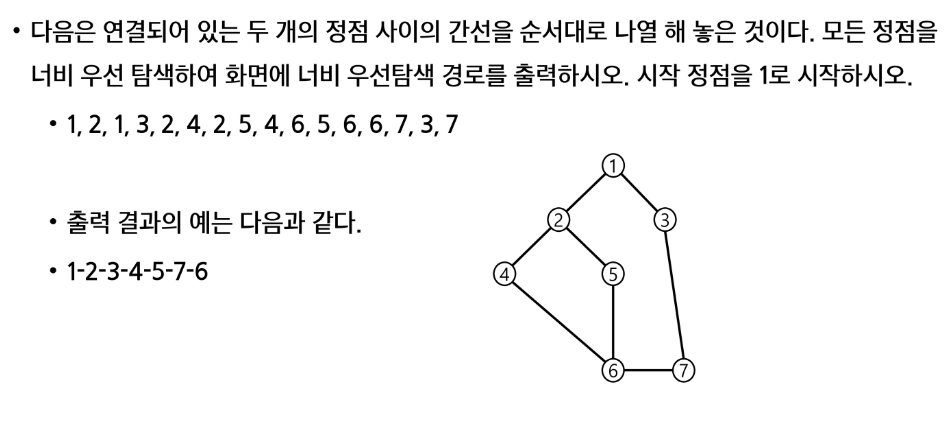


## 서로소 집합

- **서로소 집합(Disjoint-sets)**
  - 서로소 또는 상호배타 집합들은 서로 중복 포함된 원소가 없는 집합들이다. 다시 말해 교집합이 없다.
  - 집합에 속한 하나의 특정 멤버를 통해 각 집합들을 구분한다. 이를 대표자(representative)라 한다.


- 상호배타 집합을 표현하는 방법
  - 연결 리스트
  - 트리


- 상호배타 집합 연산
  - Make-set(x)
  - Find-set(x)
  - Union(x, y)


- 상호배타 집합 예

  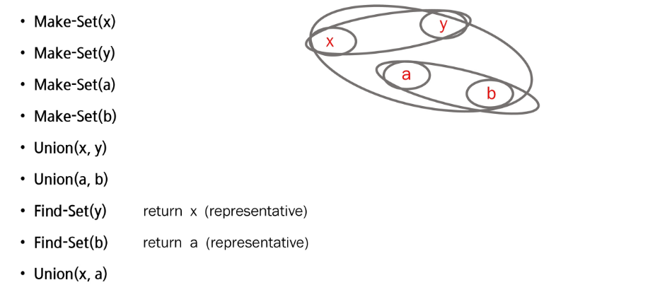


- **상호 배타 집합 표현 - 연결 리스트**

  - 같은 집합의 원소들은 하나의 연결리스트로 관리한다.

  - 연결리스트의 맨 앞의 원소를 집합의 대표 원소로 삼는다.

  - 각 원소는 집합의 대표원소를 가리키는 링크를 갖는다.

    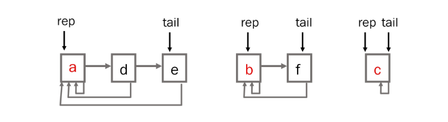

  - 연결리스트 연산 예

    - Find-Set(e)	return a

    - Find-Set(f)     return b

    - Union(a, b)

      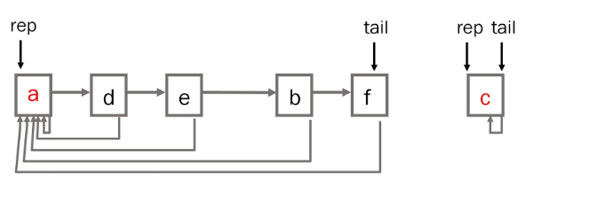

- **상호 배타 집합 표현 - 트리**

  - 하나의 집합(a disjoint set)을 하나의 트리로 표현한다.

  - 자식 노드가 부모 노드를 가리키며 루트 노드가 대표자가 된다.

    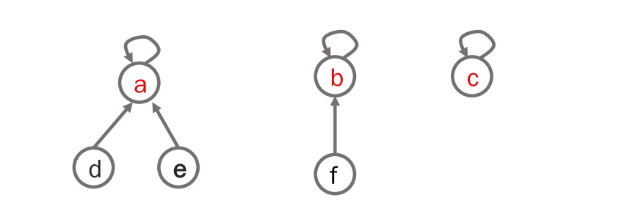

  - 연산 예

    - Make-Set(a) ~ Make-Set(f)

      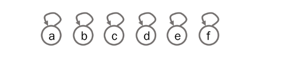

    - Union(c, d), Union(e, f)

      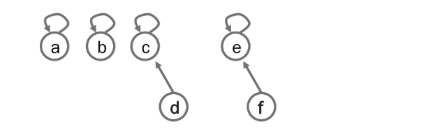
  
    - Union(d, f)
  
      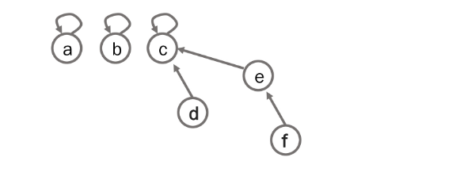
  
    - Find-Set(d)          return c
    - Find-Set(e)          return c
  
  - 상호배타 집합을 표현한 트리의 배열을 이용한 저장된 모습
  
    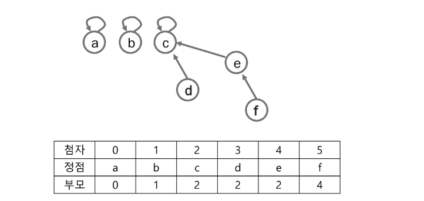


- **상호배타 집합에 대한 연산**

  - Make-Set(x): 유일한 멤버 x를 포함하는 새로운 집합을 생성하는 연산

    ```pseudocode
    Make-Set(x)
    	p[x] <- x
    ```

  - Find-Set(x): x를 포함하는 집합을 찾는 연산

    ```pseudocode
    Find_Set(x)
    	IF x == p[x] : RETURN x
    	ELSE		 : RETURN Find_Set(p[x])
    ```

  - Union(x, y): x와 y를 포함하는 두 집합을 통합하는 연사

    ```pseudocode
    Union(x, y)
    	p[Find_Set(y)] <- Find_Set(x)
    ```

  - Find_Set(x): x를 포함하는 집합을 찾는 연산(반복)

    ```pseudocode
    Find_Set(x)
    	while x != p[x]
    			x = p[x]
    	return x
    ```


- 문제점

  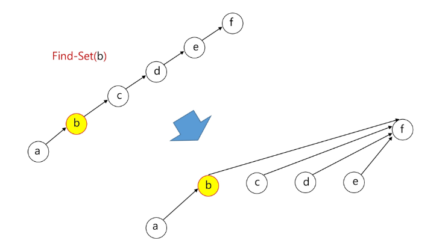


- 연산의 효율을 높이는 방법
  - Rank를 이용한 Union
    - 각 노드는 자신을 루트로 하는 subtree의 높이를 랭크(Rank)라는 이름으로 저장한다.
    - 두 집합을 합칠 때 rank가 낮은 집합을 rank가 높은 집합에 붙인다.
  - Path compression
    - Find-Set을 행하는 과정에서 만나는 모든 노드들이 직접 root를 가리키도록 포인터를 바꾸어 준다.


- 랭크를 이용한 Union의 예

  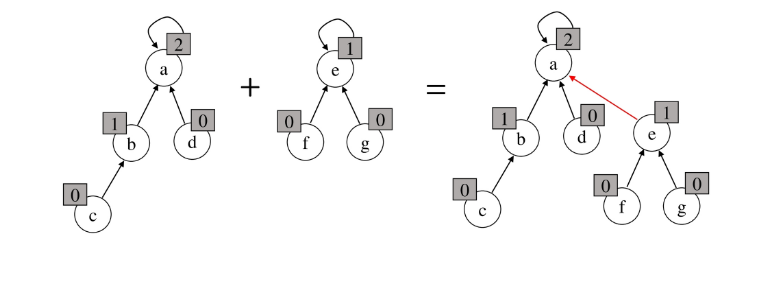


- 랭크를 이용한 Union에서 랭크가 증가하는 예

  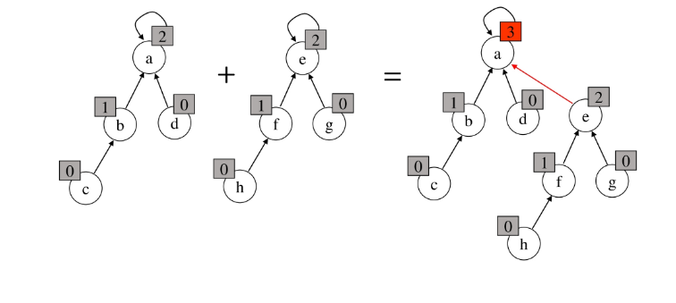

- Path Compression의 예

  

- Make_Set() 연산

  - Make_Set(x): 유일한 멤버 x를 포함하는 새로운 집합을 생성하는

    ```pseudocode
    p[x]: 노드 x의 부모 저장
    rank[x]: 루트 노드가 x인 트리의 랭크 값 저장
    
    Make_Set(x)
    	p[x] <- x
    	rank[x] <- 0
    ```

    

- Find_Set 연산

  - Find_Set(x): x를 포함하는 집합 찾는 오퍼레이션 

    ```pseudocode
    Find_Set(x)
    	IF x != p[x] 		// x가 루트가 아닌 경우
    		p[x] <- Find_Set(p[x])
    	RETURN p[x]
    ```

  - Find_Set 연산은 특정 노드에서 루트까지의 경로를 찾아 가면서 노드의 부모 정보를 갱신한다.


- Union 연산

  - Union(x, y): x와 y를 포함하는 두 집합을 통합하는 오퍼레이션

    ```pseudocode
    Union(x, y)
    	Link(Find_Set(x), Find_Set(y))
    ```

    ```pseudocode
    Link(x, y)
    	IF rank[x] > rank[y]	// rank는 트리의 높이
    		p[y] <- x
        ELSE
        	p[x] <- y
        	IF rank[x] == rank[y]
        		rank[y]++
    ```

    


## 최소 신장 트리

- 최소 신장 트리 (MST)

  - 그래프에서 최소 비용 문제

    - 모든 정점을 연결하는 간선들의 가중치의 합이 최소가 되는 트리

    - 두 정점 사이의 최소 비용의 경로 찾기
- 신장 트리
  
  - n개의 정점으로 이루어진 무방향 그래프에서 n개의 정점과 n-1개의 간선으로 이루어진 트리
  - 최소 신장 트리 (Minimum Spanning Tree)
  - 무방향 가중치 그래프에서 신장 트리를 구성하는 간선들의 가중치의 합이 최소한 신장 트리


- MST 표현

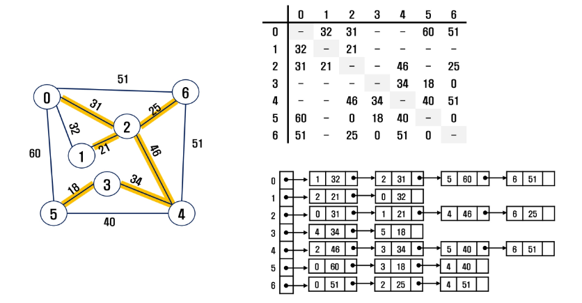

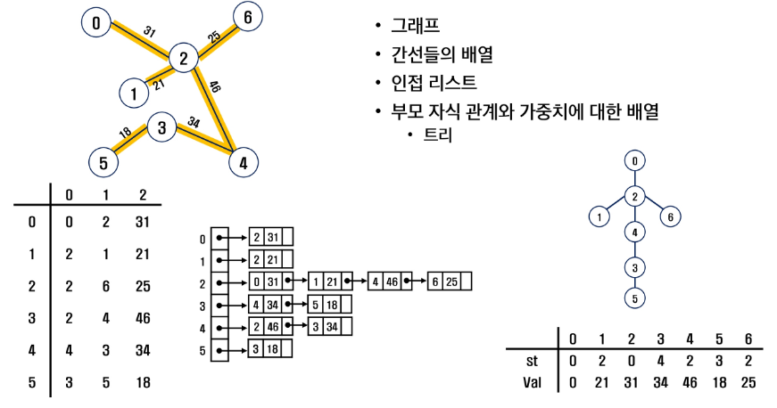


### - Prim 알고리즘

- 하나의 정점에서 연결된 간선들 중에 하나씩 선택하면서 MST를 만들어 가는 방식
  1) 임의 장점을 하나 선택해서 시작
  2) 선택한 정점과 인접하는 정점들 중의 최소 비용이 간선이 존재하는 정점을 선택
  3) 모든 정점이 선택될 때까지 1, 2 과정을 반복


- 서로소인 2개의 집합(2 disjoint-sets) 정보를 유지
  - 트리 정점들(tree vertices) - MST를 만들기 위해 선택된 정점들
  - 비트리 정점들(nontree vertices) - 선택되지 않은 정점들


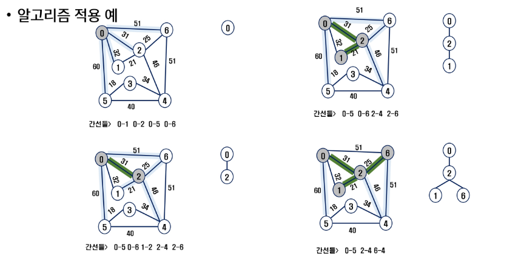

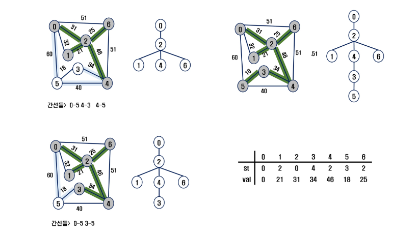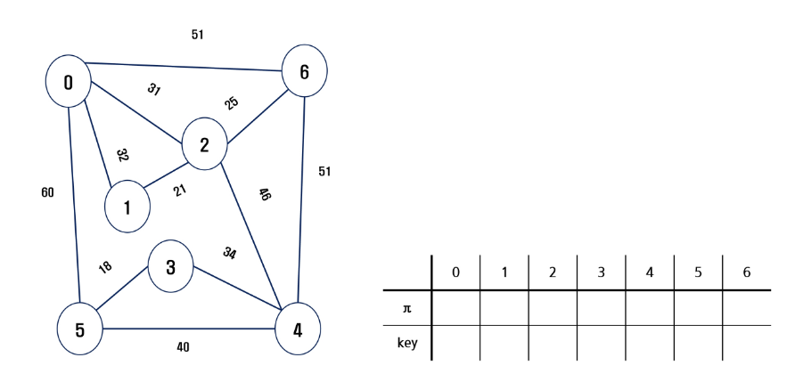


- 알고리즘

  ```pseudocode
  MST_PRIM(G, r)		// G: 그래프, r: 시작 정점
  	FOR u in G, V
  		u.key <- ∞ 		// u.key: u에 연결된 간선 중 최고 가중치
  		u.π <- NULL		// u.π: 트리에서 u의 부모
  	r.key <- 0
  	Q <- G.V			// 우선순위 Q에 모든 정점 넣는다
  	WHILE Q != 0			// 빈 Q가 아닐 동안 반복
  		u <- Extract_MIN(Q)		// key 값이 가장 작은 정점 가져오기
  		FOR v in G.Adj[u]			// u의 인접 정점들
  			IF v ∈ Q AND w(u, v) < v.key	// Q에 있는 v의 key값 갱신
  				v.π <- u
  				v.key <- w(u, v)
  ```

  

### - KRUSKAL 알고리즘

- 간선을 하나씩 선택해서 MST를 찾는 알고리즘

  1) 최초, 모든 간선을 가중치에 따라 오름차순으로 정렬

  2) 가중치가 가장 낮은 간선부터 선택하면서 트리를 증가시킴

     \- 사이클이 존재하면 다음으로 가중치가 낮은 간선 선택

  3. n - 1개의 간선이 선택될 때까지 2.를 반복

     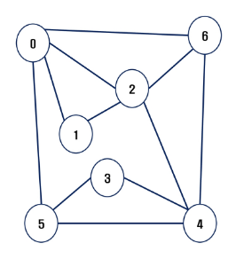


- 알고리즘 적용 예

  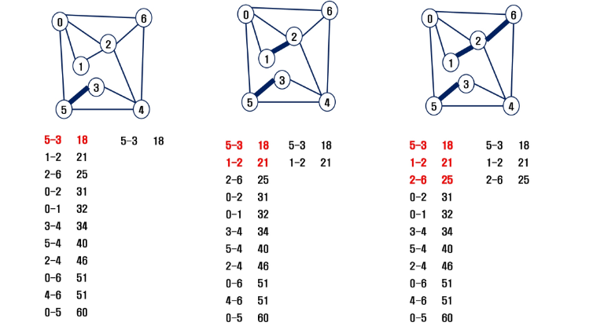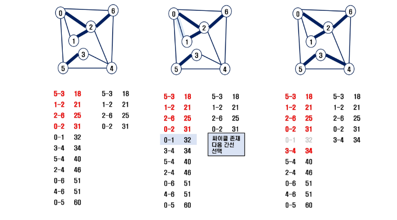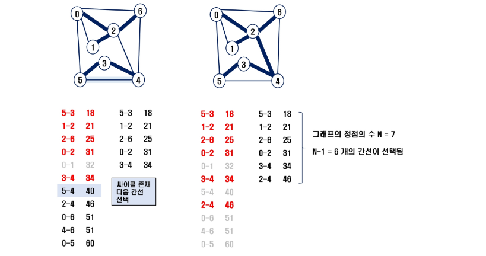


- 알고리즘

  ```pseudocode
  MST-KRUSKAL(G, w)
  	A <- 0
  	FOR vertex v in G.v
  		Make_Set(v)
  		
  	G.E에 포함된 간선들을 가중치 w에 의해 정렬
  	
  	FOR 가중치가 가장 낮은 간선 (u, v) ∈ G, E 선택(n - 1개)
  		IF Find_Set(u) != Find_Set(v)
  			A <- A ∪ {(u, v)}
  			Union(u, v);
  	
  	RETURN A
  ```

  

## 최단 경로

- 최단 경로 정의
  - 간선의 가중치가 있는 그래프에서 두 정점 사이의 경로들 중에 간선의 가중치의 합이 최소인 경로


- 하나의 시작 정점에서 끝 정점까지의 최단경로
  - 다익스트라(dijkstra) 알고리즘
    - 음의 가중치를 허용하지 않음
  - 벨만-포드(Bellman-Ford) 알고리즘
    - 음의 가중치 허용


- 모든 정점들에 대한 최단 경로
  - 플로이드-워샬(Floyd-Warshall) 알고리즘


### - Dijkstra 알고리즘

- 시작 정점에서 거리가 최소인 정점을 선택해 나가면서 최단 경로를 구하는 방식이다.

- 시작정점(s)에서 끝정점(t) 까지의 최단 경로에 정점 x가 존재한다.

- 이때, 최단경로는 s에서 x까지의 최단 경로와 x에서 t까지의 최단 경로로 구성된다.

- 탐욕 기법을 사용한 알고리즘으로 MST의 프림 알고리즘과 유사하다.

  

- 알고리즘

  ```pseudocode
  s: 시작 정점, A: 인접 행렬, D: 거리
  v: 정점 집합, U: 선택된 정점 집합
  
  Dijkstra(s, A, D)
  	U = {s};
  	
  	FOR 모든 정점 v
  		D[v] <- A[s][v]
  		
  	WHILE U != V
  		D[w]가 최소인 정점 w ∈ V - U를 선택
  		U <- U ∪ {w}
  		
  		FOR w에 인접한 모든 정점 v
  			D[v] <- min(D[v], D[w] + A[w][v])
  ```

  

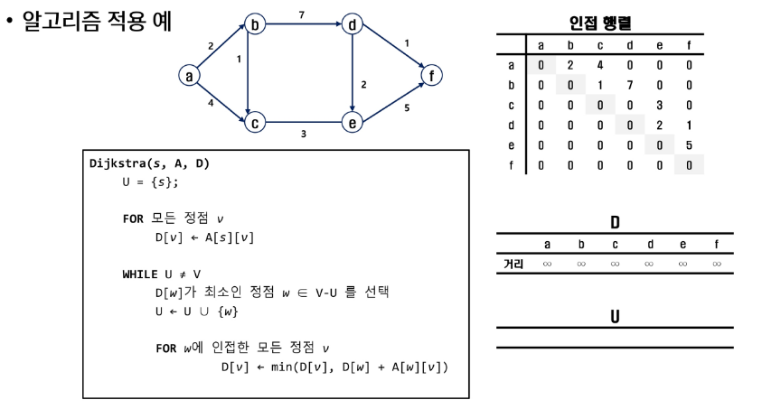

**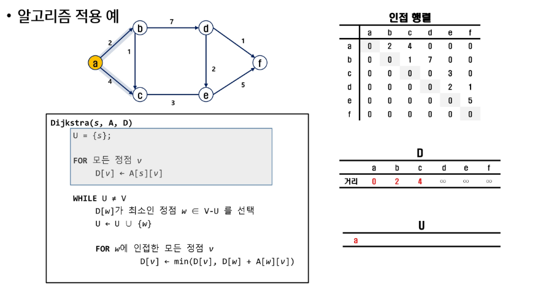**

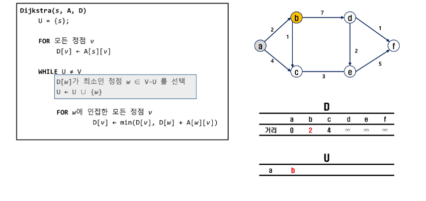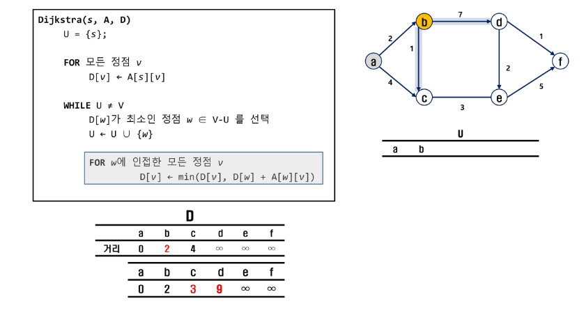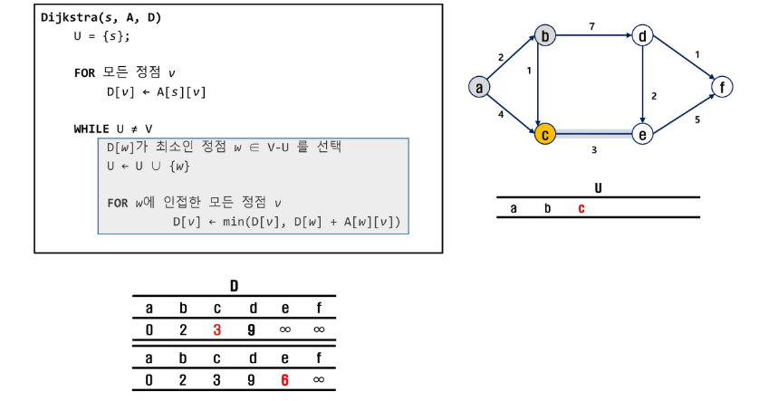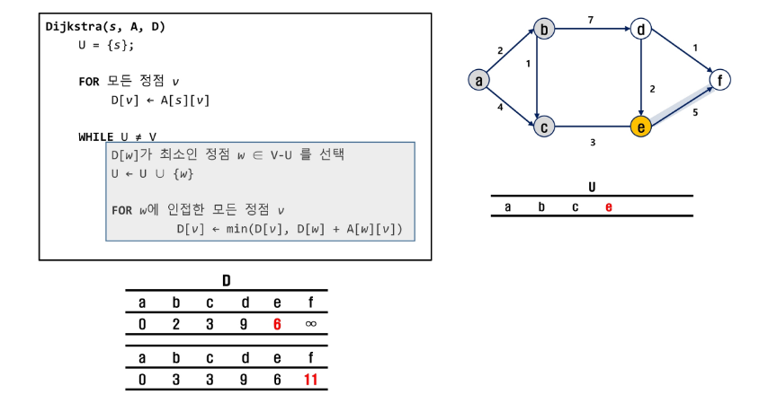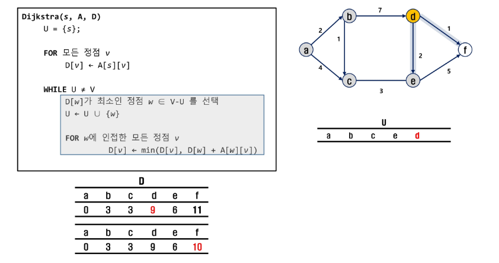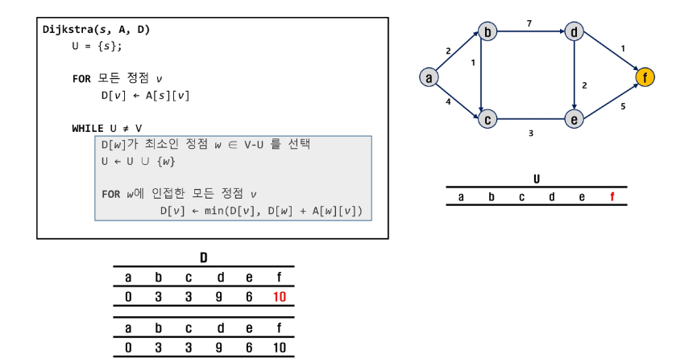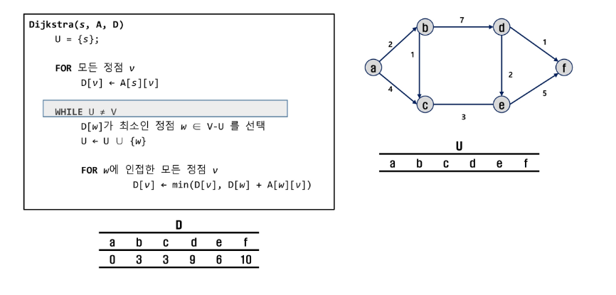
