# Stack 1

> [강의자료](https://edu.ssafy.com/data/upload_files/crossUpload/openLrn/ebook/unzip/A2022020911023028800/index.html)  2022-02-21


## 스택

### 스택의 특성

- 물건을 쌓아 올리듯 자료를 쌓아 올린 형태의 자료구조이다.

- 스택에 저장된 자료는 선형 구조를 갖는다.
  - 선형 구조 : 자료 간의 관계가 1대 1의 관계를 갖는다.
  - 비선형 구조 : 자료 간의 관계가 1대 N의 관계를 갖는다. (ex. 트리)

- 스택에 자료를 삽입하거나 스택에서 자료를 꺼낼 수 있다.

- 마지막에 삽입한 자료를 가장 먼저 꺼낸다. 후입선출(LIFO, Last-In-First-Out)이라고 부른다.
  - 예를 들어 스택에 1, 2, 3 순으로 자료를 삽입한 후 꺼내면 역순으로 즉 3, 2, 1 순으로 꺼낼 수 있다.


### 스택의 구현

- **스택을 프로그램에서 구현하기 위해서 필요한 자료구조와 연산**

  - 자료구조 : 자료를 선형으로 저장할 저장소

    - 배열을 사용할 수 있다.

    - 저장소 자채를 스택이라 부르기도 한다.

    - 스택에서 마지막 삽입된 원소의 위치를 top이라 부른다. (+ stack pointer)

      

- **연산**

  - 삽입 : 저장소에 자료를 저장한다. 보통 `push`라고 부른다.
  - 삭제 : 저장소에서 자료를 꺼낸다. 꺼낸 자료는 삽입한 자료의 역순으로 꺼낸다. 보통 `pop`이라고 부른다.
  - 스택이 공백인지 아닌지를 확인하는 연산 : `isEmpty`
  - 스택의 top에 있는 item(원소)를 반환(확인)하는 연산 : `peek`


- **스택의 삽입 / 삭제 과정**

  빈 스택에 원소 A, B, C를 차례로 삽입 후 한 번 삭제하는 연산 과정

  


- 스택의 push 알고리즘

  append 메소드를 통해 리스트의 마지막에 데이터를 삽입

  ```python
  def push(item):
      s.append(item)
  ```

  ```python
  # 참고
  
  def push(item, size):
      global top
      top += 1
      if top == size:
          print('overflow!')
      else:
          stack[top] = item
          
  size = 10
  stack = [0] * size		
  top = -1			# 초기 설정
  
  push(10, size)
  top += 1		# push(20)
  stack[top] = 20 
  ```

  

- 스택의 pop 알고리즘

  단점 : 느린 연산이 구현됨

  ```python
  def pop():
      if len(s) == 0:	 # 스택이 비어 있는 경우
          # underflow
          return
      else:
          return s.pop(-1);
  ```

  ```python
  # 참고
  
  def pop():
      global top
      if top == -1:
          print('underflow')
          return 0
      else:
          top -= 1
          return stack[top+1]
      
  print(pop)
  
  if top > -1:	# pop()
      top -= 1
      print(stack[top+1])
  ```

  ```python
  while top >= 0:
      n = stack[top]
      top -= 1
  ```

  

- 스택 구현 고려 사항

  1차원 배열을 사용하여 구현할 경우 구현이 용이하다는 장점이 있지만 스택의 크기를 변경하기가 어렵다는 단점이 있다.

  이를 해결하기 위한 방법으로 저장소를 동적으로 할당하여 스택을 구현하는 방법이 있다. 동적 연결리스트를 이용하여 구현하는 방법을 의미한다. 구현이 복잡하다는 단점이 있지만 메모리를 효율적으로 사용한다는 장점을 가진다. 스택의 동적 구현은 생략한다. 


### 스택의 응용

#### 1. 괄호검사

- 괄호의 종류 : 대괄호 ('[', ']'), 중괄호('{', ''}'), 소괄호('(', ')')
- 조건
  1. 왼쪽 괄호의 개수와 오른쪽 괄호의 개수가 같아야 한다.
  2. 같은 괄호에서 왼쪽 괄호는 오른쪽 괄호보다 먼저 나와야 한다.
  3. 괄호 사이에는 포함 관계만 존재한다.


괄호를 조사하는 알고리즘 개요

문자열에 있는 괄호를 차례대로 조사하면서 왼쪽 괄호를 만나면 스택에 삽입하고, 오른쪽 괄호를 만나면 스택에서 top 괄호를 삭제(`pop`)한 후 오른쪽 괄호와 짝이 맞는지를 검사한다.

이 때, 스택이 비어 있으면 조건 1 또는 조건 2에 위배되고 괄호의 짝이 맞지 않으면 조건 3에 위배된다.

마지막 괄호까지를 조사한 후에도 스택에 괄호가 남아 있으면 조건 1에 위배된다.


#### 2. Function call

- 프로그램에서의 <u>함수 호출</u>과 복귀에 다른 수행 순서를 관리

  가장 마지막에 호출된 함수가 가장 먼저 실행을 완료하고 복귀하는 후입선출 구조이므로, 후입선출 구조의 스택을 이용하여 수행순서 관리

  함수 호출이 발생하면 호출한 함수 수행에 필요한 지역변수, 매개변수 및 수행 후 복귀할 주소 등의 정보를 스택 프레임(stack frame)에 저장하여 시스템 스택에 삽입

  함수의 실행이 끝나면 시스템 스택의 top 원소(스택 프레임)를 삭제(pop)하면서 프레임에 저장되어 있던 복귀주소를 확인하고 복귀

  함수 호출과 복귀에 따라 이 과정을 반복하여 전체 프로그램 수행이 종료되면 시스템 스택은 공백 스택이 된다.


- 함수 호출과 복귀에 따른 전체 프로그램의 수행 순서

  


## 재귀호출

- <u>자기 자신을 호출하여 순환 수행되는것</u>

- 함수에서 실행해야 하는 작업의 특성에 따라 일반적인 호출방식보다 재귀호출방식을 사용하여 함수를 만들면 프로그램의 크기를 줄이고 간단하게 작성

  - 재귀 호출의 예-**Factorial**

    n에 대한 factorial : 1부터 n까지의 모든 자연수를 곱하여 구하는 연산

    ```
    n! = n x (n-1)!
    	(n-1)! = (n-1) x (n-2)!
        (n-2)! = (n-2) x (n-2)!
    ...
    	2! = 2 x 1!
        1! = 1
    ```

    마지막에 구한 하위 값을 이용하여 상위 값을 구하는 작업을 반복

  - factorial 함수에서 n=4인 경우의 실행

  


- 0과 1로 시작하고 이전의 두 수 합을 다음 항으로 하는 수열을 피보나치라 한다.

  - 0, 1, 1, 2, 3, 5, 8, 13, ...

- **피보나치 수열**의 i번째 값을 계산하는 함수 F를 정의하면 다음과 같다.

  

- 위의 정의로부터 피보나치 수열의 i번째 항을 반환하는 함수를 재귀함수로 구현할 수 있다.

- **피보나치 수를 구하는 재귀함수**

  ```python
  def fibo(n):
      if n < 2:
          return n
      else:
          return fibo(n-1) + fibo(n-2)
  ```

  
  
- 재귀로 복사

  ```python
  def f(i, N):
      if i == N:
          print(B)
      else:
          B[i] = A[i]
          f(i+1, N)
          
  A = [1, 2, 3]
  B = [0] * 3
  f(0, 3)
  ```

  

## Memoization

앞의 예에서 피보나치 수를 구하는 함수를 재귀함수로 구현한 알고리즘은 문제점이 있다.

"엄청난 중복 호출이 존재한다"라는 것이다. 


메모이제이션(memoization)은 컴퓨터 프로그램을 실행할 때 이전에 계산한 값을 메모리에 저장해서 매번 다시 계산하지 않도록 하여 전체적인 실행속도를 빠르게 하는 기술이다. 동적 계획법의 핵심이 되는 기술이다.

'memoization'은 글자 그대로 해석하면 '메모리에 넣기(to put in memory)'라는 의미이며 '기억되어야 할 것'이라는 뜻의 라틴어 memorandum에서 파생되었다. 흔히 '기억하기', '암기하기'라는 뜻의 memorization과 혼동하지만, 정확한 단어는 memoization이다. 동사형은 memoize이다.

앞의 예에서 피보나치 수를 구하는 알고리즘에서 fibo(n)의 값을 계산하자마자 저장하면(memoize), 실행시간을 Θ(n)으로 줄일 수 있다.

Memoization 방법을 적용한 알고리즘은 다음과 같다.

```python
# memo를 위한 배열을 할당하고, 모두 0으로 초기화한다
# memo[0]을 0으로 memo[1]는 1로 초기화한다.

def fibo1(n):
    global memo
    if n >= 2 and len(memo) <= n:
        memo.append(fibo1(n-1) + fibo1(n-2))
    return memo[n]

memo = [0, 1]
```


## DP

> Dynamic Programming

- **동적 계획(Dynamic Programming)** 알고리즘은 그리디 알고리즘과 같이 최<u>적화 문제</u>를 해결하는 알고리즘이다.
- 동적 계획 알고리즘은 먼저 입력 크기가 작은 부분 문제들을 모두 해결한 후에 그 해들을 이용하여 보다 큰 크기의 부분 문제들을 해결하여, 최종적으로 원래 주어진 입력의 문제를 해결하는 알고리즘이다.


- 피보나치 수 DP  적용

  - 피보나치 수는 부분 문제의 답으로부터 본 문제의 답을 얻을 수 있으므로 최적 부분 구조로 이루어져 있다.

  1. 문제를 부분 문제로 분할한다.
  
     Fibonacci(n) 함수는 Fibonacci(n-1)과 Fibonacci(n-2)의 합
  
     Fibonacci(n-1)은 Fibonacci(n-2)와 Fibonacci(n-3)의 합
  
     Fibonacci(2)는 Fibonacci(1)과 Fibonacci(0)의 합
  
     Fibonacci(n)은 Fibonacci(n-1), Fibonacci(n-2), ... Fibonacci(2), Fibonacci(1), Fibonacci(0)의 부분집합으로 나뉜다.
  
  2. 부분 문제로 나누는 일을 끝냈으면 가장 작은 부분 문제부터 해를 구한다.
  3. 그 결과는 테이블에 저장하고, 테이블에 저장된 부분 문제의 해를 이용하여 상위 문제의 해를 구한다.

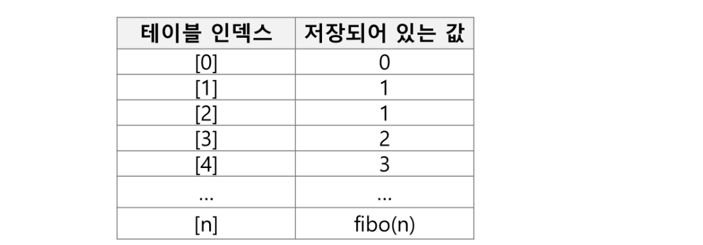


- 피보나치 수 DP 적용 알고리즘

  ```python
  def fibo2(n):
      f = [0, 1]
      
      for i in range(2, n+1):
          f.append(f[i-1] + f[i-2])
          
      return f[n]
  ```

  

- DP의 구현 방식

  - recursive 방식 : fib1()

  - iterative 방식 : fib2()

    

  - memoization을 재귀적 구조에 사용하는 것보다 반복적 구조로 DP를 구현한 것이 성능 면에서 보다 효율적이다.

  - 재귀적 구조는 내부에 시스템 호출 스택을 사용하는 오버헤드가 발생하기 때문이다.

## DFS

> 깊이우선탐색

- 비선형구조인 그래프 구조는 그래프로 표현된 모든 자료를 빠짐없이 검색하는 것이 중요하다.

- 두 가지 방법
  - 깊이 우선 탐색 (Depth First Search, DFS)
  - 너비 우선 탐색 (Breadth First Search, BFS)

- 시작 정점의 한 방향으로 갈 수 있는 경로가 있는 곳까지 깊이 탐색해 가다가 더 이상 갈 곳이 없게 되면, 가장 마지막에 만났던 갈림길 간선이 있는 정점으로 되돌아와서 다른 방향의 정점으로 탐색을 계속 반복하여 결국 모든 정점을 방문하는 순회 방법

- 가장 마지막에 만났던 갈림길의 정점으로 되돌아가서 다시 깊이 우선 탐색을 반복해야 하므로 후입선출 구조의 스택 사용


- DFS 알고리즘

  1. 시작 정점 v를 결정하여 방문한다

  2. 정점 v에 인접한 정점 중에서

     (1) 방문하지 않은 정점 w가 있으면, 정점 v를 스택에 push하고 정점 w를 방문한다. 그리고 w를 v로 하여 다시 2. 를 반복한다.

     (2) 방문하지 않은 정점이 없으면, 탐색의 방향을 바꾸기 위해서 스택을 pop하여 받은 가장 마지막 방문 정점을 v로 하여 다시 2. 를 반복한다.

  3. 스택이 공백이 될 때까지 2. 를 반복한다.

  ```pseudocode
  visited[], stack[] 초기화
  DFS(v)
  	v 방문;
  	visited[v] <- true;
  	do {
  		if (v의 인접 정점 중 방문 안한 w 찾기)
  			push(v);
  			while (w) {
  				w 방문;
  				visited[w] <- true;
  				push(w);
  				v <- w
  				v의 인접 정점 중 방문 안한 w 찾기
  			}
  			v <- pop(stack);
  	} while(v)
  end DFS()
  ```

  

- DFS 예

  초기상태 : 배열 visited를 False로 초기화하고, 공백 스택을 생성

  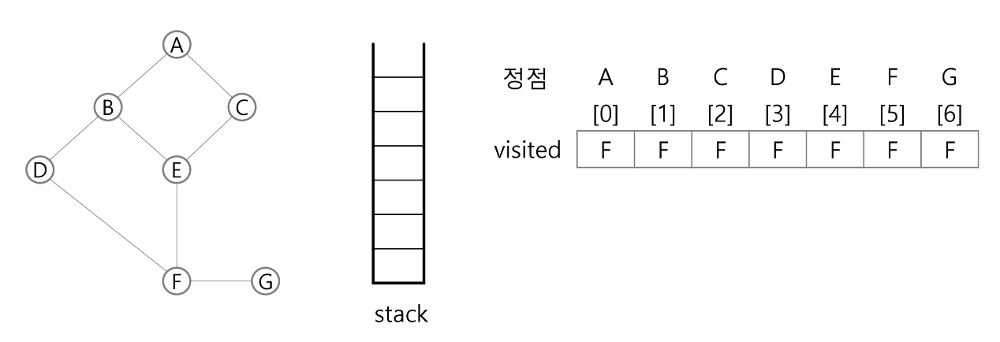

  1. 정점 A를 시작으로 깊이 우선 탐색을 시작

  ```pseudocode
  A 방문;
  	visited[A] <- true;
  ```

  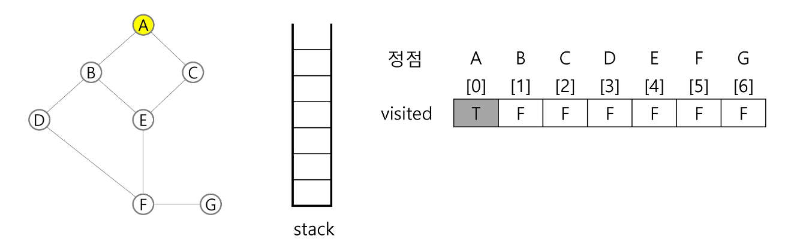

  2. 정점 A에 방문하지 않은 정점 B, C가 있으므로 A를 스택에 push하고, 인접 정점 B와 C 중에서 오름차순에 따라 B를 선택하여 탐색을 계속한다.

     \- 꼭 오름차순이어야 하는 것은 아님! 내가 정한 규칙에 의해 탐색

  ```pseudocode
  push(a);
  B 방문;
  visited[B] <- true;
  ```

  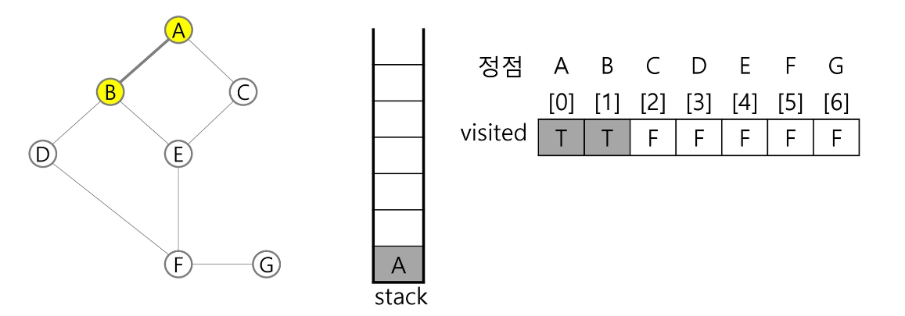

  3. 정점 B에 방문하지 않은 정점 D, E가 있으므로 B를 스택에 push하고, 인접정점 D와 E 중에서 오름차순에 따라 D를 선택하여 탐색을 계속한다.

  ```pseudocode
  push(B);
  D 방문;
  visited[D] <- true;
  ```

  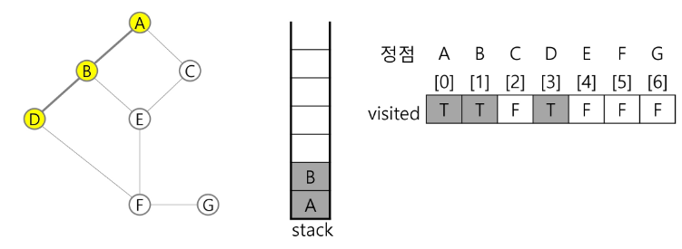

  4. 정점 D에 방문하지 않은 정점 F가 있으므로 D를 스택에 push하고, 인접정점 F를 선택하여 탐색을 계속한다. 

  ```
  push(D);
  F 방문;
  visited[F] <- true;
  ```

  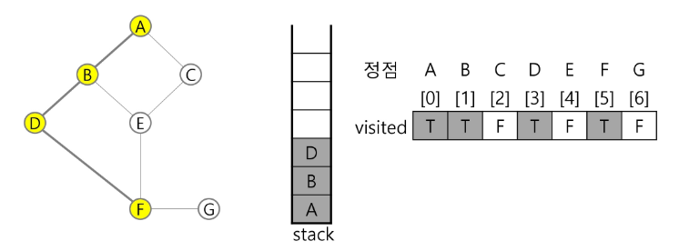

  5. 정점 F에 방문하지 않은 정점 E, G가 있으므로 F를 스택에 push하고, 인접정점 E와 G 중에서 오름차순에 따라 E를 선택하여 탐색을 계속한다.

  ```
  push(F);
  E 방문;
  visited[E] <- true;
  ```

   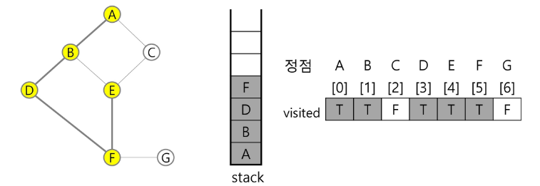

  6. 정점 E에 방문하지 않은 정점 C가 있으므로 E를 스택에 push하고, 인접정점 C를 선택하여 탐색을 계속한다.

  ```pseudocode
  push(E);
  C 방문;
  visited[C] <- true;
  ```

  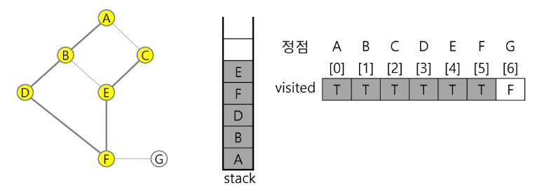

  7. 정점 C에서 방문하지 않은 인접정점이 없으므로, 마지막 정점으로 돌아가기 위해 스택을 pop하여 받은 정점 E에 대해서 방문하지 않은 인접정점이 있는지 확인한다.

  ```pseudocode
  pop(stack);
  ```

  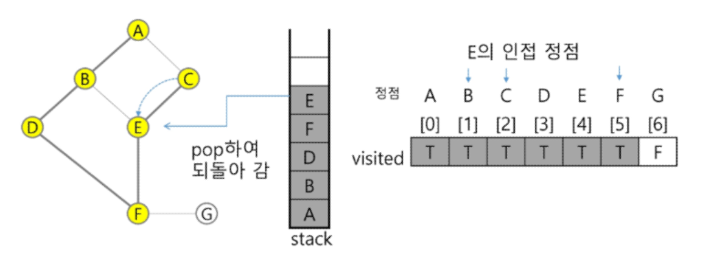

  8. 정점 E는 방문하지 않은 인접정점이 없으므로, 다시 스택을 pop하여 받은 정점 F에 대해서 방문하지 않은 인접정점이 있는지 확인한다.

  ```pseudocode
  pop(stack);
  ```

  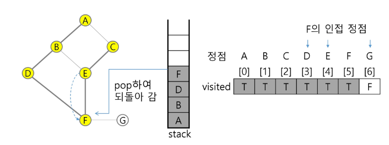

  9. 정점 F에 방문하지 않은 정점 G가 있으므로 F를 스택에 push하고, 인접정점 G를 선택하여 탐색을 계속한다.

  ```pseudocode
  push(F);
  G 방문;
  visited[G] <- true;
  ```

  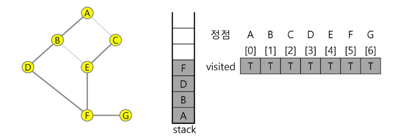

  10. 정점 G에서 방문하지 않은 인접정점이 없으므로, 마지막 정점으로 돌아가기 위해 스택을 pop하여 받은 정점 F에 대해서 방문하지 않은 인접정점이 있는지 확인한다.

  ```pseudocode
  pop(stack);
  ```

  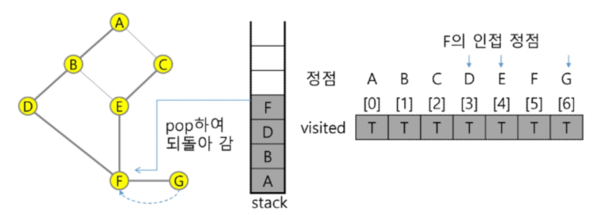

  11. 정점 F에서 방문하지 않은 인접정점이 없으므로, 다시 마지막 정점으로 돌아가기 위해 스택을 pop하여 받은 정점 D에 대해서 방문하지 않은 인접정점이 있는지 확인한다.

  ```pseudocode
  pop(stack);
  ```

  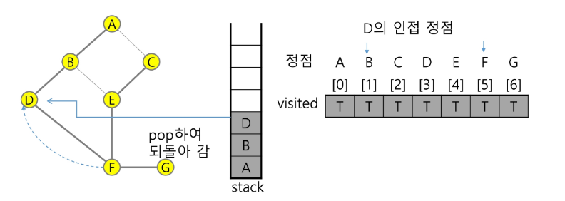

  12. 정점 D에서 방문하지 않은 인접정점이 없으므로, 다시 마지막 정점으로 돌아가기 위해 스택을 pop하여 받은 정점 B에 대해서 방문하지 않은 인접정점이 있는지 확인한다.

  ```pseudocode
  pop(stack);
  ```

  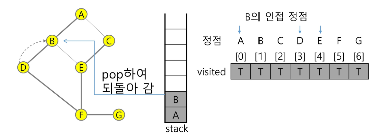

  13. 정점 B에서 방문하지 않은 인접정점이 없으므로, 다시 마지막 정점으로 돌아가기 위해 스택을 pop하여 받은 정점 A에 대해서 방문하지 않은 인접정점이 있는지 확인한다.

  ```pseudocode
  pop(stack);
  ```

  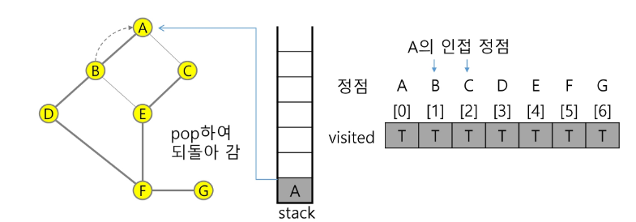

  14. 현재 정점 A에서 방문하지 않은 인접 정점이 없으므로 마지막 정점으로 돌아가기 위해 스택을 pop하는데, 스택이 공백이므로 깊이 우선 탐색을 종료한다.

  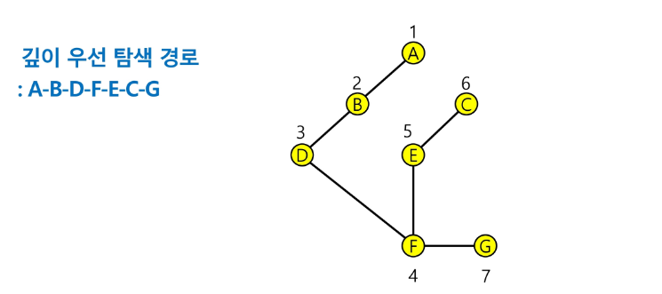


- 연습문제

  다음은 연결되어 있는 두 개의 정점 사이의 간선을 순서대로 나열해 놓은 것이다. 모든 정점을 깊이 우선 탐색하여 화면에 깊이 우선 탐색 경로를 출력하시오. 시작 정점을 1로 시작하시오.

  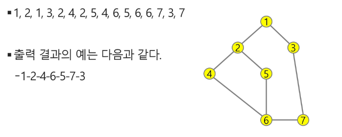

