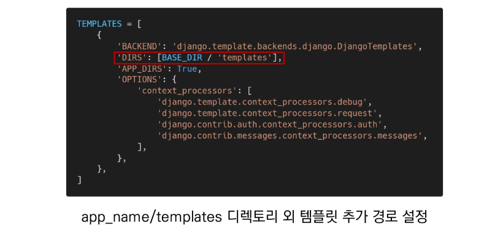
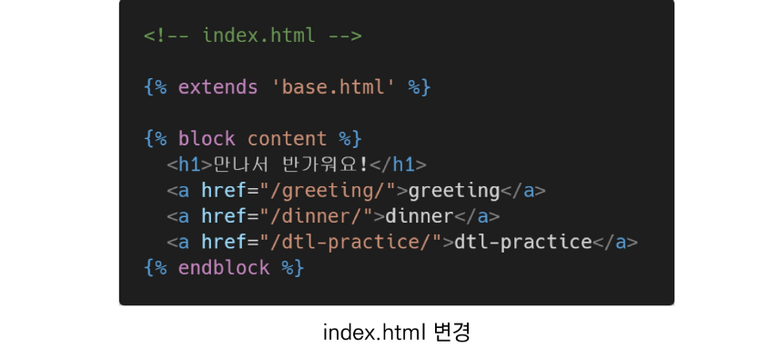
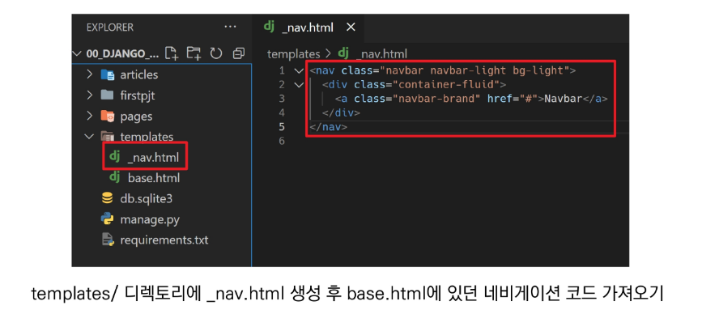
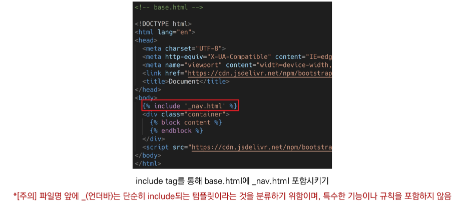
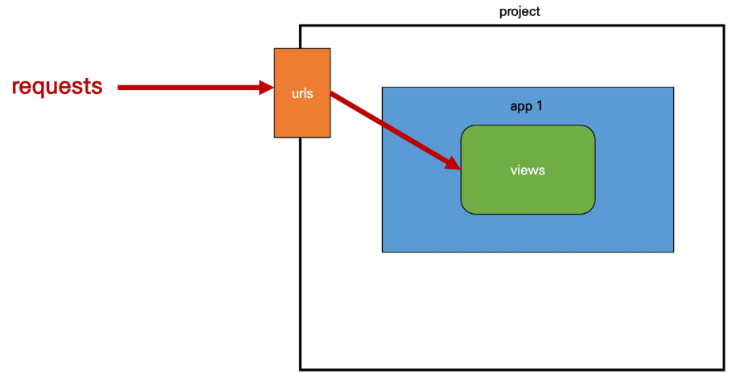
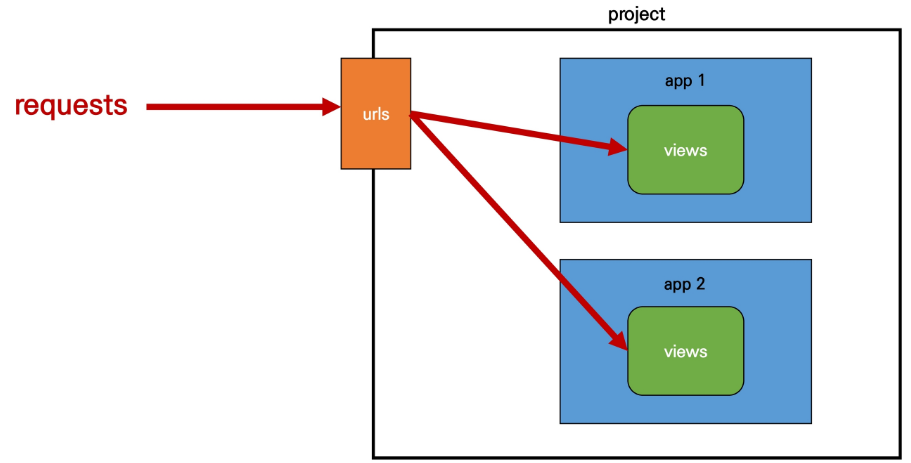
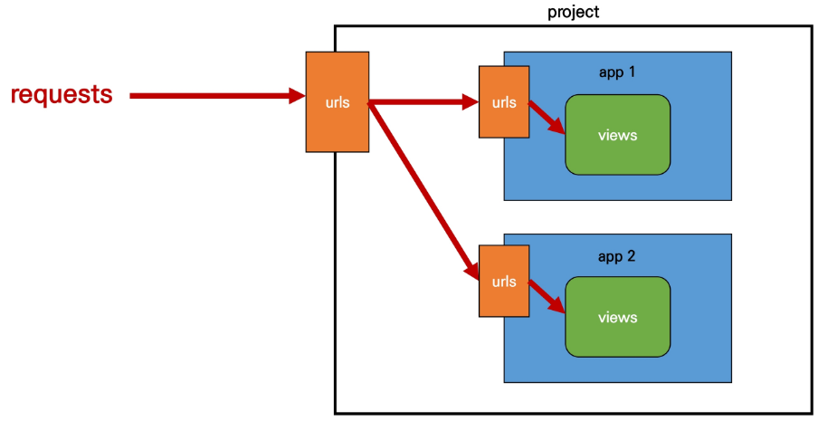

# Django 01

> Django The Web Framework  :: [강의자료](https://edu.ssafy.com/data/upload_files/crossUpload/openLrn/ebook/unzip/A2022030210053672900/index.html)  2022-03-02

- [Django 공식 문서](https://docs.djangoproject.com/en/4.0/)

- 클라이언트: 데스크탑, 스마트폰, 웹 브라우저(크롬) 등 서버가 제공하는 정보 등을 얻기 위해 요청하는 역할
- 서버: 클라이언트에게 네트워크 환경을 통해 정보나 서비스를 제공하는 컴퓨터 시스템

- Django: 서버를 구축하는 프로그램

- 요청과 응답


## Web Framework

- **Django**

  Django is a high-level <u>Python Web Framework</u> that encourages rapid development and clean, pragmatic design.

  It takes care of much of the hassle of Web development, so <u>you can focus on writing your app without needing to reinvent the wheel</u>.


- **Web**

  World Wide Web

  인터넷에 연결된 컴퓨터를 통해 정보를 공유할 수 있는 전 세계적인 정보 공간


- **Static web page** (정적 웹 페이지)

  서버에 미리 저장된 파일이 사용자에게 그대로 전달되는 웹 페이지

  서버가 정적 웸 페이지에 대한 요청을 받은 경우 서버는 추가적인 <u>처리 과정 없이</u> 클라이언트에게 응답을 보냄

  모든 상황에서 모든 사용자에게 <u>동일한 정보를 표시</u>

  일반적으로 HTML, CSS, JavaScript로 작성됨

  flat page라고도 함


- **Dynamic Web Page** (동적 웹 페이지)

  웹 페이지에 대한 요청을 받은 경우 서버는 추가적인 처리 과정 이후 클라이언트에게 응답을 보냄

  동적 웹 페이지는 방문자와 상호작용하기 때문에 페이지 내용은 그때그때 다름

  서버 사이드 프로그래밍 언어(Python, Java, C++ 등)가 사용되며, 파일을 처리하고 데이터베이스와의 상호작용이 이루어짐


- **Framework**

  프로그래밍에서 특정 운영 체제를 위한 응용 프로그램 표준 구조를 구현하는 크래스와 라이브러리 모임

  재사용할 수 있는 수많은 코들르 프레임워크로 통합함으로써 개발자가 새로운 애플리케이션을 위한 표준 코드를 다시 작성하지 않아도 같이 사용할 수 있도록 도움

  Application framework라고도 함


- **Web framework**

  <u>웹 페이지를 개발하는 과정에서 겪는 어려움을 줄이는 것이 주 목적</u>으로 데이터베이스 연동, 템플릿 형태의 표준, 세션 관리, 코드 재사용 등의 기능을 포함

  동적인 웹 페이지나, 웹 애플리케이션, 웹 서비스 개발 보조용으로 만들어지는 Application framework의 일종


- **Django를 사용해야 하는 이유**

  검증된 Python 언어 기반 Web framework

  대규모 서비스에도 안정적이며 오랫동안 세계적인 기업들에 의해 사용됨(ex. Spotify, Instagram, Dropbox, Delivery Hero, etc...)


- **Framework Architecture**

  - <u>MVC Design Pattern</u> (model-view-controller)

    소프트웨어 공학에서 사용되는 디자인 패턴 중 하나

    사용자 인터페이스로부터 프로그램 로직을 분리하여 애플리케이션의 시각적 요소나 이면에서 실행되는 부분을 <u>서로 영향 없이</u> 쉽게 고칠 수 있는 애플리케이션을 만들 수 있음

  - Django는 <u>MTV Pattern</u>이라고 함

    `model-template-view`

    특별한 이유는 없다..! 같은 기능이지만 명칭이 다름

    장고의 코어 개발자들의 생각에는 MVC와 잘 매칭이 되지 않는다는 생각


- **MTV Pattern**

  - <u>Model</u>

    응용프로그램의 데이터 구조를 정의하고 데이터베이스의 기록을 관리(추가, 수정, 삭제)

  - <u>Template</u> (MVC 패턴에서의 view)

    파일의 구조나 레이아웃을 정의

    실제 내용을 보여주는 데 사용(Presentation)

  - <u>View</u> (MVC 패턴에서의 controller)

    HTTP 요청을 수신하고 HTTP 응답을 반환

    Model을 통해 요청을 충족시키는 데 필요한 데이터에 접근

    template에게 응답의 서식 설정을 맡김

  

​					- URLS: 가장 먼저 요청을 받음 - 적절한 view를 찾아 요청을 보냄

​					- view: 응답을 줌. 사용자에게 보여줄 템플릿이 있다면 가져오기도 함


## Django 시작하기

- Django 설치 전 **가상환경 생성 및 활성화**

  가상환경 통해 독립된 환경에서 개발 가능

  (다른 사람과 함께 작업할 때 환경 조율 가능)

  ```bash
  $ python -m venv venv
  $ sourct venv/Scripts/activate
  ```

  

- **Django 설치** (현재 3.2가 LTS)

  \* 2021년 12월 Django 4.0 릴리즈 이후 버전을 명시하지 않으면 4.0 버전이 설치되니 주의 

  ```bash
  $ pip install django==3.2.12
  ```


- **프로젝트 생성**

  ```
  django-admin startproject <프로젝트명> .
  ```

  ```bash
  $ django-admin startproject firstpjt .
  ```

​		프로젝트 이름에는 Python이나 Django에서 사용중인 키워드를 피해야 한다.

​		'-'(하이픈)도 사용할 수 없다.

​		ex. Django, text, class, django-test 등


- **Django 서버 시작하기(활성화)**

  ```bash
  $ python manage.py runserver
  ```


- **메인 페이지 로켓 확인**

  


- **[참고] LTS**

  - Long Term Support(장기 지원 버전)

  - 일반적인 경우보다 장기간에 걸쳐 지원하도록 고안된 소프트웨어 버전

  - 컴퓨터 소프트웨어의 제품 수명주기 관리 정책
  - 배포자는 LTS 확정을 통해 장기적이고 안정적인 지원을 보장함


- **프로젝트 구조**

  - `__ init __.py` (x)
    
    - Python에게 이 디렉토리를 하나의 Python 패키지로 다루도록 지시
    
  - `asgi.py`

    - Asynchronous Server Gateway Interface

    - Django 애플리케이션이 비동기식 웹 서버와 연결 및 소통하는 것을 도움

  - `settings.py`

    - 애플리케이션의 모든 설정을 포함

  - `urls.py`

    - 사이트의 url과 적절한 views의 연결을 지정

  - `wsgi.py` 

    - Web Server Gateway Interface
    - Django 애플리케이션이 웹 서버와 연결 및 소통하는 것을 도움

  - `managy.py`

    - Django 프로젝트와 다양한 방법으로 상호작용하는 커맨드라인 유틸리티

      ```bash
      # manage.py Usage
      $ python manage.py <command> [options]
      ```
      
      

- **Application 생성**

  일반적으로 Application명은 <u>복수형</u>으로 하는 것을 권장

  ```bash
  $ python manage.py startapp articles
  ```

  

- **Application 구조**
  
  - `admin.py`
    - 관리자용 페이지를 설정하는 곳
  - `apps.py` (x)
    - 앱의 정보가 작성된 곳
  - `models.py`
    - 앱에서 사용하는 Model을 정의하는 곳
  - `tests.py` (x)
    - 프로젝트의 테스트 코드를 작성하는 곳
  - `views.py`
    - view 함수들이 정의되는 곳


- **Project & Application**
  - `Project`
    - Project(이하 프로젝트)는 Application(이하 앱)의 집합(collection of apps)
    - 프로젝트에는 여러 앱이 포함될 수 있음
    - 앱은 여러 프로젝트에 있을 수 있음
  - `Application`
    - 앱은 실제 요청을 처리하고 페이지를 보여주고 하는 등의 역할을 담당
    - 하나의 프로젝트는 여러 앱을 가짐
    - 일반적으로 앱은 하나의 역할 및 기능 단위로 작성함


- **앱 등록**

  프로젝트에서 앱을 사용하기 위해서는 반드시 INSTALLED_APPS 리스트에 추가해야 함 (프로젝트 - settings.py)

  - `INSTALLED_APPS`

    - Django installation에 활성화된 모든 앱을 지정하는 문자열 목록

    


- 앱 생성 시 주의사항

  - "*<u>반드시 생성 후 등록!</u>*"

  - INSTALLED_APPS에 먼저 작성(등록)하고 생성하려면 앱이 생성되지 않음

  - Django 권장 앱 등록 순서

    - 해당 순서를 지키지 않아도 수업 과정에서는 문제가 없지만, 추후 advanced한 내용을 대비하기 위해 지키는 것을 권장

      

    


## 요청과 응답

- **URLS**

  HTTP 요청(request)을 알맞은 view로 전달 (project - urls.py)

  ```python
  # urls.py
  
  from django.contrib import admin
  from django.urls import path
  from articles import views
  
  urlpatterns = [
  	path('admin/', admin.site.urls),
  	path('index/', views.index),
  ]
  ```
  
  

- **View**

  HTTP 요청을 수신하고 HTTP 응답을 반환하는 함수 작성

  Model을 통해 요청에 맞는 필요 데이터에 접근

  Template에게 HTTP 응답 서식을 맡김

  ```python
  # views.py
  
  from django.shortcuts import render
  
  def index(request):
      return render(request, 'index.html')
  ```
  
  

- **Templates**

  실제 내용을 보여주는 데 사용되는 파일

  파일의 구조나 레이아웃을 정의 (ex. HTML)

  Template 파일 경로의 기본 값은 <u>app 폴더 안의 templates 폴더</u>로 지정되어 있음

  ```html
  <!-- articles/templates/index.html-->
  
  <h1>만나서 반가워요!</h1>
  ```
  
  

- 추가 설정

  ```python
  # settings.py
  
  LANGUAGE_CODE = 'ko-kr'
  TIME_ZONE = 'Asia/Seoul'
  ```
  
  - `LANGUAGE_CODE`
    - 모든 사용자에게 제공되는 번역을 결정
    - 이 설정이 적용되려면 USE_I18N이 활성화되어 있어야 함
    - [language-identifiers](http://www.i18nguy.com/unicode/language-identifiers.html)
  - `TIME_ZONE`
    - 데이터베이스 연결의 시간대를 나타내는 문자열 지정
    - USE_TZ가 True이고 이 옵션이 설정된 경우 데이터베이스에서 날짜 시간을 읽으면, UTC 대신 새로 설정한 시간대의 인식 날짜&시간이 반환됨
    - USE_TZ이 False인 상태로 이 값을 설정하는 것은 error가 발생하므로 주의
    - [List of tz database time zones](https://en.wikipedia.org/wiki/List_of_tz_database_time_zones)
    
  - `USE_I18N`
    - Django의 번역 시스템을 활성화해야 하는지 여부를 지정
  - `USE_L10N`
    - 데이터의 지역화된 형식(localized formatting)을 기본적으로 활성화할지 여부를 지정
    - True일 경우, Django는 현재 locale의 형식을 사용하여 숫자와 날짜를 표시
  - `USE_TZ`
    - datetimes가 기본적으로 시간대를 인식하는지 여부를 지정
    - True일 경우 Django는 내부적으로 시간대 인식 날짜 / 시간을 사용


## Template

- **Django Template**

  - "데이터 표현을 제어하는 도구이자 표현에 관련된 로직"

  - 사용하는 built-in system
    - Django template language


- **Django Template Language (DTL)**
  - Django template에서 사용하는 built-in template system
  - 조건, 반복, 변수 치환, 필터 등의 기능을 제공
  - 단순히 Python이 HTML에 포함된 것이 아니며, 프로그래밍적 로직이 아니라 <u>프레젠테이션을 표현하기 위한 것</u>
  - Python처럼 일부 프로그래밍 구조(if, for 등)를 사용할 수 있지만, 이것은 해당 Python 코드로 실행되는 것이 아님


### - DTL Syntax

#### 1. Variable

```django
{{ variable }}
```

- render()를 사용하여 views.py에서 정의한 변수를 template 파일로 넘겨 사용하는 것
- 변수명은 영어, 숫자와 밑줄(_)의 조합으로 구성될 수 있으나 밑줄로는 시작할 수 없음
  - 공백이나 구두점 문자 또한 사용할 수 없음
- dot(.)를 사용하여 변수 속성에 접근할 수 있음
- render()의 세번째 인자로 {'key': value}와 같이 딕셔너리 형태로 넘겨주며, 여기서 정의한 key에 해당하는 문자열이 template에서 사용 가능한 변수명이 됨


#### 2. Filters

```django
{{ variable|filter }}
```

- 표시할 변수를 수정할 때 사용

- ex. name 변수를 모두 소문자로 출력 

  ```django
  {{ name|lower }}
  ```

- 60개의 built-in template filters를 제공

- chained가 가능하며 일부 필터는 인자를 받기도 함

  ```django
  {{ variable|truncatewords:30 }}
  ```

  

#### 3. Tags

```django

```

- 출력 텍스트를 만들거나, 반복 또는 논리를 수행하여 제어 흐름을 만드는 등 변수보다 복잡한 일들을 수행

- 일부 태그는 시작과 종료 태그가 필요

  ```django
  
  ```

- 약 24개의 built-in template tags를 제공


#### 4. Comments

```django
{# #}
```

- Django template에서 라인의 주석을 표기하기 위해 사용

- 아래처럼 유효하지 않은 템플릿 코드가 포함될 수 있음

  ```django
  {#  text  }
  ```

- 한 줄 주석에만 사용할 수 있음 (줄 바꿈이 허용되지 않음)

- 여러 줄 주석은 `` 와 `` 사이에 입력

  ```django
  
  	주석
  	주석
  
  ```

  

- **코드 작성 순서**
  
  - 데이터의 흐름에 맞추어 작성
    1. urls.py
    2. views.py
    3. templates


### -   실습

- **variable**

```python
# urls.py

urlpatterns = {
    path('admin/', admin.site.urls),
    path('index/', views.index),
    path('greeting/', views.greeting),
}
```

```python
# views.py

def greeting(request):
    return render(request, 'greeting.html', {'name': 'Amelie'})
```

```html
<!-- greeting.html -->

<p>Hello, I am {{ name }}.</p>
```

```python
# views.py

def greeting(request):
    foods = ['apple', 'banana', 'coconut']
    info = {
        'name': 'Amelie'
    }
    context = {
        'foods': foods,
        'info': info.
    }
    return render(request, 'greeting.html', context)
```

```html
<!-- greeting.html -->

<p>Hello, I am {{ info.name }}.</p>
<p>My favorite foods are {{ foods }}.</p>
<p>Especially {{ foods.0 }}</p>
```

```python
# urls.py

urlpatterns = [
    ...,
    path('dinner/', views.dinner),
]
```

```python
# views.py

import random

def dinner(request):
    foods = ['족발', '햄버거', '치킨', '초밥']
    pick = random.choice(foods)
    context = {
        'pick': pick,
    }
    return render(request, 'dinner.html', context)
```

```html
<!-- dinner.html -->

<h1>Today's dinner is {{ pick }}</h1>
```


- **filters**

```python
# views.py

def dinner(request):
    foods = ['족발', '햄버거', '치킨', '초밥']
    pick = random.choice(foods)
    context = {
        'pick': pick,
        'foods': foods,
    }
    return render(request, 'dinner.html', context)
```

```html
<!-- dinner.html -->

<h1>Today's dinner is {{ pick }}</h1>
<p>{{ pick }}은 {{ pick|length }}글자</p>
<p>{{ foods|join:", "}}</p>
```


- **tags**

```html
<!-- dinner.html -->

<h1>Today's dinner is {{ pick }}</h1>
<p>{{ pick }}은 {{ pick|length }}글자</p>

<p>메뉴판</p>
<ul>
    
    	<li>{{ food }}</li>
    
</ul>
```


- **comments**

```django
<!-- dinner.html -->

{# 이것은 주석입니다. #}


	<p>여러 줄</p>
	<p>주석</p>
	<p>입니다.</p>

```


### - 템플릿 상속

- **Template inheritance**
  - 템플릿 상속은 기본적으로 코드의 재사용성에 초점을 맞춤
  - 템플릿 상속을 사용하면 사이트의 모든 공통 요소를 포함하고, 하위 템플릿이 재정의(override) 할 수 있는 블록을 정의하는 기본 "skeleton" 템플릿을 만들 수 있음


- **"tags"**

  ```django
  
  ```

  - 자식(하위) 템플릿이 부모 템플릿을 확장한다는 것을 알림
  - 반드시 템플릿 최상단에 작성되어야 함

  ```django
   
  ```

  - 하위 템플릿에서 재지정(overridden)할 수 있는 블록을 정의
  - 즉, 하위 템플릿이 채울 수 있는 공간

  





- **"include"**

  ```django
  
  ```

  - 템플릿을 로드하고 현재 페이지로 렌더링
  - 템플릿 내에 다른 템플릿을 "포함(including)"하는 방법

  

  




- **Django template system** (feat. Django 설계 철학)
  - <u>"표현과 로직(view)을 분리"</u>
    - 템플릿 시스템은 표현을 제어하는 도구이자 표현에 관련된 로직일 뿐이라고 생각한다.
    - 즉, 템플릿 시스템은 이러한 기본 목표를 넘어서는 기능을 지원하지 말아야 한다.
  - <u>"중복을 배제"</u>
    - 대다수의 동적 웹사이트는 공통 header, footer, navbar 같은 사이트 공통 디자인을 갖는다.
    - Django 템플릿 시스템은 이러한 요소를 한 곳에 저장하기 쉽게 하여 중복 코드를 없애야 한다.
    - 이것이 템플릿 상속의 기초가 되는 철학이다.


## HTML Form

- **HTML "form" element**
  - 웹에서 사용자 정보를 입력하는 여러 방식(text, button, checkbox, file, hidden, image, password, radio, reset, submit)을 제공하고, 사용자로부터 할당된 데이터를 서버로 전송하는 역할을 담당
  - 핵심 속성(attribute)
    - `action` : 입력 데이터가 전송될 URL 지정
    - `method` : 입력 데이터 전달 방식 지정


- **HTML "input" element**
  - 사용자로부터 데이터를 입력 받기 위해 사용
  - type 속성에 따라 동작 방식이 달라짐
  - 핵심 속성(attribute)
    - `name`
    - 중복 가능, 양식을 제출했을 때 name이라는 이름에 설정된 값을 넘겨서 값을 가져올 수 있음
    - 주요 용도는 GET/POST 방식으로 서버에 전달하는 파라미터(name은 key, value는 value)로 매핑하는 것
    - GET 방식에서는 URL에서 `?key=value&key=value` 형식으로 데이터를 전달함


- **HTML "label" element**
  - 사용자 인터페이스 항목에 대한 설명(caption)을 나타냄
  - label을 input 요소와 연결하기
    1. input에 id 속성 부여
    2. label에는 input의 id와 동일한 값의 for 속성이 필요
  - label과 input 요소 연결의 주요 이점
    - 시각적인 기능 뿐만 아니라 화면 리더기에서 label을 읽어 사용자가 입력해야 하는 텍스트가 무엇인지 더 쉽게 이해할 수 있도록 돕는 프로그래밍적 이점도 있음
    - label을 클릭해서 input에 초점(focus)를 맞추거나 활성화(activate)시킬 수 있음


- **HTML "for" attribute**
  - for 속성의 값과 일치하는 id를 가진 문서의 첫 번째 요소를 제어
    - 연결된 요소가 labelabel elements인 경우 이 요소에 대한 labeled control이 됨
  - "labelabel elements"
    - label 요소와 연결할 수 있는 요소
    - button, input(not hidden type), select, textarea ...


- **HTML "id" attribute**
  - 전체 문서에서 고유(must be unique)해야 하는 식별자를 정의
  - 사용 목적
    - linking, scripting, styling 시 요소를 식별


- HTTP

  - HyperText Transfer Protocol

  - 웹에서 이루어지는 모든 데이터 교환의 기초

  - 주어진 리소스가 수행할 작업을 나타내는 request methods를 정의

  - HTTP request method 종류

    - GET, POST, PUT, DELETE ...

      

### - GET

- 서버로부터 정보를 조회하는 데 사용
- 데이터를 가져올 때만 사용해야 함
- 데이터를 서버로 전송할 때 body가 아닌 Query String Parameters를 톻해 전송
- 우리는 서버에 요청을 하면 HTML 문서 한 장을 받는데, 이때 사용하는 요청의 방식이 GET


- **[실습] Throw & Catch**

  - `Throw`

    ```python
    # urls.py
    
    urlpatterns = [
        ...,
        path('throw/', views.throw),
    ]
    ```

    ```python
    # views.py
    
    def throw(request):
        return render(request, 'throw.html')
    ```

    ```django
    <!-- throw.html -->
    
    
    
    	<h1>Throw</h1>
    	<form action="#" method="#">
        	<label for="message">Throw</label>
            <input type="text" id="message" name="message">
            <input type="submit">
    	</form>
    
    ```

  - `Catch`

    ```python
    # urls.py
    
    urlpatterns = [
        ...,
        path('catch/', views.catch),
    ]
    ```

    ```python
    # views.py
    
    def catch(request):
        message = request.GET.get('message')
        context = {
            'message': message,
        }
        return render(request, 'catch.html', context)
    ```

    ```django
    <!-- catch.html -->
    
    
    
    	<h1>Catch</h1>
    	<h2>여기서 {{ message }}를 받았어!</h2>
    	<a href="/throw/">다시 던지러 가기</a>
    
    ```

    

## URL

- **Django URLS**
  - Dispatcher(발송자, 운항 관리자)로서의 URL
  - 웹 애플리케이션은 URL을 통한 클라이언트의 요청에서부터 시작됨
  
  

### - **Variable Routing**

- URL 주소를 변수로 사용하는 것

- URL의 일부를 변수로 지정하여 view 함수의 인자로 넘길 수 있음

- 즉, 변수 값에 따라 하나의 path()에 여러 페이지를 연결 시킬 수 있음

  - 사용 예시

    - ```python
      path('accounts/user/<int:user_pk>/', ...)
      ```

      - `accounts/user/1` -> (1번 user 관련 페이지)
      - `accounts/user/2` -> (2번 user 관련 페이지)


- **URL Path converters**

  ```python
  path('hello/<str:name>/', views.hello)
  ```

  - `str`
    - '/'를 제외하고 비어 있지 않은 모든 문자열과 매치
    - 작성하지 않을 경우 기본값
  - `int`
    - 0 또는 양의 정수와 매치
  - `slug`
    - ASCII 문자 또는 숫자, 하이픈 및 밑줄 문자로 구성된 모든 슬러그 문자열과 매치
    - ex. 'building-your-1st-django-site'
  - `uuid`
  - `path`


- [실습] Variable routing

  ```python
  # urls.py
  
  urlpatterns = [
      ...,
      # path('hello/<str:name>/', views.hello),
      path('hello/<name>', views.hello),
  ]
  ```

  ```python
  # views.py
  
  def hello(request, name):
      context = {
          'name': name,
      }
      return(render, 'hello.html', context)
  ```

  ```django
  <!-- hello.html -->
  
  
  
  
  	<h1>만나서 반가워요, {{ name }}님!</h1>
  
  ```

  

- Add URL mapping

  - app의  view 함수가 많아지면서 사용하는 path()또한 많아지고, app 또한 많이 작성되기 때문에 프로젝트의 urls.py에서 모두 관리하는 것은 프로젝트 유지보수에 좋지않음
  - 이제는 각 apps에 urls.py를 작성하게 됨
  - pages 앱 생성 및 등록 후 url 작성 - 이렇게도 가능하지만...

  ```python
  # firstpjt/urls.py
  
  from articles import views as articles_views
  from pages import views as pages_views
  
  urlpatterns = [
      ...,
      path('pages-index', pages_views.index),
  ]
  ```

  - 각각의 app 안에 urls.py을 생성하고 프로젝트 urls.py에서 각 앱의 urls.py 파일로 <u>URL 매핑을 위탁</u>

  ```python
  # articles/urls.py
  
  from django.urls import path
  from . import views
  
  urlpatterns = [
      path('index/', views.index),
      path('greeting/', views.greeting),
      path('dinner/', views.dinner),
      path('hello/<str:name>/', views.hello),
      path('dtl-practice/', views.dtl_practice),
      path('throw/', views.throw),
      path('catch/', views.catch)
  ]
  ```

  ```python
  # pages/urls.py
  
  from django.urls import path
  
  urlpatterns = [
      
  ]
  ```

  

- Including other URLconfs

  - urlpattern은 언제든지 다른 URLconf 모듈을 포함(include)할 수 있음
  - `include()`
    - 다른 URLconf(app1/urls.py)들을 참조할 수 있도록 도움
    - 함수 include()를 만나게 되면, URL의 그 시점까지 일치하는 부분을 잘라내고, 남은 문자열 부분을 후속 처리를 위해 include된 URLconf로 전달
  - django는 명시적 상대경로(**from** .module **import** ..)를 권장

  

  

  


- Naming URL patterns

  ```python
  path('index/', views.index, name='index')
  ```

  ```django
  <a href="">메인 페이지</a>
  ```

  - 이제는 링크에 url을 직접 작성하는 것이 아니라 path() 함수의 name 인자를 정의해서 사용
  - Django Template Tag 중 하나인 url 태그를 사용해서 path() 함수에 작성한 name을 사용할 수 있음
  - url 설정에 정의된 특정한 경로들의 의존성을 제거할 수 있음


- Naming URL patterns 적용

  - the 'name' value as called by the `` template tag

  ```python
  # articles/urls.py
  
  urlpatterns = [
      path('index/', views.index, name='index'),
  	path('greeting/', views.greeting, name='greeting'),
      path('dinner/', views.dinner, name='dinner'),
      path('hello/<str:name>/', views.hello, name='hello'),
      path('throw/', views.throw, name='throw'),
      path('catch/', views.catch, name='catch'),
  ]
  ```

  


- url template tag

  ```django
  
  ```

  - 주어진 URL 패턴 이름 및 선택적 매개 변수와 일치하는 절대 경로 주소를 반환
  - 템플릿에 URL을 하드 코딩하지 않고도 DRY 원칙을 위반하지 않으면서 링크를 출력하는 방법


- [실습] url tag 적용하기

  ```django
  <!-- index.html -->
  
  
  
  
  	<h1>만나서 반가워요!</h1>
  	<a href="">greeting</a>
  	<a href="">dinner</a>
  	<a href="">dtl_practice</a>
  	<a href="">throw</a>
  
  
  <!-- dinner, dtl_practice, greeting, throw.html -->
  
  <a href="">뒤로</a>
  ```

  ```django
  <!-- throw.html -->
  
  
  
  
  	<h1>Throw</h1>
  	<form action="" method="GET">
          ...
  	</form>
  
  	<a href="">뒤로</a>
  
  ```

  ```django
  <!-- catch.html -->
  
  
  
  
  	<h1>Catch</h1>
  	<h2>여기서 {{ message }}를 받았어!</h2>
  	<a href="">다시 던지러 가기</a>
  
  ```


