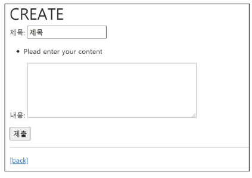
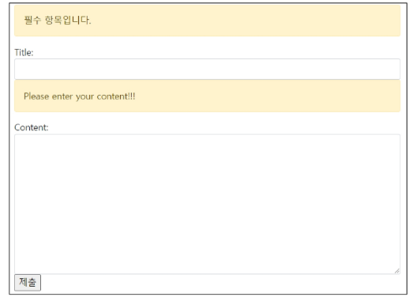

# Django 03

> [강의자료](https://edu.ssafy.com/data/upload_files/crossUpload/openLrn/ebook/unzip/A2022040710213497700/index.html)  2022-04-06


## Form Class

- **Intro**
  - 우리는 지금까지 HTML form, input을 통해서 사용자로부터 데이터를 받음
  - 이렇게 직접 사용자의 데이터를 받으면 입력된 데이터의 유효성을 검증하고, 필요시에 입력된 데이터를 검증 결과와 함께 다시 표시함
    - 사용자가 입력한 데이터는 개발자가 요구한 형식이 아닐 수 있음을 항상 생각해야 함
  - 이렇게 사용자가 입력한 데이터를 검증하는 것을 '유효성 검증'이라고 하는데, 이 과정을 코드로 모두 구현하는 것은 많은 노력이 필요한 작업임
  - Django는 이러한 과중한 작업과 반복 코드를 줄여줌으로써 이 작업을 훨씬 쉽게 만들어줌
    - "Django Form"


- **Django's forms**
  - form은 Django의 유효성 검사 도구 중 하나로 외부의 악의적 공격 및 데이터 손상에 대한 중요한 방어 수단
  - Django는 Form과 관련한 유효성 검사를 단순화하고 자동화할 수 있는 기능을 제공하여 개발자로 하여금 직접 작성하는 코드보다 더 안전하고 빠르게 수행하는 코드를 작성할 수 있게 함
  - Django는 form에 관련된 작업의 아래 세 부분을 처리해줌
    - 렌더링을 위한 데이터 준비 및 재구성
    - 데이터에 대한 HTML forms 생성
    - 클라이언트로부터 받은 데이터 수신 및 처리


- **The Django 'Form Class'**
  - Django Form 관리 시스템의 핵심
  - Form내 field, field 배치, 디스플레이 widget, label, 초기값, 유효하지 않는 field에 관련된 에러 메세지를 결정
  - Django는 사용자의 데이터를 받을 때 해야 할 과중한 작업(데이터 유효성 검증, 필요시 입력된 데이터 검증 결과 재출력, 유효한 데이터에 대해 요구되는 동작 수행 등)과 반복 코드를 줄여 줌


- **Form 선언하기**

  ```python
  # articles/forms.py
  
  from django import forms
  
  class ArticleForm(forms.Form):
      title = forms.CharField(max_length=10)
      content = forms.CharField()
  ```

  - Model을 선언하는 것과 유사하며 같은 필드타입을 사용 (또한, 일부 매개변수도 유사함)
  - forms 라이브러리에서 파생된 Form 클래스를 상속받음

  ```python
  # articles/views.py
  
  from .forms import ArticleForm
  
  def new(request):
      form = ArticleForm()
      context = {
          'form': form,
      }
      return render(request, 'articles/new.html', context)
  ```

  ```django
  <!-- new.html -->
  
  
  
  
  	<h1 class="text-center">NEW</h1>
  	<form action="" method="POST">
          
          {{ form.as_p }}
          <input type="submit">
  	</form>
  	<hr>
  	<a href="">[back]</a>
  
  ```

  


- **Form rendering options**
  - < label > & < input > 쌍에 대한 3가지 출력 옵션
  - `as_p()`
    - 각 필드가 단락(< p > 태그)으로 감싸져서 렌더링됨
  - `as_ul()`
    - 각 필드가 목록 항목(< li > 태그)으로 감싸져서 렌더링됨
    - < ul > 태그는 직접 작성해야 함
  - `as_table()`
    - 각 필드가 테이블(< tr > 태그) 행으로 감싸져서 렌더링됨
    - < table > 태그는 직접 작성해야 함


- **Django의 HTML input 요소 표현 방법 2가지**

  - Form fields

    - input에 대한 유효성 검사 로직을 처리하며 템플릿에서 직접 사용됨

  - Widgets

    - 웹페이지의 HTML input 요소 렌더링
    - GET/POST 딕셔너리에서 데이터 추출
    - widget은 반드시 Form fields에 할당됨
    - Django의 HTML input element 표현
    - HTML 렌더링 처리
    - 주의사항
      - Form Fields와 혼동되어서는 안됨
      - Form Fields는 input 유효성 검사를 처리
      - Widgets은 웹페이지에서 input element의 단순 raw한 렌더링 처리

    ```python
    # articles/forms.py
    
    form django import forms
    
    class ArticleForm(forms.Form):
        title = forms.CharField(max_length=10)
        content = froms.CharField(widget=forms.Textarea)
    ```

    


- **Form field 및 widget 응용**

  ```python
  from django import forms
  
  class ArticleForm(forms.Form):
      REGION_A = "sl"
      REGION_B = "dj"
      REGION_C = "gj"
      REGIONS_CHOICES = [
          (REGION_A, "서울"),
          (REGION_B, "대전"),
          (REGION_C, "광주"),
      ]
  
  title = forms.CharField(max_length=10)
  content = froms.CharField(widget=forms.Textarea)
  region = forms.ChoiceField(choices=REGIONS_CHOICES, widget=forms.Select())
  ```

  


## ModelForm

- **Intro**
  - Django Form을 사용하다 보면 Model에 정의한 필드를 유저로부터 입력받기 위해 Form에서 Model 필드를 재정의하는 행위가 중복될 수 있음
  - 그래서 Django는 Model을 통해 Form Class를 만들 수 있는 ModelForm이라는 Helper를 제공


- **ModelForm Class**
  - Model을 통해 Form Class를 만들 수 있는 Helper
  - 일반 Form Class와 완전히 같은 방식(객체 생성)으로 view에서 사용 가능


- **ModelForm 선언하기**

  - 기존의 Form을 ModelForm으로 변경해보기

  ```python
  # articles/forms.py
  
  from django import forms
  from .models import Article
  
  class ArticleForm(forms.ModelForm):
      
      class Meta:
          model = Article
          fields = '__all__'		# 전체 피드 출력
          # exclude = ('title',)
  ```

  - forms 라이브러리에서 파생된 ModelForm 클래스를 상속받음
  - 정의한 클래스 안에 Meta 클래스를 선언하고, 어떤 모델을 기반으로 Form을 작성할 것인지에 대한 정보를 Meta클래스에 지정
  - [주의] 클래스 변수 fields와 exclude는 동시에 사용할 수 없음


- **Meta class**
  - Model의 정보를 작성하는 곳
  - ModelForm을 사용할 경우 사용할 모델이 있어야 하는데 Meta Class가 이를 구성함
    - 해당 Model에 정의한 field 정보를 Form에 적용하기 위함
  - [참고] Inner Class(Nested Class)
    - 클래스 내에 선언된 다른 클래스
    - 관련 클래스를 함께 그룹화하여 가독성 및 프로그램 유지 관리를 지원 (논리적으로 묶어서 표현)
    - 외부에서 내부 클래스에 접근할 수 없으므로 코드의 복잡성을 줄일 수 있음
  - [참고] Meta 데이터
    - "데이터에 대한 데이터"
    - ex. 사진 촬영 - 사진 데이터 - 사진의 메타 데이터 (촬영 시각, 렌즈, 조리개 값 등)


- **create view 수정**

  ```python
  # articles/views.py
  
  def create(request):
      form = ArticleForm(request.POST)
      if form.is_valid():
          article = form.save()
          return redirect('articles:detail', article.pk)
      return redirect('articles:new')
  ```

  

- **`is_valid()` method**
  - 유효성 검사를 실행하고, 데이터가 유효한지 여부를 boolean으로 반환
  - 데이터 유효성 검사를 보장하기 위한 많은 테스트에 대해 Django는 is_valid()를 제공
  - [참고] 유효성 검사
    - 요청한 데이터가 특정 조건에 충족하는지 확인하는 작업
    - 데이터베이스 각 필드 조건에 올바르지 않은 데이터가 서버로 전송되거나 저자오디지 않도록 하는 것


- **The `save()` method**

  ```python
  # Create a form instance from POST data
  form = ArticleForm(request.POST)
  
  # CREATE
  # Save a new Article object from the form's data
  new_article = f.save()
  
  # UPDATE
  # Create a form to edit an existing Article, but use POST data to populate the form
  article = Article.objects.get(pk=1)
  form = ArticleForm(request.POST, instance=article)
  form.save()
  ```

  - Form에 바인딩된 데이터에서 데이터베이스 객체를 만들고 저장
  - ModelForm의 하위(sub)클래스는 기존 모델 인스턴스를 키워드 인자 instance로 받아들일 수 있음
    - 이것이 제공되면 save()는 해당 인스턴스를 수정(UPDATE)
    - 제공되지 않은 경우 save()는 지정된 모델의 새 인스턴스를 만듦(CREATE)
  - Form의 유효성이 확인되지 않은 경우 (hasn't been validated) save()를 호출하면 form.errors를 확인하여 에러 확인 가능


- **create view 함수 구조 변경**

  - new view 함수, url path 삭제
  
  ```python
  # articles/views.py
  
  def create(request):
      if request.method == 'POST':
          form = ArticleForm(request.POST)
          if form.is_valid():
              article = form.save()
              return redirect('articles:detail', article.pk)
       else:
          form = ArticleForm()
       context = {
            'form': form,
       }
       return render(request, 'articles/create.html', context)
  ```
  
  - new.html -> create.html 이름 변경 / 이제는 action 값이 없어도 동작
  
  ```django
  <!-- create.html -->
  
  
  
  
    	<h1 class="text-center">CREATE</h1>
   	<form action="" method="POST">
      	
      	{{ form.as_p }}
      	<input type="submit">
    	</form>
    	<hr>
  	<a href="">back</a>
  
  ```
  
  - create 페이지 링크 작성 / input 태그에 공백 데이터를 넣어 보고 글 작성 -> 에러 메시지 출력 확인
  
  ```django
  <!-- index.html -->
  
  
  
  
    	<h1 class="text-center">Articles</h1>
    	<a href="">CREATE</a>
    	<hr>
    	
      	<p>글 번호: {{ article.pk }}</p>  
      	<p>글 제목: {{ article.title }}</p>
      	<p>글 내용: {{ article.content }}</p>
      	<a href="">DETAIL</a>
      	<hr>
    	
  
  
  ```
  
  - input 태그에 공백 데이터를 넣어보고 글 작성 -> 에러 메시지 출력 확인
  
  


- **DELETE**

  - DELETE 로직 작성

  ```python
  # views.py
  
  def delete(request, pk):
      article = Article.objects.get(pk=pk)
      if request.method == 'POST':
          article.delete()
          return redirect('articles:index')
      return redirect('articles:detail', article.pk)
  ```

  ```django
  <!-- detail.html -->
  
  <form action="" method="POST">
      
      <input type="submit" value="삭제">
    </form>
  ```


- **UPDATE**

  - update view 함수 작성 (edit path & edit view 함수 삭제)

  ```python
  # articles/views.py
  
  def update(request, pk):
      article = Article.objects.get(pk=pk)
      if request.method == 'POST':
          # Create a form to edit an existing Article
          # but use POST data to populate the form
          form = ArticleForm(request.POST, instance=article)
          if form.is_valid():  # 유효성 검사
              article = form.save()
              return redirect('articles:detail', article.pk)
      else:
          # Creating a form to change an existing article
          form = ArticleForm(instance=article)
      context = {
          'form': form,
      }
      return render(request, 'articles/update.html', context)
  ```

  - edit.html -> update.html 파일명 변경

  ```django
  <!-- update.html -->
  
  
  
  
    <h1 class="text-center">UPDATE</h1>
    <form action="" method="POST">
      
      {{ form.as_p }}
      <input type="submit">
    </form>
    <hr>
    <a href="">[back]</a>
  
  ```

  - update 로직 완성

  ```django
  <!-- detail.html -->
  
  <a href="">UPDATE</a>
  ```

  ```python
  # views.py
  
  def update(request, pk):
      ...
  	context = {
          'article': article,
          'form': form,
      }
      return render(request, 'articles/update.html', context)
  ```

  

- **form & ModelForm 비교**
  - Form
    - 어떤 Model에 저장해야 하는지 알 수 없으므로 유효성 검사 이후 cleaned_data 딕셔너리를 생성
    - cleaned_data 딕셔너리에서 데이터를 가져온 후 .save() 호출해야 함
    - Model에 연관되지 않은 데이터를 받을 때 사용
  - ModelForm
    - Django가 해당 model에서 양식에 필요한 대부분의 정보를 이미 정의
    - 어떤 레코드를 만들어야 할 지 알고 있으므로 바로 .save() 호출 가능


- **[참고] Form을 사용했을 경우 (cleaned_data 구조 예시)**

  ```python
  def create(request):
      if request.method == 'POST':
          # create
          form = ArticleForm(request.POST)
          if form.is_valid():  # 유효성 검사
              title = form.cleaned_data.get('title')
              content = form.cleaned_data.get('content')
              article = Article.objects.create(title=title, content=content)
              return redirect(article)
      else:
          # new
          form = ArticleForm()
      context = {
          'form': form,
      }
      return render(request, 'articles/create.html', context)
  ```


- **forms.py 파일 위치**
  - Form 클래스는 forms.py뿐만 아니라 다른 어느 위치에 두어도 상관없음
  - 하지만 되도록 `app폴더/forms.py`에 작성하는 것이 일반적인 구조


- **Widgets 활용하기**

  - Django의 HTML input element 표현

  - HTML 렌더링을 처리

  - 2가지 작성 방식을 가짐

    - widgets - 첫번째 방식

      ```python
      # articles/forms.py
      
      class ArticleForm(forms.ModelForm):
          
          class Meta:
              Model = Article
              fields = '__all__'
              widgets = {
                  'title': forms.TextInput(arrts={
                      'class':'my-title',
                      'placeholder': 'Enter the title', 
                      'maxlength': 10,
                  	}
           		)
              }
      ```

    - widgets - 두번째 방식 (권장)

      ```python
      # articles/forms.py
      
      class ArticleForm(forms.ModelForm):
      	title = form.CharField(
          	label = '제목',
              widget=forms.TextInput(
              	attrs = {
                      'class': 'my-title',
                      'placeholder': 'Enter the title',
                  }
              ),
          )           
              
          class Meta:
              model = Article
              fields = '__all__'
      ```

      

  

  

## Rendering fields manually

- 수동으로 Form 작성하기
  1. Rendering fields manually
  2. Looping over the form's fields ()


- Rendering fields manually

  ```django
  <!-- articles/create.html -->
  
  <h2>1. Rendering fields manually</h2>
  <form action="" method="POST">
  	
      <div>
        {{ form.title.errors }}
        {{ form.title.label_tag }}
        {{ form.title }}
      </div>
      <div>
        {{ form.content.errors }}
        {{ form.content.label_tag }}
        {{ form.content }}
      </div>
      <input type="submit">
  </form>
  ```
  
  

- Looping over the form's fields

  ```django
  <!-- articles/create.html -->
  
  <h2>2. Looping over the form's fields</h2>
  <form action="" method="POST">
      
      
      	{{ field.errors }}
      	{{ field.label_tag }}
      	{{ field }}
      
      <input type="submit">
  </form>
  ```

  

- Bootstrap과 함께 사용하기

  1. Bootstrap class with widgets

  2. Django Bootstrap 5 Library

     

- **Bootstrap Form class**

  - Bootstrap Forms 사용하기

    https://getbootstrap.com/docs/5.1/forms/overview/

  - 핵심 클래스

    - form-control

  - Bootstrap Form의 핵심 class를 widget에 작성

    ```python
    # forms.py
    
    class ArticleForm(forms.ModelForm):
        title = forms.CharField(
        	label = '제목', 
        	widget = forms.TextInput(
            	attrs = {
                    'class': 'my-title form-control',
                    'placeholder': 'Enter the title',
            }),
        )
        content = forms.CharField(
        	label = '내용',
            widget = forms.Textarea(
            	attrs = {
                    'class': 'my-content form-control',
                    'placeholder': 'Enter the content', 
                    'rows': 5,
                    'cols': 50,
            }),
            error_messages = {
                'required': 'Please enter your content'
            }
        )
    ```

  - Bootstrap Form 적용 결과

    

  - 에러 메시지 with bootstrap alert 컴포넌트

    ```django
    <!-- articles/create.html -->
    
    <h2>2. Looping over the form's fields</h2>
    <form action="" method="POST">
        
        
        	
        		
        			<div class="alert alert-warning">{{ error|escape }}</div>
        		
        	
        	{{ field.label_tag }}
        	{{ field }}
        
        <input type="submit">
    </form>
    ```

  - 에러 메시지 with bootstrap alert 컴포넌트 결과

    


- **Django Bootstrap Library**

  - django-bootstrap v5

    - form class에 bootstrap을 적용시켜주는 라이브러리

      ```bash
      $ pip install django-bootstrap-v5
      ```

      ```python
      # settings.py 
      
      INSTALLED_APPS = [
          ...
          'bootstrap5',
          ...
      ]
      ```

  - 패키지 목록 업데이트

    ```bash
    $ pip freeze > requirements.txt
    ```

  - 설치한 라이브러리 적용해보기

    ```django
    <!-- base.html -->
    
    
    
    <!DOCTYPE html>
    <html lang="ko">
    <head>
      <meta charset="UTF-8">
      <meta name="viewport" content="width=device-width, initial-scale=1.0">
      
      <title>Document</title>
    </head>
    <body>
      <div class="container">
          
          
        </div>
        
    </body>
    </html>
    ```

    ```django
    <!-- article/update.html -->
    
    
    
    
    
      <h1>UPDATE</h1>
      <form action="" method="POST">
        
        
        
      </form>
      <hr>
      <a href="">[back]</a>
    
    ```

    

