# Django 04

> [강의자료](https://edu.ssafy.com/data/upload_files/crossUpload/openLrn/ebook/unzip/A2022040610595166300/index.html)  2022-04-11


## Authentication System Ⅰ

- **The Django Authentication System**

  - Django 인증 시스템은 django.contrib.auth에 Django contrib <u>module</u>로 제공
  - 필수 구성은 settings.py에 이미 포함되어 있으며 INSTALLED_APPS 설정에 나열된 아래 두 항목으로 구성됨

  

  1. `django.contrib.auth`
     - 인증 프레임워크의 핵심과 기본 모델을 포함
  2. `django.contrib.contenttypes`
     - 사용자가 생성한 모델과 <u>권한</u>을 연결할 수 있음
  3. Django 인증 시스템은 <u>인증(Authentication)</u>과 <u>권한(Authorization)</u> 부여를 함께 제공(처리)하며, 이러한 기능이 어느 정도 결합되어 일반적으로 인증 시스템이라고 함


- **Authentication & Authorization**
  - `Authentication` (인증) 
    - 신원 확인
    - 사용자가 자신이 누구인지 확인하는 것
  - `Authorization` (권한, 허가)
    - 권한 부여
    - 인증된 사용자가 수행할 수 있는 작업을 결정


- **두번째 앱 (accounts) 생성하기**

  ```bash
  $ python manage.py startapp accounts
  ```

  - app 이름이 반드시 accounts일 필요는 없음
  - 단, auth와 관련해 Django 내부적으로 accounts(계정)라는 이름으로 사용되고 있기 때문에 되도록 accounts로 지정하는 것을 권장

  - app 등록 및 url 설정

    ```python
    # settings.py
    
    INSTALLED_APPS = [
        'articles', 
        'accounts'
    ]
    ```

    ```python
    # crud/urls.py
    
    urlpatterns = [
        path('admin/', admin.site.urls),
        path('articles/', include('articles.urls')),
        path('accounts/', include('accounts.urls')),
    ]
    ```

    ```python
    # accounts/urls.py
    
    from django.urls import path
    from . import views
    
    app_name = 'accounts'
    urlpatterns = [
        
    ]
    ```

    

### - 쿠키와 세션

- **HTTP**

  - `Hyper Text Transfer Protocol`

    - HTML 문서와 같은 리소스(자원, 데이터)들을 가져올 수 있도록 해주는 프로토콜(규칙, 규약)
    - 웹에서 이루어지는 모든 데이터 교환의 기초
    - 클라이언트 - 서버 프로토콜이기도 함

    

  

- **HTTP 특징**
  
  - `비연결지향 (connectionless)`
    - 서버는 요청에 대한 응답을 보낸 후 연결을 끊음
  - `무상태 (stateless)`
    - 연결을 끊는 순간 클라이언트와 서버 간의 통신이 끝나며 상태 정보가 유지되지 않음
    - 클라이언트와 서버가 주고 받는 메시지들은 서로 완전히 <u>독립적</u>임
  - 클라이언트와 서버의 지속적인 관계를 유지하기 위해 쿠키와 세션이 존재 (비연결지향과 무상태를 해결하기 위해)

#### + 쿠키 (Cookie)

- **쿠키(Cookie) 개념**

  - 서버가 사용자의 웹 브라우저에 전송하는 <u>작은 데이터 조각</u>
  - 사용자가 웹사이트를 방문할 경우 해당 웹사이트의 서버를 통해 사용자의 컴퓨터에 설치(placed-on)되는 작은 <u>기록 정보 파일</u>
    - 브라우저(클라이언트)는 쿠키를 로컬에 KEY-VALUE의 데이터 형식으로 저장
    - 이렇게 쿠키를 저장해 놓았다가, 동일한 서버에 재 요청 시 저장된 쿠키를 함께 전송 (상태가 유지된 것처럼 보이기 위해서)
  - [참고] 소프트웨어가 아니기 때문에 프로그램처럼 실행될 수 없으며 약성코드를 설치할 수 없지만, 사용자의 행동을 추적하거나 쿠키를 훔쳐서 해당 사용자의 계정 접근 권한을 획득할 수도 있음
  - HTTP 쿠키는 <u>상태가 있는 세션</u>을 만들어 줌 
  - 쿠키는 두 요청이 동일한 브라우저에서 들어왔는지 아닌지를 판단할 때 주로 사용
    - 이를 이용해 사용자의 로그인 상태를 유지할 수 있음
    - 상태가 없는(stateless) HTTP 프로토콜에서 상태 정보를 기억시켜주기 때문

  > 웹 페이지에 접속하면 요청한 웹 페이지를 받으며 쿠키를 저장하고, 클라이언트가 같은 서버에 재요청 시 요청과 함께 쿠키도 함께 전송


- **요청과 응답**


- 쿠키의 사용 목적
  1. ⭐ `세션 관리` (Session management) 
     - 로그인, 아이디 자동 완성, 공지 하루 안보기, 팝업 체크, 장바구니 등의 정보 관리
  2. `개인화` (Personalization)
     - 사용자 선호, 테마 등의 설정
  3. `트래킹` (Tracking)
     - 사용자 행동을 기록 및 분석


- **쿠키를 이용한 장바구니 예시**

  - 장바구니에 상품 담기

    

  - 개발자 도구 - Network 탭 - cartView.pang 확인

    서버는 응답과 함께 `Set-Cookie` 응답 헤더를 브라우저에게 전송

    이 헤더는 클라이언트에게 쿠키를 저장하라고 전달

    

  - Cookie 데이터 자세히 확인

    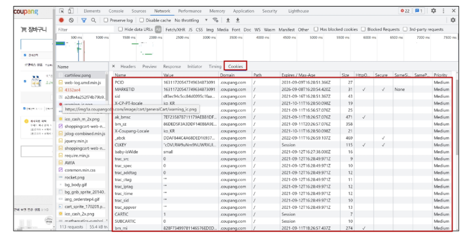

  - 메인 페이지 이동 - 장바구니 유지 상태 확인

    이제 서버로 전송되는 모든 요청과 함께, 브라우저는 `Cookie` HTTP 헤더를 사용해 서버로 이전에 저장했던 모든 쿠키들을 함께 전송

    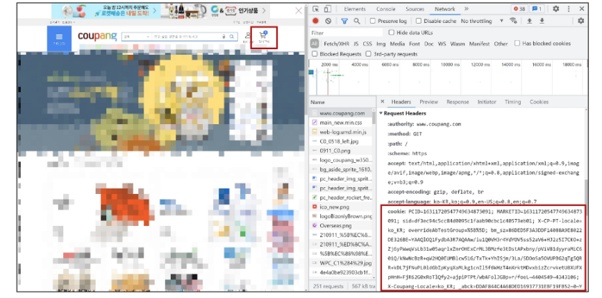

  - 개발자 도구 - Application 탭 - Cookies

    마우스 우측 버튼 - Clear 후 새로고침

    

  - 빈 장바구니로 변경 확인

    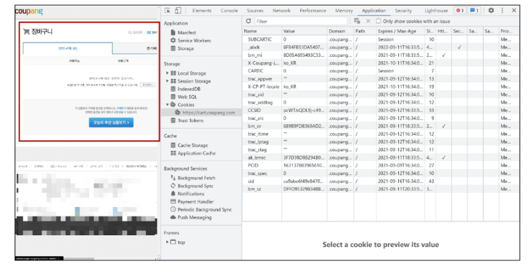


#### + 세션 (Session)

- **세션(Session)**
  - 쿠키가 세션 정보를 가지고 있음
  - 사이트와 특정 브라우저 사이의 "상태(state)"를 유지시키는 것
  - 클라이언트가 서버에 접속하면 서버가 특정 `session id`를 발급하고, 클라이언트는 발급 받은 session id를 쿠키에 저장
    - 클라이언트가 다시 서버에 접속하면 요청과 함께 쿠키(session id가 저장된)를 서버에 전달
    - 쿠키는 요청 때마다 서버에 함께 전송되므로 서버에서 session id를 활용해 알맞은 로직을 처리
  - ID는 세션을 구별하기 위해 필요하며, 쿠키에는 ID만 저장함


- **세션을 이용한 Gitlab 예시**

  - Gitlab 로그인 - 개발자 도구 - Application 탭

    Gitlab 서버로부터 받아 저장된 session 쿠키 확인

    

  - session 삭제 후 페이지 새로고침

    로그아웃 상태 변경 확인

    


- **쿠키 lifetime (수명)**
  - 쿠키의 수명은 두 가지 방법으로 정의할 수 있음
    1. `Session cookies`
       - 현재 세션이 종료되면 삭제됨
       - 브라우저가 "현재 세션(current session)"이 종료되는 시기를 정의
         - [참고] 일부 브라우저는 다시 시작할 때 세션 복원(session restoring)을 사용해 세션 쿠키가 오래 지속될 수 있도록 함
    2. `Persistent cookies` (or `Permanent cookies`)
       - Expires 속성에 지정된 날짜 혹은 Max-Age 속성에 지정된 기간이 지나면 삭제


- **Session in Django**
  - Django의 세션은 미들웨어를 통해 구현됨
  - Django는 database-backed sessions 저장 방식을 기본 값으로 사용
    - [참고] 설정을 통해 cached, file-based, cookie-based 방식으로 변경 가능
  - Django는 특정 session id를 포함하는 쿠키를 사용해서 각각의 브라우저와 사이트가 연결된 세션을 알아냄
    - 세션 정보는 Django DB의 django_session 테이블에 저장됨
  - 모든 것을 세션으로 사용하려고 하면 사용자가 많을 때 서버에 부하가 걸릴 수 있음


- **Authentication System in MIDDLEWARE**

  ```python
  # settings.py
  
  MIDDLEWARE = [
      'django.middleware.security.SecurityMiddleware',
      * 'django.contrib.sessions.middleware.SessionMiddleware', *
      'django.middleware.common.CommonMiddleware',
      'django.middleware.csrf.CsrfViewMiddleware',
      * 'django.contrib.auth.middleware.AuthenticationMiddleware', *
      'django.contrib.messages.middleware.MessageMiddleware',
      'django.middleware.clickjacking.XFrameOptionsMiddleware',
  ]
  ```

  - `SessionMiddleware`
    - 요청 전반에 걸쳐 세션을 관리
  - `AuthenticationMiddleware`
    - 세션을 사용하여 사용자를 요청과 연결


- **[참고] MIDDLEWARE (미들웨어)**

  - HTTP 요청과 응답 처리 중간에서 작동하는 시스템(hooks)

  - Django는 HTTP 요청이 들어오면 미들웨어를 거쳐 해당 URL에 등록되어 있는 view로 연결해주고, HTTP 응답 역시 미들웨어를 거쳐서 내보냄
  - 주로 데이터 관리, 애플리케이션 서비스, 메시징, 인증 및 API 관리를 담당


### - 로그인

- **로그인**
  - 로그인은 session을 Create하는 로직과 같음
  - Django는 우리가 session의 메커니즘에 생각하지 않게끔 도움을 줌
  - 이를 위해 인증에 관한 built-in forms를 제공


- **AuthenticationForm**
  - 사용자 로그인을 위한 form
  - request를 첫번째 인자로 취함


- **login 함수**

  - `login(request, user, backend=None)`

    ```python
    # accounts/urls.py
    
    from django.urls import path
    from . import views
    
    app_name = 'accounts'
    urlpatterns = [
        path('login/', views.login, name='login'),
        ...
    ```

    ```python
    # accounts/views.py
    
    from django.shortcuts import render, redirect
    from django.contrib.auth import login as auth_login
    from django.contrib.auth.forms import AuthenticationForm
    from django.views.decorators.http import require_http_methods
    
    @require_http_methods(['GET', 'POST'])
    def login(request):
        if request.method == 'POST':
            form = AuthenticationForm(request, request.POST)
            if form.is_valid():
                # 로그인
                auth_login(request, form.get_user())
                return redirect(request.GET.get('next') or 'articles:index')
        else:
            form = AuthenticationForm()
        context = {
            'form': form,
        }
        return render(request, 'accounts/login.html', context)
    ```

    ```django
    <!-- accounts/login.html -->
    
    
    
    
      <h1>로그인</h1>
      <form action="" method="POST">
        
        {{ form.as_p }}
        <input type="submit">
      </form>
    
    ```

    - 현재 세션에 연결하려는 인증된 사용자가 있는 경우 login() 함수가 필요
    - 사용자를 로그인하며 view 함수에서 사용됨
    - HttpRequest 객체와 User 객체가 필요
    - Django의 session framework를 사용하여 세션에 user의 ID를 저장 (== 로그인)
    - login 함수 이름을 auth_login으로 바꿈 => login view 함수와의 혼동을 방지하기 위함

    - 로그인 후 브라우저와 Django DB에서 Django로부터 발급받은 sessionid 확인

      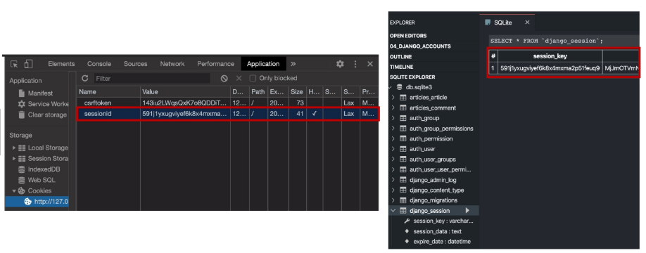


- **get_user()**

  ```python
  class AuthenticationForm(forms.Form):
      """
      Base class for authenticationg users. Extending this to get a form that accepts username/password logins.
      """
      ...
      def get_user(self):
          return self.user_cache
  ```

  - AuthenticationForm의 인스턴스 메서드
  - `user_cache`는 인스턴스 생성 시에 None으로 할당되며, 유효성 검사를 통과했을 경우 로그인한 사용자 객체로 할당됨
  - 인스턴스의 유효성을 먼저 확인하고, 인스턴스가 유효할 때만 user를 제공하려는 구조

  

- **로그인 링크 작성**

  ```django
  <!-- base.html -->
  
  <body>
      <div class="container">
          <a href="">Login</a>
          
          
      </div>
  </body>
  ```

  

### - Authentication data in templates

- **현재 로그인 되어있는 유저 정보 출력**

  ```django
  <!-- base.html -->
  
  <body>
      <div class="container">
          <h3>Hello, {{ user }}</h3>
          <a href="">Login</a>
          
          
      </div>
  </body>
  ```


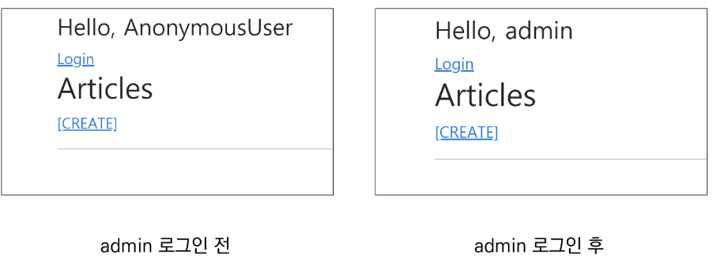


- **Authentication data in templates**

  - `context processors`

    ```python
    # settings.py
    
    TEMPLATES = [
        {
            'BACKEND': 'django.template.backends.django.DjangoTemplates',
            'DIRS': [BASE_DIR / 'templates',],
            'APP_DIRS': True,
            'OPTIONS': {
               * 'context_processors': [
                    'django.template.context_processors.debug',
                    'django.template.context_processors.request',
                    'django.contrib.auth.context_processors.auth',
                    'django.contrib.messages.context_processors.messages',
                ], *
            },
        },
    ]
    
    ```

    - 템플릿이 렌더링될 때 자동으로 호출 가능한 컨텍스트 데이터 목록
    - 작성된 프로세서는 RequestContext에서 사용 가능한 변수로 포함됨

  - `Users`

    ```python
    'django.contrib.auth.context_processors.auth'
    ```

    - 템플릿 RequestContext를 렌더링할 때, 현재 로그인한 사용자를 나타내는 auth.User 인스턴스(또는 클라이언트가 로그인하지 않은 경우 AnonymousUser 인스턴스)는 템플릿 변수 `{{ user }}`에 저장됨

  - Built-in template context processors
    - 'django.contrib.auth.context_processors.auth'
    - 'django.template.context_processors.debug',
    - 'django.template.context_processors.i18n`
    - ...


### - 로그아웃

- **로그아웃**
  - 로그아웃은 session을 Delete하는 로직과 같음


- **logout 함수**
  - `logout(request)`
    - HttpRequest 객체를 인자로 받고 반환 값이 없음
    - 사용자가 로그인하지 않은 경우 오류를 발생시키지 않음
    - 현재 요청에 대한 session data를 DB에서 완전히 삭제하고, 클라이언트의 쿠키에서도 sessionid가 삭제됨
    - 이는 다른 사람이 동일한 웹 브라우저를 사용하여 로그인하고, 이전 사용자의 세션 데이터에 액세스하는 것을 방지하기 위함


```python
# accounts/urls.py

path('logout/', views.logout, name='logout'),
```

```python
# accounts/views.py

from django.views.decorators.http import require_http_methods, require_POST
from django.contrib.auth import logout as auth_logout

@require_POST
def logout(request):
    if request.user.is_authenticated:
        auth_logout(request)
    return redirect('articles:index')
```

```django
<!-- base/html -->

<form action="" method="POST">
        
        <input type="submit" value="Logout">
      </form>
```


### - 로그인 사용자에 대한 접근 제한

- **Limiting access to logged-in users**

  - 로그인 사용자에 대한 액세스 제한 2가지 방법
    1. The raw way
       - `is_authenticated` attribute
    2. The `login_required` decorator

  

1. **`is_authenticated` 속성**
   - User model의 속성(attributes) 중 하나
   - 모든 User 인스턴스에 대해 항상 True인 읽기 전용 속성 (AnonymousUser에 대해서는 항상 False)
   - 사용자가 인증되었는지 여부를 알 수 있는 방법
   - 일반적으로 request.user에서 이 속성을 사용하여, 미들웨어의 'django.contrib.auth.middleware.AuthenticationMiddleware'를 통과했는지 확인
   - 단, 권한(permission)과는 관련이 없으며, 사용자가 활성화 상태(active)이거나 유효한 세션(valid session)을 가지고 있는지도 확인하지 않음

- `is_authenticated` 적용

  - 로그인과 비로그인 상태에서 출력되는 링크를 다르게 설정

    ```django
    <!-- base.html -->
    
    <body>
      <div class="container">
        
          <h3>Hello, {{ user }}</h3>
          <form action="" method="POST">
            
            <input type="submit" value="Logout">
          </form>
        
          <a href="">Login</a>
        
        
        
      </div>
      ...
    </body>
    ```

  - 인증된 사용자(로그인 상태)라면 로그인 로직을 수행할 수 없도록 처리

    ```python
    # accounts/views.py
    
    @require_http_methods(['GET', 'POST'])
    def login(request):
        if request.user.is_authenticated:
            return redirect('articles:index')
    ```

  - 인증된 사용자(로그인 상태)만 로그아웃 로직을 수행할 수 있도록 처리

    ```python
    # accounts/views.py
    
    @require_POST
    def logout(request):
        if request.user.is_authenticated:
            auth_logout(request)
        return redirect('articles:index')
    ```

  - 인증된 사용자(로그인 상태)만 게시글 작성 링크를 볼 수 있도록 처리

    ```django
    <!-- articles/index.html -->
    
    
      <a href="">CREATE</a>
    
      <a href="">[새 글을 작성하려면 로그인 하세요]</a>
    
    ```

    

2. **`login_required` decorator**

   ```python
   from django.contrib.auth.decorators import login_required
   
   @login_required
   def my_view(request):
       pass
   ```

   - 사용자가 로그인되어 있지 않으면, `settings.Login_URL`에 설정된 문자열 기반 절대 경로로 redirect함
     - LOGIN_URL의 기본 값은 '/accounts/login/'
     - 두번째 app 이름을 accounts로 했던 이유 중 하나
   - 사용자가 로그인되어 있으면 정상적으로 view 함수를 실행
   - 인증 성공 시 사용자가 redirect되어야하는 경로는 "next"라는 쿼리 문자열 매개 변수에 저장됨
     - 예시) /accounts/login/?next=/articles/create/

   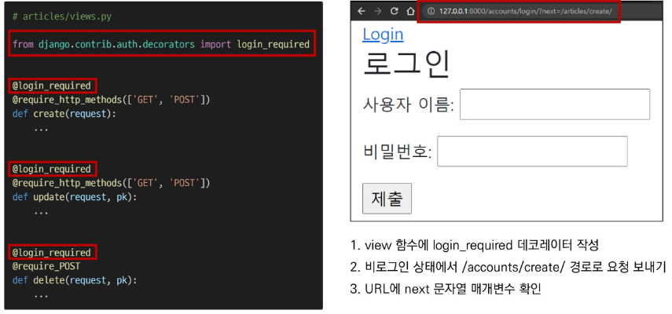


- **"next" query string parameter**

  - 로그인이 정상적으로 진행되면 기존에 요청했던 주소로 redirect하기 위해 마치 주소를 keep해주는 것

  - 단, 별도로 처리해주지 않으면 우리가 view에 설정한 redirect 경로로 이동하게 됨

    ```python
    # accounts/views.py
    
    @require_http_methods(['GET', 'POST'])
    def login(request):
        ...
        if request.method == 'POST':
            form = AuthenticationForm(request, request.POST)
            if form.is_valid():
                # 로그인
                auth_login(request, form.get_user())
                return redirect(request.GET.get('next') or 'articles:index')
        ...
        return render(request, 'accounts/login.html', context)
    ```

  - 현재 URL로(next parameter가 있는) 요청을 보내기 위해 action 값 비우기

    ```django
    <!-- accounts/login.html -->
    
    
    
    
      <h1>로그인</h1>
      <hr>
      <form action="" method="POST">
        
        {{ form.as_p }}
        <input type="submit">
      </form>
    
    ```

  

- **두 데코레이터로 인해 발생하는 구조적 문제와 해결** 

  - 비로그인 상태에서 게시글 삭제 시도

    ```python
    # articles/views.py
    
    @login_required
    @require_POST
    def delete(request, pk):
        article = get_object_or_404(Article, pk=pk)
        article.delete()
        return redirect('articles:index')
    ```
    
  - redirect로 이동한 로그인 페이지에서 로그인 시도 - 405(Method Not Allowed) status code 확인
  
    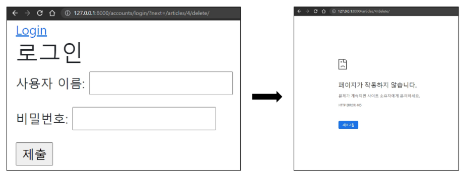
  
  - @require_POST 작성된 함수에 @login_required를 함께 사용하는 경우 에러 발생
  
  - 로그인 이후 "next" 매개변수를 따라 해당 함수로 다시 redirect되는데, 이때 @require_POST 때문에 405 에러가 발생하게 됨
  
  - 두 가지 문제 발생
  
    1. redirect 과정에서 POST 데이터의 손실
    2. redirect 요청은 POST 방식이 불가능하기 때문에 GET 방식으로 요청됨
  
  - 로그인 성공 후 next에 담긴 경로로 리다이렉트 될 때 에러 발생
  
    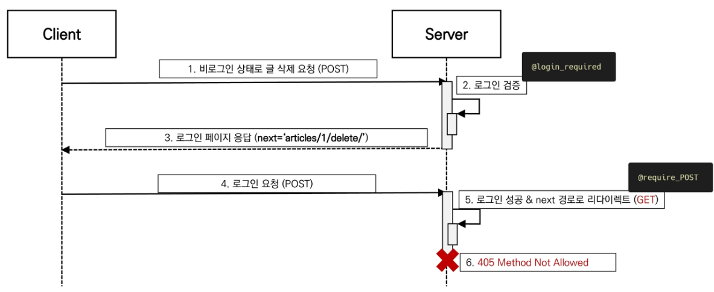
  
  - login_required는 GET method request를 처리할 수 있는 view 함수에서만 사용해야 함
  
    ```python
    # articles/views.py
    
    @require_POST
    def delete(request, pk):
        if request.user.is_authticated:
            article = get_object_or_404(Article, pk=pk)
            article.delete()
        return redirect('articles:index')
    ```
  
    

## Authentication System Ⅱ

### - 회원가입

- **UserCreationForm**

  - 주어진 username과 password로 권한이 없는 새 user를 생성하는 ModelForm

  - 3개의 필드를 가짐

    1. username (from the user model)
    2. password1
    3. password2

    ```python
    class UserCreationForm(forms.ModelForm):
        """
        A form that creates a user, with no privileges, from the given username and
        password.
        """
        error_messages = {
            'password_mismatch': _('The two password fields didn’t match.'),
        }
        password1 = forms.CharField(
            label=_("Password"),
            strip=False,
            widget=forms.PasswordInput(attrs={'autocomplete': 'new-password'}),
            help_text=password_validation.password_validators_help_text_html(),
        )
        password2 = forms.CharField(
            label=_("Password confirmation"),
            widget=forms.PasswordInput(attrs={'autocomplete': 'new-password'}),
            strip=False,
            help_text=_("Enter the same password as before, for verification."),
        )
    ...
    ```

  - 회원가입 진행 후 admin 페이지에서 새로운 계정이 생겼는지 확인

    ```python
    # accounts/urls.py
    
    path('signup/', views.signup, name='signup'),
    ```

    ```python
    # accounts/views.py
    
    from django.contrib.auth.forms import AuthenticationForm, UserCreationForm
    
    def signup(request):
        if request.method == 'POST':
            form = UserCreationForm(request.POST)
            if form.is_valid():
                user = form.save()
                return redirect('articles:index')
        else:
            form = UserCreationForm()
        context = {
            'form': form,
        }
        return render(request, 'accounts/signup.html', context)
    ```

    ```django
    <!-- accounts/signup.html -->
    
    
    
    
      <h1>회원가입</h1>
      <form action="" method="POST">
        
        {{ form.as_p }}
        <input type="submit">
      </form>
    
    ```

    

- **회원가입 페이지**

  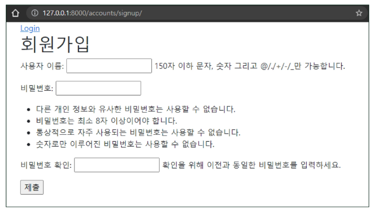


- 회원가입 후 자동으로 로그인 진행하기

  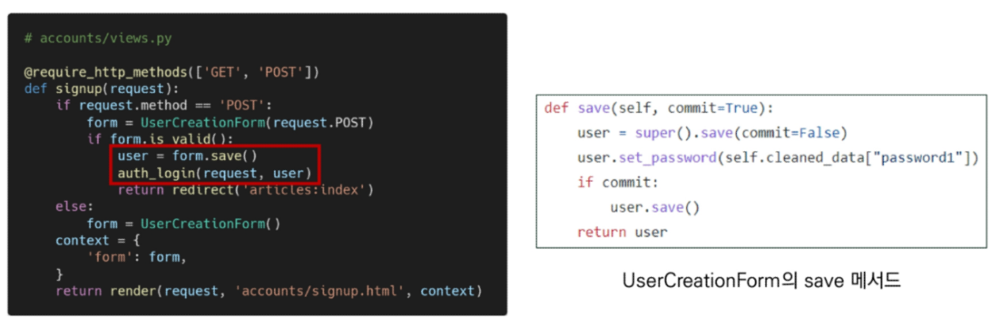

  

### - 회원탈퇴

- 회원탈퇴는 DB에서 사용자를 삭제하는 것과 같음

  ```python
  # accounts/urls.py
  
  path('delete/', views.delete, name='delete'),
  ```

  ```python
  # accounts/views.py
  
  from django.views.decorators.http import require_POST
  
  @require_POST
  def delete(request):
      if request.user.is_authenticated:
          # 반드시 회원탈퇴 후 로그아웃 함수 호출
          request.user.delete()
      return redirect('articles:index')
  ```

  ```django
  <!-- base.html -->
  
  <form action="" method="POST">
     
     <input type="submit" value="회원탈퇴">
  </form>
  ```

  - 회원탈퇴 진행 후 SQLite 확장프로그램이나 admin 페이지에서 유저가 삭제되었는지 확인

  - 탈퇴하면서 해당 유저의 세션 데이터도 함께 지울 경우 (단, 반드시 탈퇴 후 로그아웃 순으로 처리해야함)

    ```python
    @require_POST
    def delete(request):
        if request.user.is_authenticated:
            request.user.delete()
            auth_logout(request)
        return redirect('articles:index')
    ```

    

### - 회원정보 수정

- `UserChangeForm`

  - 사용자의 정보 및 권한을 변경하기 위해 admin 인터페이스에서 사용되는 ModelForm

    ```python
    class UserChangeForm(forms.ModelForm):
        password = ReadOnlyPasswordHashField(
            label=_("Password"),
            help_text=_(
                'Raw passwords are not stored, so there is no way to see this '
                'user’s password, but you can change the password using '
                '<a href="{}">this form</a>.'
            ),
        )
    
        class Meta:
            model = User
            fields = '__all__'
            field_classes = {'username': UsernameField}
        ...
    ```

    

- **회원정보 수정 페이지 확인**

  ```python
  # accounts/urls.py
  
  path('update/', views.update, name='update'),
  ```

  ```python
  # accounts/views.py
  
  from django.contrib.auth.forms import AuthenticationForm, UserCreationForm, UserChangeForm
  
  @require_http_methods(['GET', 'POST'])
  def update(request):
      if request.method == 'POST':
      	pass
      else:
          form = CustomUserChangeForm(instance=request.user)
      context = {
          'form': form,
      }
      return render(request, 'accounts/update.html', context)
  ```

  ```django
  <!-- accounts/update.html -->
  
  
  
  
    <h1>UPDATE</h1>
    <form action="" method="POST">
      
      {{ form.as_p }}
      <input type="submit">
    </form>
  
  ```

  

- **회원정보 수정 페이지**

  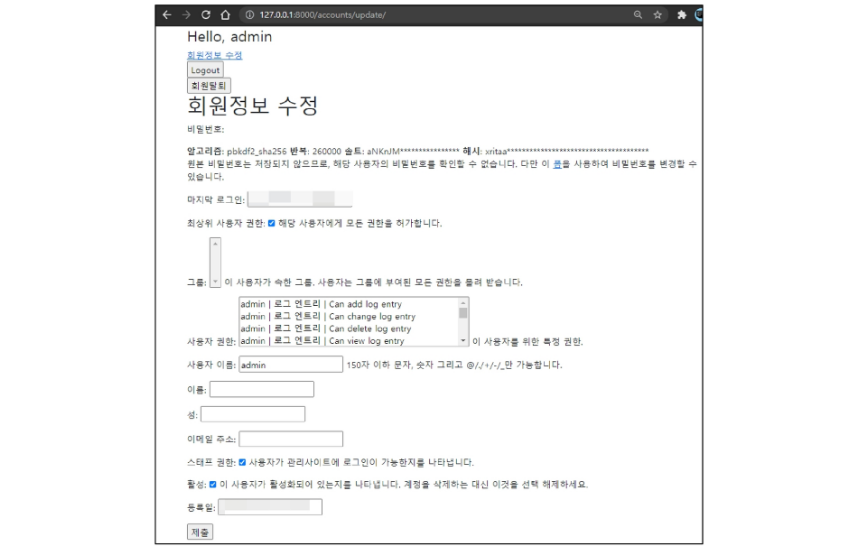


- UserChangeForm 사용 시 문제점
- 