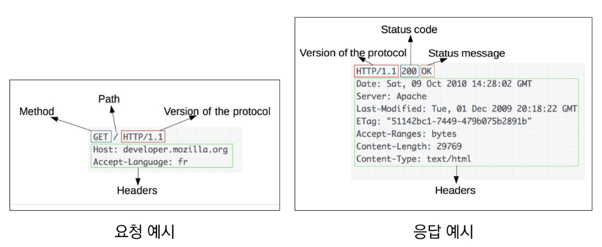
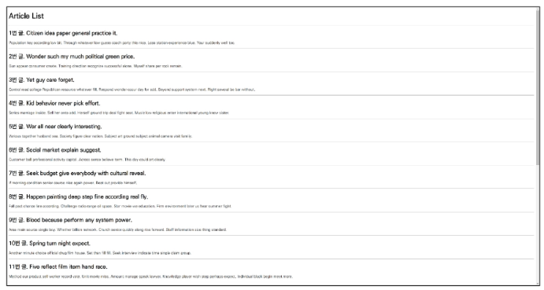
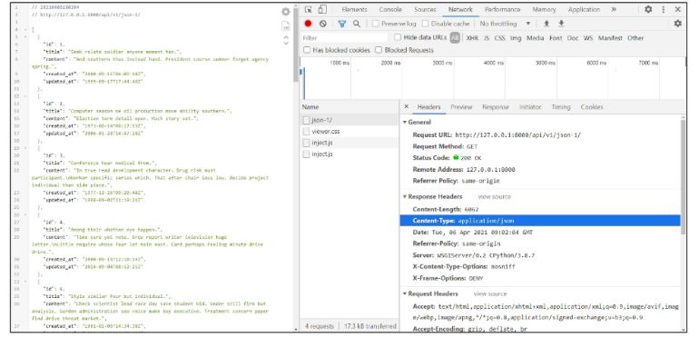

# Django 05 - REST API

> [강의자료](https://edu.ssafy.com/data/upload_files/crossUpload/openLrn/ebook/unzip/A2022040613045196000/index.html)  2022-04-20


## HTTP

- **HTTP**

  - HyperText Transfer Protocol

  - 웹 상에서 컨텐츠를 전송하기 위한 약속

  - HTML 문서와 같은 리소스들을 가져올 수 있도록 하는 프로토콜(규칙, 약속) 

  - 웹에서 이루어지는 모든 데이터 교환의 기초

    - `요청(request)`

      \- 클라이언트에 의해 전송되는 메시지

    - `응답(response)`

      \- 서버에서 응답으로 전송되는 메시지

  - 기본 특성
    - Stateless (무상태)
    - Connectionless (비연결성)
  - 쿠키와 세션을 통해 서버 상태를 요청과 연결하도록 함


- **HTTP 메시지**

  


- **HTTP request methods**
  - 자원에 대한 행위(수행하고자 하는 동작)을 정의
  - 주어진 리소스(자원)에 수행하길 원하는 행동을 나타냄
  - HTTP Method 예시
    - `GET` : 조회, `POST` : 작성, `PUT` : 수정, `DELETE` : 삭제


- **HTTP responser status codes**
  - 특정 HTTP 요청이 성공적으로 완료되었는지 여부를 나타냄
  - 응답은 5개의 그룹으로 나뉘어짐
    1. `Information responses (1xx)`
    2. `Successful responses (2xx)`
    3. `Redirection messages (3xx)`
    4. `Client error responses (4xx)`
    5. `Server error responses (5xx)`


- **웹에서의 리소스 식별**
  - HTTP 요청의 대상을 리소스(resource, 자원)라고 함
  - 리소스는 문서, 사진 또는 기타 어떤 것이든 될 수 있음
  - 각 리소스는 리소스 식별을 위해 HTTP 전체에서 사용되는 URI(Uniform Resource Identifier)로 식별됨


- **URL, URN**
  - `URL(Uniform Resource Locator)`
    - 통합 자원 위치
    - 네트워크 상에 자원이 어디 있는지 알려주기 위한 약속
    - 과거에는 실제 자원의 위치를 나타냈지만 현재는 추상화된 의미론적인 구성
    - '웹 주소', '링크'라고도 불림
  - `URN(Uniform Resource Name)`
    - 통합 자원 이름
    - URL과 달리 자원의 위치에 영향을 받지 않는 유일한 이름 역할을 함
    - ex. ISBN(국제표준도서번호)


- **URI**
  - `Uniform Resource Identifier`
    - 통합 자원 식별자
    - 인터넷의 자원을 식별하는 유일한 주소 (정보의 자원을 표현)
    - 인터넷에서 자원을 식별하거나 이름을 지정하는 데 사용되는 간단한 문자열
    - 하위 개념: URL, URN
  - URI는 크게 URL과 URN으로 나눌 수 있지만, URN을 사용하는 비중이 매우 적기 때문에 일반적으로 URL은 URI와 같은 의미처럼 사용하기도 함


- **URI의 구조**

  - `Scheme (protocol)`

    - 브라우저가 사용해야 하는 프로토콜 (규약)
    - http(s), data, file, ftp, mailto

    

  - `Host (Domain name)`

    - 요청을 받는 웹 서버의 이름
    - IP address를 직접 사용할 수도 있지만, 실 사용시 불편하므로 웹에서 그리 자주 사용되지는 않음 (google의 IP address - 142.251.42.142)

    

  - `Port`

    - 웹 서버 상의 리소스에 접근하는데 사용되는 기술적인 '문(gate)'

    - HTTP 프로토콜의 표준 포트

      \- HTTP 80

      \- HTTPS 443

    

  - `Path`

    - 웹 서버 상의 리소스 경로
    - 초기에는 실제 파일이 위치한 물리적 위치를 나타냈지만, 오늘날은 물리적인 실제 위치가 아닌 추상화 형태의 구조로 표현

    

  - `Query (Identifier)`

    - Query String Parameters
    - 웹 서버에 제공되는 추가적인 매개 변수
    - &로 구분되는 key-value 목록

    

  - `Fragment`

    - Anchor
    - 자원 안에서의 북마크의 한 종류를 나타냄
    - 브라우저에게 해당 문서(HTML)의 특정 부분을 보여주기 위한 방법
    - 브라우저에게 알려주는 요소이기 때문에 fragment identifier(부분 식별자)라고 부르며 '#' 뒤의 부분은 요청이 서버에 보내지지 않음

    


## RESTful API

- **API**
  - Application Programming Interface
  - 프로그래밍 언어가 제공하는 기능을 수행할 수 있게 만든 인터페이스
    - 애플리케이션과 프로그래밍으로 소통하는 방법
    - CLI는 명령줄, GUI는 그래픽(아이콘), API는 프로그래밍을 통해 특정한 기능 수행
  - Web API
    - 웹 애플리케이션 개발에서 다른 서비스에 요청을 보내고 응답을 받기 위해 정의된 명세
    - 현재 웹 개발은 모든 것을 직접 개발하기보다 여러 Open API를 활용하는 추세
  - 응답 데이터 타입
    - HTML, XML, JSON 등
  - 대표적인 API 서비스 목록
    - Youtube API, Naver Papago API, Kakao Map API ...


- **REST**
  - **RE**presentational **S**tate **T**ransfer (대표 상태 통신)
  - API Server를 개발하기 위한 일종의 소프트웨어 설계 <u>방법론</u> (규약, 약속 X)
    - 2000년 로이 필딩의 박사학위 논문에서 처음으로 소개된 후 네트워킹 문화에 널리 퍼짐
  - 네트워크 구조(Network Architecture) 원리의 모음
    - 자원을 정의하고 자원에 대한 주소를 지정하는 전반적인 방법
  - REST 원리를 따르는 시스템을 RESTful이란 용어로 지칭함
  - 자원을 정의하는 방법에 대한 고민
    - ex. 정의된 자원을 어디에 위치시킬 것인가
  - REST의 자원과 주소의 지정 방법
    1. 자원
       - URI
    2. 행위
       - HTTP Method
    3. 표현
       - 자원과 행위를 통해 궁극적으로 표현되는 (추상화된) 결과물
       - JSON으로 표현된 데이터를 제공
  - REST의 핵심 규칙
    1. '정보'는 <u>URI</u>로 표현
    2. 자원에 대한 '행위'는 <u>HTTP Method</u>로 표현 (`GET`, `POST`, `PUT`, `DELETE`)
  - 설계 방법론은 지키지 않았을 때 잃는 것보다 지켰을 때 얻는 것이 훨씬 많음
    - 단, 설계 방법론을 지키지 않더라도 동작 여부에 큰 영향을 미치지는 않음


- **JSON**
  - `JSON (JavaScript Object Notation)`
    - JSON is a lightweight data-interchange format
    - JavaScript의 표기법을 따른 <u>단순 문자열</u>
  - 특징
    - 사람이 읽거나 쓰기 쉽고 기계가 파싱(해석, 분석)하고 만들어내기 쉬움
    - 파이썬의 dictionary, 자바스크립트의 object처럼 C 계열의 언어가 갖고 있는 자료구조로 쉽게 변화할 수 있는 key-value 형태의 구조를 갖고 있음


- **RESTful API**
  - REST 원리를 따라 설계한 API
  - RESTful services, 혹은 simply REST services라고도 부름
  - 프로그래밍을 통해 클라이언트의 요청에 JSON을 응답하는 서버를 구성
    - 지금까지 사용자의 입장에서 썼던 API를 제공자의 입장이 되어 개발해보기


## Response

- **Init Project**

  - 가상환경 설정 및 패키지 설치

    ```bash
    $ python -m venv venv
    $ source venv/Scripts/activate
    
    $ pip install -r requirements.txt
    ```

  - 설치된 app 확인

    ```python
    # settings.py
    
    INSTALLED_APPS = [
        'articles',
        'django_seed',
        ...,
    ]
    ```

  - 작성된 URL 확인

    ```python
    # my_api/urls.py
    
    from django.contrib import admin
    from django.urls import path, include
    
    urlpatterns = [
        path('admin/', admin.site.urls),
        path('api/v1/', include('articles.urls')),
    ]
    ```

    ```python
    # articles/urls.py
    
    from django.urls import path
    from . import views
    
    
    urlpatterns = [
        path('html/', views.article_html),
        path('json-1/', views.article_json_1),
        path('json-2/', views.article_json_2),
        path('json-3/', views.article_json_3),
    ]
    ```

    

- **Create Dummy Data**

  - 작성된 model 확인

    ```python
    # models.py
    
    from django.db import models
    
    # Create your models here.
    class Article(models.Model):
        title = models.CharField(max_length=100)
        content = models.TextField()
        created_at = models.DateTimeField(auto_now_add=True)
        updated_at = models.DateTimeField(auto_now=True)
    ```

  - django-seed 라이브러리를 사용해 모델 구조에 맞는 데이터 생성

    ```bash
    $ python manage.py migrate
    $ python manage.py seed articles --number=20
    ```

    

### 1. Response - `HTML`




- **HTML을 응답하는 서버**

  ```python
  # articles/urls.py
  
  path('html/', views.article_html),
  ```

  ```python
  # articles/views.py
  
  from django.shortcuts import render
  from .models import Article
  
  def article_html(request):
      articles = Article.objects.all()
      context = {
          'articles': articles,
      }
      return render(request, 'articles/article.html', context)
  ```

  ```django
  <!-- articles/article.html -->
  
  <!DOCTYPE html>
  <html lang="en">
  <head>
    <meta charset="UTF-8">
    <meta http-equiv="X-UA-Compatible" content="IE=edge">
    <meta name="viewport" content="width=device-width, initial-scale=1.0">
    <title>Document</title>
  </head>
  <body>
    <h1>Article List</h1>
    <hr>
    <p>
      
        <h2>{{ article.pk }}번 글. {{ article.title }}</h2>
        <p>{{ article.content }}</p>
        <hr>
      
    </p>
  </body>
  </html>
  ```

  

### 2. Response - `JsonResponser`




- **JsonResponse 객체를 활용한 JSON 데이터 응답**

  ```python
  # articles/urls.py
  
  path('json-1/', views.article_json_1),
  ```

  ```python
  # articles/views.py
  
  from django.http.response import JsonResponse
  
  def article_json_1(request):
      articles = Article.objects.all()
      articles_json = []
  
      for article in articles:
          articles_json.append(
              {
                  'id': article.pk,
                  'title': article.title,
                  'content': article.content,
                  'created_at': article.created_at,
                  'updated_at': article.updated_at,
              }
          )
      return JsonResponse(articles_json, safe=False)
  ```

  

- **`Content-Type` entity header**

  - 데이터의 media type(MIME type, content type)을 나타내기 위해 사용됨
  - 응답 내에 있는 컨텐츠의 컨텐츠 유형이 실제로 무엇인지 클라이언트에게 알려줌

  

- **`JsonResponse` objects**

  - JSON-encoded response를 만드는 HttpRespons의 서브 클래스

  - "safe" parameter

    \- True (기본값)

    \- dict 이외의 객체를 직렬화(Serialization)하려면 False로 설정해야 함

    ```python
    # JsonResponse 예시
    
    response = JsonResponse({'foo': 'bar'})
    response = JsonResponse([1, 2, 3], safe=False)
    ```

    

- **Serialization**
  - "직렬화"
  - 데이터 구조나 객체 상태를 동일하거나 다른 컴퓨터 환경에 저장하고, 나중에 재구성할 수 있는 포맷으로 변환하는 과정
  - Serializers in Django
    - Queryset 및 Model Instance와 같은 복잡한 데이터를 JSON, XML 등의 유형으로 쉽게 변환할 수 있는 <u>Python</u> 데이터 타입으로 만들어 줌


### 3. Response - `Django Serializer`


- **Django의 내장 HttpResponse를 활용한 JSON 응답**

  ```python
  # articles/urls.py
  
  path('json-2/', views.article_json_2),


- Django의 내장 HttpResponse를 활용한 JSON 응답 객체

- 주어진 모델 정보를 확인하기 때문에 이전과 달리 필드를 개별적으로 직접 만들어 줄 필요 없음

  ```python
  # articles/views.py
  
  from django.http.response import JsonResponse, HttpResponse
  from django.core import serializers
  
  def article_json_2(request):
      articles = Article.objects.all()
      data = serializers.serialize('json', articles)
      return HttpResponse(data, content_type='application/json')
  ```

  

### 4. Response - `Django REST Framework`


- Django REST framework(DRF) 라이브러리를 사용한 JSON 응답

- 설치 과정

  ```bash
  $ pip install djangorestframework
  ```

  ```python
  # settings.py
  
  INSTALLED_APPS = [
      ...
      'rest_framework',
  ]
  ```


- DRF 라이브러리를 사용한 JSON 응답 URL 확인

  ```python
  # articles/urls.py
  
  path('json-3/', views.article_json_3),
  ```


- Article 모델에 맞춰 자동으로 필드를 생성해 serialize 해주는 ModelSerializer 확인

  ```python
  # articles/serializers.py
  
  from rest_framework import serializers
  from .models import Article
  
  
  class ArticleSerializer(serializers.ModelSerializer):
  
      class Meta:
          model = Article
          fields = '__all__'
  ```

  

- DRF의 Response()를 활용해 Serialize된 JSON 객체 응답 (DRF를 이용한 view 함수 작성은 다음 챕터에서 진행)

  ```python
  # articles/views.py
  
  from rest_framework.decorators import api_view
  from rest_framework.response import Response
  from .serializers import ArticleSerializer
  
  # @api_view(['GET'])
  @api_view()
  def article_json_3(request):
      articles = Article.objects.all()
      serializer = ArticleSerializer(articles, many=True)
      return Response(serializer.data)
  ```

  

- Python 파일을 통해 직접 요청 보낸 후 응답 확인해보기 (requests 라이브러리를 활용)

  


---

- **Django REST Framework (DRF)**
  - Web API 구축을 위한 강력한 Toolkit을 제공하는 라이브러리
  - DRF의 Serializer는 Django의 Form 및 ModelForm 클래스와 매우 유사하게 구성되고 작동함
  - Web API
    - 웹 애플리케이션 개발에서 다른 서비스에 요청을 보내고 응답을 받기 위해 정의된 명세


- Django ModelForm vs. DRF Serializer

  |          |  Django   |    DRF     |
  | :------: | :-------: | :--------: |
  | Response |   HTML    |    JSON    |
  |  Model   | ModelForm | Serializer |

  

## Single Model

- **DRF with Single Model**
  - 단일 모델의 data를 직렬화(serialization)하여 JSON으로 변환하는 방법에 대한 학습
  - 단일 모델을 두고 CRUD 로직을 수행 가능하도록 설계
  - API 개발을 위한 핵심 기능을 제공하는 도구 활용
    - DRF built-in form
    - Postman


- **[참고] Postman**
  - API를 구축하고 사용하기 위해 여러 도구를 제공하는 API 플랫폼
  - 설계, 테스트, 문서화 등의 도구를 제공함으로써 API를 더 빠르게 개발 및 생성할 수 있도록 도움


- **Init Project**

  - 가상환경 설정 및 패키지 설치

    ```bash
    $ python -m venv venv
    $ source venv/Scripts/activate
    
    $ pip install -r requirements.txt
    ```

  - 설치된 app 확인

    ```python
    # settings.py
    
    INSTALLED_APPS = [
        'articles',
        'django_seed',
        'django_extensions', 
        'rest_framework',
        ...,
    ]
    ```

  - 작성된 url 확인

    ```python
    # my_api/urls.py
    
    from django.contrib import admin
    from django.urls import include
    
    urlpatterns = [
        path('admin/', admin.site.urls),
        path('api/v1/', include('articles.urls')),
    ]
    ```

    ```python
    # articles/urls.py
    
    from django.urls import path
    from . import views
    
    urlpatterns = [
        
    ]
    ```

  - 작성된 model 확인

    ```python
    # models.py
    
    from django.db import models
    
    class Articles(models.Model):
        title = models.CharField(max_length=100)
        content = models.TextField()
        created_at = models.DateTimeField(auto_now_add=True)
        updated_at = models.DateTimrfield(auto_now=True)
    ```

    

- **Create Dummy Data**

  - django-seed 라이브러리를 사용해 모델 구조에 맞는 데이터 생성

    ```bash
    $ python manage.py migrate
    
    $ python manage.py seed articles --number=20
    ```

    

- **ModelSerializer**

  - 모델 필드에 해당하는 필드가 있는 Serializer 클래스를 자동으로 만들 수 있는 shortcut
  - 아래 핵심 기능을 제공
    1. 모델 정보에 맞춰 자동으로 필드 생성
    2. serializer에 대한 유효성 검사기를 자동으로 생성
    3. `.create()` & `.update()`의 간단한 기본 구현이 포함됨

  - Model의 필드를 어떻게 '직렬화'할 지 설정하는 것이 핵심

  - 이 과정은 Django에서 Model의 필드를 설정하는 것과 동일함

    ```python
    # articles/serializers.py
    
    from rest_framework import serializers
    from .models import Article
    
    class ArticleListSerializer(serializers.ModelSerializer):
        
        class Meta:
            model = Article
            fields = ('id', 'title',)
    ```

    

- **Serializer in Shell**

  - shell_plus에서 serializer 사용해보기

    ```shell
    #1. shell_plus 실행
    $ python manage.py shell_plus
    ```

    ```shell
    #2. 작성한 Serializer import
    >>> from articles.serializers import ArticleListSerializer
    ```

    ```shell
    #3. 기본 인스턴스 구조 확인
    >>> serializer = ArticleListSerializer()
    >>> serializer
    ArticleListSerializer():
    	id = IntegerField(label='ID', read_only=True)
    	title = CharField(max_length=100)
    ```

    ```shell
    #4. Model Instance 객체
    >>> article = Article.objects.get(pk=1)
    >>> article
    <Article: Article object (1)>
    
    >>> serializer = ArticleListSerializer(article)
    >>> serializer
    ArticleListSerializer(<Article: Article object (1)>):
    	id = IntegerField(label='ID', read_only=True)
    	title = CharField(max_length=100)
    >>> serializer.data
    {'id': 1, 'title': 'Site economic if two country science'}
    ```

    ```shell
    #5. QuerySet 객체
    >>> articles = Article.objects.all()
    ```

    ```shell
    #5-1. many-True 옵션 X
    >>> serializer = ArticleListSerializer(articles)
    >>> serializer.data
    AttributeError: Got AttributeError when attempting to get a value for field 'title' on serializer 'ArticleListSerializer'.
    The serializer field might be named incorrectly and not match any attribute or key on the 'QuerySet' instance.
    Original exception text was: 'QuerySet' objects has no attribute 'title'.
    
    #5-2. many-True 옵션 O
    >>> serializer = ArticleListSerializer(articles, many=True)
    >>> serializer.data
    [OrderedDict([('id', 1), ('title', 'Live left research'), ('content', 'Small') ...
    ```

    

- **`many` argument**

  - many=True

    - "Serializing multiple objects"
    - 단일 인스턴스 대신 QuerySet 등을 직렬화하기 위해서는 serializer를 인스턴스화할 때 many=True를 키워드 인자로 전달해야 함

    ```python
    @api_view(['GET'])
    def article_json_3(request):
        articles = Article.objects.all()
        serializer = ArticleSerializer(articles, many=True)
        return Response(serializer.data)
    ```

    ```python
    # many=True 예시
    
    queryset = Book.objects.all()
    serializer = BookSerializer(queryset, many=True)
    print(serializer.data)
    # [
    #	{'id': 0, 'title': 'The electric', 'author': 'Tom'},
    #	{'id': 1, 'title': 'If this is', 'author': 'Prime'},
    #]
    ```

    

- **Build RESTful API**

  |             |     GET      |  POST   |     PUT     |   DELETE    |
  | ----------- | :----------: | :-----: | :---------: | :---------: |
  | articles/   | 전체 글 조회 | 글 작성 |             |             |
  | articles/1/ | 1번 글 조회  |         | 1번 글 수정 | 1번 글 삭제 |
  
  

### 1. GET - `Article List`

- **url 및 view 함수 작성**

  ```python
  # articles/urls.py
  
  urlpatterns = [
      path('articles/', views.article_list),
  ]
  ```
  
  ```python
  # articles/views.py
  
  from rest_framework.response import Response
  from rest_framework.decorators import api_view
  
  from .serializers import ArticleListSerializer
  from .models import Article
  
  @api_view(['GET'])
  def article_list(request):
      articles = Article.objects.all()
      serializer = ArticleListSerializer(articles, many=True)
      return Response(serializer.data)
  ```


- **`api_view` decorator**

  - 기본적으로 GET 메서드만 허용되며 다른 메서드 요청에 대해서는 405 Method Not Allowed로 응답
  - View 함수가 응답해야 하는 HTTP 메서드의 목록을 리스트의 인자로 받음
  - DRF에서는 선택이 아닌 <u>필수적으로 작성</u>해야 해당 view함수가 정상적으로 동작함

  ```python
  # api_view 데코레이터 예시
  
  from rest_framework.decorators import api_view
  
  @api_view(['GET'], ['POST'])
  def hello_world(request):
      if request.method == 'POST':
          return Response({'message': 'Got some data!', 'data': request.data})
     	return Response({'message': 'Hello, world!'})
  ```


- http://127.0.0.1:8000/api/v1/articles/ 로 GET 요청 후 응답 확인

  


### 2. GET - `Article Detail`

- Article List와 Article Detail을 구분하기 위해 추가 Serializer 정의

- 모든 필드를 직렬화하기 위해 fields 옵션을 `__all__`로 설정

  ```python
  # articles/serializers.py
  
  class ArticleSerializer(serializers.ModelSerializer):
      
      class Meta:
          model = Article
          field = '__all__'
  ```

  

- url 및 view 함수 작성

  ```python
  # articles/urls.py
  
  urlpatterns = [
      ...,
      path('articles/<int:article_pk>/', views.article_detail)
  ]
  ```
  
  ```python
  # articles/views.py
  
  from django.shortcuts import get_object_or_404
  from .serializers import ArticleListSerializer, ArticleSerializer
  
  @api_view(['GET'])
  def article_detail(request, article_pk):
      article = get_object_or_404(Article, pk=article.pk)
      serializer = ArticleSerializer(article)
      return Response(serializer.data)
  ```
  


- http://127.0.0.1:8000/api/v1/articles/1/로 GET 요청 후 응답 확인

  


### 3. POST - `Create Article`

- 201 Created 상태 코드 및 메시지 응답
- RESTful 구조에 맞게 작성
  1. URI는 자원을 표현
  2. 자원을 조작하는 행위는 HTTP Method
- article_list 함수로 게시글을 조회하거나 생성하는 행위를 모두 처리 가능


- view 함수 수정

  ```python
  # articles/views.py
  
  from rest_framework import status
  
  @api_view(['GET', 'POST'])
  def article_list(request):
      # 전체 게시글 조회
      if request.method == 'GET':
      	articles = Article.objects.all()
      	serializer = ArticleListSerializer(articles, many=True)
      	return Response(serializer.data)
  	# 게시글 생성
      elif request.method == 'POST':
          serializer = ArticleSerializer(data=request.data)
          if serializer.is_valid():
              serializer.save()
          	return Response(serializer.data, status=status.HTTP_201_CREATED)
         	return response(serializer.errors, status=status.HTTP_400_BAD_REQUEST)
  ```


- **Status Codes in DRF**

  - DRF에는 status code를 보다 명확하고 읽기 쉽게 만드는 데 사용할 수 있는 정의된 상수 집합을 제공


  - status 모듈에 HTTP status code 집합이 모두 포함되어 있음

    ```python
    # status 모듈 예시
    
    from rest_framework import status
    
    def example_list(request):
        return Response(serialzier.data, status=status.HTTP_201_CREATED)
    ```

  - 단순히 status=201 같은 표현으로도 사용할 수 있지만 DRF는 권장하지 않음

    ```python
    Response(serializer.data, status=201)
    ```


- HTTP body에 form-data로 title과 content 데이터 작성

- http://127.0.0.1:8000/api/v1/articles/로 POST 요청 후 응답 확인

  

  

---

- **`raise_exception` argument**

  - "Raising an exception on invalid data"

  - `is_valide()`는 유효성 검사 오류가 있는 경우 serializers.ValidationError 예외를 발생시키는 선택적 `raise_exception` 인자를 사용할 수 있음

  - DRF에서 제공하는 기본 예외 처리기에 의해 자동으로 처리되며, 기본적으로 HTTP status code 400을 응답으로 반환함

  - `raise_exception` 작성

    ```python
    # articles/views.py
    
    
    ```
    
    

### 4. DELETE - `Delete Article`

- 204 No Content 상태 코드 및 메시지 응답

- article_detail 함수로 상세 게시글을 조회하거나 삭제하는 행위 모두 처리 가능

  ```python
  # articles/views.py
  
  @api_view(['GET', ''])
  ```

  

### 5. PUT - `Update Article`

- article


## 1 : N Relation

- DRF with 1:N Relation

  - 1:N 관계에서의 모델 data를 직렬화(serialization)하여 JSON으로 변환하는 방법에 대한 학습

  - 2개 이상의 1:N 관계를 맺는 모델을 두고 CRUD 로직을 수행 가능하도록 설계하기

  - 데이터베이스 초기화 후 Comment 모델 작성

    ```python
    # artiles/models.py
    
    class Comment(models.Model):
        article = models.ForeignKey(Article, on_delete=models.CASCADE)
        content = models.TextField()
        created_at = models.DateTimeField(auto_now_add=True)
        
    ```


### 1. GET - `Comment List`

- CommentSerializer 작성

  ```python
  # articles/serializers.py
  
  
  ```


- url 작성 및 comment_list 함수 정의

  ```python
  # articles/urls.py
  ```

  ```python
  # articles/views.py
  
  from .models import Article, Comment
  from .serializers import 
  ```

  

