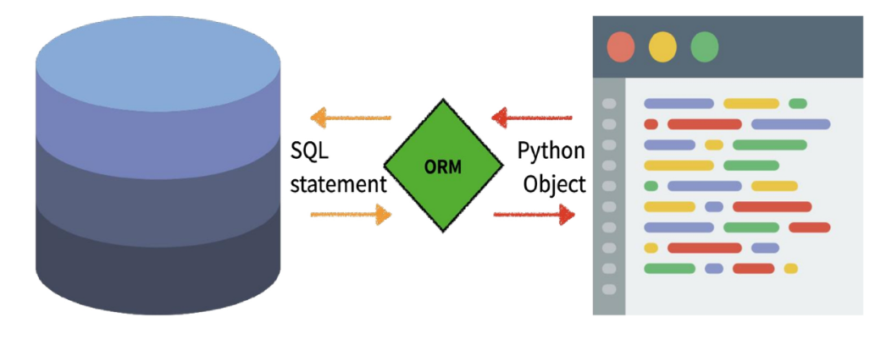

# Django Model

>[강의자료]()


## Model

- Model
  - 단일한 데이터에 대한 정보를 가짐	
    - 사용자가 저장하는 데이터들의 필수적인 필드들과 동작들을 포함
  - 저장된 데이터베이스의 구조(layout)
  - Django는 model을 통해 데이터에 접속하고 관리
  - 일반적으로 각각의 model은 하나의 데이터베이스 테이블에 매핑됨


- Database
  - 데이터베이스(DB)
    - 체계화된 데이터의 모임
  - 쿼리(Query)
    - 데이터를 조회하기 위한 명령어
    - 조건에 맞는 데이터를 추출하거나 조작하는 명령어
    - "Query를 날린다" → DB를 조작한다


- Database의 기본 구조
  - 스키마(Schema)
    - 데이터베이스에서 자료의 구조, 표현 방법, 관계 등을 정의한 구조(structure)
  - 테이블(Table)
    - 열(column): 필드(field) or 속성
    - 행(row): 레코드(record) or 튜플


- Model 정리
  - "웹 애플리케이션의 데이터를 구조화하고 조작하기 위한 도구"


## ORM

- **ORM**
  - Object-Relational-Mapping
  - 객체 지향 프로그래밍 언어를 사용하여 호환되지 않는 유형의 시스템 간에(Django - SQL) 데이터를 변환하는 프로그래밍 기술
  - OOP 프로그래밍에서 RDBMS을 연동할 때, 데이터베이스와 객체 지향 프로그래밍 언어 간의 호환되지 않는 데이터를 변환하는 프로그래밍 기법
  - Django는 내장 Django ORM을 사용함





- **ORM의 장점과 단점**
  - <u>장점</u>
    - SQL을 잘 알지 못해도 DB 조작이 가능
    - SQL 절차적 접근이 아닌 객체 지향적 접근으로 인한 높은 생산성
  - <u>단점</u>
    - ORM만으로 완전한 서비스를 구현하기 어려운 경우가 있음
  - 현대 웹 프레임워크의 요점은 웹 개발의 속도를 높이는 것 (생산성)


- 왜 ORM을 사용할까?

  "우리는 DB를 객체(object)로 조작하기 위해 ORM을 사용한다."


- models.py 작성

  ```python
  class Article(models.Model):
      title = models.CharField(max_length=10)
      content = models.TextField()
  ```

  - 각 모델은 django.models.Model 클래스의 서브 클래스로 표현됨
    - django.db.models 모듈의 Model 클래스를 상속받음
  - models 모듈을 통해 어떠한 타입의 DB 컬럼을 정의할 것인지 정의
    - title과 content는 모델의 필드를 나타냄
    - 각 필드는 클래스 속성으로 지정되어 있으며, 각 속성은 각 데이터베이스의 열에 매핑


- 사용 모델 필드
  - `CharField(max_length=None, **options)`
    - 길이의 제한이 있는 문자열을 넣을 때 사용
    - CharField의 max_length는 필수 인자
    - 필드의 최대 길이(문자), 데이터베이스 레벨과 Django의 유효성 검사(값을 검증하는 것)에서 활용
  - `TextField(**options)`
    - 글자의 수가 많을 때 활용
    - max_length 옵션 작성 시 자동 양식 필드인 textarea 위젯에 반영은 되지만 모델과 데이터베이스 수준에는 적용되지 않음
      - max_length 사용은 CharField에서 사용해야 함


## Migrations

- **Migrations**

  - "Django가 model에 생긴 변화를 반영하는 방법"

  - Migration(이하 마이그레이션) 실행 및 DB 스키마를 다루기 위한 몇 가지 명령어

    - `makemigrations`

    - `migrate`

    - `sqlmigrate`

    - `showmigrations`

      

### Migrations Commands

1. `makemigrations`
   - model을 변경한 것에 기반한 새로운 마이그레이션(like 설계도)을 만들 때 사용

2. `migrate`
   - 마이그레이션을 DB에 반영하기 위해 사용
   - 설계도를 실제 DB에 반영하는 과정
   - model에서의 변경 사항들과 DB의 스키마가 동기화를 이룸
3. `sqlmigrate`
   - 마이그레이션에 대한 SQL 구문을 보기 위해 사용
   - 마이그레이션이 SQL문으로 어떻게 해석되어서 동작할지 미리 확인 할 수 있음
4. `showmigrations`
   - 프로젝트 전체의 마이그레이션 상태를 확인하기 위해 사용
   - 마이그레이션 파일들이 migrate 됐는지 안 됐는지 여부를 확인할 수 있음


### [Practice]

- **makemigrations**

  ```bash
  $ python manage.py makemigrations
  ```

  - 'migrations/0001_initial.py' 생성 확인


- **migrate**

  ```bash
  $ python manage.py migrate
  ```

  - 0001_initial.py 설계도를 실제 DB에 반영


- **실제 DB table 확인**

  - vscode sqlite 확장프로그램을 통해 확인

    

- **sqlmigrate**

  ```bash
  $ python manage.py sqlmigrate app_name 0001
  ```

  - 해당 migrations 설계도가 SQL문으로 어떻게 해석되어서 동작할지 미리 확인할 수 있음

    


- **showmigrations**

  ```bash
  $ python manage.py showmigrations
  ```

  - migrations 설계도들이 migrate됐는지 안됐는지 여부를 확인할 수 있음

    

- **model 수정**

  - 추가 모델 필드 작성 후 makemigrations 진행

    

  - created_at 필드에 대한 default 값 설정 => 1 입력 후 enter

    

  - timezone.now 함수 값 자동 설정 => 빈 값 상태에서 enter 클릭

    => migrate를 통해 models.py 수정사항 반영

    


- **DateField's options**
  - `auto_now_add`
    - 최초 생성 일자
    - Django ORM이 최초 insert(테이블에 데이터 입력)시에만 현재 날짜와 시간으로 갱신 (테이블에 어떤 값을 최초로 넣을 때)
  - `auto_now`
    - 최종 수정 일자
    - Django ORM이 save를 할 때마다 현재 날짜와 시간으로 갱신


- DateTimeField가 아닌 DateField의 options를 확인한 이유

  - DateTimeField는 DateField와 동일한 추가 인자(extra argument)를 사용함

  - DateTimeField는 DateField의 서브 클래스

    


- 반드시 기억해야 할 migration 3단계

  1. `models.py`

     - model 변경사항 발생 시

  2. ```bash
     $ python manage.py makemigrations
     ```

     - migrations 파일 생성

  3. ```bash
     $ python manage.py migrate
     ```

     - DB 반영 (모델과 DB의 동기화)


## Database API

- **DB API**

  - "DB를 조작하기 위한 도구"

  - Django가 기본적으로 ORM을 제공함에 따른 것으로 DB를 편하게 조작할 수 있도록 도움

  - Model을 만들면 Django는 객체들을 만들고 읽고 수정하고 지울 수 있는 database-abstract API를 자동으로 만듦

  - database-abstract API 혹은 database-access API라고도 함

    

  - DB API 구문 - Making Queries

    

    

  

  - `Manager`
    - Django 모델에 데이터베이스 query 작업이 제공되는 인터페이스
    - 기본적으로 모든 Django 모델 클래스에 objects라는 Manager를 추가

  - `QuerySet`
    - 데이터베이스로부터 전달받은 객체 목록
    - queryset 안의 객체는 0개, 1개 혹은 여러 개일 수 있음
    - 데이터베이스로부터 조회, 필터, 정렬 등을 수행할 수 있음


- **Django shell**
  - 일반 Python shell을 통해서는 장고 프로젝트 환경에 접근할 수 없음
  - 그래서 장고 프로젝트 설정이 load된 Python shell을 활용해 DB API 구문 테스트 진행
  - 기본 Django shell보다 더 많은 기능을 제공하는 shell_plus를 사용하여 진행
    - Django-extensions 라이브러리의 기능 중 하나


### [Practice]

- **라이브러리 설치**

  ```bash
  $ pip install ipython
  $ pip install django-extensions
  ```

  - more powerful interactive shell을 위한 2가지 라이브러리 설치


- **라이브러리 등록 및 실행**

  ```python
  # settings.py
  
  INSTALLED_APPS = [
      ...,
      'django-extensions',
      ...,
  ]
  ```

  ```bash
  $ python manage.py shell_plus
  ```

  - 앱 등록 후 shell_plus 실행

  


## CRUD

- CRUD
  - 대부분의 컴퓨터 소프트웨어가 가지는 기본적인 데이터 처리 기능인 Create(생성), Read(읽기), Update(갱신), Delete(삭제)를 묶어서 일컫는 말


- Read

  ```shell
  # DB에 인스턴스 객체를 얻기 위한 쿼리문 날리기
  # 이때, 레코드가 하나만 있으면 인스턴스 객체로, 두 개 이상이면 쿼리셋으로 리턴
  >>> Article.objects.all()
  <QuerySet []>
  ```

  - 전체 article 객체 조회


### Create


- 방법 1. 인스턴스 생성 후 인스턴스 변수 설정

  ```python
  # 특정 테이블에 새로운 행을 추가하여 데이터 추가
  >>> article = Article()	# Article(class)로부터 article(instance)
  >>> article
  <Article: Article object (None)>
      
  >>> article.title = 'first' # 인스턴스 변수(title)에 값을 할당
  >>> article.content = 'django!'	# 인스턴스 변수(content)에 값을 할당
  
  # save를 하지 않으면 아직 DB에 값이 저장되지 않음
  >>> article
  <Article: Article object (None)>
      
  >>> Article.objects.all()
  <QuerySet []>
  
  # save를 하고 확인하면 저장된 값을 확인할 수 있다
  >>> article.save()
  >>> article
  <Article: Article object (1)>
  >>> Article.objects.all()
  <QuerySet [Article: Article object (1)]>
  
  # 인스턴스와 article을 활용하여 변수에 접근해보자(저장된걸 확인)
  >>> article.title
  'first'
  >>> article.content
  'django!'
  >>> article.created_at
  datetime.datetime(2022, 3, 20, ...)
  ```


- 방법 2. 초기값과 함께 인스턴스 생성

  ```python
  >>> article = Article(title='secone', content='django!!')
  
  # 아직 저장이 안 되어 있음
  >>> article
  <Article: Article object (None)>
      
  # save를 해주면 저장이 됨
  >>> article.save()
  >>> article
  <Article: Article object (2)>
  >>> Article.objects.all()
  <QuerySet [<Article: Article object (1)>, <Article: Article object (2)>]>
  
  # 값 확인
  >>> article.pk
  2
  >>> article.title
  'second'
  >>> article.content
  'django!!'
  ```


- 방법 3. QuerySet API - create() 사용

  ```python
  # 위의 2개의 방식과는 다르게 바로 쿼리 표현식 리턴
  >>> Article.objects.create(title='third', content='django!!!')
  <Article: Article object (3)>
  ```


- 테이블 확인

  - 실제로 저장이 되었는지 여부를 확인

    


- CREATE 관련 메서드
  - `save()` method
    - Saving objects
    - 객체를 데이터베이스에 저장함
    - 데이터 생성 시 save()를 호출하기 전에는 객체의 ID값이 무엇인지 알 수 없음
      - ID값은 Django가 아니라 DB에서 계산되기 때문
    - 단순히 모델을 인스턴스화 하는 것은 DB에 영향을 미치지 않기 때문에 반드시 save()가 필요


- `str` method

  ```python
  class Article(models.Model):
      title = models,CharField(max_length=10)
      content = models.TextField()
      created_at = models.DateTimeField(auto_now_add=True)
      updated_at = models.DateTimeField(auto_now=True)
      
      def __str__(self):
          return self.title
  ```

  - 표준 파이썬 클래스의 메소드인 `str()`을 정의하여 각각의 object가 사람이 읽을 수 있는 문자열을 반환(return)하도록 할 수 있음
  - 작성 후 반드시 shell_plus를 재시작해야 반영됨


### Read

- QuerySet API method를 사용해 다양한 조회를 하는 것이 중요
- QuerySet API method는 크게 2가지로 분류
  1. Methods that <u>return new querysets</u>
  2. Methods that <u>do not return querysets</u>


- `all()`

  - 현재 QuerySet의 복사본을 반환

    ```python
    >>> Article.objects.all()
    <QuerySet [<Article: Article object (1)>, <Article: Article object (2)>, <Article: Article object (3)>]>
    ```

    

- `get()`

  - 주어진 lookup 매개변수와 일치하는 객체를 반환

  - 객체를 찾을 수 없으면 DoesNotExist 예외를 발생시키고, 둘 이상의 객체를 찾으면 MultipleObjectsReturnes 예외를 발생시킴

  - 위와 같은 특징을 가지고 있기 때문에 primary key와 같이 고유(unique)성을 보장하는 조회에서 사용해야 함

    ```python
    >>> article = Article.objects.get(pk=100)
    DoesNotExist: Article matching query does not exist.
        
    >>> Article.objects.get(content='django!')
    MultipleObjectsReturned: get() returned more than one Article -- it returned 2!
    ```

    

- `filter()`

  - 주어진 lookup 매개변수와 일치하는 객체를 포함하는 새 QuerySet을 반환

    ```python
    >>> Article.objects.filter(content='django!')
    <QuerySet [<Article: first>, <Article: third>]>
    
    >>> Article.objects.filter(title='first')
    <QuerySet [<Article: first>]>
    ```

    


### Update

- Update

  - article 인스턴스 객체의 인스턴스 변수의 값을 변경 후 저장

    ```python
    # UPDATE articles SET title='byebye' WHERE id=1;
    >>> article = Article.objects.get(pk=1)
    >>> article.title
    'first'
    
    # 값을 변경하고 저장
    >>> article.title = 'byebye'
    >>> article.save()
    
    # 정상적으로 변경된 것을 확인
    >>> article.title
    'byebye'
    ```

    

### Delete

- `delete()`

  - QuerySet의 모든 행에 대해 SQL 삭제 쿼리를 수행하고, 삭제된 객체 수와 객체 유형당 삭제 수가 포함된 딕셔너리를 반환

    ```python
    >>> article = Article.objects.get(pk=1)
    
    # 삭제
    >>> article.delete()
    (1, {'articles.Article': 1})
    
    # 1번은 이제 찾을 수 없음
    >>> Articles.objects.get(pk=1)
    DoesNotExist: Article matching query does not exist.
    ```

    

- Field lookups
  - 조회 시 특정 검색 조건을 지정
  - QuerySet 메서드 `filter()`, `exclude()` 및 `get()`에 대한 키워드 인수로 지정됨
  - 사용 예시
    - `Article.objects.filter(pk__gt=2)`
    - `Article.objects.filter(content__contains=='ja')`


- QuerySet API
  - 데이터베이스 조작을 위한 다양한 QuerySet API methods는 해당 공식문서를 반드시 참고하여 학습할 것
  - https://docs.Djangoproject.com/en/3.2/ref/models/querysets/#queryset-api-reference


## Admin Site

- Automatic admin interface
  - 사용자가 아닌 서버의 관리자가 활용하기 위한 페이지
  - Model class를 admin.py에 등록하고 관리
  - django.contrib.auth 모듈에서 제공됨
  - record 생성 여부 확인에 매우 유용하며, 직접 record를 삽입할 수도 있음


- admin 생성

  ```bash
  $ python manage.py createsuperuser
  ```

  - 관리자 계정 생성 후 서버를 실행한 다음 '/admin'으로 가서 관리자 페이지 로그인
    - 계정만 만든 경우 Django 관리자 화면에서 아무 것도 보이지 않음 
  - 내가 만든 Model을 보기 위해서는 admin.py에 작성하여 Django 서버에 등록
  - [주의] auth에 관련된 기본 테이블이 생성되지 않으면 관리자 계정을 생성할 수 없음


- admin 등록

  ```python
  # articles/admin.py
  
  from django.contrib import admin
  from .models import Article
  
  # admin site에 register하겠다.
  admin.site.register(Article)
  ```

  - admin.py는 관리자 사이트에 Article 객체가 관리자 인터페이스를 가지고 있다는 것을 알려주는 것
  - models.py에 정의한 __ str __의 형태로 객체가 표현됨


- ModelAdmin options

  ```python
  # articles/admin.py
  
  from django.contrib import admin
  from .models import Article
  
  class ArticleAdmin(admin.ModelAdmin):
      list_display = ('pk', 'title', 'content', 'created_at', 'updated_at',)
      
  admin.site.register(Article, Articleadmin)
  ```

  - `list_display`
    - models.py 정의한 각각의 속성(컬럼)들의 값(레코드)을 admin 페이지에 출력하도록 설정
  - list_filter, list_display_links 등 다양한 ModelAdmin options 참고
  - https://docs.Djangoproject.com/en/3.2/ref/contrib/admin/#modeladmin-options


## CRUD with views

