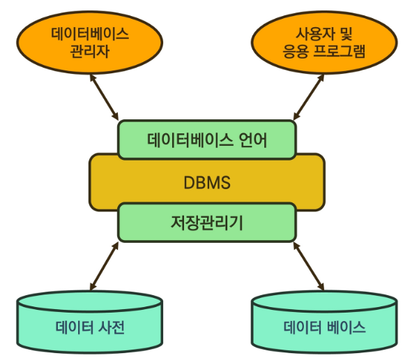
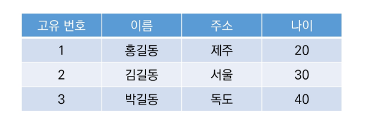
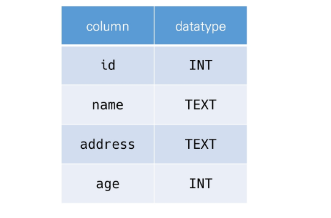
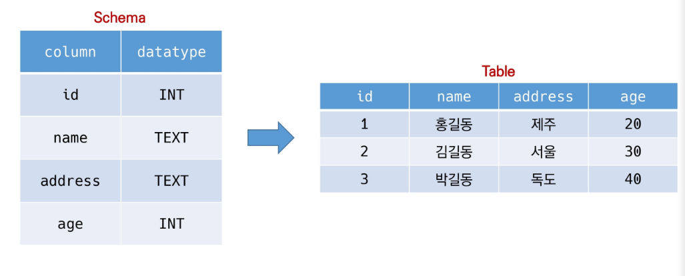
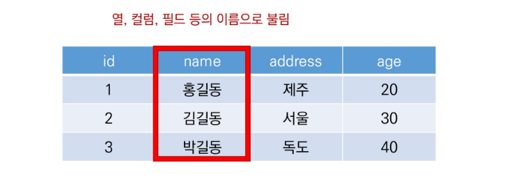
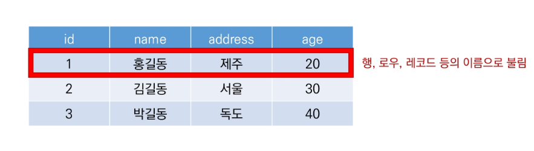
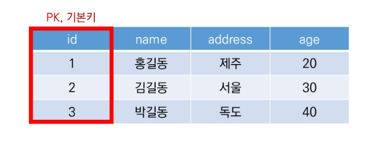
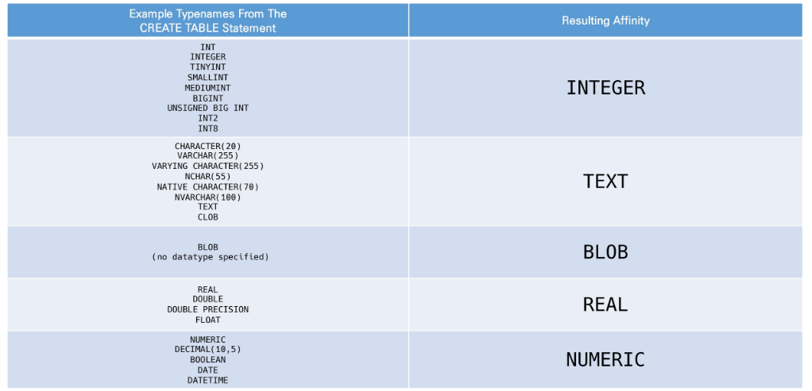

# DB 01

> [강의자료](https://edu.ssafy.com/data/upload_files/crossUpload/openLrn/ebook/unzip/A2022031411335256400/index.html)  2022-03-14


## Database

- **데이터베이스 (DB)**
  - 데이터베이스는 <u>체계화된 데이터</u>의 모임
  - 여러 사람이 공유하고 사용할 목적으로 통합 관리되는 정보의 집합
  - 논리적으로 연관된 (하나 이상의) 자료의 모음으로 그 내용을 고도로 구조화함으로써 검색과 갱신의 효율화를 꾀한 것
  - 즉, <u>몇 개의 자료 파일을 조직적으로 통합</u>하여 <u>자료 항목의 중복을 없애고</u> <u>자료를 구조화하여 기억</u>시켜 놓은 <u>자료의 집합체</u>


- **데이터베이스로 얻는 장점들**

  - 데이터 중복 최소화
  - 데이터 무결성 (정확한 정보를 보장)
  - 데이터 일관성
  - 데이터 독립성 (물리적 / 논리적)
  - 데이터 표준화
  - 데이터 보안 유지

  


## RDB

- **관계형 데이터베이스 (RDB)**

  - Relational Database

  - 키(key)와 값(value)들의 간단한 관계(relation)를 표(table) 형태로 정리한 데이터베이스

  - 관계형 모델에 기반

    

- 관계형 데이터베이스 용어 정리

  - `스키마 schema` : 데이터베이스에서 자료의 구조, 표현 방법, 관계 등 전반적인 명세를 기술한 것

    

  - `테이블 table` : 열(컬럼/필드)과 행(레코드/값)의 모델을 사용해 조직된 데이터 요소들의 집합

    

  - `열 column` : 각 열에는 고유한 데이터 형식이 지정됨

    - 아래의 예시에서는 name이란 필드에 고객의 이름(TEXT) 정보가 저장됨

    

  - `행 row` : 실제 데이터가 저장되는 형태

    - 아래의 예시에서는 총 3명의 고객정보가 저장되어 있음 (레코드가 3개)

    

  - `기본 키 Primary Key` : 각 행(레코드)의 고유 값

    - 반드시 설정해야 하며, 데이터베이스 관리 및 관계 설정 시 주요하게 활용됨

    


## RDBMS

- **관계형 데이터베이스 관리 시스템 (RDBMS)**

  - Relational Database Management System

  - 관계형 모델을 기반으로 하는 데이터베이스 관리 시스템을 의미
  - ex. MySQL, SQLite, PostgreSQL, ORACLE, MS SQL


- **SQLite**
  - 서버 형태가 아닌 파일 형식으로 응용 프로그램에 넣어서 사용하는 비교적 가벼운 데이터베이스
  - 구글 안드로이드 운영체제에 기본적으로 탑재된 데이터베이스이며, 임베디드 소프트웨어에도 많이 활용됨
  - 로컬에서 간단한 DB 구성을 할 수 있으며, 오픈소스 프로젝트이기 때문에 자유롭게 사용 가능


- **Sqlite Data Type**
  1. NULL
  2. INTEGER
     - 크기에 따라 0, 1, 2, 3, 4, 6 또는 8바이트에 저장된 부호 있는 정수
  3. REAL
     - 8바이트 부동 소수점 숫자로 저장된 부동 소수점 값
  4. TEXT
  5. BLOB


- Sqlite Type Affinity

  - Type Affinity
    - 특정 컬럼에 저장하도록 권장하는 데이터 타입

  1. INTEGER
  2. TEXT
  3. BLOB
  4. REAL
  5. NUMERIC

  


## SQL

- SQL (Structured Query Language_
  - 관계형 데이터베이스 관리시스템의 <u>데이터 관리</u>를 위해 설계된 <u>특수 목적 프로그래밍 언어</u>


- SQL 분류
  - DDL - 데이터 정의 언어 (Data Definition Language)
    - 관계형 데이터베이스 구조(테이블, 스키마)를 정의하기 위한 명령어
    - `CREATE`, `DROP`, `ALTER`
  - DML - 데이터 조작 언어 (Data Manipulation Language)
    - 데이터를 저장, 조회, 수정, 삭제 등을 하기 위한 명령어
      - `INSERT`, `SELECT`, UPDATE, DELETE


- SQL Keywords - Data Manipulation Language
  - `INSERT` : 새로운 데이터 삽입(추가)
  - `SELECT` : 저장


## 테이블 생성 및 삭제


### INSERT

- INSERT는 특정 테이블에 레코드(행)을 삽입

```sqlite
INSERT INTO 테이블이름 (컬럼1, 컬럼2, ...) VALUES (값1, 값2, ...);
```


