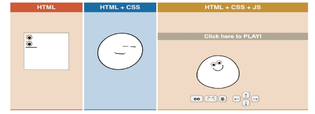
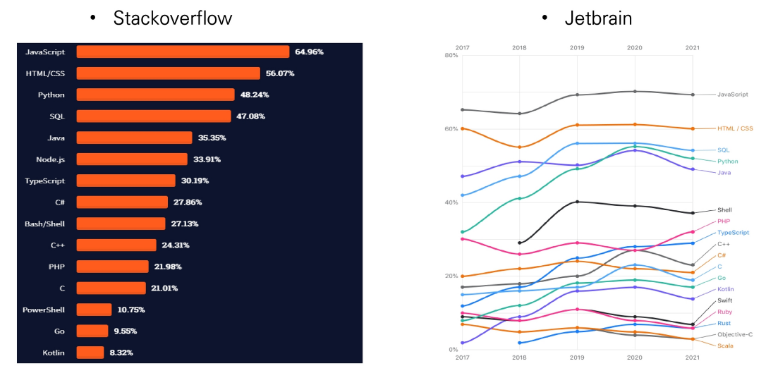
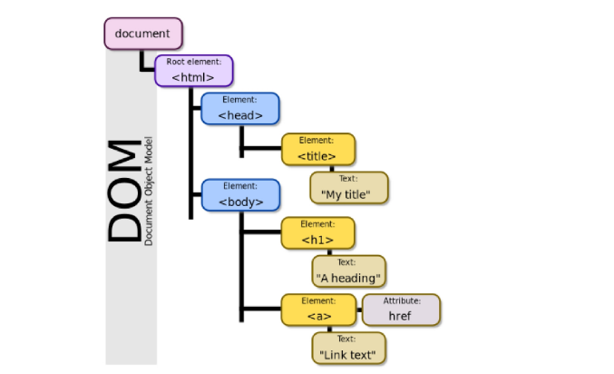
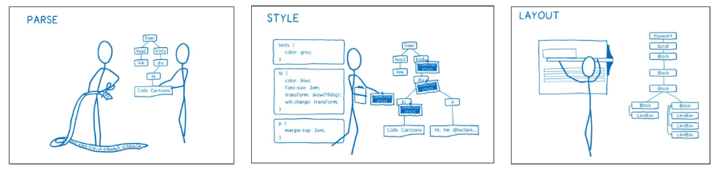
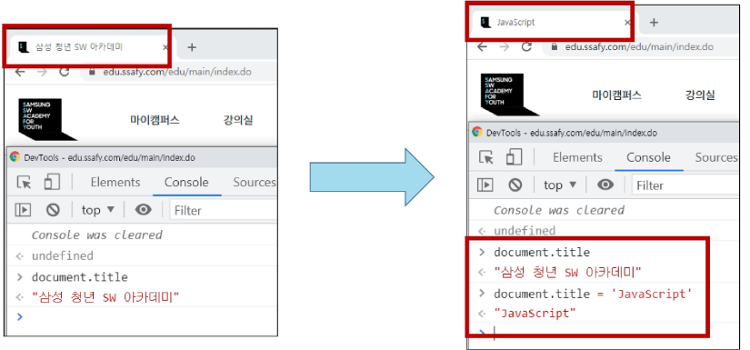
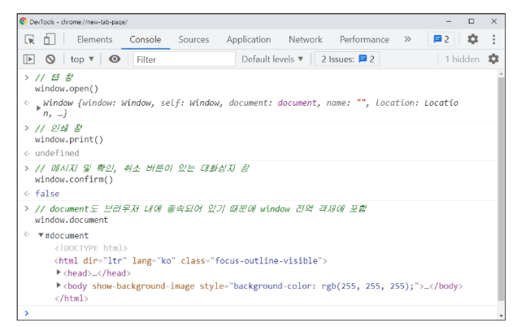
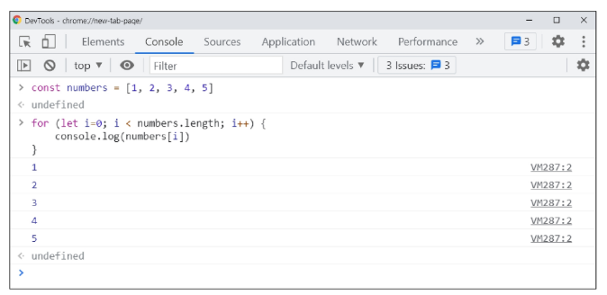
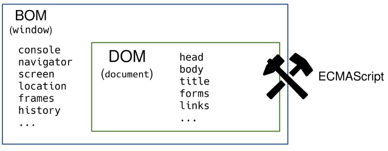
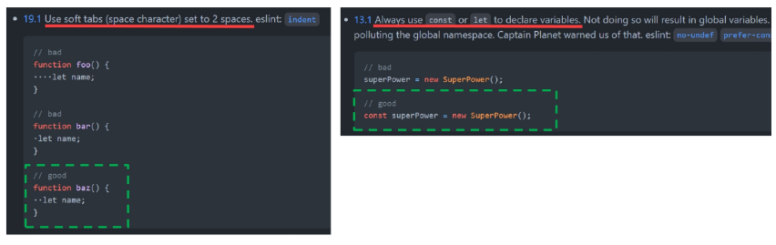
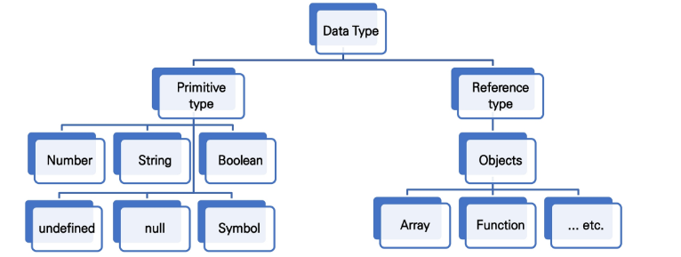

# JavaScript 기초

> [강의자료](https://edu.ssafy.com/data/upload_files/crossUpload/openLrn/ebook/unzip/A2022042217072253500/index.html)  2022-04-25


## JavaScript Intro

- **동작 방식**

  

- **브라우저 (browser)**
  - URL로 웹(WWW)을 탐색하며 서버와 통신하고, HTML 문서나 파일을 출력하는 GUI 기반의 소프트웨어
  - 인터넷의 컨텐츠를 검색 및 열람하도록 함
  - "웹 브라우저"라고도 함
  - 주요 브라우저
    - Google Chrome, Mozilla Firefox, Microsoft Edge, Opera, Safari


- **JavaScript의 필요성**

  - 브라우저 화면을 '동적'으로 만들기 위함

  - 브라우저를 조작할 수 있는 유일한 언어

    


- **Most Popular Programming Language in 2021 survey**

  


## Browser

- **브라우저에서 할 수 있는 일**
  - DOM(Document Object Model) 조작
    - 문서(HTML) 조작
  - BOM(Browser Object Model) 조작
    - navigator, screen, location, frames, history, XHR
  - JavaScript Core (ECMAScript)
    - Data Structure(Object, Array), Conditional Expression, Iteration


- **DOM이란?**

  > 문서(HTML)을 프로그램으로 조작

  - HTML, XML과 같은 문서를 다루기 위한 프로그래밍 인터페이스
  - 문서를 구조화하고, 구조화된 구성 요소를 하나의 객체로 취급하여 다루는 논리적 트리 모델
  - 문서가 객체(object)로 구조화되어 있으며 key로 접근 가능
  - 단순한 속성 접근, 메서드 활용 뿐만 아니라 프로그래밍 언어적 특성을 활용한 조작 가능
  - 주요 객체
    - `window`: DOM을 표현하는 창(브라우저 탭). 최상위 객체 (작성 시 생략 가능)
    - `document`: 페이지 컨텐츠의 Entry Point 역할을 하며, <head>, <body> 등과 같은 수많은 다른 요소들을 포함
    - `navigator`, `location`, `history`, `screen`

  

- **DOM - 해석**

  - 파싱 (Parsing)

    - 구문 분석, 해석
    - 브라우저가 문자열을 해석하여 DOM Tree로 만드는 과정

    


- **DOM - 조작**

  


- **BOM이란?**
  - Browser Object Model
  - 자바스크립트가 브라우저와 소통하기 위한 모델
  - 브라우저의 창이나 프레임을 추상화해서 프로그래밍적으로 제어할 수 있도록 제공하는 수단
    - 버튼, URL 입력창, 타이틀 바 등 브라우저 윈도우 및 웹 페이지 일부분을 제어 가능
    - window 객체는 모든 브라우저로부터 지원받으며 브라우저의 창(window)를 지칭


- **BOM - 조작**

  


- **JavaScript Core**

  - 브라우저(BOM & DOM)을 조작하기 위한 명령어 약속(언어)

    


- **정리**

  - 브라우저(BOM)과 그 내부의 문서(DOM)를 조작하기 위해 ECMAScript(JS)를 학습

    


## ECMAScript

- **ECMA**
  - ECMA (ECMA International)
    - 정보 통신에 대한 <u>표준을 제정하는 비영리 표준화 기구</u>
  - ECMAScript는 ECMA에서 [ECMA-262](https://www.ecma-international.org/publications-and-standards/standards/ecma-262/) 규격에 따라 정의한 언어
    - ECMA-262: 범용적인 목적의 프로그래밍 언어에 대한 명세
  - <u>ECMAScript6는 ECMA에서 제안하는 6번째 표준 명세를 말함</u>
    - (참고) ECMAScript6의 발표 연도에 따라 ECMAScript2015라고도 불림


## 세미콜론

- **세미콜론 (semicolon)**
  - 자바스크립트는 <u>세미콜론을 선택적으로 사용 가능</u>
  - 세미콜론이 없으면 <u>ASI</u>에 의해 자동으로 세미콜론이 삽입됨
    - ASI: 자동 세미콜론 삽입 규칙 (Automatic Semicolon Insertion)
  - 본 수업에서는 <u>자바스크립트의 문법 및 개념적 측면에 집중하기 위해 세미콜론을 사용하지 않고 진행</u>


- **세미콜론 (semicolon) 예시**

  - 선택적으로 사용 가능

  ```javascript
  // 세미콜론이 있는 경우
  const greeting = 'Hello, world!';
  console.log(greeting);
  
  // 세미콜론이 없는 경우
  const greeting = 'Hello, world!'
  console.log(greeting)
  ```


## 코딩 스타일 가이드

- **코딩 스타일 가이드**
  - 코딩 스타일의 핵심은 <u>합의된 원칙과 일관성</u>
    - 절대적인 하나의 정답은 없으며, 상황에 맞게 원칙을 정하고 일관성 있게 사용하는 것이 중요
  - 코딩 스타일은 <u>코드의 품질에 직결되는 중요한 요소</u>
    - 코드의 가독성, 유지보수 또는 팀원과의 커뮤니케이션 등 <u>개발 과정 전체에 영향을 끼침</u>
  - (참고) 다양한 자바스크립트 코딩 스타일 가이드
    - [Airbnb Javascript Style Guide](https://github.com/airbnb/javascript)
    - [Google Javascript Style Guide](https://google.github.io/styleguide/jsguide.html)
    - [standardjs](https://standardjs.com/)


- 코딩 스타일 가이드 예시

  - 본 수업에서는 [Airbnb Style Guide](https://github.com/airbnb/javascript)를 중심으로 진행할 예정

    - 단, 가이드의 일부 항목은 <u>문법 및 개념적 측면에 집중하기 위해 변형해서 사용</u>

    


## 변수와 식별자

- **식별자 정의와 특징**
  - 식별자(identifier)는 변수를 구분할 수 있는 변수명을 말함
  - 식별자는 반드시 문자, 달러($) 또는 밑줄(_)로 시작
  - 대소문자를 구분하며, 클래스명 외에는 모두 소문자로 시작
  - 예약어 사용 불가능
    - 예약어 예시: `for`, `if`, `function` 등


- **식별자 작성 스타일**

  - `카멜 케이스 (camelCase, lower-camel-case)`

    - 변수, 객체, 함수에 사용
    - 두 번째 단어의 첫 글자부터 대문자

    ```javascript
    // 변수
    let dog
    let variableName
    
    // 객체
    const userInfo = { name: 'Tom', age: 20 }
    
    // 함수
    function add() {}
    function getName() {}
    ```

    

  - `파스칼 케이스 (PascalCase, upper-camel-case)`

    - 클래스, 생성자에 사용
    - 모든 단어의 첫 번째 글자를 대문자로 작성

    ```javascript
    // 클래스
    class User {
        constructor(options) {
            this.name = options.name
        }
    }
    
    // 생성자 함수
    function User(options) {
        this.name = options.name
    }
    ```

    

  - `대문자 스네이크 케이스 (SNAKE_CASE)`

    - 상수(constants)에 사용	

      \- 상수의 정의: 개발자의 의도와 상관없이 <u>변경될 가능성이 없는 값을 의미</u>

    - 모든 단어 대문자 작성 & 단어 사이에 언더스코어 삽입

    ```javascript
    // 값이 바뀌지 않을 상수
    const API_KEY = 'my-key'
    const PI = Math.PI
    
    // 재할당이 일어나지 않는 변수
    const numbers = [1, 2, 3]
    ```

    

- **변수 선언 키워드**
  - `let`
    - <u>재할당 할 예정</u>인 변수 선언 시 사용
    - 변수 재선언 불가능
    - 블록 스코프
  - `const`
    - <u>재할당 할 예정이 없는</u> 변수 선언 시 사용
    - 변수 재선언 불가능
    - 블록 스코프


- **[참고] 선언, 할당, 초기화**

  ```javascript
  let foo 			// 선언
  console.log(foo)	// undefined
  
  foo = 11			// 할당
  console.log(foo)	// 11
  
  let bar = 0			// 선언 + 할당
  console.log(bar) 	// 0
  ```

  - 선언 (Declaration)
    - <u>변수를 생성</u>하는 행위 또는 시점
  - 할당 (Assignment)
    - <u>선언된 변수에 값을 저장</u>하는 행위 또는 시점
  - 초기화 (Initialization)
    - <u>선언된 변수에 처음으로 값을 저장</u>하는 행위 또는 시점


- **변수 선언 키워드 (let, const) 예시 - 재할당**

  - let (재할당 가능)

    ```javascript
    let number = 10		// 1. 선언 및 초기값 할당
    number = 10			// 2. 재할당
    
    console.log(number)	// 10
    ```

  - const (재할당 불가능)

    ```javascript
    const number = 10	// 1. 선언 및 초기값 할당
    number = 10			// 재할당 불가능
    
    => Uncaught TypeError
    	:Assignment to constant variable
    ```

    

- **변수 선언 키워드 (let, const) 예시 - 재선언**

  - let (재선언 불가능)

    ```javascript
    let number = 10 	// 1. 선언 및 초기값 할당
    let number = 50		// 2. 재선언 불가능
    
    => Uncaught SyntaxError
    	: Identifier 'number' has already been declared
    ```

  - const (재선언 불가능)

    ```javascript
    const number = 10 	// 1. 선언 및 초기값 할당
    const number = 50	// 2. 재선언 불가능
    
    => Uncaught SyntaxError
    	: Identifier 'number' has already been declared    


- **블록 스코프 (block scope)**

  

  - if, for, 함수 등의 중괄호 내부를 가리킴
  - 블록 스코프를 가지는 변수는 블록 바깥에서 접근 불가능


- **변수 선언 키워드 - `var`**

  - `var`

    - <u>var로 선언한 변수는 재선언 및 재할당 모두 가능</u>

    - <u>ES6 이전</u>에 변수를 선언할 때 사용되던 키워드

    - <u>호이스팅되는 특성</u>으로 인해 예기치 못한 문제 발생 가능

      \- 따라서 <u>ES6 이후부터는</u> var 대신 <u>const와 let을 사용하는 것을 권장</u>

    - 함수 스코프


- **`var` - 재선언 및 재할당 모두 가능**

  ```javascript
  var number = 10 // 1. 선언 및 초기값 할당
  var number = 50 // 2. 재할당
  
  console.log(number) // 50
  ```

  

- **함수 스코프 (function scope)**
  - <u>함수의 중괄호 내부</u>를 가리킴
  - 함수 스코프를 가지는 변수는 <u>함수 바깥에서 접근 불가능</u>


- **호이스팅 (hoisting)**

  - 변수를 선언 이전에 참조할 수 있는 현상
  - 변수 선언 이전의 위치에서 접근 시 undefined를 반환

  ```javascript
  console.log(username)	// undefined
  var username = '홍길동'
  
  console.log(email)		// Uncaught ReferenceError
  let email = 'gildong@gmail.com'
  
  console.log(age)		// Uncaught ReferenceError
  const age = 50
  ```

  

- **변수와 식별자 Quiz**

  - Q1. 자바스크립트 변수 선언 시 사용 가능한 키워드는 const와 let 뿐이다.   => `F`

    `A1. 자바스크립트 변수 선언 시 사용 가능한 키워드는 const, let 그리고 var이다.`

  - Q2. const 키워드로 선언한 변수는 재할당이 가능하다 => `F`

    `A2. const 키워드로 선언한 변수는 재할당이 불가능하다.`

  - Q3. let 키워드로 선언한 변수는 재할당이 가능하다.  => `T`


- **let, const, var 비교**

  | 키워드 | 재선언 | 재할당 |   스코프    |     비고     |
  | :----: | :----: | :----: | :---------: | :----------: |
  |  let   |   X    |   O    | 블록 스코프 | ES6부터 도입 |
  | const  |   X    |   X    | 블록 스코프 | ES6부터 도입 |
  |  var   |   O    |   O    | 함수 스코프 |    사용 X    |

  

## 데이터 타입

- **데이터 타입 종류**

  - 자바스크립트의 모든 값은 특정한 데이터 타입을 가짐

  - 크게 원시 타입(Primitive type)과 참조 타입(Reference type)으로 분류됨

    


- (참고) 원시 타입과 참조 타입 비교

  - `원시 타입 (Primitive type)`

    - <u>객체(object)가 아닌</u> 기본 타입
    - 변수에 <u>해당 타입의 값이 담김</u>
    - 다른 변수에 복사할 때 <u>실제 값이 복사됨</u>

    ```javascript
    let message = '안녕하세요!'	 // 1. message 선언 및 할당
    
    let greeting = message	   	// 2. greeting에 message 복사
    console.log(greeting)		// 3. '안녕하세요!' 출력
    
    message = 'Hello, world!'	// 4. message 재할당
    console.log(greeting)		// 5. '안녕하세요!' 출력
    
    // => 즉, 원시 타입은 실제 해당 타입의 값을 변수에 저장한다.
    ```

  

  - `참조 타입 (Reference type)`

    - <u>객체(object) 타입</u>의 자료형
    - 변수에 해당 <u>객체의 참조 값</u>이 담김
    - 다른 변수에 복사할 때 <u>참조 값이 복사</u>됨

    ```javascript
    const message = ['안녕하세요!']	 // 1. message 선언 및 할당
    
    const greeting = message		// 2. greeting에 message 복사	
    console.log(greeting)			// 3. ['안녕하세요!'] 출력
    	
    message[0] = 'Hello, world!'	// 4. message 재할당
    console.log(greeting)			// 5. ['Hello, world!'] 출력
    
    // => 즉, 참조 타입은 해당 객체를 참조할 수 있는 참조 값을 저장한다.
    ```

    


### - 원시 타입

- **숫자(Number) 타입**

  - 정수, 실수 구분 없는 하나의 숫자 타입

  - 부동소수점 형식을 따름

  - (참고) Nan (Not-A-Number)

    \- 계산 불가능한 경우 반환되는 값   ex. 'Angel' / 1004 => NaN

  ```javascript
  const a = 13		// 양의 정수
  const b = -5		// 음의 정수
  const c = 3.14		// 실수
  const d = 2.998e8	// 거듭제곱
  const e = Infinity	// 양의 무한대
  const f = -Infinity	// 음의 무한대
  const g = NaN		// 산술 연산 불가
  ```

  

- **문자열(String) 타입**

  - 텍스트 데이터를 나타내는 타입
  - 16비트 유니코드 문자의 집합
  - 작은따옴표 또는 큰따옴표 모두 가능
  - 템플릿 리터럴 (Template Literal)
    - ES6부터 지원
    - 따옴표 대신 backtick(\` \`)으로 표현
    - ${expression} 형태로 표현식 삽입 가능

  ```javascript
  const firstName = 'Brandan'
  const lastName = 'Eich'
  const fullName = '${firstname} ${lastname}'
  
  console.log(fullName) // Brandan Eich
  ```

  

- **undefined**

  - 변수의 <u>값이 없음</u>을 나타내는 데이터 타입
  - 변수 선언 이후 <u>직접 값을 할당하지 않으면, 자동으로 undefined가 할당됨</u>

  ```javascript
  let firstName
  console.log(firstName) // undefined
  ```

  

- **null**

  - 변수의 <u>값이 없음</u>을 <u>의도적으로 표현</u>할 때 사용하는 데이터 타입
  - (참고) null 타입과 typeof 연산자
    - typeof 연산자: 자료형 평가를 위한 연산자
    - null 타입은 ECMA 명세의 원시 타입의 정의에 따라 원시 타입에 속하지만, typeof 연산자의 결과는 객체(object)로 표현됨

  ```javascript
  let firstName = null
  console.log(firstName) // null
  
  typeof null // object
  ```

  


- **(참고) undefined 타입과 null 타입 비교**

  - `undefined`

    - 빈 값을 표현하기 위한 데이터 타입

    - 변수 선언 시 아무 값도 할당하지 않으면, 자바스크립트가 자동으로 할당

    - typeof 연산자의 결과는 undefined

      ```javascript
      typeof undefined // undefined
      ```

      

  - `null`

    - 빈 값을 표현하기 위한 데이터 타입

    - 개발자가 의도적으로 필요한 경우 할당

    - typeof 연산자의 결과는 object

      ```javascript
      typeof null // object
      ```

      

- **Boolean 타입**

  - 논리적 참 거짓을 나타내는 타입
  - true 또는 false로 표현
  - 조건문 또는 반복문에서 유용하게 사용
    - (참고) 조건문 또는 반복문에서 boolean이 아닌 데이터 타입은 자동 형변환 규칙에 따라 true 또는 false로 변환됨

  ```javascript
  let isAdmin = true
  console.log(isAdmin) // true
  
  isAdmin = false
  console.log(isAdmin) // false
  ```

  

- **(참고) ToBoolean Conversions (자동 형변환) 정리**

  | 데이터 타입 |    거짓    |        참        |
  | :---------: | :--------: | :--------------: |
  | `Undefined` | 항상 거짓  |        X         |
  |   `Null`    | 항상 거짓  |        X         |
  |  `Number`   | 0, -0, NaN | 나머지 모든 경우 |
  |  `String`   | 빈 문자열  | 나머지 모든 경우 |
  |  `Object`   |     X      |     항상 참      |

  - 조건문 또는 반복문에서 표현식의 결과가 참/거짓으로 판별되는 경우 발생


---

- **참조 타입**
  - 함수 (Functions)
  - 배열 (Arrays)
  - 객체 (Objects)


## 연산자

- 할당 연산자
  - 오른쪽에 있는 피연산자의 평가 결과를 왼쪽 피연산자에 할당하는 연산자
  - 다양한 연산에 대한 단축 연산자 지원
  - (참고) Increment 및 Decrement 연산자
    - Increment(++): 피연산자의 값을 1 증가시키는 연산자
    - Decrement(--): 피연산자의 값을 1 감소시키는 연산자
    - Airbnb Style Guide에서는 '+=' 또는 '-='와 같이 더 분명한 표현으로 적을 것을 권장


## 반복문

