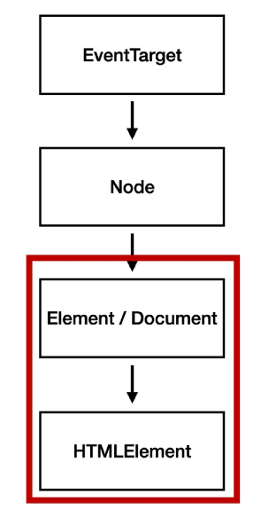

# DOM 조작과 Event

> [강의자료](https://edu.ssafy.com/data/upload_files/crossUpload/openLrn/ebook/unzip/A2022042217082448400/index.html)  2022-04-27

## History of JavaScript

- **핵심 인물**
  - 팀 버너스리 (Tim Berners-Lee)
    - WWW, URL, HTTP, HTML 최초 설계자
    - 웹의 아버지
  - 브랜던 아이크 (Brandan Eich)
    - JavaScript 최초 설계자
    - 모질라 재단 공동 설립자
    - 코드네임 피닉스 프로젝트 진행 (파이어폭스의 전신)

- **JavaScript의 탄생**
  - 1994년 당시 넷스케이프 커뮤니케이션스사의 Netscape Navigator(NN) 브라우저가 전 세계 점유율을 80% 이상 독점하며 브라우저의 표준 역할을 함
  - 당시 넷스케이프에 재직 중이던 브랜던 아이크가 HTML을 동적으로 동작하기 위한 회사 내부 프로젝트를 진행 중 JS를 개발
  - JavaScript 이름 변천사
    - Mocha -> LiveScript -> JavaScript (1995)
  - 그러나 1995년 경쟁사 마이크로소프트에서 이를 채택하여 커스터마이징한 JScript를 만듦
  - 이를, IE 1.0에 탑재 -> 1차 브라우저 전쟁의 시작

- **제 1차 브라우저 전쟁**

  - 넷스케이프 vs 마이크로소프트 (이하 MS)
  - 빌 게이츠 주도하에 MS는 1997년 IE 4를 발표하면서 시장을 장악하기 시작
    - 당시 윈도우 OS의 시장 점유율은 90%
    - 글로벌 기업 MS의 공격적인 마케팅
  - MS의 승리로 끝나며 2001년부터 IE의 점유율은 90%를 상회
  - 1998년 넷스케이프에서 나온 브랜던 아이크 외 후계자들은 모질라 재단을 설립
    - 파이어폭스를 통해 IE에 대항하며 꾸준히 점유율을 올려 나감
  - MS의 폭발적 성장, IE3에서 자체적인 JScript를 지원, 호환성 문제로 크로스 브라우징 등의 이슈 발생
  - 이후 넷스케이프 후계자들은 모질라 재단 기반의 파이어폭스를 개발

  

- **제 2차 브라우저 전쟁**
  - MS vs Google
  - 2008년 Google의 Chrome(이하 크롬) 브라우저 발표
  - 2011년 3년 만에 파이어폭스의 점유율을 돌파 후 2012년부터 전 세계 점유율 1위 등록
  - 크롬의 승리 요인
    - 압도적인 속도
    - 강력한 개발자 도구 제공
    - 웹 표준

- **파편화와 표준화**
  - 제 1차 브라우저 전쟁 이후 수많은 브라우저에서 자체 자바스크립트 언어를 사용하게 됨
  - 결국 서로 다른 자바스크립트가 만들어지면서 크로스 브라우징 이슈가 발생하여 웹 표준의 필요성이 제기
  - 크로스 브라우징 (Cross Browsing)
    - W3C에서 채택된 표준 웹 기술을 채용하여 각각의 브라우저마다 다르게 구현되는 기술을 비슷하게 만들되, 어느 한쪽에 치우치지 않도록 웹 페이지를 제작하는 방법론 (동일성이 아닌 동등성)
    - 브라우저마다 렌더링에 사용하는 엔진이 다르기 때문
  - 1996년부터 넷스케이프는 표준 제정의 필요성을 주장
    - ECMA 인터내셔널(정보와 통신 시스템을 위한 국제적 표준화 기구)에 표준 제정 요청
  - 1997년 ECMAScript 1 (ES1) 탄생
  - 제1차 브라우저 전쟁 이후 제기된 언어의 파편화를 해결하기 위해 각 브라우저 회사와 재단은 표준화에 더욱 적극적으로 힘을 모으기 시작

- **JavaScript ES6+**

  - 2015년 ES2015 (ES6) 탄생

    - "Next-gen of JS"
    - JavaScript의 고질적인 문제들을 해결
    - JavaScript의 다음 시대라고 불릴 정도로 많은 혁신과 변화를 맞이한 버전
    - 이때부터 버전 순서가 아닌 출시 연도를 붙이는 것이 공식 명칭이나 통상적으로 ES6라고 부름
    - 현재는 표준 대부분이 ES6+로 넘어옴

    

- **Vanilla JavaScript**

  - 크로스 브라우징, 간편한 활용 등을 위해 많은 라이브러리 등장 (jQuery 등)

  - ES6 이후, 다양한 도구의 등장으로 순수 자바스크립트 활용의 증대

    

- **정리**
  - History of JavaScript & Browser
    - 브라우저 전쟁
    - 파편화와 표준화의 투쟁
  - 브라우저 전쟁의 여파
    - Cross Browsing Issue
    - 표준화(통합)를 위한 노력
    - Vanilla JavaScript

## DOM

- **브라우저에서 할 수 있는 일**

  - DOM 조작

    문서(HTML) 조작

  - BOM 조작
    - navigator, screen, location, frames, history, XHR
  - JavaScript Core (ECMAScript)
    - Data Structure(Object, Array), Conditional Expression, Iteration

- **DOM이란?**

  - HTML, XML과 같은 문서를 다루기 위한 문서 프로그래밍 인터페이스

  - 문서를 구조화하고 구조화된 구성 요소를 하나의 객체로 취급하여 다루는 논리적 트리 모델

  - 문서가 구조화되어 있으며 각 요소는 객체(object)로 취급

  - 단순한 속성 접근, 메서드 활용 뿐만 아니라 프로그래밍 언어적 특성을 활용한 조작 가능

  - 주요 객체

    - window: DOM을 표현하는 창. 가장 최상위 객체 (작성 시 생략 가능)
    - document: 페이지 컨텐츠의 Entry point 역할을 하며, <body> 등과 같은 수많은 다른 요소들을 포함
    - navigator, location, history, screen

    

- **DOM - 해석**

  - 파싱 (Parsing)

    - 구문 분석, 해석
    - 브라우저가 문자열을 해석하여 DOM Tree로 만드는 과정

    

- **DOM - 조작**

  

- **BOM이란?**
  - Browser Object Model
  - 자바스크립트가 브라우저와 소통하기 위한 모델
  - 브라우저의 창이나 프레임을 추상화해서 프로그래밍적으로 제어할 수 있도록 제공하는 수단
    - 버튼, URL 입력창, 타이틀 바 등 브라우저 윈도우 및 웹 페이지 일부분을 제어 가능
  - window 객체는 모든 브라우저로부터 지원받으며 브라우저의 창(window)를 지칭

- BOM - 조작

  

- **JavaScript Core**

  - 프로그래밍 언어

    

### DOM 조작

- **DOM 조작 - 개념**
  - Document는 문서 한 장(HTML)에 해당하고 이를 조작
  - DOM 조작 순서
    1. 선택 (Select)
    2. 변경 (Manipulation)

- **DOM 조작 - Document 위치**

  

- DOM 관련 객체의 상속 구조

  - `EventTarget`

    - Event Listener를 가질 수 있는 객체가 구현하는 DOM 인터페이스

  - `Node`

    - 여러 가지 DOM 타입들이 상속하는 인터페이스

      

  - `Element`

    - Document 안의 모든 객체가 상속하는 가장 범용적인 인터페이스
    - 부모인 Node와 그 부모인 EventTarget의 속성을 상속
  
  - `Document`
  
    - 브라우저가 불러온 웹 페이지를 나타냄
    - DOM 트리의 진입점(entry point) 역할을 수행
  
  - `HTMLElement`
  
    - 모든 종류의 HTML 요소
    - 부모 element의 속성 상속
  
    

- DOM 선택 - 선택 관련 메서드

  - `document.querySelector(selector)`
    - 제공한 선택자와 일치하는 element 하나 선택
    - 제공한 CSS selector를 만족하는 첫 번째 element 객체를 반환 (없다면 null)

  - `document.querySelectorAll(selector)`
    - 제공한 선택자와 일치하는 여러 element를 선택
    - 매칭 할 하나 이상의 셀렉터를 포함하는 유효한 CSS selector를 인자(문자열)로 받음
    - 지정된 셀렉터에 일치하는 NodeList를 반환

## EVENT

- Event의 역할

  `~하면 ~ 한다`

  ''

  \

- Event handler - `addEventListener()`

  - target.addEventListener(type, listener[, options])

    - type

      \- 반응할 이벤트 유형 (대소문자 구분 문자열)