# 01. Vue.js

> [강의자료](https://edu.ssafy.com/data/upload_files/crossUpload/openLrn/ebook/unzip/A2022050409464109700/index.html)  2022-05-04

## Intro

- **Front-End Development**

  - HTML, CSS 그리고 JavaScript를 활용해서 데이터를 볼 수 있게 만들어줌
    - 이 작업을 통해 사용자(User)는 데이터와 상호작용(Interaction) 할 수 있음

  - 대표적인 프론트엔드 프레임워크
    - Vue.js, React, Angular

- **Vue.js**
  - 사용자 인터페이스 (=화면) 를 만들기 위한 진보적인 자바스크립트 프레임워크
  - 현대적인 tool과 다양한 라이브러리를 통해 SPA(Single Page Application)를 완벽하게 지원
  - [참고] Evan You에 의해 발표 (2014)
    - 구글의 Angular 개발자 출신
    - 학사 미술, 미술사 전공 / 석사 디자인 & 테크놀로지 전공
    - 구글 Angular보다 더 가볍고, 간편하게 사용할 수 있는 프레임워크를 만들기 위해 개발

- **SPA**
  - Single Page Application (단일 페이지 애플리케이션)
  - 현재 페이지를 동적으로 렌더링함으로써 사용자와 소통하는 웹 애플리케이션
  - 단일 페이지로 구성되며 서버로부터 최초에만 페이지를 다운로드하고, 이후에는 동적으로 DOM을 구성
    - 처음 페이지를 받은 이후부터는 서버로부터 새로운 전체 페이지를 불러오는 것이 아닌, 현재 페이지 중 필요한 부분만 동적으로 다시 작성함
  - 연속되는 페이지 간의 사용자 경험(UX)을 향상
    - 모바일 사용량이 증가하고 있는 현재 트래픽의 감소와 속도, 사용성, 반응성의 향상은 매우 중요하기 때문
  - 동작 원리의 일부가 CSR(Cilent Side Rendering)의 구조를 따름

- **SPA 등장 배경**
  - 과거 웹 사이트들은 요청에 따라 매번 새로운 페이지를 응답하는 방식이었음
    - MPA (Multi Page Application)
  - 스마트폰이 등장하면서 모바일 최적화의 필요성이 대두됨
    - 모바일 네이티브 앱과 같은 형태의 웹 페이지가 필요해짐
  - 이러한 문제를 해결하기 위해 Vue.js와 같은 프론트엔드(Front-End) 프레임워크가 등장
    - CSR(Client Side Rendering), SPA(Single Page Application)의 등장
  - 1개의 웹 페이지에서 여러 동작이 이루어지며 모바일 앱과 비슷한 형태의 사용자 경험을 제공

- **CSR**

  - Client Side Rendering
  - 서버에서 화면을 구성하는 SSR 방식과 달리 클라이언트에서 화면을 구성
  - 최초 요청 시 HTML, CSS, JS 등 데이터를 제외한 각종 리소스를 응답받고 이후 클라이언트에서는 필요한 데이터만 요청해 JS로 DOM을 렌더링하는 방식
  - 즉, 처음엔 뼈대만 받고 브라우저에서 동적으로 DOM을 그림
  - SPA가 사용하는 렌더링 방식

  

  - 장점
    1. 서버와 클라이언트 간 트래픽 감소
       - 웹 애플리케이션에 필요한 모든 정적 리소스를 최초에 한 번 다운로드 후 필요한 데이터만 갱신
    2. 사용자 경험(UX) 향상
       - 전체 페이지를 다시 렌더링하지 않고 변경되는 부분만을 갱신하기 때문
  - 단점
    1. SSR에 비해 전체 페이지 최종 렌더링 시점이 느림
    2. SEO(검색 엔진 최적화)에 어려움이 있음 (최초 문서에 데이터 마크업이 없기 때문)

- **SSR**

  - Server Side Rendering
  - 서버에서 클라이언트에게 보여줄 페이지를 모두 구성하여 전달하는 방식
  - JS 웹 프레임워크 이전에 사용되던 전통적인 렌더링 방식

  

  - 장점
    1. 초기 구동 속도가 빠름
       - 클라이언트가 빠르게 컨텐츠를 볼 수 있음
    2. SEO(검색 엔진 최적화)에 적합
       - DOM에 이미 모든 데이터가 작성되어 있기 때문
  - 단점
    1. 모든 요청마다 새로운 페이지를 구성하여 전달
       - 반복되는 전체 새로고침으로 인해 사용자 경험이 떨어짐
       - 상대적으로 트래픽이 많아 서버의 부담이 클 수 있음

- **SSR & CSR**
  - 두 방식의 차이는 최종 HTML 생성 주체가 누구인가에 따라 결정
  - 즉, 실제 브라우저에 그려질(렌더링) HTML을 서버가 만든다면 SSR / 클라이언트가 만든다면 CSR
  - SSR과 CSR을 단순 비교하여 '어떤 것이 더 좋다'가 아니라, 내 서비스 또는 프로젝트 구성에 맞는 방법을 적절하게 선택하는 것이 중요
  - 예를 들어, Django에서 Axios를 활용한 좋아요/팔로우 로직의 경우 대부분은 Server에서 완성된 HTML을 제공하는 구조 (SSR)
  - 단, 특정 요소(좋아요/팔로우)만 JS(AJAX & DOM조작)를 활용 (CSR)
    - AJAX를 활용해 비동기 요청으로 필요한 데이터를 클라이언트에서 서버로 직접 요청을 보내 받아오고 JS를 활용해 DOM을 조작

- **[참고] SEO**
  - Search Engine Optimization (검색 엔진 최적화)
  - 웹 페이지 검색엔진이 자료를 수집하고 순위를 매기는 방식에 맞게 웹 페이지를 구성해서 검색 결과의 상위에 노출될 수 있도록 하는 작업
  - 인터넷 마케팅 방법 중 하나
  - 구글의 등장 이후 검색엔진들이 컨텐츠의 신뢰도를 파악하는 기초 지표로 사용됨
    - 다른 웹 사이트에서 얼마나 인용되었나를 반영
    - 결국 타 사이트에 인용되는 횟수를 늘리는 방향으로 최적화

- **[참고] SEO 대응**

  - Vue.js 또는 React 등의 SPA 프레임워크는 SSR을 지원하는 SEO 대응 기술이 이미 존재

    - SEO 대응이 필요한 페이지에 대해서는 선별적 SEO 대응 가능

  - 혹은 추가로 별도의 프레임워크를 사용하기도 함

    - Nuxt.js

      \- Vue.js 응용 프로그램을 만들기 위한 프레임워크

      \- SSR 지원

    - Next.js

      \- React 응용 프로그램을 만들기 위한 프레임워크

      \- SSR 지원

- **Vue.js 역할**

  

  

## Why Vue.js?

- **가장 인기있는 프론트엔드 프레임워크** 

  - 2021년 10월 기준

    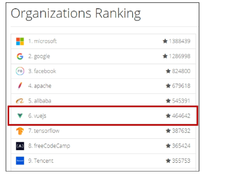

- **왜 사용할까?**

  - 현대 웹 페이지는 페이지 규모가 계속해서 커지고 있으며, 그만큼 사용하는 데이터도 늘어나고 사용자와의 상호작용도 많이 이루어짐

  - 결국 Vanilla JS만으로는 관리하기 어려움

    - 예시) "페이스북 친구가 이름을 수정했을 경우, 화면상에서 변경되어야 하는 것들"

    - 타임라인의 이름, 페이스북 메시지 상의 이름, 내 주소록에서의 친구 이름 등

      => 페이스북이 React를 개발한 이유

- **Django 좋아요 with Vanilla JS 예시**

  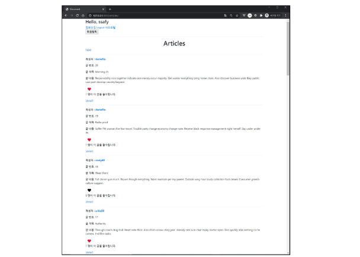

  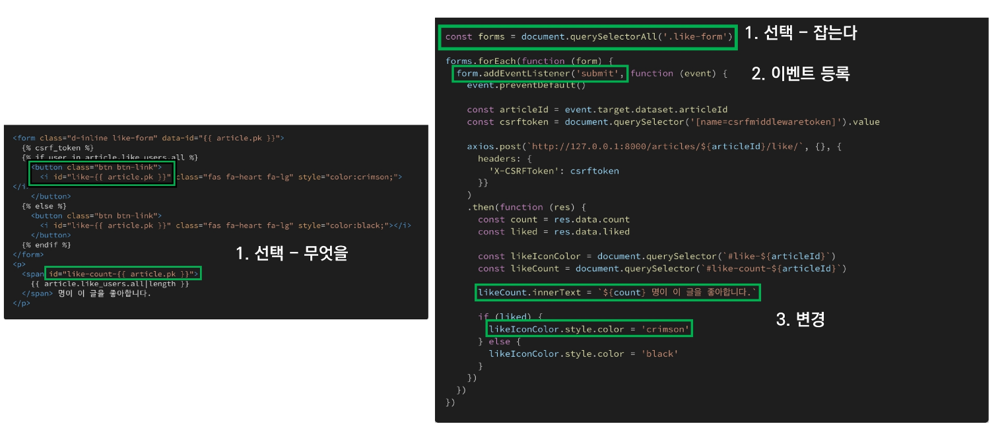

  => 하지만 선택해야하는 데이터와 동시에 변경되어야 하는 요소가 많아진다면..?

  

- **페이스북 예시**

  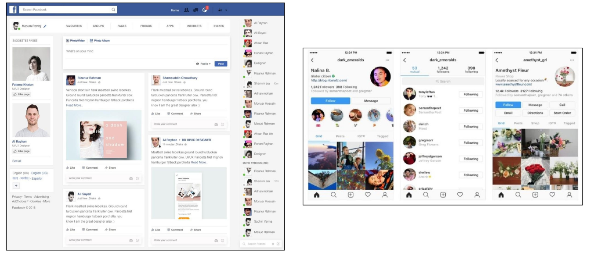

  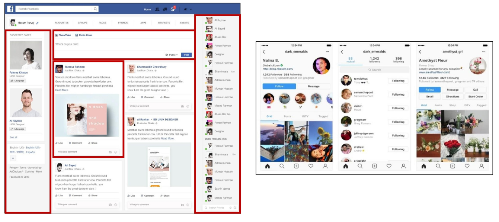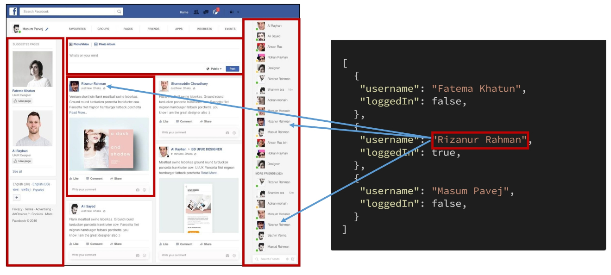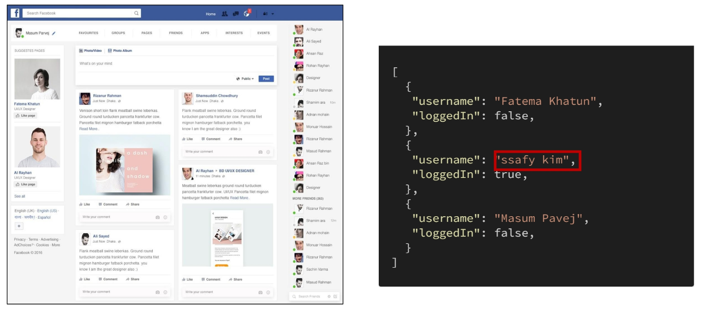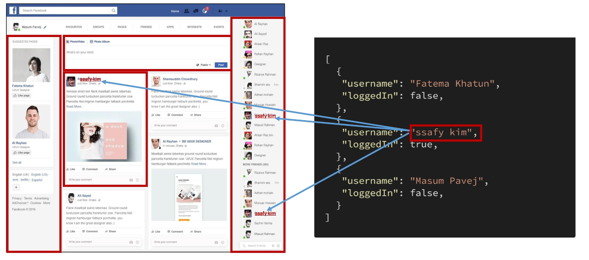

- **페이스북 코드 예시 - Vanilla JS**

  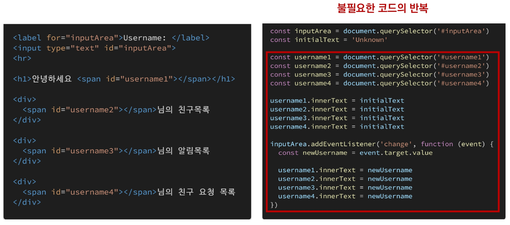

- **페이스북 코드 예시 - Vue.js**

  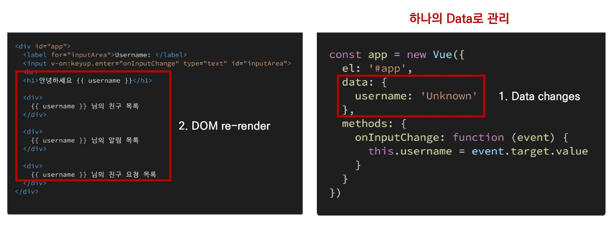

- **비교**
  - `Vanilla JS`
    - 한 유저가 작성한 게시글이 DOM상에 100개 존재
    - 이 유저가 닉네임을 변경하면, DB의 Update와 별도로 DOM상의 100개의 작성자 이름이 모두 수정되어야 함
    - '모든 요소'를 선택해서 '이벤트'를 등록하고 값을 변경해야 함
  - `Vue.js`
    - DOM과 Data가 연결되어 있고
    - Data를 변경하면 이에 연결된 DOM은 알아서 변경
    - 즉, 우리가 신경써야 할 것은 오직 <u>Data에 대한 관리 (Developer Exp 향상)</u>

## Concepts of Vue.js

- **MVVM Pattern**
  - 애플리케이션 로직을 UI로부터 분리하기 위해 설계된 디자인 패턴
  - 구성 요소
    1. Model
    2. View
    3. View Model

- **MVVM Pattern in Vue.js**

  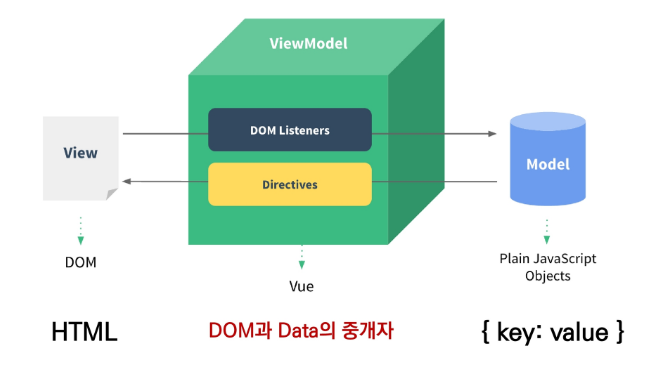

- **MVVM**
  - `Model`
    - "Vue에서 Model은 JavaScript Object다."
    - Object === { key: value }
    - Model은 Vue Instance 내부에서 data라는 이름으로 존재
    - 이 data가 바뀌면 View(DOM)가 반응
  - `View`
    - "Vue에서 View는 DOM(HTML)이다."
    - Data의 변화에 따라서  바뀌는 대상
  - `ViewModel`
    - "Vue에서 ViewModel은 모든 Vue Instance이다."
    - View와 Model 사이에서 Data와 DOM에 관련된 모든 일을 처리
    - ViewModel을 활용해 Data를 얼마만큼 잘 처리해서 보여줄 것인지(DOM)를 고민하는 것

## Vue version 2 vs 3

- Official main version === vue 3
  - `Vue 3`
    - 2022년 2월부터 vue 프레임워크의 기본 버전이 3.x로 전환
    - CDN or npm을 통한 설치시 자동으로 Vue 3로 설정
  - `Vue 2`
    - 실무에서 여전히 Vue 2가 많이 사용됨(legacy code)
    - Vue 2의 생태계(문서, 튜토리얼, 자료, QnA 등)가 더 성숙함
    - 코어/커뮤니티 라이브러리의 호환 역시 Vue 2가 더 안정적