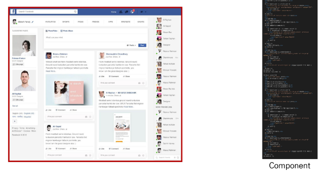
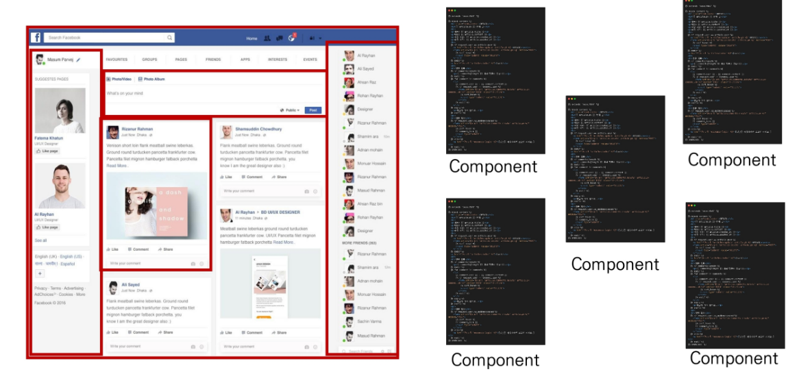
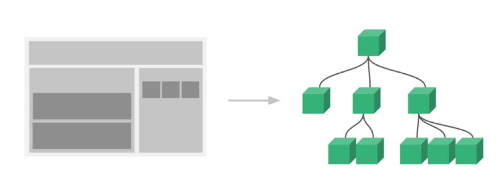
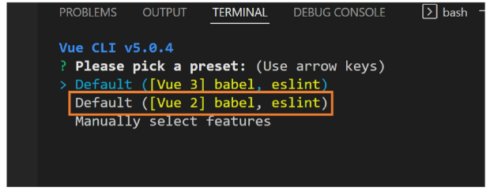
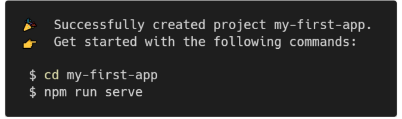
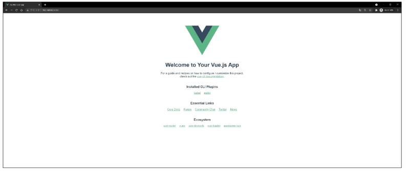

# Vue 02: CLI & Router

> [강의자료](https://edu.ssafy.com/data/upload_files/crossUpload/openLrn/ebook/unzip/A2022050616462982700/index.html)  2022-05-09


## Vue CLI

### SFC

- **Component (컴포넌트)**

  `Vue 컴포넌트 === Vue 인스턴스`

  - 기본 HTML 엘리먼트를 확장하여 재사용 가능한 코드를 캡슐화 하는 데 도움을 줌

  - CS에서는 다시 사용할 수 있는 범용성을 위해 개발된 소프트웨어 구성 요소를 의미

  - 즉, 컴포넌트는 유지보수를 쉽게 만들어 줄 뿐만 아니라, 재사용성의 측면에서도 매우 강력한 기능을 제공

    

- **SFC (Single File Component)**
  
  `Vue 컴포넌트 === Vue 인스턴스 === .vue 파일`
  
  - Vue의 컴포넌트 기반 개발의 핵심 특징
  - 하나의 컴포넌트는 `.vue` 확장자를 가진 하나의 파일 안에서 작성되는 코드의 결과물
  - 화면의 특정 영역에 대한 HTML, CSS, JavaScript 코드를 하나의 파일(.vue)에서 관리
  - 즉, `.vue` 확장자를 가진 싱글 파일 컴포넌트를 통해 개발하는 방식


- **Component 예시 - 단일 파일 관리**

  

  - 단일 파일에서의 개발
    - 처음 개발을 시작할 때는 크게 신경 쓸 것이 없기 때문에 쉽게 개발 가능
    - 하지만 코드의 양이 많아지면 변수 관리가 힘들어지고 유지보수에 많은 비용 발생


- **Component 예시 - 한 화면을 구성하는 여러 컴포넌트**

  

  - 각 기능 별로 파일을 나눠서 개발
    - 처음 개발을 준비하는 단계에서 시간 소요가 증가
    - 하지만 이후 변수 관리가 용이하며 기능 별로 유지&보수 비용 감소


- **Vue Component 구조 예시**

  

  - 한 화면 안에서도 기능 별로 각기 다른 컴포넌트가 존재
    - 하나의 컴포넌트는 여러 개의 하위 컴포넌트를 가질 수 있음
    - Vue는 컴포넌트 기반의 개발 환경 제공
  - Vue 컴포넌트는 `const app = new Vue({...})`의 app을 의미하며 이는 Vue 인스턴스
    - 여기서 오해하면 안 되는 것은 <u>컴포넌트 기반의 개발이 반드시 파일 단위로 구분되어야 하는 것은 아님</u>
    - 단일 .html 안에서도 여러 개의 컴포넌트를 만들어 개발 가능


- 정리
  - Vue 컴포넌트는 Vue 인스턴스(new Vue ({}))이기도 함
  - Vue 인스턴스는 `.vue` 파일 안에 작성된 코드의 집합
  - HTML, CSS, 그리고 JavaScript를 `.vue`라는 확장자를 가진 파일 안에서 관리하며 개발


### Vue CLI

- **Vue CLI**
  - Vue.js 개발을 위한 표준 도구
  - 프로젝트의 구성을 도와주는 역할을 하며 Vue 개발 생태계에서 표준 tool 기준을 목표로 함
  - 확장 플러그인, GUI, Babel 등 다양한 tool 제공


- **Node.js**
  - 자바스크립트를 브라우저가 아닌 환경에서도 구동할 수 있도록 하는 자바스크립트 런타임 환경
    - 브라우저 밖을 벗어날 수 없던 자바스크립트 언어의 태생적 한계를 해결
  - Chrome V8 엔진을 제공하여 여러 OS 환경에서 실행할 수 있는 환경을 제공
  - 즉, 단순히 브라우저만 조작할 수 있던 자바스크립트를 SSR 아키텍처에서도 사용할 수 있도록 함
  - [참고] 2009년 Ryan Dahl에 의해 발표


- **NPM (Node Package Manage)**
  - 자바스크립트 언어를 위한 패키지 관리자
    - Python에 pip가 있다면 Node.js에는 NPM
    - pip와 마찬가지로 다양한 의존성 패키지를 관리
  - Node.js의 기본 패키지 관리자
  - Node.js 설치 시 함께 설치됨


- Vue CLI Quick Start

  - 설치

    ```bash
    $ npm install -g @vue/cli
    ```

  - 버전 확인

    ```bash
    $ vue --version
    ```

  - 프로젝트 생성

    ```bash
    $ vue create my-first-app
    ```

  - npm 레지스트리 변경 (환경에 따라 나오지 않을 수 있음)

    ```bash
    ?	Your connection to the default npm registry seems to be slow.
    	Use https://registry.npm.taobao.org for faster installation? Yes
    ```

  - Vue 버전 선택 (Vue 2)

    

  - 프로젝트 생성 성공

    

  - 프로젝트 디렉토리 이동

    ```bash
    $ cd my-first-app
    ```

  - 서버 실행

    ```bash
    $ npm run serve
    ```

  - 프로젝트 메인 페이지

    


### Babel & Webpack

