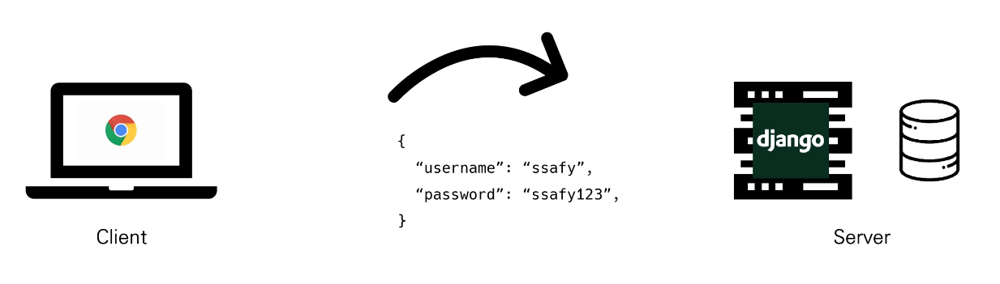
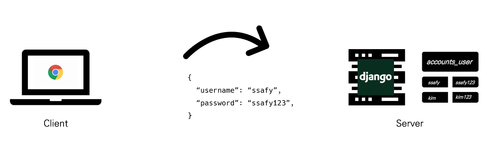
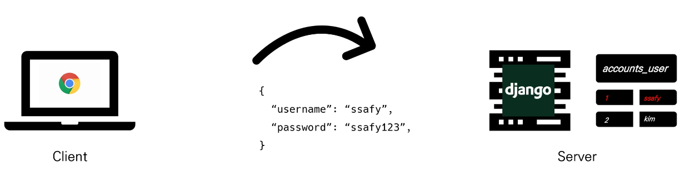
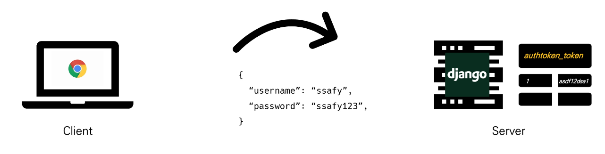
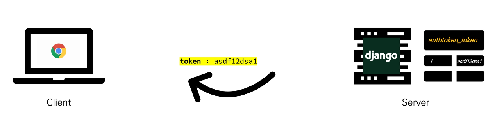
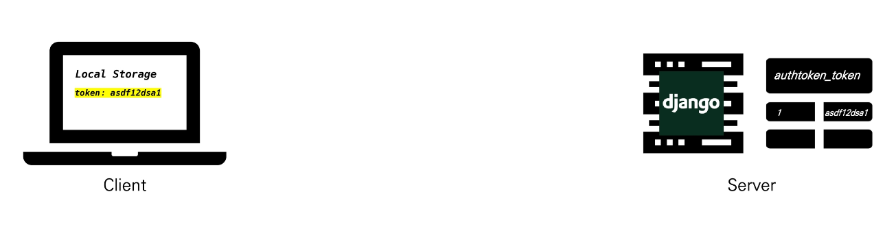
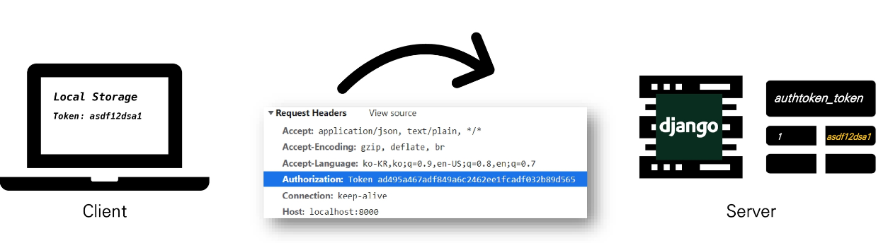
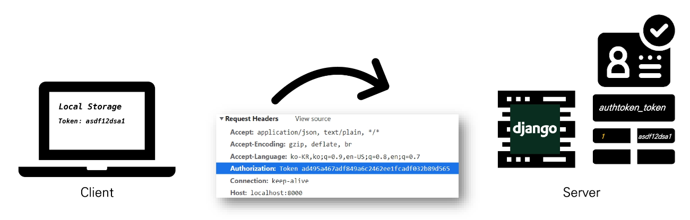
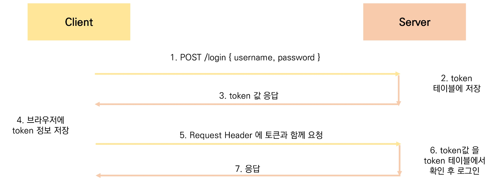

# Vue 04. Vue + API

> [강의자료](https://edu.ssafy.com/data/upload_files/crossUpload/openLrn/ebook/unzip/A2022051318433387800/index.html)  2022-05-16


## Server & Client

- **Server**
  - 클라이언트에게 '정보', '서비스'를 제공하는 컴퓨터 시스템
  - 정보 & 서비스
    - Django를 통해 응답한 template
    - DRF를 통해 응답한 JSON


- **Server - 정보 & 서비스 제공**

  


- **Client**
  - 서버에게 그 서버가 맡는(서버가 제공하는) <u>서비스를 요청</u>하고, 서비스 요청을 위해 필요한 인자를 <u>서버가 요구하는 방식에 맞게 제공</u>하며, 서버로부터 반환되는 응답을 <u>사용자에게 적절한 방식으로 표현</u>하는 기능을 가진 시스템


- **Client - 서버에 올바른 요청**

  

  


- **Client - 사용자에게 적절하게 표현**

  

  


- **정리**
  - Server는 "<u>정보 제공</u>"
    - DB와 통신하며 데이터를 CRUD
    - 요청을 보낸 Client에게 이러한 정보를 응답
  - Client는 "<u>정보 요청 & 표현</u>"
    - Server에게 정보(데이터) 요청
    - 응답 받은 정보를 잘 가공하여 화면에 보여줌


## Start Project Model + Serializer

```bash
$ python -m venv venv
```

```bash
$ source venv/Scripts/activate
(venv)
```

```bash
$ pip install django==3.2.12 djangorestframework django_extensions
```

```bash
$ pip freeze > requirements.txt
```

```bash
$ django-admin startproject [name]
```

```bash
$ touch .gitignore

// gitignore.io
django / venv / vsc / python
```

```bash
$ python manage.py startapp [name]
```

```bash
$ python 
```

```
settings.py
```


```
# accounts/models.py
```


```
# articles/models.py
```


```
# urls.py
(articles와 accounts에 urls.py 생성 필요)
```


```bash
$ python manage.py makemigrations
$ python manage.py migrate
```

```bash
$ python manage.py createsuperuser
```


## CORS

- **Same-origin policy (SOP)**

  - "동일 출처 정책"

  - 특정 출처(origin)에서 불러온 문서나 스크립트가 다른 출처에서 가져온 리소스와 상호작용 하는 것을 제한하는 보안 방식

  - 잠재적으로 해로울 수 있는 문서를 분리함으로써 공격받을 수 있는 경로를 줄임

    

- **Origin (출처)**

  - 두 URL의 Protocol, Port, Host가 모두 같아야 동일한 출처라 할 수 있음

  - URL http://store.company.com/dir/page.html의 출처를 비교한 예시

    


- Same-origin 예시

  


- **Cross-Origin Resource Sharing (CORS)**
  - "교차 출처 리소스(자원) 공유"
  - <u>추가 HTTP header를 사용</u>하여, 특정 출처에서 실행중인 웹 애플리케이션이 <u>다른 출처의 자원에 접근할 수 있는 권한을 부여하도록 브라우저에 알려주는 체제</u>
  - 리소스가 자신의 출처(Domain, Protocol, Port)와 다를 때 교차 출처 HTTP 요청을 실행
  - 보안 상의 이유로 브라우저는 교차 출처 HTTP 요청을 제한 (SOP)
    - 예를 들어 XMLHttpReaquest는 SOP를 따름
  - 다른 출처의 리소스를 불러오려면 그 출처에서 <u>올바른 CORS header를 포함한 응답을 반환</u>해야 함


- 교차 출처 접근 허용하기
  - CORS를 사용해 교차 출처 접근을 허용하기


- Why CORS?

  1. 브라우저 & 웹 애플리케이션 보호
     - 악의적인 사이트의 데이터를 가져오지 않도록 사전 차단
     - 응답으로 받는 자원에 대한 최소한의 검증
     - 서버는 정상적으로 응답하지만 브라우저에서 차단

  2. Server의 자원 관리
     - 누가 해당 리소스에 접근할 수 있는지 관리 가능


- Access-Control-Allow-Origin 응답 헤더
  - 이 응답이 주어진 출처(origin)로부터 요청 코드와 공윧


- `django-cors-headers` 라이브러리
  - 응답에 CORS header를 추가해주는 라이브러리
  - 다른 출처에서 보내는 Django 애플리케이션에 대한 브라우저 내 요청을 허용함
  - Django App이 header 정보에 CORS를 설정한 상태로 응답을 줄 수 있게 도와주며, 이 설정을 통해 브라우저는 다른 origin에서 요청을 보내는 것이 가능해짐


## Authentication & Authorization

- Authentication
  - 인증, 입증
  - 자신이라고 주장하는 사용자가 누구인지 확인하는 행위
  - 모든 보안 프로세스의 첫 번째 단계 (가장 기본 요소)
  - 즉, 내가 누구인지를 확인하는 과정


- Authentication and authorization work together
  - 회원 가입을 하고 로그인을 하면 할 수 있는 권한 생성
    - 인증 이후에 권한이 따라오는 경우가 많음
  - 단, 모든 인증을 거쳐도 권한이 동일하게 부여되는 것은 아님
    - Django에서 로그인을 했더라도 다른 사람의 글까지 수정 / 


## DRF Authentication

- **다양한 인증 방식**
  1. Session Based
  2. Token Based
     - Basic Token
     - JWT
  3. Oauth
     - google
     - facebook
     - github
     - …


- Basic Token Authentication

  

  

  

  