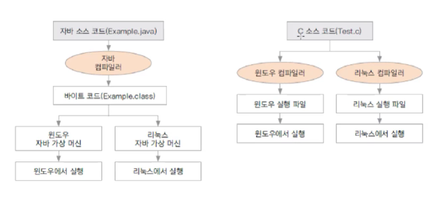

# 📝 Do it! 자바 프로그래밍 입문

## 1️⃣ 자바 기본 익히기

### 자바 프로그래밍 시작하기

- 프로그래밍이란 무엇일까?
  - `프로그래밍`: 컴퓨터에게 일을 하도록 명령어를 만드는 것
  - `컴파일`: 프로그램 언어를 컴퓨터가 알 수 있는 언어로 바꿔 주는 일
  - `컴파일러`: 기계어로 번역해주는 프로그램. 자바를 설치하면 자바 컴파일러도 설치됨

- 패키지(소문자로 작성) 생성 이후 클래스(대문자로 시작) 생성

- 자바를 쓰면 좋은 점

  - 플랫폼에 영향을 받지 않으므로 다양한 환경에서 사용

  

  - 객체 지향 언어이기 때문에 유지보수가 좋고 확장성이 좋다.
  - 프로그램이 안정적이다.
  - 풍부한 기능을 제공하는 오픈소스이다.

### 변수와 자료형

- 컴퓨터에서 데이터 표현하기
  - 컴퓨터는 0과 1로만 데이터를 저장
  - bit(비트): 컴퓨터가 표현하는 데이터의 최소 단위로 2진수 하나의 값을 저장할 수 있는 메모리 크기
  - 