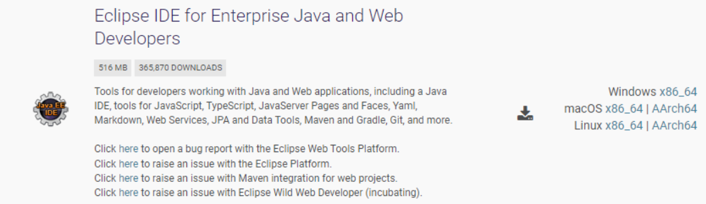
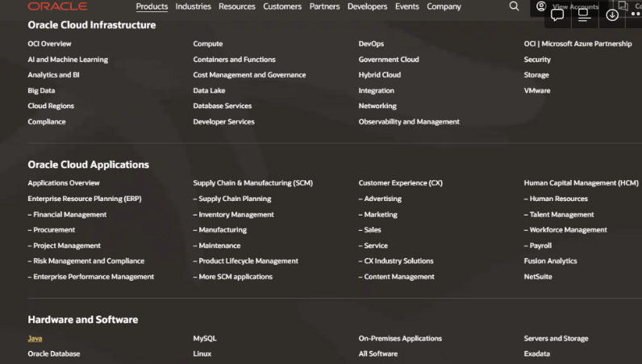
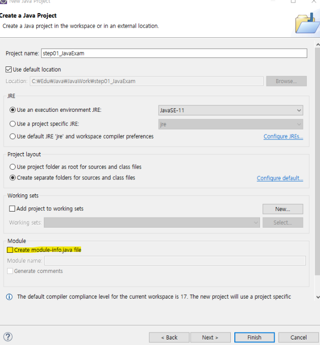
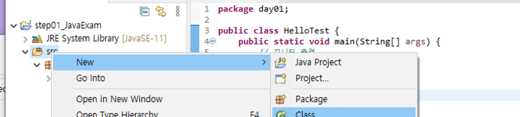

### 자바 시작하기

https://www.eclipse.org/

- 자바 통합 개발 환경 (IDE)

- Servlet 등 웹 기반 개발 전반적으로 진행 시 다운로드
- Java
  - SUN에서 시작
  - 1991년 오크라는 이름으로 전자 제품에 들어가는 SW로 시작
  - 2011 Oracle에서 흡수
  - 웹으로 넘어오면서 크게 성장
  - 원래 오픈소스 → oracle에 흡수되면서 라이센스 문제 발생
    - 기업에서의 상용화 등
  - SCJP(Sun Certificated Java Programmer) → OCJP
- 운영 프로그램: 운영 체제 위에서 돌아가는 프로그램
- Java 분야
  1. JavaSE (Standard Edition)
     1. 자바 언어의 핵심기능 제공
  2. JavaEE (Enterprise Edition)
     1. JavaSE 플랫폼 위에서 구축하며 기업용 애플리케이션 제작에 필요한 도구, 라이브러리제공
     2. 요즘은 대신 Spring Framework 사용
  3. Java ME Embedded
     1. 핸드폰등 모바일 기기나 다른 임베디드 장치에 사용

### 환경 세팅

1. JDK (Java Development Kit)

   - 작성한 코드를 컴파일하고 실행

   - https://www.oracle.com/ 에서 다운로드

     

   - 사용할 버전: `Java 11`

     - Java는 운영체제에 독립적: JDK 안의 JVM 덕분에 가능
     - JVM을 가진 JDK가 있다면 어떤 운영체제 안에서든 돌아가게 만들 수 있음
     - 하지만, JDK 자체는 운영체제마다 다름 (운영체제에 독립적이지 않음)
     - JVM은 리눅스용, 윈도우용 등 다름

   - Java 소스코드 자체는 오픈소스. 오픈소스인 Java 소스코드를 빌드하여 사용하는 것에는 거의 제약이 없지만, Oracle에서 제공하는 설치버전의 JDK는 회사에서는 사용할 수 없다. (라이센스 문제) 그래서, 무료로 제공하는 다양한 버전의 JDK가 있다.

   - JDK 종류

     1. `Oracle JDK`: Oracle에서 제공하는 JDK. 구독을 통해 유료 라이센스를 구매할 수 있다.
     2. `OpenJDK`
     3. `Azul Zulu`

   +) 원래 JDK가 필요하지만, eclipse에 포함되어 있기 때문에 굳이 설치하지 않을 것!

   - Java Version 19 17 - LTS 11 - 선택 설치!!! (LTS - Long Term Support) 9 8 - LTS (현재 가장 많이 쓰고 있음, 2030까지 지원 예정) 7 - LTS 6 - LTS 5 (5 → 8에서 큰 변화)

   - Java Version별 추가 spec

     1. Java 5.0

        - 제네릭, 오토박싱, 언박싱, enum , annotation , 개선된 for (콜론으로 for 지정), static import

     2. Java 8.0

        > oracle로 흡수가 되면서 LTS 버전을 첫 번째로 출시한 것이 v8 → 이 때의 변화가 큼

        - Interface의 static, default
        - 함수형프로그래밍, Lambda
          - Lambda를 쓸 때는 인수와 메소드 이름이 예측이 되어야 함 (어떤 인터페이스 안에 인수는 뭐고, 메소드는 뭔지)
          - 감춰져 있기 때문에 자바를 잘 모르면 이해하기 어려움
          - 간결하지만 학습 곡선은 높음
        - Stream활용
        - 날짜와 시간관리 강화 - 개선된 Date API
        - 병렬데이터 처리성능

     3. Java 9.0

        - Immutable List 가능
          - 리스트를 수정하지 못하게 하는 것
        - Private Method in Interface : interface 안에 private 메소드
          - 은닉, 캡슐화
        - The var for local variables : var map = new HashMa<String , Student>();
          - 자바에 유연성 추가 (대입연산자 왼쪽에 타입 표시 x)
          - 로컬에서만 사용 가능
        - Optional class에 새로운 메소드 추가(ifPresent, ifPresentOrElse)
        - REPL(Read Eval Print Loop) - jshell
          - jshell은 컴파일, 수정, 실행을 IDE를 사용하지 않고 쉽게 자바 코드의 개발과 테스트 할수 있게함.
        - Java 9의 가장 큰변화중 하나는 모듈시스템(Java Platform Module System)!
          - JDK 모듈을 사용할수 있고 자신의 모듈을 만들수 있음
          - java에서 패키지단위의 캡슐화가 가능하고 module간의 의존관계를 정의하여 최적화된 application배포를 가능하게 한다.
          - 기존의 패키지를 작은 규모로 분리할 수 있게 함
          - module.java에 세팅 필요

2. 코딩을 위한 tool 필요

   > 개발을 더 편안하게

   - NotePad

   - EditPlus

   - Visual Studio Code

   - Aptana Studio

   - IDE(Integrated Development Environment) - 통합개발환경

     > 자바 베이스는 아래 두개 (요즘은 인텔리제이 많이 씀 근데 라이센스 문제)

     - 이클립스 - [eclipse.org](http://eclipse.org/)
     - 인텔리제이 - [jetbrains.com](http://jetbrains.com/)

3. path 설정

   > jdk 설치를 안해서 path 설정을 할 필요는 없지만 eclipse 없이는 자바를 실행할 수 없는 단점

- window - C:Program Files|Java|jdk-11.0.13|bin 등록한다.
  - 이유 : bin안에 있는 실행파일을 위치에 상관없이 언제든지 어디서든 사용할 수 있도록
  - 보통 bin 파일의 역할: 실행파일

### Java 기타

- Java의 변천사
  - 응용프로그램
    - 브라우저에서 동작할 수 있는 실행할 수 있는 applet 제공!! (Applet —> swing과 비슷)
      - 화면 구성 가능
      - swing: gui 관련
    - 완벽한 자바소스로 만들어서 ~.html 문서안에 <applet class="클래스이름" />
    - 브라우저에서 동작한다 하더라도 완벽한 자바소스이기때문에 프로그램을 만드는데 불편함 ⇒ 이 시기에 asp, php (저가형으로 빠르게 웹 개발 가능) 언어가 인기
- Servlet 언어
  - java로 만들어 웹브라우저에서 동작하는 언어
  - java문서안에 html, css, javaScript 모두 함께 사용가능
  - 프론트에 대한 부분은 html, css, js로 작성하고 B/L은 순수 자바로 작성할수 있다.
    - 결국, 확장자는 ~.java이기 때문에 컴파일으하고 실행해야하는 번거로움과 자바를 잘 모르면 만들기가 쉽지 않다. 디자이너와 개발자사이의 소통이 어려움
    - 코딩이 java 중심 코드
- JSP
  - ~.jsp문서안에 html, css, javaScript를 코딩
  - 코딩이 html중심(마크업 중심)으로 코딩하고 자바코드가 필요 할때 `<% java코드 작성 %>` 사용해서 작성한다.
  - asp, php와 거의 유사한 언어를 제공
- 결론
  - JSP로 웹페이지를 만들다 보니 뷰와 Business Logic이 한 페이지에 섞여 있다보니 소스는 복잡하고 유지보수, 확장성이 떨어진다.
  - 어떻게 잘 만들어야 유지보수, 확장성이 좋을까? 대한 고민 (결과가 아닌 과정이 중요)
    - Refactoring
    - 디자인패턴 GoF 23가지, SOLID 객체지향설계원칙
    - MVC구조 개발 필요성 (궁극적인 목표)
      - Model : java
      - View : html, css, js, jsp
      - Controller : Servlet   - View와 Model사이 중간에서 Front와 Back을 연결해주는 역
- +) 라이브러리 vs 프레임워크
  - 라이브러리: 실행의 주체를 개발자가 가지고 있음 (원할 때 호출)
  - 프레임워크: 흐름(라이프사이클)이 정해져 있음

- 모든 소스는 src 아래에

