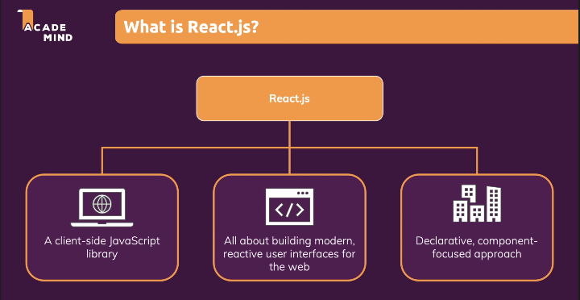
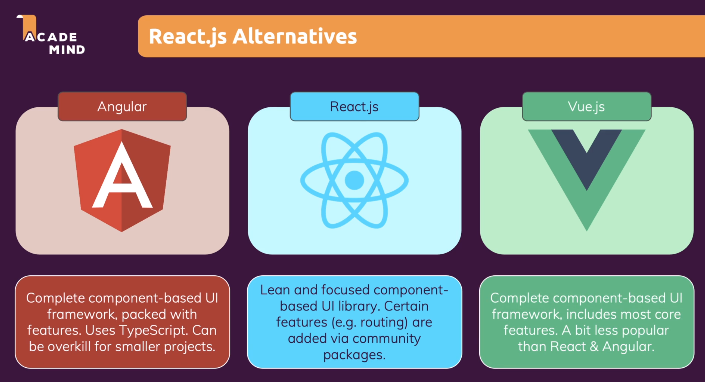
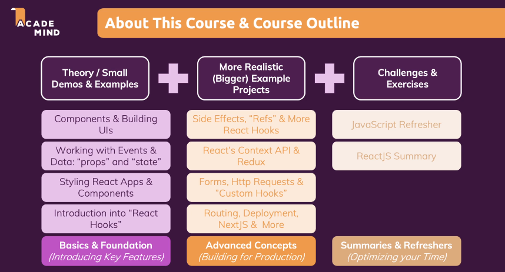

# 1. getting started

## What is React? and Why would we use it?

- React is a JavaScript library for <u>building user interfaces</u>
- Mobile apps and desktop apps feel very "reactive": Things happen instantly. you don't wait for new pages to load or actions to start.
- Traditionally, in web apps, you click a link and wait for a new page to load. You click a button and wait for some action to complete.
  - 무겁고, 새로운 html 페이지가 로딩되기를 기다려야 함

- JS: runs in the browser - on the loaded page.
  - JS를 통해 새로운 html 페이지를 로딩하지 않고 새로운 페이지 보여줄 수 있게 됨
- React.js는 자바스크립트 라이브러리
- 최신의 반응형 사용자 인터페이스

- 그렇다면 왜 자바스크립트에 리액트도 필요할까?

  - 자바스크립트로 작업 시 모든 단계를 일일이 작업해야함
  - 세부 사항들을 신경써야 함
  - 되풀이된 작업을 해야 함
  - 리엑트에서는 작은 컴포넌트와 빌딩 블록으로 분할하여 유지 보수와 관리가 용이하다
    - 고수준의 구문 제공
    - 선언형 방식, 선언형 컴포넌트

  

  

- 리액트의 대안

  

  - 현재는 리액트가 가장 인기 있는 라이브러리

### Course Outline

