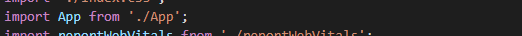
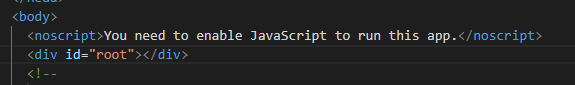
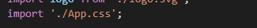
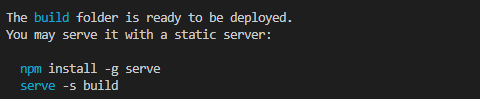
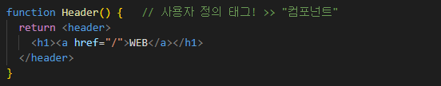
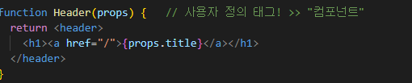
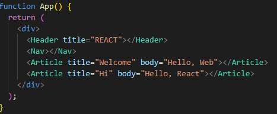

## React

> youtube 생활코딩 강의 참고 https://www.youtube.com/playlist?list=PLuHgQVnccGMCOGstdDZvH41x0Vtvwyxu7

### 1. 수업 소개

- 리액트의 핵심적인 역할: `사용자 정의 태그`를 만드는 것
- `사용자 정의 태그`
  - 부품으로 사용된다
  - 공유 가능
  - 거대한 공급망 존재


- 리액트를 만드는 두 가지 방법

  - `class`

  - `function`
    - 최근에 더 많이 사용


### 2. 실습환경 구축

- React 문서 https://ko.reactjs.org/docs/getting-started.html

- 온라인 플레이그라운드: 온라인 서비스를 이용하여 실습 가능
  - Stackblitz https://stackblitz.com/edit/react-djprfm?file=src%2FApp.js

- 새로운 React 앱 만들기 https://ko.reactjs.org/docs/create-a-new-react-app.html

  - create-react-app  

    - https://github.com/facebook/create-react-app

    - https://create-react-app.dev/

    - ```bash
      npx create-react-app <appname>   # 사용 위해 node.js 필요
      ```

      - 터미널에서 실행 시 create-react-app 바로 사용 가능


- 실습

  - ```bash
    $ npx create-react-app . # . => 현재 디렉토리를 의미함
    ```

    - 설치 여부 물으면 yes

    

    

  

  - npm start 명령어 입력 시 리액트 개발환경 실행

    - 웹 브라우저가 뜨면서 샘플 리액트 앱이 뜸

    


### 3. 소스코드 수정 방법

- 파일 구조

  - src > `index.js` : 입구 파일

    - 여러가지 전역적인 설정들이 들어 있음
    - npm start를 이용하여 create-react-app을 구동시키면 `index.js` 파일을 찾아서 보여줌

    

    - <App /> 태그 삭제 시 전체 페이지가 보이지 않음

    - 그렇다면 실제 <App /> 의 내용은?

      

      - './App' 뒤에는 .js라는 확장자명이 숨겨져 있음
      - . 은 현재 디렉토리를 의미

    - id: root의 정보는 public> `index.html`에서 확인 가능

      

  - src > `App.js`

    - 안의 App() 함수 안의 내용이 화면 구성 중

    - CSS 요소: App.css에 들어 있음

      


- 배포

  ```bash
  $ npm run build
  ```

  - 빌드 명령 실행
    - 빌드: 배포판을 만드는 과정
  - `build` 폴더 생성됨
    - 내부의 `index.html` 파일 => 배포 시에는 공백 등 필요 없음!

  

  - 빌드 결과 서비스시 `serve`라는 앱을 쓰는 것을 추천하고 있음
    - -s 옵션: 사용자가 어떤 경로로 들어오든 index.html 페이지 서비스 (build- build 폴더 내의 index.html)


### 4. 컴포넌트 만들기

**<u>`리액트는 사용자 정의 태그를 만드는 기술이다!`</u>**

- 정리의 핵심: 연관된 것들을 모아 grouping 후 이름을 붙인다!

- **사용자 정의 태그** 만들기  =>  `컴포넌트`
  - 반드시 대문자로 시작!




### 5. props

- `prop`: 리액트에서의 속성

- 함수의 () 안에 props 추가

  

  
