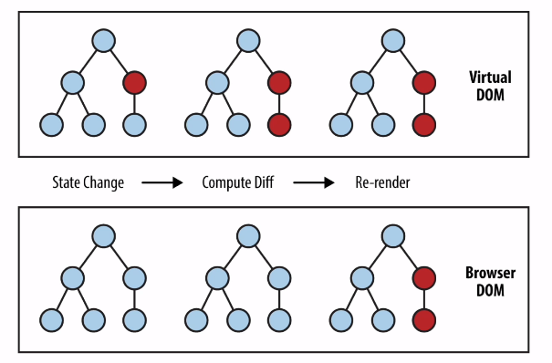

# 처음 만난 리액트

> [인프런](https://www.inflearn.com/course/%EC%B2%98%EC%9D%8C-%EB%A7%8C%EB%82%9C-%EB%A6%AC%EC%95%A1%ED%8A%B8/dashboard)  2022-07-07 ~

## 0. 준비하기

### HTML과 CSS

- **HTML**
  
  - **H**yper **T**ext **M**arkup **L**anguage
    
    - Markup: 문서나 데이터를 처리하기 위해 문서에 추가되는 정보
  
  - 웹사이트의 뼈대를 구성하기 위해 사용하는 마크업 언어

- **Tag**
  
  - < html >< /html >
  - 태그는 열었으면 꼭 닫아줘야 함!
    - < br/ >처럼 한 번에 열고 닫는 태그도 있음

- **웹사이트의 뼈대를 구성하는 태그들**
  
  

- `< head >` : 웹사이트의 속성이 들어감 (< title > 등)

- `< body >` : 실제로 웹사이트에서 보이는 콘텐츠가 들어감
  
  - 우리가 실제로 웹 브라우저에서 보게 되는 내용

- **SPA**
  
  - **S**ingle **P**age **A**pplication
    - 하나의 페이지만 존재하는 애플리케이션
  
  

- **CSS**
  
  - **C**ascading **S**tyle **S**heets
    - 웹사이트의 레이아웃과 글꼴, 색상 등의 디자인을 입히는 역할

---

### JavaScript 소개 및 자료형

> https://developer.mozilla.org/en-US/docs/Web/JavaScript/Data_structures

- **JavaScript**
  
  - 프로그래밍 언어의 한 종류 (Java와는 관련 X!)
  
  - 정식 명칭: ECMAScript (버전명: ES6 등)
  
  - HTML이 웹사이트의 뼈대를 구성한다면, JS는 웹사이트가 살아 움직이도록 생명을 불어 넣는 역할
  
  - 사용 범위가 굉장히 넓다
  
  - 스크립트 언어에 속함
    
    - `Script Language (스크립트 언어)`
      
      다른 언어와의 차이점: 프로그램이 실행되는 Runtime에 소스코드가 해석되고 실행된다
  
  - ES6 (ECMAScript 2015, ES2015)

- **JavaScript의 문법**
  
  - <u>JavaScript의 자료형 (Data Type)</u>
    
    - 변수에 데이터가 대입되는 시점에 자료형이 결정됨 => `Dynamic Typing (동적 타이핑)`
    
    
    
    - `Number Type`
    - `String type` : 따옴표를 사용
    - `Boolean type` : true 혹은 false
    - `Null type` : 값이 정의되긴 했지만 그 값이 Null
    - `Undefined type` : 정의가 되지 않음 (선언만 하고 값을 대입하지 않는 등)
    - `Array type` : 여러 가지 변수들을 순서대로 모아 놓은 것 (다양한 자료형의 변수가 함께 들어갈 수 있음)
    - `Object type` : 객체를 다루기 위한 자료형 (객체: key와 value로 이루어진 쌍의 집합 (python의 dictionary와 유사)) 

---

### JavaScript의 연산자

> https://developer.mozilla.org/en-US/docs/Web/JavaScript/Reference/Operators

- **대입 연산자 (Assignment operator)**
  
  - `=`
  - 변수에 값을 대입하기 위해 사용
  - 대입 연산자는 항상 오른쪽에서 왼쪽 방향으로 흐름이 흘러간다!
  
  

- **산술 연산자 (Arithmetic operators)**
  
  - 사칙 연산자
    
    - 덧셈(`+`), 뺄셈(`-`), 곱셈(`*`), 나눗셈(`/`)
    - 나머지를 구하는 연산자(`%`), 지수 연산자(`**`)
  
  - 증가 연산자 (`++`)
    
    - postfix 방식: `a++` (증감 전의 값을 반환하고 이후에 변수의 값이 증감)
    - prefix 방식: `++a` (변수의 값을 증감시키고 이후에 증감된 변수의 값을 반환)
    
    
  
  - 감소 연산자 (`--`)

- **관계 연산자 (Relational operators) / 비교 연산자 (Comparison operators)**
  
  - <, >, <=, >=
  - 동등 연산자 (Equality operators)
  - 일치 연산자 (Strict equality operator)
    - `===` : 값과 자료형이 모두 같다
    - `!==` : 값이나 자료형이 같지 않다

- **이진 논리 연산자 (Binary logical operators)**
  
  - `&&` : 모두 true일때만 true
  - `||` : 하나라도 true일 경우 true

- 조건부 연산자 (Conditional operator) / 삼항 연산자 (Ternary operator)
  
  - `조건식 ? true일 경우 : false일 경우`

---

### JavaScript의 함수

> https://developer.mozilla.org/en-US/docs/Web/JavaScript/Reference/Functions

- **함수**
  - 입력을 받아서 정해진 출력을 하는 것
  - 입력: `파라미터(parameter)` , `인자(argument)`


---

## 1강. 리액트 소개

### 리액트는 무엇인가?

> A JavaScript library for building user interfaces

- **라이브러리**
  
  - 자주 사용되는 기능을 정리해 모아놓은 것

- **사용자 인터페이스 (User Interface, UI)**
  
  - 사용자와 컴퓨터 프로그램이 서로 상호작용을 하기 위해 중간에서 서로간의 입력과 출력을 제어해줌
    - 웹페이지의 버튼이나 사용자 입력 창 등
  - UI 라이브러리
    - 화면을 만들기 위한 기능 모음집

- **프레임워크 vs 라이브러리**
  
  - 프레임워크: 흐름의 제어 권한을 개발자가 아닌 프레임워크가 가지고 있음
  - 라이브러리: 흐름에 대한 제어를 하지 않고 개발자가 필요한 부분만 가져다 사용

---

### 리액트의 장점과 단점

- **빠른 업데이트 & 렌더링 속도**
  
  - `Virtual DOM`
    - 하나의 웹사이트에 대한 정보를 모두 담고 있는 큰 그릇
  - `Component-Based`
    - 모든 페이지가 component로 구성
    - 하나의 component는 다른 여러개의 component로 구성

- **재사용성 (Reusability)**
  
  
  
  - 개발 기간이 단축됨
  
  - 유지 보수가 용이함

## 2강. 리액트 시작하기

### [실습] 직접 리액트 연동하기

- **(실습) HTML만으로 간단한 웹사이트 만들기**
  
  ```html
  <!-- index.html -->
  
  <html>
    <head>
      <title>My Blog</title>
      <!-- index.html 파일과 styles.css파일이 동일한 디렉토리에 위치해야 함 -->
      <link rel="stylesheet" href="styles.css">
    </head>
    <body>    <!-- 화면에 보이는 컨텐츠는 body 태그 안에 -->
      <h1>Welcome!</h1>
  
      <!-- DOM container (Root DOM Node) virtual DOM의 시작점 -->
      <div id="root"></div> 
  
      <!-- React 가져오기 -->
      <script crossorigin src="https://unpkg.com/react@17/umd/react.development.js"></script>
      <script crossorigin src="https://unpkg.com/react-dom@17/umd/react-dom.development.js"></script>
  
      <!-- React component 가져오기 -->
      <script src="MyButton.js"></script>
    </body>
  </html>
  ```
  
  - `link` 태그 : 현재 html 파일과 외부 리소스 사이의 관계 정의 (css 파일, favicon 등)

- **(실습) CSS를 사용하여 웹사이트 스타일링하기**
  
  ```css
  <!-- styles.css -->
  
  h1 {
    color: green;
    font-style: italic;
  }
  ```

- **(실습) 웹사이트에 React.js 추가하기**
  
  ```javascript
  // MyButton.js
  
  function MyButton(props) {
    const [isClicked, setIsClicked] = React.useState(false);
  
    return React.createElement(
      'button',
      { onClick: () => setIsClicked(true) },
      isClicked ? 'Clicked!' : 'Click here!'
    )
  }
  
  // React DOM의 render 함수를 사용하여 리액트 컴포넌트를 DOM 컨테이너에 렌더링하는 코드
  const domContainer = document.querySelector('#root');
  ReactDOM.render(React.createElement(MyButton), domContainer);
  ```

---

### [실습] create-react-app (CRA)

> react로 웹 애플리케이션을 개발하는 데 필요한 모든 설정이 되어 있는 상태로 프로젝트를 생성
> 
> https://reactjs.org/docs/create-a-new-react-app.html

```
Node.js v14.0.0 이상
npm v6.14.0 이상
VS Code
```

- **`npx` - execute npm package binaries**
  
  ```bash
  # 사용법
  $ npx create-react-app <your-project-name>
  
  # 실제 사용 예제
  $ npm create-react-app my-app
  ```

- **Commands**
  
  ```bash
  # 경로 변경 (change directory)
  $ cd my-app
  
  # 애플리케이션 실행
  $ npm start
  ```

## 3강. JSX

### JSX의 정의와 역할

- **JSX란?**
  
  - A syntax extension to JavaScript
  - JavaScript + XML/HTML

- **예제 코드**
  
  ```jsx
  const element = <h1>Hello, world!</h1>;
  ```

- **JSX의 역할**
  
  - JSX를 사용하는 것이 필수는 아니지만, 생산성과 가독성 등이 올라가는 장점이 있음
  
  ```jsx
  // createElement 함수의 parameter
  
  React.createElement(
      type,    // element의 유형 (div, span 등)
      [props],    // 속성
      [...children]    // 현재 element가 포함하는 자식 element
  )
  ```
  
  ```jsx
  // JSX를 사용한 코드
  
  class Hello extends React.Component {
      render() {
          return <div>Hello {this.props.toWhat}</div>;
      }
  }
  
  ReactDOM.render(
      <Hello toWhat="World" />
      document.getElementById('root')
  );
  ```
  
  ```javascript
  // JSX를 사용하지 않은 코드
  
  class Hello extends React.Component {
      render() {
          return React.createElement('div', null, `Hello ${this.props.toWhat}`);
      }
  }
  
  ReactDOM.render(
      React.createEleent(Hello, { toWhat: 'World' }, null),
      document.getElementById('root')
  );
  ```
  
  ```jsx
  // JSX를 사용한 코드
  const element = (
      <h1 className="greeting">
          Hello, world!
      </h1>
  )
  
  // JSX를 사용하지 않은 코드
  const element = React.createElement(
      'h1',
      { className: 'greeting' },
      'Hello, world!'
  )
  ```

---

### JSX의 장점 및 사용법

- **간결한 코드**

- **가독성 향상**
  
  - 버그를 발견하기 쉬움

- **Injection Attacks 방어**
  
  - 입력창에 문자나 숫자 대신 코드를 입력하여 실행되게 하는 해킹 방법
  
  ```jsx
  const title = response.potentiallyMaliciousInput;
  
  // 이 코드는 안전합니다.
  const element = <h1>{title}</h1>;
  ```

- **JSX 사용법**
  
  - JavaScript 코드 + XML / HTML
    
    - XML이나 HTML 코드 사이에 {}을 사용하여 JS 코드 사용
    
    ```jsx
    const name = 'HY';
    const element = <h1>안녕, {name}</h1>;    // name이라는 JS 변수 참조
    
    ReactDOM.render(
        element,
        document.getElementById('root')
    );
    ```
  
  - 태그의 속성(attribute)에 값을 넣는 방법
    
    ```jsx
    // 큰따옴표 사이에 문자열을 넣거나
    const element = <div tabIndex="0"></div>;
    
    // 중괄호 사이에 자바스크립트 코드를 넣으면 됨!
    const element = </img>
    ```
  
  - 자식(children)을 정의하는 방법
    
    ```jsx
    const element = (
        <div>
            <h1>Hello!</h1>
            <h2>Let's React!</h2>
        </div>
    )
    ```

---

### [실습] JSX 코드 작성해보기

```jsx
// Book.jsx

import React from "react";

// jsx - 가독성이 높고 직관적인 코드 작성 가능
function Book(props) {
  return (
    <div>
      <h1>{`이 책의 이름은 ${props.name}입니다.`}</h1>
      <h2>{`이 책은 총 ${props.numOfPage}페이지로 이루어져 있습니다.`}</h2>
    </div>
  );
}

export default Book;
```

```jsx
// Library.jsx

import React from "react";
import Book from "./Book";

function Library(props) {
  return (
    <div>
      <Book name="처음 만난 파이썬" numOfPage={300} />
      <Book name="처음 만난 AWS" numOfPage={400} />
      <Book name="처음 만난 리액트" numOfPage={500} />
    </div>
  );
}

export default Library;
```

```javascript
// index.js

import Library from './chapter_03/Library';

const root = ReactDOM.createRoot(document.getElementById('root'));
root.render(
  <React.StrictMode>
    <Library />
  </React.StrictMode>
);
```

---

## 4강. Rendering Elements

### Elements의 정의와 생김새

- **Element**
  
  - 어떤 물체를 구성하는 성분
  - react 앱을 구성하는 요소
  - <u>Elements are the smallest building blocks of React apps.</u>
    - 리액트 앱을 구성하는 가장 작은 블록들
  - 화면에서 보이는 것들을 기술

- **DOM Elements vs React Element**
  
  
  
  - Descriptor
    - 화면에 나타나는 내용을 기술하는 자바스크립트 객체
  - DOM Elements: 실제 브라우저에 나타남
    - 상대적으로 크고 무거움
  - React Elements: Virtual DOM에 존재
    - DOM Elements의 가상 표현

- **Elements의 생김새**
  
  - 리액트 Elements는 자바스크립트 객체 형태로 존재
  
  - button을 나타내는 element (단순한 자바스크립트 객체)
    
    

- 실제로 렌더링이 된다면 아래와 같은 DOM Element가 됨
  
  

- 리액트의 Component Element (일반적인 자바스크립트 객체)
  
  - 타입이 React component의 이름 (일반적인 문자열이 아님)
  
  

- **CreateElement의 동작 과정**
  
  - ConfirmDialog component가 Button component를 포함
  
  

- 첫 번째 children의 type은 p(html tag)이므로 바로 렌더링 가능

- 두 번째 children의 type은 react component의 이름인 button 
  
  - react는 Button component에 element를 생성해서 합친다
  
  

- 최종적으로는 아래와 같은 모습이 됨
  
  - 컴포넌트 렌더링을 위해 모든 컴포넌트가 createElement함수를 통해 element로 변환된다
  
  

- react element는 우리 눈에 실제로 보이는 것을 기술한다.

---

### Elements의 특징 및 렌더링하기

- **Elements의 특징**
  
  - `불변성`: React elements are <u>immutable</u>.
    
    - 변하지 않는 성질 (한 번 생성된 element는 변하지 않는다)
    - Elements 생성 후에는 <u>children</u>이나 <u>attributes</u>를 바꿀 수 없다.
    
    

- **Elements 렌더링하기**
  
  - 실제로 화면에 보여주는 과정
  
  - Root DOM Node
    
    ```react
    <div id="root"></div>
    ```
    
    
  
  - Root div에 실제로 react element를 렌더링하기 위해서
    
    - element를 생성 후 root div에 렌더링 (render 함수)
    
    ```react
    const element = <h1>안녕, 리액트!</h1>;
    ReactDOM.render(element, document.getElementById('root'));
    ```

- 렌더링된 Elements를 업데이트 하기
  
  - 불변성
    
    - 업데이트 위해서는 다시 생성해야함
  
  - 예시 - tick 함수 정의
    
    - 현재 시간을 포함하고 있는 element를 생성하여 렌더링
    - 매초 화면에 새로운 시간 출력
    - 내부적으로는 새로운 element를 생성해서 교체
    
    

---

### [실습] 시계 만들기

```jsx
// clock.jsx


import React from "react";

// 현재 시각을 출력하는 component
function Clock(props) {
  return (
    <div>
      <h1>Hello, React!</h1>
      <h2>현재 시각: {new Date().toLocaleTimeString()}</h2>
    </div>
  );
}

export default Clock;
```

```javascript
// index.js


import Clock from './chapter_04/Clock';

// setInterval 함수를 사용하여 1000ms마다 Clock 컴포넌트를 새롭게 root div에 렌더링
setInterval(() => {
  ReactDOM.render(
    <React.StrictMode>
      <Clock />
    </React.StrictMode>,
    document.getElementById('root')
  );
}, 1000);
```

## 5강. Components and Props

### Components와 Props의 정의

- **Components**
  
  - 리액트는 Component-Based 구조
  
  - 모든 페이지가 컴포넌트로 이루어져 있고, 하나의 컴포넌트는 또 다른 여러개의 컴포넌트의 조합으로 구성될 수 있다
  
  - 레고블록을 조립하듯 컴포넌트들을 모아서 개발
  
  
  
      
  
  - 입력: props / 출력: React element
  
  - 리액트 컴포넌트의 역할: 속성들을 입력으로 받아 그에 맞는 react element를 생성하여 return
  
  - react element: 리액트 앱을 구성하는 가장 작은 빌딩 블록들 (자바스크립트 객체 형태로 존재, 화면에 보이는 것을 기술)
  
  - 만들고자하는대로 속성에 넣으면 화면에 보일 것을 만들어줌
  
  

     

- Props
  
  - `prop`: property(속성)
  
  - 무엇의 속성? => React Component의 속성!
  
  
  
  - 모양은 같지만 안에 들어 있는 속성은 다름!
  
  - 같은 리액트 컴포넌트에서 눈에 보이는 글자나 색 등을 바꿀 때!
  
  
  
  - props: 컴포넌트에 전달할 다양한 정보를 담고 있는 자바스크립트 객체


### Props의 특징 및 사용법

- **Props의 특징**
  
  - `Read-Only`
    
    - 값을 변경할 수 없다! (붕어빵이 다 구워진 이후에는 속재료를 바꿀 수 없음)
  
  - 변경해야 할 때는 새로운 값을 컴포넌트에 전달하여 새로 element를 생성
  
  - JavaScript 함수의 특성
    
    - 'pure' 함수: 입력값(input)을 변경하지 않으며, 같은 입력값에 대해서는 항상 같은 출력값(output)을 리턴
      
      
    
    - 
