# 트리

> [강의자료](https://edu.ssafy.com/data/upload_files/crossUpload/openLrn/ebook/unzip/A2022031411345777100/index.html)  2022-03-16


## 트리

- 트리의 개념
  - 비선형 구조
  
  - 원소들 간에 <u>1:n 관계</u>를 가지는 자료구조
  
    cf) 그래프: n:n
  
  - 원소들 간에 <u>계층관계</u>를 가지는 계층형 자료구조
  - 상위 원소에서 하위 원소로 내려가면서 확장되는 트리(나무) 모양의 구조


- 정의
  - 한 개 이상의 노드로 이루어진 유한 집합이며 다음 조건을 만족한다.
    - 노드 중 최상위 노드를 루트(root)라 한다.
    - 나머지 노드들은 n(>=0)개의 분리 집합 T1, ..., TN으로 분리될 수 있다.
  
  - 이들 T1, ..., TN은 각각 하나의 트리가 되며(재귀적 정의) 루트의 부 트리(subtree)라 한다.
  
    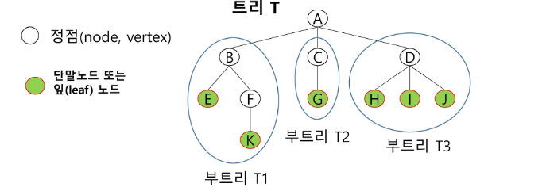


- 용어 정리

  

  - `노드(node)`: 트리의 원소

    - 트리 T의 노드 - A, B, C, D, E, F, G, H, I, J, K

  - `간선(edge)`: 노드를 연결하는 선. 부모 노드와 자식 노드를 연결

  - `루트 노드(root node)`: 트리의 시작 노드

    - 트리 T의 루트 노드 - A 

  - `형제 노드(sibling node)`: 같은 부모 노드의 자식 노드들

    - B, C, D는 형제 노드

  - `조상 노드`: 간선을 따라 루트 노드까지 이르는 경로에 있는 모든 노드들

    - K의 조상 노드: F, B, A

  - `서브 트리(subtree)`: 부모 노드와 연결된 간선을 끊었을 때 생성되는 트리

  - `자손 노드`: 서브 트리에 있는 하위 레벨의 노드들

    - B의 자손 노드 - E, F, K

  - `차수(degree)`

    - 노드의 차수: 노드에 연결된 자식 노드의 수

      \- B의 차수 = 2, C의 차수 = 1

    - 트리의 차수: 트리에 있는 노드의 차수 중에서 가장 큰 값

      \- 트리 T의 차수 = 3

    - `단말 노드(리프 노드)`: 차수가 0인 노드, 자식 노드가 없는 노드
  
  - `높이`
  
    - 노드의 높이: 루트에서 노드에 이르는 간선의 수, 노드의 레벨
  
      \- B의 높이 = 1, F의 높이 = 2
  
    - 트리의 높이: 트리에 있는 노드의 높이 중에서 가장 큰 값. 최대 레벨
  
      \- 트리 T의 높이 = 3
  
    
  
    


## 이진 트리

- 정의

  - 모든 노드들이 2개의 서브트리를 갖는 특별한 형태의 트리

  - 각 노드가 자식 노드를 최대한 2개까지만 가질 수 있는 트리

    - 왼쪽 자식 노드(left child node)
    - 오른쪽 자식 노드(right child node)

  - 이진 트리의 예

    

- 특성

  - 레벨 i에서의 노드의 최대 개수는 2^i개

  - 높이가 h인 이진 트리가 가질 수 있는 노드의 최소 개수는 (h+1)개가 되며, 최대 개수는 (2^(h+1) -1))개가 된다.

    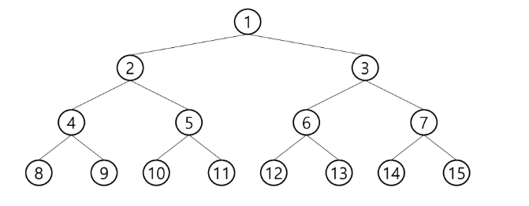


### - 종류

- `포화 이진 트리(Full Binary Tree)`

  - 모든 레벨에 노드가 포화상태로 차 있는 이진 트리

  - 높이가 h일 때, 최대의 노드 개수인 (2^(h+1) -1)의 노드를 가진 이진 트리

    \- 높이 3일 때 2^(3+1) -1 = 15개의 노드

  - 루트를 1번으로 하여 2^(h+1) -1까지 정해진 위치에 대한 노드 번호를 가짐

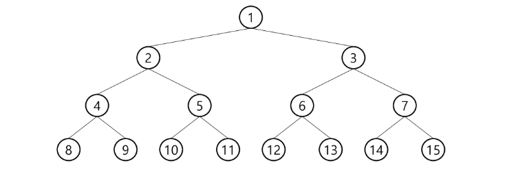


- `완전 이진 트리(Complete Binary Tree)`

  - 높이가 h이고 노드 수가 n개일 때 (단, h+1 <= n < 2^(h+1) -1), 포화 이진 트리의 노드 번호 1번부터 n번까지 빈 자리가 없는 이진 트리

  - ex. 노드가 10개인 완전 이진 트리

    

- `편향 이진 트리(Skewed Binary Tree)`

  - 높이 h에 대한 최소 개수의 노드를 가지면서 한쪽 방향의 자식 노드만을 가진 이진 트리

    \- 왼쪽 편향 이진 트리

    \- 오른쪽 편향 이진 트리
  
  


### - 순회

- `순회(traversal)`: <u>트리의 노드들을 체계적으로 방문(visit)하는 것</u>을 말하는데 트리는 비 선형 구조이기 때문에 선형 구조에서와 같이 선후 연결 관계를 알 수 없다.

  따라서 특별한 방법이 필요하다.

  

- 3가지의 기본적인 순회 방법

  - `전위 순회(preorder traversal)`: **VLR**
    - 부모 노드 방문 후, 자식 노드를 좌, 우 순서로 방문한다
  - `중위 순회(inorder traversal)`: **LVR**
    - 왼쪽 자식 노드, 부모 노드, 오른쪽 자식 노드 순으로 방문한다.
  - `후위 순회(postorder traversal)`: **LRV**
    - 자식 노드를 좌우 순서로 방문한 후, 부모 노드로 방문한다. 


- **전위 순회(preorder traversal)**

  - 수행 방법

    1. 현재 노드 n을 방문하여 처리한다. -> V
    2. 현재 노드 n의 왼쪽 서브트리로 이동한다 -> L
    3. 현재 노드 n의 오른쪽 서브트리로 이동한다 -> R

  - 중간부터 시작하면 위로 올라가지 않음! 해당 서브 트리 안에서 끝난다.

  - 전위 순회 알고리즘

    ```python
    def preorder_traverse(T):
        if T:	# T is not None
            # 그 정점에서 처리할 일
            visit(T)	# print(T.item)
            # 이후 다시 호출
            preorder_traverse(T.left)
            preorder_traverse(T.right)
    ```

    ```python
    def pre_order(v):
    	if v:    # 0인지 아닌지만 보면 됨 (존재하는 정점인지)
    		print(v)    # visit() - 방문해서 해야 할 일 
    		pre_order(ch1[v])    # 왼쪽 자식 노드로 이동
    		pre_order(ch2[v])    # 오른쪽 자식 노드로 
    ```
  
    
  
  - 예시
  
    


- **중위 순회(inorder traversal)**

  - 수행 방법

    1. 현재 노드 n의 왼쪽 서브트리로 이동한다: L
    2. 현재 노드 n을 방문하여 처리한다: V
    3. 현재 노드 n의 오른쪽 서브트리로 이동한다: R

  - 중위 순회 알고리즘

    ```python
    def inorder_traversal(T):
        if T:	# T is not None
            inorder_traverse(T.left)
            visit(T)	# print(T.item)
            inorder_traverse(T.right)
    ```
  
    ```python
    def in_order(v):
    	if v:
    		in_order(ch1[v])
    		print(v)
    		in_order(ch2[v])
    ```
  
    
  
  - 예시
  
    


- **후위 순회(postorder traversal)**

  - 수행 방법
    1. 현재 노드 n의 왼쪽 서브트리로 이동한다: L
    2. 현재 노드 n의 오른쪽 서브트리로 이동한다: R
    3. 현재 노드 n을 방문하여 처리한다: V

  - 후위 순회 알고리즘

    ```python
    def postorder_traverse(T):
        if T:	# T is not None
            postorder_traverse(T.left)
            postorder_traverse(T.right)
            visit(T)	# print(T.item)
    ```
    
    ```python
    def post_order(v):
    	if v:
    		post_order(ch1[v])
    		post_order(ch2[v])
    		print(v)
    ```
    
    
    
    - 예시
  
      


- **완전이진트리에서의 순회**

  ```python
  def pre_order(v):
      global last
      if v <= last:	# 마지막 정점 이내
          print(v)	# visit(v)
          pre_order(v * 2)	# 왼쪽 자식 정점 방문
          pre_order(v * 2 + 1) # 오른쪽 자식 정점 방문
  ```

  

### - 표현

#### + 배열

- 배열을 이용한 이진 트리의 표현
  - 이진 트리에 각 노드 번호를 다음과 같이 부여 (완전 이진 트리)
  
  - 루트의 번호를 1로 함
  
  - 레벨 n에 있는 노드에 대하여 왼쪽부터 오른쪽으로 2^n부터 2^(n+1) -1 까지 번호를 차례로 부여
  
    
  
  


- 노드 번호의 성질
  - 노드 번호가 i인 노드의 부모 노드 번호?  `⌊i/2⌋` (i/2 이하의 정수 중 가장 큰 정수)
  - 노드 번호가 i인 노드의 왼쪽 자식 노드 번호? `2*i`
  - 노드 번호가 i인 노드의 오른쪽 자식 노드 번호? `2*i+1`
  - 레벨 n의 노드 번호 시작 번호는? `2^n`

  

  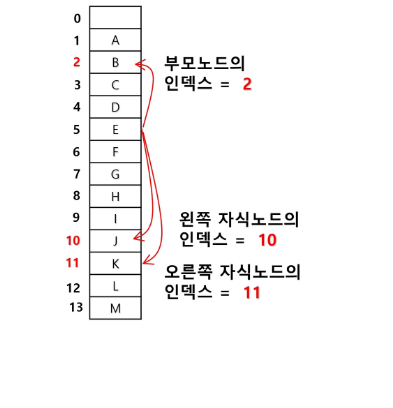

  - 노드 번호를 배열의 인덱스로 사용

  - 높이가 h인 이진 트리를 위한 배열의 크기는?

    - 레벨 i의 최대 노드 수는? `2^i`
    - 따라서 1 + 2 + 4 + 8 + ... + 2^i = ∑2^i = 2^(h+1) -1

    
    


#### + 저장

- 부모 번호를 인덱스로 자식 번호를 저장

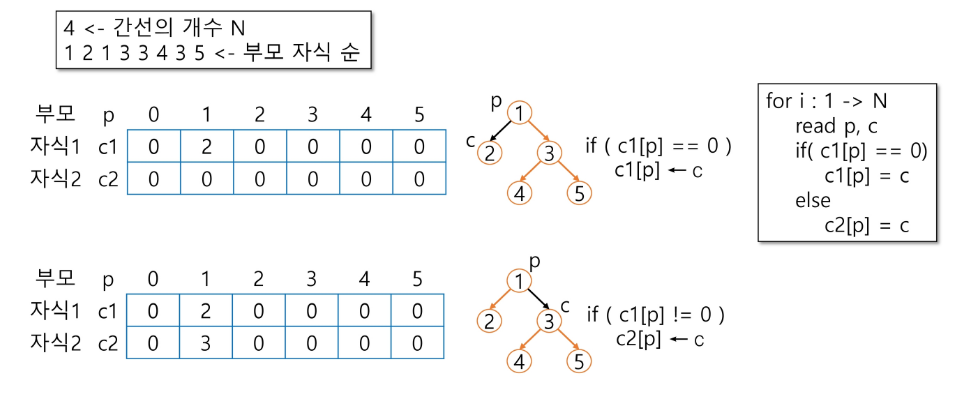


```pseudocode
for i: 1 -> N
	read p, c
	# 첫 번째 자식인지 확인
	if( c1[p] == 0)
		c1[p] = c
    else
    	c2[p] = c
```


```python
'''
4
1 2 1 3 3 4 3 5
'''

E = int(input())	# edge 수
arr = list(map(int, input().split()))
V = E + 1	# 정점 수 == 1번부터 V번까지 정점이 있을 때 마지막 정점

# 부모 번호를 인덱스로 자식 번호 저장
ch1 = [0] * (V+1)	# 자식 1
ch2 = [0] * (V+1)	# 자식 2
for i in range(E):
    p, c = arr[i*2], arr[i*2+1]
    if ch1[p] == 0:	# 아직 자식이 없는 경우
        ch1[p] = c
	else:
        ch2[p] = c
        
print(ch1)	# [0, 2, 0, 4, 0, 0]
print(ch2) 	# [0, 3, 0, 5, 0, 0]
```

```
* 이진 Tree 정점 번호 규칙
	- 포화 이진 트리: 부모 < 자식
	- 그 외(더 자주 나오는 경우): 1번 루트 X (루트를 직접 구해야 할 수도!), 부모 < 자식 X
```


- 자식 번호를 인덱스로 부모 인덱스 저장


```python
'''
5
2 1 2 4 4 3 4 5
'''

# 자식 번호를 인덱스로 부모 번호 저장 => root 찾기, 조상 찾기에 쓴다
par = [0] * (v+1)
for i in range(E):    # 부모-자식 E개의 쌍
	p, c = arr[i*2], arr[i*2+1]
	par[c] = p	# 자식은 부모가 하나뿐이다!

print(par)
# [0, 2, 0, 4, 2, 4]
# 부모가 0이면 root
```


- 루트 찾기, 조상 찾기


```python
# root 찾기
root = 1
for i in range(1, V+1):
	if par[i] == 0:
		root = i
		break
```

```python
# 조상 찾기
anc = []   # 조상 목록 저장
v = 5   # 조상을 찾을 정점 번호
while par[v] != 0:   # v가 root가 아니면 (부모가 있으면)
	anc.append(par[v])	# 부모를 저장해 나감
	v = par[v]   # v의 부모(par[v])를 자식으로   
```


- 배열을 이용한 이진 트리의 표현의 단점
  - 편향 이진 트리의 경우에 사용하지 않는 배열 원소에 대한 메모리 공간 낭비 발생
  - 트리의 중간에 새로운 노드를 삽입하거나 기존의 노드를 삭제할 경우 배열의 크기 변경 어려워 비효율적


#### + 연결 리스트

- 배열을 이용한 이진 트리의 표현의 단점을 보완하기 위해 연결 리스트를 이용하여 트리를 표현할 수 있다.

- 연결 자료구조를 이용한 이진트리의 표현

  - 이진 트리의 모든 노드는 최대 2개의 자식 노드를 가지므로 일정한 구조의 단순 연결 리스트 노드를 사용하여 구현

    

- 완전 이진 트리의 연결 리스트 표현

  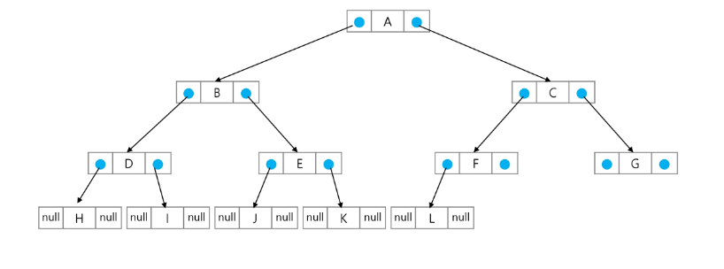

- 연습문제

  첫 줄에는 트리의 정점의 총 수 V가 주어진다. 그 다음 줄에는 V-1개 간선이 나열된다. 간선은 그것을 이루는 두 정점으로 표기된다. 간선은 항상 "부모-자식" 순서로 표기된다. 아래 예에서 두 번째 줄 처음 1과 2는 정점 1과 2를 잇는 간선을 의미하며 1이 부모, 2가 자식을 의미한다. 간선은 부모 정점 번호가 작은 것부터 나열되고, 부모 정점이 동일하다면 자식 정점 번호가 작은 것부터 나열된다.

  다음 이진 트리 표현에 대하여 전위 순회하여 정점의 번호를 출력하시오.

  ```
  13 <- 정점의 개수
  1 2 1 3 2 4 3 5 3 6 4 7 5 8 5 9 6 10 6 11 7 12 11 13
  ```

   


### - 수식 트리

- 수식을 표현하는 이진 트리

- 수식 이진 트리(Expression Binary Tree)라고 부르기도 함

- 연산자는 루트 노드이거나 가지 노드

- 피연산자는 모두 잎 노드

  

#### + 순회

- 중위 순회: A / B * C * D + E (식의 중위 표기법)

- 후위 순회: A B / C * D * E + (식의 후위 표기법)

- 전위 순회: + * * / A B C D E (식의 전위 표기법)

  


---


## 이진 탐색 트리

- 개요

  - 탐색 작업을 효율적으로 하기 위한 자료구조
  - 모든 원소는 서로 다른 유일한 키를 갖는다.
  - key(왼쪽 서브트리) < key(루트 노드) < key(오른쪽 서브트리)
  - 왼쪽 서브트리와 오른쪽 서브트리도 이진 탐색 트리다. (재귀적 구조)
  - 중위 순회하면 오름차순으로 정렬된 값을 얻을 수 있다.

  

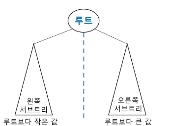


### - 연산

#### + **탐색 연산**

- 루트에서 시작한다.

- 탐색할 키 값 x를 루트 노드의 키 값과 비교한다.

  \- `키 값 x = 루트 노드의 키 값` 인 경우: 원하는 원소를 찾았으므로 탐색 연산 성공

  \- `키 값 x < 루트 노드의 키 값` 인 경우: 루트 노드의 왼쪽 서브트리에 대해서 탐색 연산 수행

  \- `키 값 x > 루트 노드의 키 값` 인 경우: 루트 노드의 오른쪽 서브트리에 대해서 탐색 연산 수행

- 서브 트리에 대해서 순환적으로 탐색 연산을 반복한다.

- 예시

  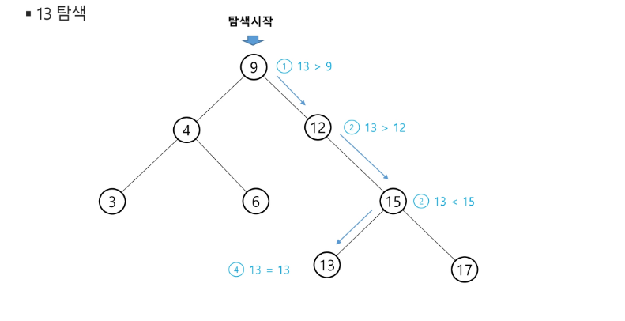


#### + 삽입 연산

- 먼저 탐색 연산을 수행

  - 삽입할 원소와 같은 원소가 트리에 있으면 삽입할 수 없으므로 같은 원소가 트리에 있는지 탐색하여 확인한다.
  - 탐색에서 탐색 실패가 결정되는 위치가 삽입 위치가 된다.

- 탐색 실패한 위치에 원소를 삽입한다.

- 예시 (5 삽입)

  


### - 성능

- 탐색(searching), 삽입(insertion), 삭제(deletion) 시간은 트리의 높이 만큼 시간이 걸린다.

  - O(h), h: BST의 깊이(height)

- 평균의 경우

  - 이진 트리가 균형적으로 생성되어 있는 경우
  - O(log n)

- 최악의 경우

  - 한쪽으로 치우친 경사 이진트리의 경우
  - O(n)
  - 순차 탐색과 시간복잡도가 같다

  

- 검색 알고리즘의 비교

  - 배열에서의 순차 검색: O(N)

  - 정렬된 배열에서의 순차 검색: O(N)

  - 정렬된 배열에서의 이진 탐색: O(logN)

    - 고정 배열 크기와 삽입, 삭제 시 추가 연산 필요

  - 이진 탐색 트리에서의 평균: O(logN)

    - 최악의 경우: O(N)

    - 완전 이진 트리 또는 균형 트리로 바꿀 수 있다면 최악의 경우를 없앨 수 있다.

      \- 새로운 원소를 삽입할 때 삽입 시간을 줄인다.

      \- 평균과 최악의 시간이 같다. O(logn)

  - 해쉬 검색: O(1)
    - 추가 저장 공간이 필요


### - 연산 연습

- 삭제 연산

- 왼쪽 서브 트리의 가장 큰 잎 찾거나, 오른쪽 서브 트리에서 가장 작은 잎 찾기

- 복잡함..! 일단 개요 중심으로 보기

  


---


## 힙

- **힙(heap)**	
  - 완전 이진 트리에 있는 노드 중에서 키값이 가장 큰 노드나 키값이 가장 작은 노드를 찾기 위해서 만든 자료구조


- 최대 힙(max heap)
  - 키값이 가장 큰 노드를 찾기 위한 <u>완전 이진 트리</u>
  - {부모 노드의 키 값 > 자식 노드의 키 값}
  - 루트 노드: 키값이 가장 큰 노드


- 최소 힙(min heap)

  - 키값이 가장 작은 노드를 찾기 위한 완전 이진 트리

  - {부모 노드의 키 값 < 자식 노드의 키 값}

  - 루트 노드: 키값이 가장 작은 노드

    

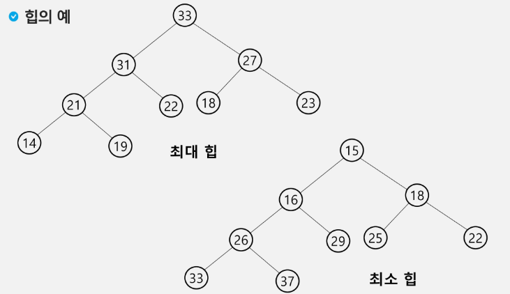

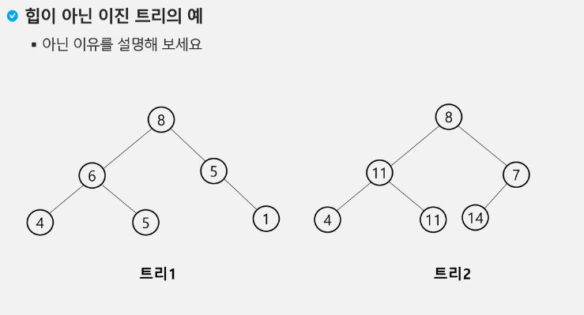


### - 힙 연산 : 삽입

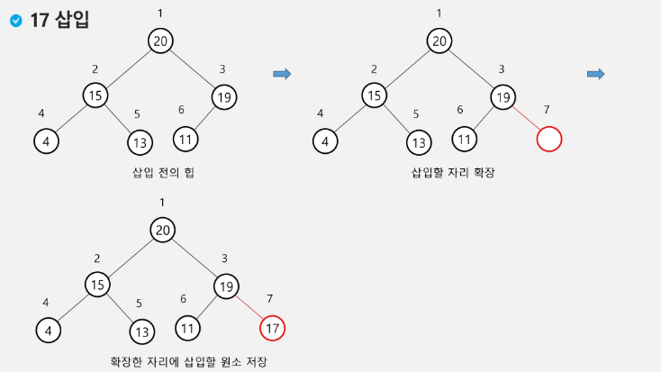

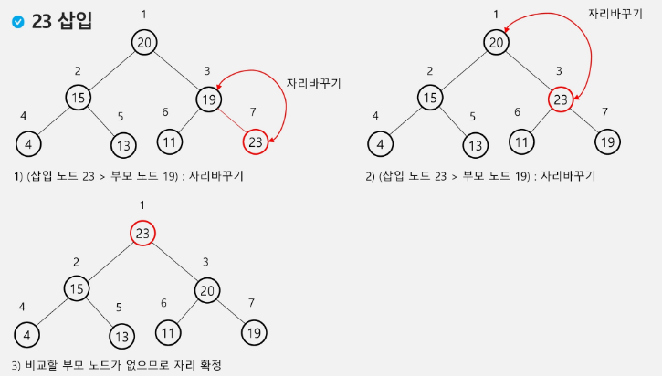

```python
'''
최대 100개의 정수가 키로 입력 (키 != 정점 번호)
최대 힙
'''

# 삽입 연산
def enq(n):
    global last
    # 완전 이진 트리 유지
    last += 1 	# 정점 추가
    tree[last] = n	# 마지막 정점에 방금 받은 키 값 추가
    # 최대 힙 유지
    c = last	# 새로 추가된 정점을 자식으로
    p = c // 2	# 완전이진트리에서의 부모 정점 번호
    while p >= 1 and tree[p] < tree[c]:	# 부모가 있고, 자식의 키 값이 더 크면
        tree[p], tree[c] = tree[c], tree[p]	# 교환
        c = p
        p = c // 2	# 부모를 새로운 자식으로 해서 다시 반복
    

# 포화이진트리의 정점 번호 1~100
tree = [0] * (101)
last = 0		# 마지막 정점 번호
```


### - 힙 연산 : 삭제

- 힙에서는 루트 노드의 원소만을 삭제할 수 있다.
- 루트 노드의 원소를 삭제하여 반환한다.
- 힙의 종류에 따라 최대값 또는 최소값을 구할 수 있다.

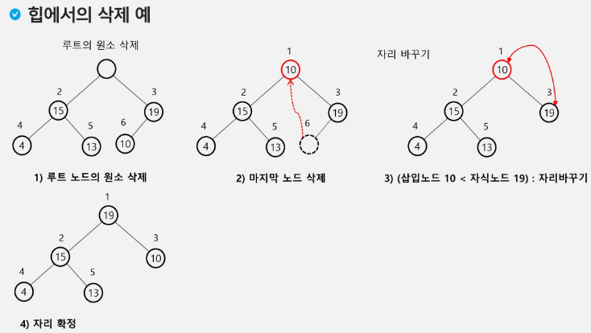

```python
# 삭제 연산
def deq():
    global last
    tmp = tree[1] 	# 루트의 key값
    tree[1] = tree[last] 	# 마지막 정점의 키를 루트에 복사
    last -= 1		# 마지막 정점 삭제
    # 부모 > 자식 규칙 유지
    p = 1
    c = p * 2 	# 왼쪽 자식 노드 번호
    while c <= last:	# 왼쪽 자식이 있으면
        if c + 1 <= last and tree[c] < tree[c+1]:	# 오른쪽 자식 노드도 있고 더 크면
            c += 1	# 오른쪽 자식 선택
        if tree[p] < tree[c]:	# 자식의 키 값이 더 크면 교환
            tree[p], tree[c] = tree[c], tree[p]
            p = c
            c = p * 2
        else:
            break
    return tmp	# 저장해둔 값을 꺼내자
```


### - 우선순위 큐

- 힙(Heap)
  - 완전 이진 트리로 구현된 자료구조로서, 키값이 가장 큰 노드나 가장 작은 노드를 찾기에 유용한 자료구조
  - 힙의 키를 우선순위로 활용하여 우선순위 큐를 구현할 수 있다.
  - http://pages.cs.wisc.edu/~vernon/cs367/notes/11.PRIORITY-Q.html


