# Computational Thinking

[강의자료](https://edu.ssafy.com/data/upload_files/crossUpload/openLrn/ebook/unzip/A2022032110500476800/index.html)  2022-03-21


## 서문

- **Problem Solving**
  - 문제를 봤는데 어떻게 풀어야 하는지 전혀 모르겠다.
  - Dijkstra 알고리즘 아무리 봐도, "될 것 같기는 한데" 이유는 모르겠다.
  - 도구나 라이브러리는 잘 쓰는데 프로그램 처음부터 짜려면 막막하다.
  - 어떻게 프로그램을 짜면 더 빠른지, 더 느린지 전혀 감이 없다.
  - log n을 본 적이 없거나, 본 적이 있는데 무슨 뜻이라고 한 마디로 설명하지는 못한다. 혹은, log n의 밑이 10이나 e라고 알고 있다. 
  - Problem Solving 자료를 보고 시간을 들여도 발전이 없다.


- **하나라도 일치하는 상황이 있다면, 어쩌면**
  - Problem Solving을 본격적으로 공부할 준비가 안 된 것일 수 있다.
  - "왜 이해가 안 되는 것인가?"


- **필요한 것은, 아마도**

  - 논리적으로 정확하게 확인하는 과정에 대한 연습이 없어서이다.

  - 되는 것 같다는 기분이나 "공식을 외우는 것" 말고 정확하게 확인해 본 적이 있는가?

  - 프로그램을 짜기 시작하기 전에, 정확한 결과가 나올 것인지, 얼마나 빠르게 돌아갈 것인지 미리 알 수 있는가?

  - 확인이 안 된 상태에서 프로그램을 짜기 시작하면, 결과가 정확할지, 얼마나 빠를지 예측할 수 없고, 제대로 된 결과가 나오지 않으면 고치는 것이 어렵고 무작정 여러가지를 시도해 볼 수 밖에 없다.

  - 정확히 확인하는 훈련이 되어 있지 않으면, 단순 작업 이상의 코드를 작성하기 어렵고, 다른 사람의 코드를 고치는 것도 매우 어렵다.

  - 정확하게 확인하는 과정을 수많은 세월 동안 정리해 둔 것이 "증명" 기법이다.

  - 증명 기법은 딱딱한 것이 아닌 기발한 아이디어들의 집합이고 "이해하면 재미있는 그림"들과 같다.

  - 이 과정에서 쉬운 문제들을 보고 정확하게 확인하는 것을 연습해 보자.

    ```
    "어떤 전공도 상식선에서 이해되는 분야는 없다."
    ```


## 0. 서론 - 프로그래밍과 논리 / 수학

- **프로그래밍의 어려운 점 두 가지**
  - 프로그래밍 언어 문법과 라이브러리 사용
  - 논리 (Hard Logic)


### - 문법과 라이브러리

- 많이 알려진 어려운 점

  

- 위 프로그램이 무엇을 하는 것인지 처음 보는 사람은 알 수 없음

- 능숙해지기 위해 많은 훈련이 필요하지만, 이 과정의 중요 목표는 아님
- 프로그래밍을 최초로 배울 때 약간의 어려움이 있지만 훈련에 비례하여 실력이 느는 경향이 있음
- 일반 상식으로 원래 알고 있는 것이 아니기 때문에 훈련의 필요성에 대해 반감이 없음


### - 논리 (Hard Logic)

- **Hard vs. Soft Logic**


- **카드 문제**

  - 사실: 모든 카드의 한쪽에는 알파벳이, 다른 쪽에는 숫자가 써 있음

  - 주장: 만약 한쪽이 D이면 반대쪽은 3

    주장이 사실인지 확인하기 위해 다음 카드들 중 반드시 뒤집어 보아야 하는 것은 몇 개 이고 어느 것인가?

    

    - [D]를 뒤집어 보아야 한다는 것은 누구나 알아 냄
    - [3]을 뒤집어 보아야 한다고 말하는 경우가 많이 있음
    - 중요: [3] 뒤에 [D]가 있든 없든 주장이 사실인지 여부에 영향이 없음
    - [7]을 뒤집어 볼 필요가 없다고 말하는 경우도 많음
    - 중요: [7] 뒤에 [D]가 있으면 주장이 성립하지 않게 됨


- **맥주집 문제**

  - 규칙: 20세 이하인 사람은 맥주를 마실 수 없음

  - 나이 혹은 마시고 있는 것을 표시한 다음 4명 중 확인이 필요한 사람은 몇 명이고 누구인가?

    


- **카드 문제와 맥주집 문제의 비교**
  - 맥주집 문제가 훨씬 풀기 쉽다
  - 사실, 두 문제는 완전히 같은 문제임. 즉, 논리적 구성은 완전히 동일함
  - 왜 맥주집 문제가 풀기 쉬운가?
  - 논리 구조를 정확히 이해하고 맥주집 문제를 푸는 사람은 카드 문제를 똑같이 풀 수 있음
  - 즉, 맥주집 문제를 풀 때 논리를 사용한 것이 아니다!


- **Hard vs. Soft Logic**
  - 맥주집 문제를 풀 때는 직관을 사용한 것
  - 직관은 논리적인 느낌을 주는 것
  - 직관의 장점은 (익숙한 상황에서) 빠르다는 것
  - 직관의 단점은 정확하지 않다는 것 (가끔은 익숙한 상황에서도 틀림)
  - 또 다른 단점은 강한 착각을 일으킨다는 것


- **과자와 버스**
  - "너 과자 몇 개 먹었니?"  vs. "버스 타려고 하는데 천원 있니?"
  - 두 질문은 같은 표현을 사용하지만, 하나는 정확한 개수를 요구하고, 다른 하나는 천원 이상이 있는지 물어보는 것


- **토플과 복권**
  - "합격하려면 토플 500점 이상 혹은 토익 600점 이상이 필요"  vs. "복권에 당첨되면 자동차 혹은 천만원을 줍니다"
  - 두 말은 같은 표현을 사용하지만 하나는 inclusive or, 다른 하나는 exclusive or


- **일상 생활에서는**
  - Soft Logic이 빠르기 때문에 유용
  - 논리적으로 부정확한 표현을 사용하지만, 어떤 의미인지 모든 사람이 이미 알고 있다는 가정이 존재


- **프로그래밍은 Hard Logic을 사용**
  - 프로그래밍 언어의 표현들이 모두 논리학에서 나온 것
  - 사용되는 수많은 알고리즘들을 이해하기 위해서는 Hard Logic이 필요


- **오해의 근원**
  - Soft Logic으로 알고리즘을 이해하려고 하는 것!
  - 알고리즘 설명을 보고 또 봐도 이해가 안되는 것은 증명을 안 봤기 때문
  - 증명을 봐도 이해가 안 되는 것은 직관으로 이해하려고 하기 때문
  - 가끔 직관적으로 이해되는 알고리즘이 있지만 조금만 어려워지면 직관으로 완전한 이해를 얻는 것은 사실상 불가능


### - [참고]

- **명제**
  - 참이나 거짓을 알 수 있는 식이나 문장
  - p, q, r, ... 로 표현
  - ex. 서울은 대한민국의 수도다.  1 + 1 = 3


- **진릿값**
  - 참이나 거짓을 표현
  - T, F 또는 1, 0


- **[연산(결합)]**

  - 부정 `NOT`

    - p가 명제일 때, 명제의 진릿값이 반대

    - `~p` 또는 `¬p`로 표기 (Not p 또는 p의 부정으로 읽음)

      

  - 논리곱 `AND`

    - p, q가 명제일 때, p, q 모두 참일 때만 참이 되는 명제

    - p ^ q (p and q, p 그리고 q)

      

  - 논리합 `OR`

    - p, q가 명제일 때, p, q 모두 거짓일 때만 거짓이 되는 명제

    - p V q (p or q, p 또는 q)

      

  - 배타적 논리합 `XOR`

    - p, q가 명제일 때, p, q 중 하나만 참일 때 참이 되는 명제

    - p ⊕ q (p xor q)

      

- **[합성]**

  - 연산자 우선 순위

    - `¬` > `v`, `^` > `→`, `↔`

  - <u>항진명제</u>: 진릿값이 항상 참

  - <u>모순명제</u>: 진릿값이 항상 거짓

  - <u>사건명제</u>: 항진명제도 모순명제도 아닌 명제

  - <u>조건명제</u>:

    - p, q가 명제일 때, 명제 p가 조건(또는 원인), q가 결론(또는 결과)로 제시되는 명제

    - p → q (p이면 q이다)

      

  - <u>쌍방조건명제</u>

    - p, q가 명제일 때, 명제 p와 q가 모두 조건이면서 결론인 명제

    - p ↔ q (p면 q고, q면 p다)

      

- **조건명제의 역, 이, 대우**

  - 역: q → p

  - 이: ¬p → ¬q

  - 대우: ¬q → ¬p

    


- **논리 연습**

  - 문제 1.다음을 명제식 형태로 쓰고 참인지 거짓인지 판단하시오

    ①  만약 0이 홀수라면, 미국에서 2080년 월드컵이 열린다.

    ② 만약 19893827938274839이 Prime Number라면, 2는 짝수이다.

    

  - 문제 2. p와 q가 명제이고 p → q가 거짓이라고 하자. 다음 명제식의 참 거짓은 어떻게 되는가?

    ①   ~p → q			② p v q		③ q → p

    

  - 문제 3. 다음 명제들의 역, 이, 대우를 쓰시오.

    ① 만약 0이 홀수라면, 미국에서 2080년 월드컵이 열린다.

    ② 만약 19893827938274839이 Prime Number라면, 2는 짝수이다.

    

  - 문제 4. 다음 명제식의 진리표를 만드시오.

    (1) p ^ (q → ~p)

    (2) (p ^ q) → r
    
    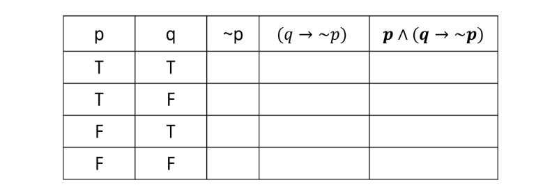

### - 증명

- **증명**
  - 증명은 명확한 명제식으로 표현할 수 있는 것이라야 함
  - 보통은 정확한 명제식까지 쓰지는 않으나 근본적으로는 명제식으로 바꿀 수 있음
  - 증명에 대한 수많은 오해가 p → q를 p ↔ q와 혼동하는 것에서 일어남


- 모든 당구공은 색이 같다는 다음 증명에서 잘못된 것은?

  - 수학적 귀납법: P(1)이 참이고 P(n) → P(n+1)이 참이면 P(n)은 모든 자연수 n에 대하여 참이다.

    모든 자연수 n에 대해 당구공 n개가 들어 있는 집합에서 그 집합에 포함된 당구공은 모두 색이 같다는 것을 증명함

    P(1): 당구공 1개가 들어있는 집합은 모두 색이 같음

    P(n) → P(n+1)을 증명하기 위해 P(n)이 참이라고 가정

    당구공 n+1개가 들어 있는 임의의 집합을 생각함

    이 집합에서 하나를 빼면 당구공 n개가 있는 집합이 되므로 지금 상황에서 모든 당구공의 색이 같음

    방금 뺀 원소를 다시 넣고, 다른 당구공을 빼면 역시 당구공 n개가 있는 집합이 되므로 지금 상황에서도 모든 당구공의 색이 같음

    <u>위의 두 상황에서 처음 뺀 당구공과 두번째로 뺀 당구공의 색이 같음을 알 수 있으므로</u> 당구공 n+1개가 들어 있는 임의의 집합은 색이 같은 것 만을 포함함

    대부분의 사람들이 P(n)이 참이라고 가정할 수 없다고 반론함

    수학적 귀납법에서 필요한 것은 P(n) → P(n+1)이 참임을 보이는 것 뿐이므로 P(n)이 정말로 참일 필요는 없음

    위 증명에서 실제로 잘못된 것은 다음 부분

    - 위의 두 상황에서 처음 뺀 당구공과 두번째로 뺀 당구공의 색이 같음을 알 수 있으므로...

    처음 뺀 당구공과 두번째로 뺀 당구공의 색이 같다는 것은 공통 부분이 있다는 것인데, 실제로 n=1인 경우, 즉 n+1=2인 경우 공통 부분이 없음


- Prime Number의 개수는 무한히 많다는 다음 증명은 옳은가?

  - Prime Number의 개수가 유한한 k개라고 가정

    모든 Prime Number를 다 곱하고 1을 더한 수를 n이라고 하자

    이 수 n은 어떤 Prime으로 나누어도 나머지가 1이다

    그런데 n은 어떤 Prime보다도 크므로 합성수이다

    합성수이지만 어떤 Prime으로 나누어지지 않으므로 모순 발생

    이 증명에 대한 반론으로 몇 개의 Prime이 더 존재하면 되는 것이 아니냐는 주장이 자주 있음

    위 증명은 "Prime Number가 k개이면 모순이 발생", 즉, "Prime Number가 k개" → "항상 거짓", 이 명제가 항상 참임을 확인할 것

    즉, "Prime Number가 k개"라는 명제가 항상 거짓일 수 밖에 없다!


### - 수학적 귀납법과 증명의 수준

- 수학적 귀납법의 기본형: P(1)이 참이고, P(n) → P(n+1)이 참이면 P(n)은 모든 자연수 n에 대해서 참이다

- 수학적 귀납법의 강한 형태: P(1)이 참이고, P(1) ^ P(2) ^ ... ^ P(n) → P(n+1)이 참이면 P(n)은 모든 자연수 n에 대해서 참이다.

  

- 다음 함수가 1부터 x까지의 합을 계산함을 증명해 보자

  ```c
  int sum(int x)
  {
      if (x <= 0) return 0;
      return x + sum(x-1);
  }
  ```

  - High-level 증명에서는 1부터 x까지 합의 정의 중 하나인 S(n) = S(n-1) + n을 그대로 코딩한 것이므로 증명이 된 것이라고 말하는 경우가 많음
  - 상세한 증명을 하려면 단순히 "답이 맞는 것이 당연하다"라고 말하는 것으로는 충분하지 않음
    - 증명이 가능한 명제를 만들어야 함
    - 이 경우 증명이 가능한 명제는 다음과 같음: "sum(x)가 리턴하는 값은 1+2+...+x의 값과 항상 같다"
    - 이제 수학적 귀납법을 적용할 수 있음
    - P(1)이 참이다: "sum(1)이 리턴하는 값은 1이다"를 증명하면 됨. 실제 코드에 1을 대입하면 1을 리턴함을 알 수 있음
    - P(x) → P(x+1)이 참이다: "sum(x-1)이 1+2+...+(x-1)을 리턴하면 sum(x)는 1+2+...+x를 리턴한다"를 증명하면 됨. 코드를 보면 sum(x)는 x+sum(x-1)의 값을 리턴함. sum(x-1)의 리턴 값은 1+2+...+(x-1)과 같다고 가정했으므로 sum(x)는 1+2+...+(x-1)+x = 1+2+...+x를 리턴함을 확인할 수 있음
    - sum(x-1)을 블랙박스로 보는 것이 이해에 도움을 줄 때가 있음


- **소팅의 사례**

  - High-level 증명에서는 소팅이 된다는 것을 직관적인 수준에서 설명하는 경우가 많음

  - 상세한 증명을 위해서는 증명이 가능한 명제가 필요

  - 배열 A[1], A[2], ..., A[n]을 소팅하는 알고리즘의 정확성을 증명하려고 한다면, 증명이 가능한 명제는 다음과 같을 것임: "A[1] < A[2] < ... < A[n]"

  - 버블 소트가 정확함을 어떻게 증명할 지 생각해 봅시다. 

    ```
    상세한 증명에 대한 경험이 없는 경우가 많고, 상세한 증명 없이는 확인하거나 이해할 수 없는 문제들이 많으므로 연습 문제들은 상세한 증명을 제시하는 것을 목표로 함
    ```

    

- **증명 연습**

  - <u>Trivial Proof</u>: ∀x, P(x) → Q(x)를 증명하려는데, Q(x)가 항상 참인 경우

  - 문제1: 다음 명제를 증명하시오

    ① 실수 x에 대해, 만약 x < -1이면 x² + ¼ > 0이다

    ② n이 홀수이면 4n³ + 6n² + 12는 짝수이다

    

  - <u>Vacuous Proof</u>: ∀x, P(x) → Q(x)를 증명하려는데, P(x)가 항상 거짓인 경우

  - 문제 2: 다음 명제를 증명하시오

    ① 실수 x에 대해, 만약 2x² - 4x + 4 < 0이면 x>8이다
  
    ② 4n³ + 6n² + 11는 짝수이면 n이 홀수이다


## 1. 논리와 증명

- 문제 1: 다음 명제들이 항진명제라는 것을 진리표를 이용해서 보이시오

  ① ~(~p ^ q) v q

  ② (~p v q) v (p ^ ~q)


- 문제 2: 다음 명제들이 모순명제라는 것을 진리표를 이용해서 보이시오

  ① (~p v q) ^ (p ^ ~q)

  ② (p ^ q) ^ (p ^ ~q)


- 문제 3: 다음 명제의 쌍들에 대해서 두 명제가 동등한지를 진리표를 이용해 확인하시오

  ① p ^ (p v q)와 p
  
  ② ~p v ~q와 ~(p v q)


- 문제 4: 명제식의 변형을 통하여 다음 명제를 간소화하시오.

  ① (p ^ ~q) v (p ^ q)

  ② (p v ~q) ^ (~p v ~q)


- 문제 5: 다음 명제들이 참인지 확인하시오. 단, R은 실수의 집합을 의미하고, Z는 정수의 집합을 의미한다.

  ① ∀x ∈ R, x² ≥ x

  ② ∀x ∈ Z, x² ≥ x

  ③ ∃x ∈ R, x² < x

  ④ ∃x ∈ Z, x² < x


- 문제 6. (직접 증명) n이 짝수이면 3n+5는 홀수임을 증명하라

  (힌트: n=2k로 두고 3n+5가 2(어떤 정수) +1 형태로 표현될 수 있는지...)


- 문제 7. n이 홀수이면 n²+n은 짝수임을 증명하라.


- 문제 8. m이 짝수이고 n이 홀수이면 2m+3n은 홀수임을 증명하라


- 문제 9: (대우를 증명) 자연수 n에 대해, n²  + 5가 홀수이면 n은 짝수임을 증명하라

  (힌트: 명제 대신, n이 홀수이면 n²+5은 짝수임을 증명한다.)

  ```
  n이 홀수 → n² + 5 = 짝수
  n = (2k+1)
  n² + 5 = (2k+1)² + 
  ```


- 문제 10: n²이 짝수이면 n은 짝수임을 증명하라.


- 문제 11: (경우를 나누어 증명) 자연수 n에 대해 n² + 5n + 3은 항상 홀수임을 증명하라.

  (힌트: n이 짝수인 경우와 홀수인 경우를 따로 증명한다.)

  ```
  # n이 짝수인 경우 => 홀수
  n = 2k
  4k² + 10k + 3 = 2(2k²+5k+1) +1
  
  # n이 홀수인 경우 => 홀수
  n = 2k+1
  (2k+1)² + 5(2k+1) + 3
  = 4k² + 4k + 1 + 10k + 8
  = 2(2k² + 7k + 4) + 1
  ```

  

- 문제 12: n²이 3의 배수이면 n은 3의 배수임을 증명하라.

  ```
  대우: n이 3의 배수가 아니면 n²은 3의 배수가 아니다
  n: 3k+1 / 3k+2
  n² = (3k+1)² = 9k²+6k+1 = 3(3k²+2k)+1 (3의 배수가 아님)
  n² = (3k+2)² = 9k²+12k+4 = 3(3k²+4k+1)+1 (3의 배수가 아님)
  ```

  


## 2. 수와 표현

- 약간의 설명

  컴퓨터는 0/1을 표현할 수 있는 비트들을 모아 수를 표현

  k개의 비트를 사용하면 0부터 2^k-1 까지 표현 가능

  사실, 꼭 저 범위인 것은 아님. 약속하는 방식에 따라 다르지만, 어떤 경우든 최대 2^k가지의 값을 표현하는 것이 가능

  10진수로 k자리를 쓰면 0부터 10^k-1까지 표현이 가능한 것과 완전히 동일한 과정

  어떤 값 n을 표현하기 위해서는 몇 개의 비트가 필요할까?

  2^k - 1 ≥ n이 성립해야 함 → 즉, 2^k ≥ n+1

  같은 의미로, k ≥ log(n+1) → 약 log n 비트가 필요

  x = log n과 2^x = n은 같은 말

  위의 식을 잘 보면, logn이란

  (가) 2의 몇 승이 n이 되느냐의 답

  (나) n을 표현하는 데 몇 비트가 필요한가의 답

  (다) 1로 시작해서 계속 두 배를 할 때 몇 번 하면 n이 되느냐의 답

  (라) n을 2로 계속 나눌 때 몇 번 나누면 거의 1이 되느냐에 대한 답

  x = logn일 때 x와 n을 비교하면 x가 더 작고, n이 커질수록 엄청나게 달라진다

  100자리로 표현할 수 있는 10진수 값은 읽을 수도 없을 정도로 큰 값이다

  컴퓨터 분야에서 로그의 밑은 항상 2

  32비트 컴퓨터의 주소 공간은 2^32 = 약 40억개 주소

  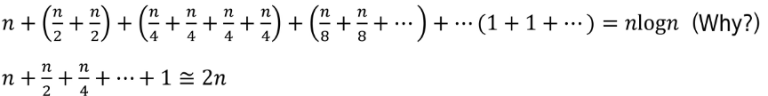

  위 두 식의 항의 개수는 log n개 (왜?)

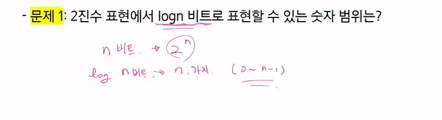


- 문제 2: 스무고개가 이상적으로 진행된다고 할 때, 맞힐 수 있는 답의 종류는 몇 가지인가?

  ```
  2^20 (각 질문마다 O, X 두 가지 경우 가능)
  ```

  

- 문제 3: n이 충분히 큰 값일 때 다음 중 어느 값이 더 큰가?

  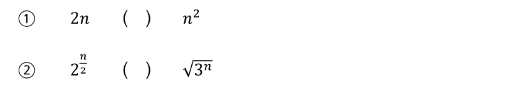

  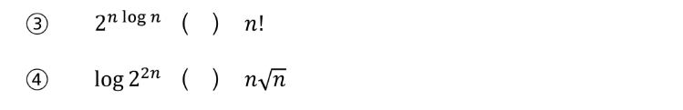


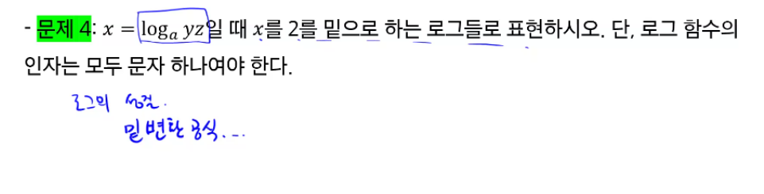

- 문제 5: 다음 함수들의 역함수를 구하시오

  ① f(x) = log(x-3) -5

  ② f(x) = 3 log(x+3) +1

  ③ f(X) = 2 x 3^x -1


## 3. 집합과 조합론

- **집합과 조합론에 대한 약간의 설명**
  
  - 두 집합 A와 B에 대해 A가 B의 부분집합임을 증명한다는 것은 A의 임의의 원소가 B에 포함됨을 보이는 것과 같다
  - 예를 들어 모든 4의 배수는 2의 배수라는 것을 증명하려면, 4k=2(2k)임을 보이면 되는 것이다.
  - 두 집합 A와 B가 같다는 것을 증명하기 위해서는 A가 B의 부분집합이고 B가 A의 부분집합임을 증명하면 된다.
  
  - 다음 두 집합이 같다는 것을 상세히 증명해보자.
  
    ```
    A = {x|x=2k+1, k는 자연수}, B = {x|x=4k+1 혹은 x=4k+3, k는 자연수}
    ```
  
    - A가 B의 부분집합이다:
  
      A에 포함되는 임의의 원소 x를 가정
  
      y = 2k+1임
  
      k가 짝수(=2t)인 경우와 홀수(=2t+1)인 경우로 나눔
  
      짝수인 경우 x=2k+1=2(2t)+1=4t+1로서, x는 B에 포함됨
  
      홀수인 경우 x=2k+1=2(2t+1)+1=4t+3로서, x는 B에 포함됨
  
      모든 가능한 경우에 x는 B에 포함됨
  
    - B가 A의 부분집합이다:
  
      B에 포함되는 임의의 원소 x를 가정
  
      x=4k+1인 경우, x=4k+1=2(2k)+1로서 x는 A에 포함됨. x=4k+3인 경우, x=4k+3=2(2k+1)+1로서 x는 A에 포함됨
  
      모든 가능한 경우에 x는 B에 포함됨
  
    - 위 두 가지 증명에서 집합 A와 B는 같다.
  
      
  
  - 조합론은 경우의 수를 따지는 문제들을 보통 말한다
  
  - 조합은 개수는 C를 이용하여 표현하기도 하지만 괄호 표현을 더 많이 쓴다.
  


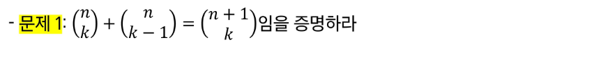

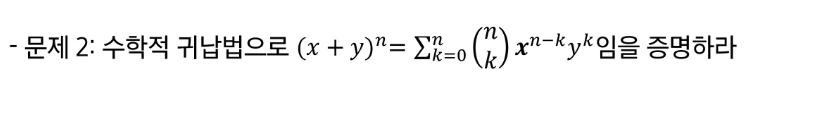

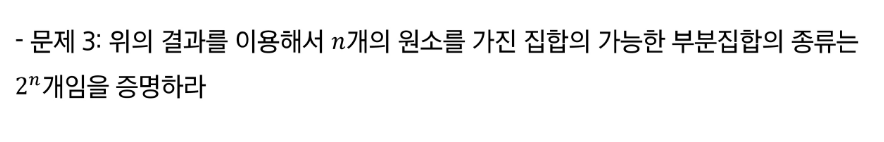

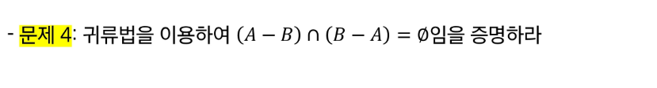


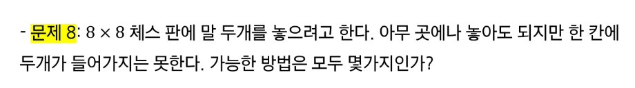

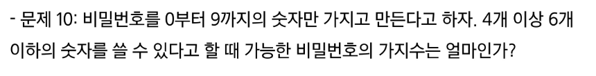

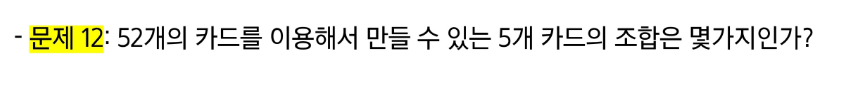

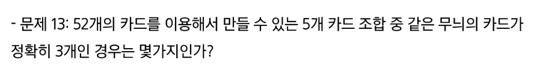

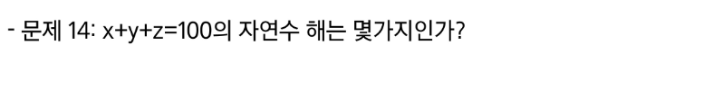

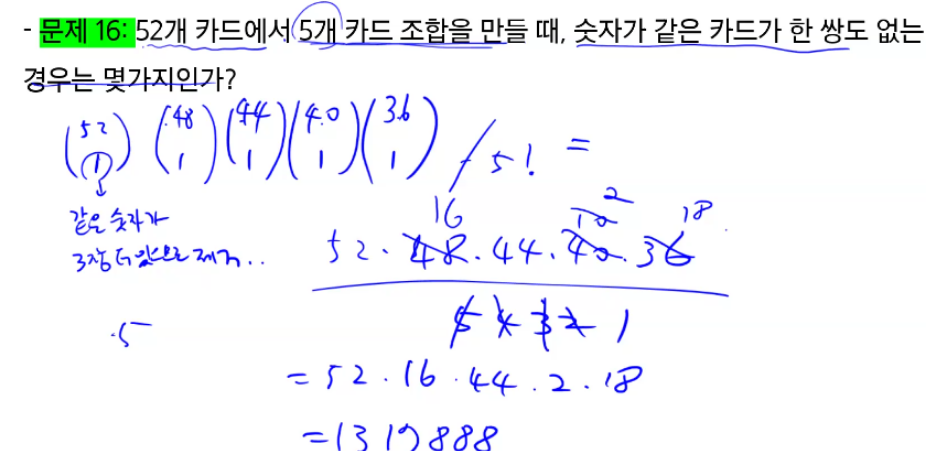


## 4. 기초 수식

- 약간의 설명
  - 알고리즘의 시간 복잡도를 표현할 수 있는 다양한 수식들이 존재한다. 
  - 풀이법을 익혀 두어야 알고리즘의 시간 복잡도를 계산할 수 있고, 알고리즘이 시간이 얼마나 걸릴지 예측할 수 있다.


- 연습 문제들: 다음 재귀식들을 O() notation 수준으로 풀어라.

  

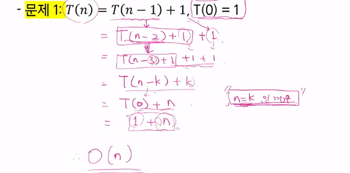

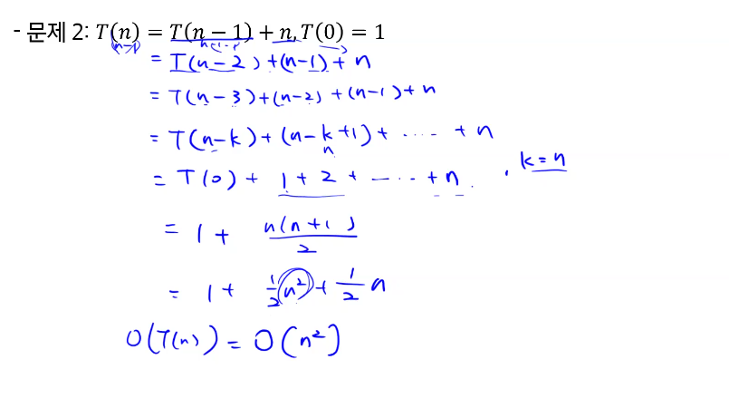

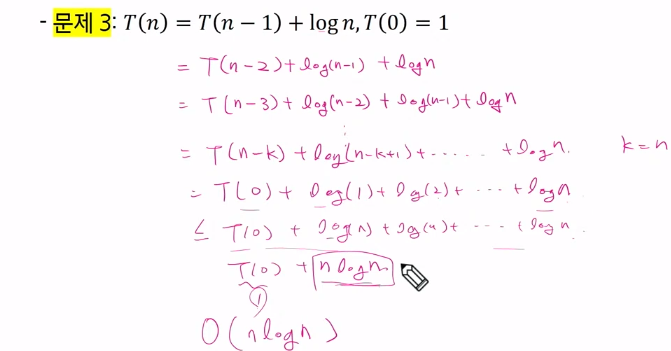

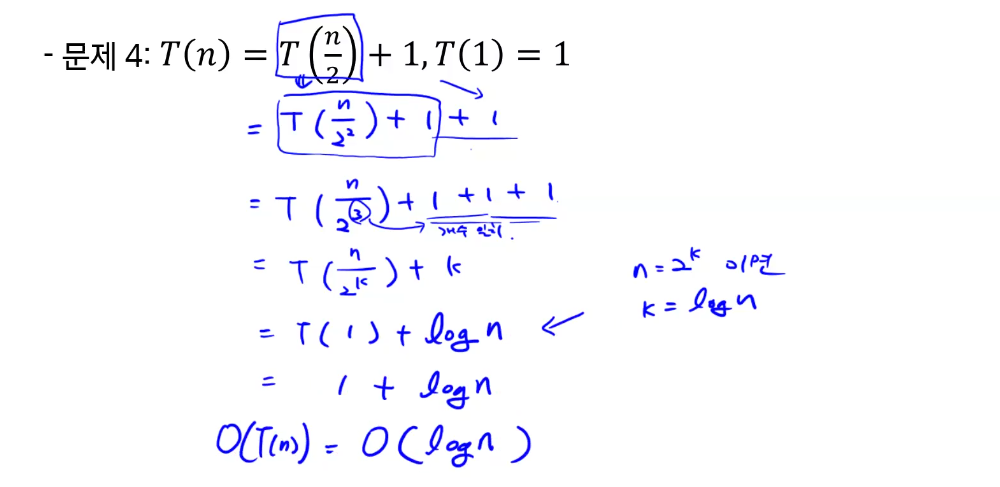

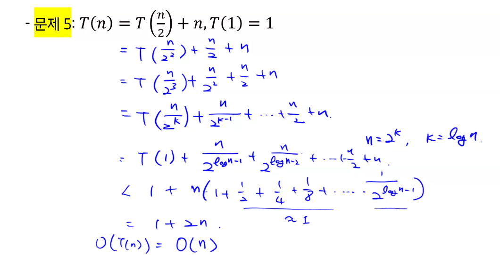

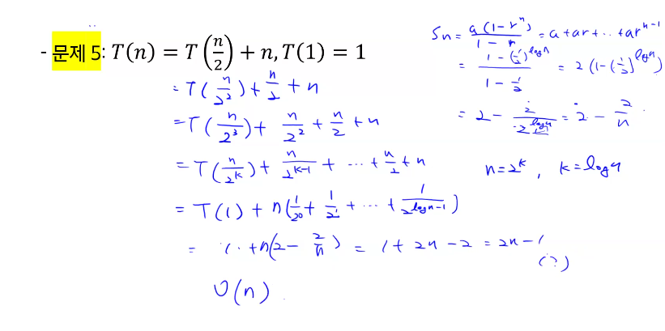

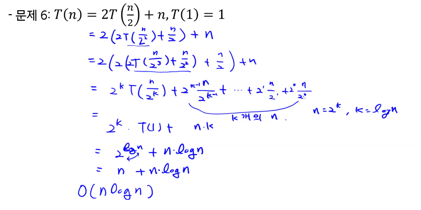

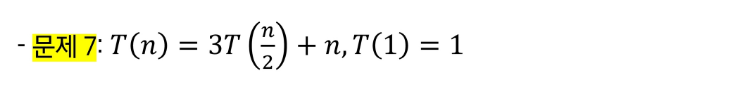

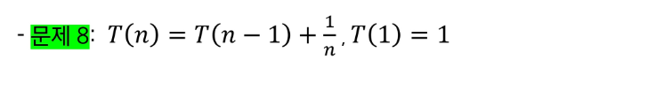

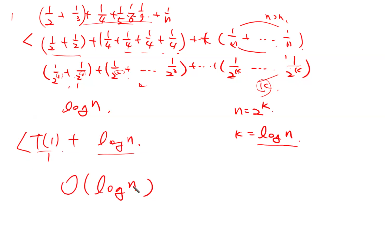


## 5. 재귀

- 약간의 설명

  - 재귀란 자기 자신을 호출하는 함수, 그럼 끝날 수가 있는가?

  - 함수는 입력이 있으며, 자기 자신의 입력과 동일한 압력으로 자기 자신을 호출하면 당연히 끝나지 않음

  - 하지만, 다른 입력으로 호출하면 끝날 수 있음

    ```c
    int abc(int x) 	// 이 함수는 안 끝남
    {
        return abc(x);
    }
    
    int sum(int x)  // 이 함수는 끝남. 결과 값은?
    {
        if (x <= 0) return 0;
        return x + sum(x-1)
    }
    ```

  - 함수란 어떤 문제를 해결하는 방법을 코딩한 것

  - 함수가 어떤 문제의 단 한 케이스만을 해결하는 것이 아님

  - 제대로 코딩된 것이라면 해결하는 문제의 모든 케이스들을 해결해야 함

  - 수학적 귀납법 증명 사용 가능

    (가) n이 0일 때 문제를 풀 수 있음

    (나) n-1에서 문제를 풀 수 있으면 n에서도 문제를 풀 수 있다

    위 두 가지가 사실이면 모든 가능한 n에 대해 문제를 풀 수 있다는 것이 사실

  - 위 박스의 함수 sum()을 보면 정확히 위의 두 가지를 코딩한 것임

  - 따라서, sum() 함수는 문제를 해결한다는 것을 증명할 수 있음

  - 방금 보인 증명은 high-level 증명이며, 상세한 증명은 과정의 첫날에 본 적이 있음

  - 어떤 미스터리한 이유로 문제가 해결되는 것은 아니고, 실제로 프로그램을 돌리면 필요한 계산이 다 일어남. 순차적인 코드에서 일어나는 계산과 완전히 동일. 다만 표현하는 방법이 달라진 것

  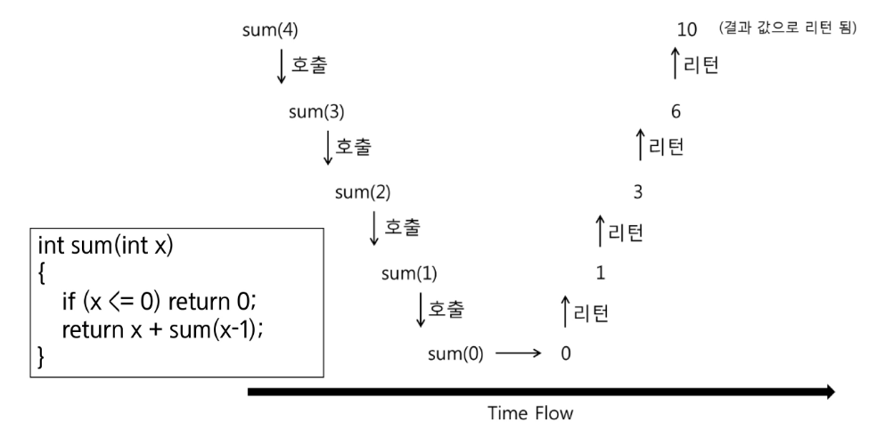

  - 다르게 생각하는 방법: 어떤 문제를 해결하려다 부분 문제를 만났는데, 원래 해결하려던 입력 케이스와 동일한 문제에 속하지만 "크기가 더 작은" 입력 케이스를 해결하는 것이 그 부분 문제였다!
  - 즉, 부분 문제가 동일한 문제인 경우!

  

- 연습 문제들: 다음 문제들을 푸는 재귀 알고리즘을 슈도 코드로 작성하고, 정확성 증명 및 시간 복잡도 계산을 수행하라

  

- 문제 1: 피보나치 수열 - F(n) = F(n-1) + F(n-2), F(1) = F(2) = 1

  ```pseudocode
  Fibo(n){
  	if(n<=2) return 1
  	return fibo(n-1) + fibo(n-2)
  }
  ```

  

- 문제 2: Merge Sort, 크기 n인 배열을 입력으로 받아, 배열을 절반으로 두개로 나눈 후, 각 작은 배열을 재귀적으로 정렬하고, 그 결과를 Merge한다.


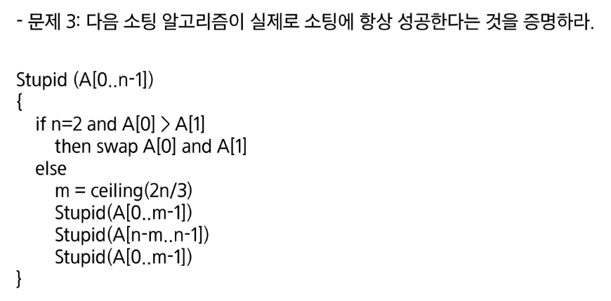


- 문제 4: 위의 소팅 알고리즘에서 수행하는 Swap의 횟수는 최대 몇 번인가?


## 6. 동적 프로그래밍

- 약간의 설명
  - 간단하게 설명하면 재귀 함수에서 동일한 입력의 함수 호출이 반복적으로 일어날 때 그 결과 값을 저장해두고 불러 쓰는 것이다 (Memoization)
  - 최초 입력에서 파생되는 모든 가능한 입력에 대한 답을 모두 저장할 수 있는 메모리가 있어야 한다.
  - 단순히 재귀에서 저장된 값을 찾아보는 것으로도 가능하지만, 결과 값을 순서를 정해서 계산할 수도 있다 (Dynamic Programming)


- 연습 문제들: 다음 문제들을 푸는 동적 프로그래밍 알고리즘을 슈도코드로 작성하고, 정확성 증명 및 시간 복잡도 계산을 수행하라

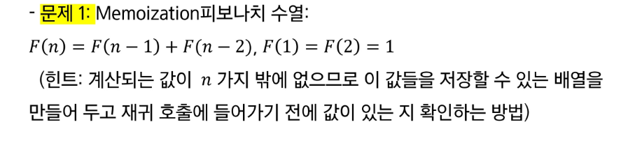

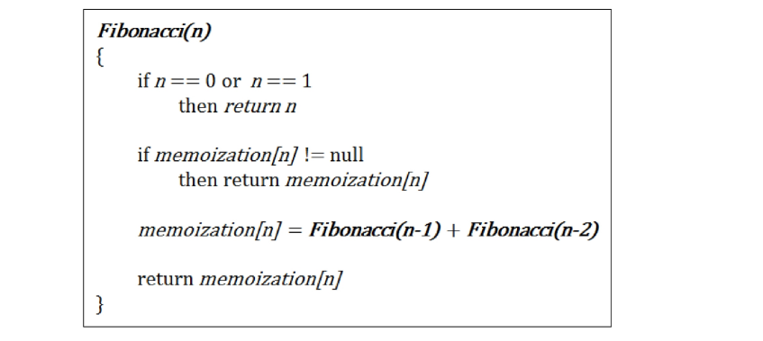


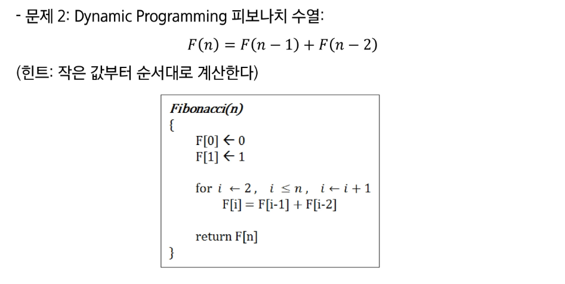