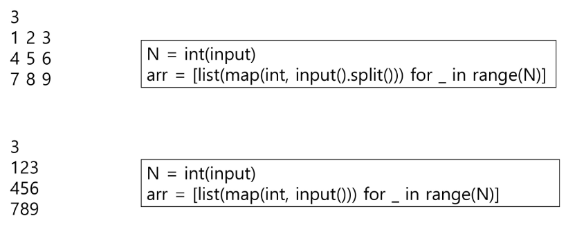
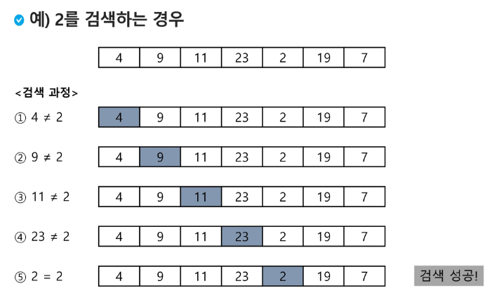
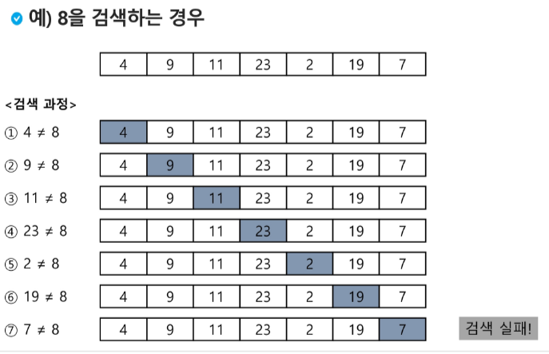
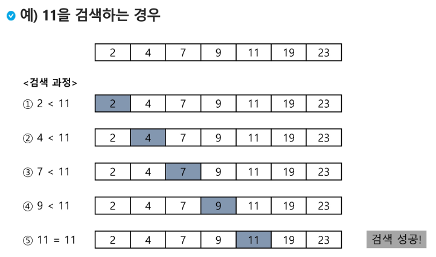
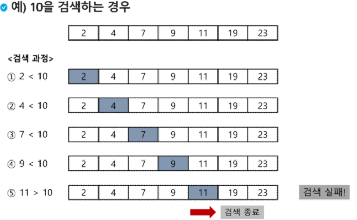
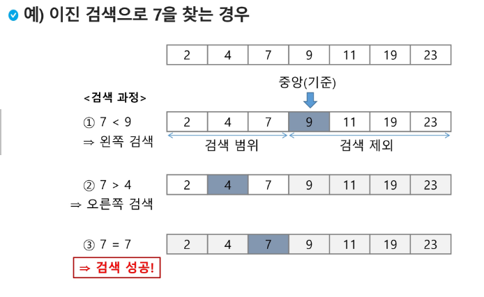

## Array 2

> [강의자료](https://edu.ssafy.com/data/upload_files/crossUpload/openLrn/ebook/unzip/A2022020318223254400/index.html) 2022-02-14


## 2차원 배열

- **2차원 배열의 선언**

  - 1차원 List를 묶어놓은 List
  - 2차원 이상의 다차원 List는 차원에 따라 Index를 선언
  - 2차원 List의 선언 : 세로 길이(행의 개수), 가로 길이(열의 개수)를 필요로 함
  - python에서는 데이터 초기화를 통해 변수선언과 초기화가 가능함

  

  

  

  - **배열 만들 시 주의할 것**

  ```python
  arr[[0]*3]*4
  arr[0][1] = 1
  
  # arr = [[0, 1, 0], [0, 1, 0], [0, 1, 0], [0, 1, 0]]
  # -> 얕은 복사 문제 발생!
  ```

  ```python
  arr = [[0]*3 for _ in range(4)]
  ```

  

- **배열 순회**

  n X m 배열의 n*m개의 모든 원소를 빠짐없이 조사하는 방법

  - <u>행 우선 순회</u>

    ```python
    # i: 행의 좌표 
    # j: 열의 좌표
    for i in range(n):
        for j in range(m):
            Array[i][j] # 필요한 연산 수행
    ```

  - <u>열 우선 순회</u>

    ```python
    # i: 행의 좌표
    # j: 열의 좌표
    for j in range(m):
        for i in range(n):
            Array[i][j]  # 필요한 연산 수행
    ```

  - <u>지그재그 순회</u>

    ```python
    # i: 행의 좌표
    # j: 열의 좌표
    for i in range(n):
        for j in range(m):
            Array[i][j + (m-1-2*j) * (1%2)] # 필요한 연산 수행
            # i % 2: 짝수행에서는 0이 됨
    ```

    ```python
    # 헷갈린다면!
    for i in range(n):
        if i % 2 ==0: # 짝수행
            ...
        else: # 홀수행
            ...
    ```

  

- 앞뒤에 0 추가하고 싶을 때

  ```python
  N = int(input())
  #arr1 = [0] + list(map(int, input().split())) + [0]
  arr2 = [[0]*(N+2)] + [[0]+list(map(int, input().split()))+[0] for _ in range(N)] + [[0]*(N+2)]
  ```

  

- **델타를 이용한 2차 배열 탐색**

  2차 배열의 한 좌표에서 4방향의 인접 배열 요소를 탐색하는 방법

  ```python
  arr[0...N-1][0...N-1] #NxN 배열
  di[] <- [0, 0, -1, 1] #좌우상하
  dj[] <- [-1, 1, 0, 0]
  for i : 1 -> N-1 :
     	for j : 1 -> N-1 :
      	for k in range(4) :
              ni <- i + di[k]
              nj <- j + dj[k]
              if 0 <= ni < N and 0 <= nj < N # 유효한 인덱스면
              	test(arr[ni][nj])
  ```


- **전치 행렬**

  `A[i][j]` 와 `A[j][i]`를 서로 바꾸는 행렬

  ```python
  # i: 행의 좌표, len(arr)
  # j: 열의 좌표, len(arr[0])
  arr = [[1, 2, 3], [4, 5, 6], [7, 8, 9]] # 3*3 행렬
  
  for i in range(3):
      for j in range(3):
          if i < j :
              arr[i][j], arr[j][i] = arr[j][i], arr[i][j]
  ```

  


## 부분집합 합(Subset Sum) 문제

- **부분집합 합(Subset Sum) 문제**

  유한 개의 정수로 이루어진 집합이 있을 때, 이 집합의 부분집합 중에서 그 집합의 원소를 모두 더한 값이 0이 되는 경우가 있는지를 알아내는 문제

  예를 들어, [-7, -3, -2, 5, 8] 라는 집합이 있을 때, [-3, -2, 5]는 이 집합의 부분집합이면서 (-3) + (-2) + 5 = 0 이므로 이 경우의 답은 참이 된다.


- **부분집합 생성하기**

  완전검색 기법으로 부분집합 합 문제를 풀기 위해서는, 우선 집합의 모든 부분집합을 생성한 후에 각 부분집합의 합을 계산해야 한다.

  주어진 집합의 부분집합을 생성하는 방법에 대해서 생각해보자.


- **부분집합의 수**

  집합의 원소가 n개일 때, 공집합을 포함한 부분집합의 수는 2^n개이다.

  이는 각 원소를 부분집합에 포함시키거나 포함시키지 않는 2가지 경우를 모든 원소에 적용한 경우의 수와 같다.


- **각 원소가 부분집합에 포함되었는지를 loop 이용하여 확인하고 부분집합을 생성하는 방법**

  ```python
  bit = [0, 0, 0, 0]
  for i in range(2):
      bit[0] = i	# 0번째 원소
      for j in range(2):
          bit[i] = j	# 1번째 원소
          for k in range(2):		
              bit[2] = k	# 2번째 원소
              for l in range(2):	
                  bit[3] = 1	# 3번째 원소
                  print(subset(bit)	# 생성된 부분집합 출력
  ```

  

- **비트 연산자**

  비트 : 메모리 안에서 구분하는 최소 단위

  ​			(최소 접근 단위는 바이트)

  비트 연산 : 같은 열의 비트 두개끼리만 연산! (비트 단위로 연산)

  `&` : 비트 단위로 AND 연산을 한다

  `|` : 비트 단위로 OR 연산을 한다.

  `<<` : 피연산자의 비트 열을 왼쪽으로 이동시킨다.

  `>>` : 피연산자의 비트 열을 오른쪽으로 이동시킨다.

  

  -  << 연산자

    1 << n : 2^n 즉, 원수가 n개일 경우의 모든 부분집합의 수를 의미한다.

  - & 연산자

    i & (1<<j) : i의 j번째 비트가 1인지 아닌지를 검사한다.


- **보다 간결하게 부분집합을 생성하는 방법**

  ```python
  arr = [3, 6, 7, 1, 5, 4]
  n = len(arr) 	# n : 원소의 개수
  
  for i in range(1<<n):	# 1<<n : 부분집합의 개수
      for j in range(n):	# 원소의 수만큼 비트를 비교함
          if i & (1<<j):	# i의 j번 비트가 1인 경우
              print(arr[j], end = ", ")	# j번 원소 출력
      print()
  print()
  ```

  

## 검색 (Search)

- **검색(Search)**

  저장되어 있는 자료 중에서 원하는 항목을 찾는 작업

  목적하는 탐색 키를 가진 항목을 찾는 것

  ​	-탐색 키(search key): 자료를 구별하여 인식할 수 있는 키

  검색의 종류

  ​	-순차 검색(sequential search), 이진 검색(binary search), 해쉬(hash)


- **순차 검색(Sequential Search)**

  - 일렬로 되어 있는 자료를 순서대로 검색하는 방법

    - 가장 간단하고 직관적인 검색 방법

    - 배열이나 연결 리스트 등 순차구조로 구현된 자료구조에서 원하는 항목을 찾을 때 유용함
    - 알고리즘이 단순하여 구현이 쉽지만, 검색 대상의 수가 많은 경우에는 수행시간이 급격히 증가하여 비효율적임

  - 2가지 경우
    - 정렬되어 있지 않은 경우
    - 정렬되어 있는 경우


- 정렬되어 있지 않은 경우

  - 검색 과정

    - 첫 번째 원소부터 순서대로 검색 대상과 키 값이 같은 원소가 있는지 비교하며 찾는다.
    - 키 값이 동일한 원소를 찾으면 그 원소의 인덱스를 반환한다.
    - 자료구조의 마지막에 이를 때까지 검색 대상을 찾지 못하면 검색 실패

    

  - 찾고자 하는 원소의 순서에 따라 비교회수가 결정됨

    - 첫 번째 원소를 찾을 때는 1번 비교, 두 번째 원소를 찾을 때에는 2번 비교

    - 정렬되지 않은 자료에서의 순차 검색의 평균 비교 회수

      = (1/n)*(1+2+3+...+n) = (n+1)2

    - 시간 복잡도: O(n)

  - 구현 예

    ```pseudocode
    def sequentialSearch(a, n, key)
    	i <-- 0
    	while i<n and a[i]!=key:
    		i <- i+1
        if i<n : return i
        else : return -1
    ```

    

 - 정렬되어 있는 경우

   - 검색 과정

     - 자료가 오름차순으로 정렬된 상태에서 검색을 실시한다고 가정하자.
     - 자료를 순차적으로 검색하면서 키 값을 비교하여, 원소의 키 값이 검색 대상의 키 값보다 크면 찾는 원소가 없다는 것이므로 더 이상 검색하지 않고 검색을 종료한다.

     
   
     
   
   - 찾고자 하는 원소의 순서에 따라 비교회수가 결정됨
   
     - 정렬이 되어있으므로, 검색 실패를 반환하는 경우 평균 비교 회수가 반으로 줄어든다.
     - 시간 복잡도 : O(n)
   
   - 구현 예
   
     ```pseudocode
     def sequentialSearch2(a, n, key)
     	i <- 0
     	while i < n and a[i] < key:
     		i <- i+1
         if i < n and a[i] == key:
         	return i
        	else:
        		return -1
     ```
   
     

- 이전 검색 (Binary Search)

  자료의 가운데에 있는 항목의 키 값과 비교하여 다음 검색의 위치를 결정하고 검색을 계속 진행하는 방법

  목적 키를 찾을 때까지 이전 검색을 순환적으로 반복 수행함으로써 검색 범위를 반으로 줄여가면서 보다 빠르게 검색을 수행함

  이진 검색을 하기 위해서는 자료가 정렬된 상태여야 한다.

  

  - 검색 과정

    - 자료의 중앙에 있는 원소를 고른다.
    - 중앙 원소의 값과 찾고자 하는 목표 값을 비교한다.
    - 목표 값이 중앙 원소의 값보다 작으면 자료의 왼쪽 반에 대해서 새로 검색을 수행하고, 크다면 자료의 오른쪽 반에 대해서 새로 검색을 수행한다.
    - 찾고자 하는 값을 찾을 때까지 ①~③의 과정을 반복한다.

    

    

  - 구현

    - 검색 범위의 시작점과 종료점을 이용하여 검색을 반복 수행한다.
    - 이진 검색의 경우, 자료에 삽입이나 삭제가 발생했을 때 배열의 상태를 항상 정렬 상태로 유지하는 추가 작업이 필요하다.

    ```python
    def binarySearch(a, N, key)
    	start = 0
    	end = N-1
    	while start <= end:
    		middle = (start + end) // 2
    		if a[middle] == key: 	# 검색 성공
    			return true
            elif a[middle] > key:
            	end = middle - 1
            else:
            	start = middle +1
        return false 	# 검색 실패
    ```

  - 재귀 함수 이용

    아래와 같이 재귀 함수를 이용하여 이진 검색을 구현할 수도 있다.

    재귀 함수에 대해서는 나중에 더 자세히 배우도록 한다.

    ```python
    def binarySearch2(a, low, high, key):
        if low > high: # 검색 실패
            return False
        else:
            middle = (low + high) // 2
            if key == a[middle] : 검색 성공
                return True
            elif key < a[middle] :
                return binarySearch2(a, low, middle-1, key)
            elif a[middle] < key :
                return binarySearch2(a,middle+1, high, key)
    ```

    


## 인덱스