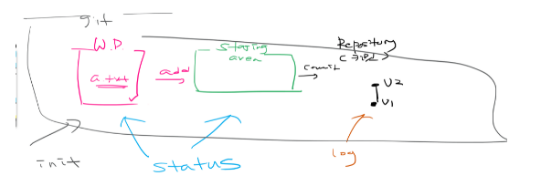
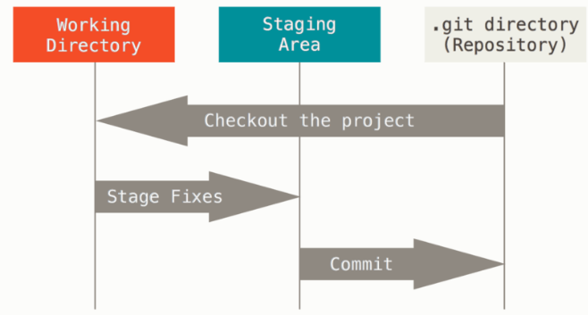
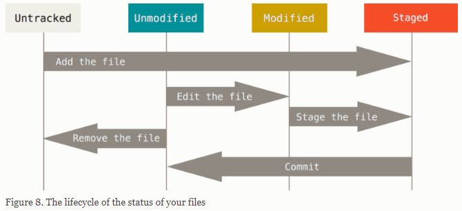

# 📑 Git

>  분산 버전 관리 시스템(DVCS)

- 전체적 사용법 참고 [Git guidebook(kor)](https://git-scm.com/book/ko/v2)
- [Git의 기초: Git 수정하고 저장소에 저장하기](https://git-scm.com/book/ko/v2/Git%EC%9D%98-%EA%B8%B0%EC%B4%88-%EC%88%98%EC%A0%95%ED%95%98%EA%B3%A0-%EC%A0%80%EC%9E%A5%EC%86%8C%EC%97%90-%EC%A0%80%EC%9E%A5%ED%95%98%EA%B8%B0)
- Who made Git?
  - Linus Torvalds [Ref. Torvalds in Google](https://youtu.be/4XpnKHJAok8)
- git과 관련된 모든 명령은 [git init](##Git 저장소 만들기)으로 시작 -> .git이라는 숨김 폴더 생성됨
- git이 여기에 모든 정보를 저장할 거지만 우리는 신경 쓰지 않는다!


## ✔ Git 저장소 만들기

### Init

>  Create an empty Git repository or reinitialize an existing one

```bash
$ git init
Initialized empty Git repository in C:/Users/drsuneamer/Desktop/first/.git/
```

- `.git`이라는 폴더 생성 -> 버전이 기록되는 저장소
  - 해당 폴더를 지우게 되면 모든 버전이 삭제되니 주의!


## ✔ 버전 기록하기

### add

> add file contents to the index

```bash
$ git add 파일명
$ git add a.txt
$ git add my_folder
$ git add a.txt b. txt (여러 개의 파일도 가능)
```

### commit

> Record changes to the repository

```bash
$ git commit -m '커밋메시지'
```

- 커밋 메시지는 항상 버전의 내용(변경사항)에 대해서 나타낼 수 있도록 기록한다.
- 각 커밋은 고유한 값을 가지고 있다. (SHA-1 알고리즘)

Q. 왜 굳이 add와 commit 두 개의 과정을 거쳐야 할까?

​	working directory(working tree) / staging area(index) / repository(commit 기록)


### Status

> Show the working tree status

```bash
$ git status

# 커밋할 변경사항들 (staging area)
Changes to be committed:
	(use "git restore --staged <file>..." to unstage)
		deleted: b.txt
	
# 커밋을 위한 준비가 되지 않은 변경 사항 (not in staging area -> in working directory)
Changes not staged for commit:
	(use "git add <file>..." to update what will be committed)
	(use "git restore <file>..." to discard changes in working directory)
		modified: a.txt

# 트래킹되지 않은 파일들 (working directory) not even been added at all
Untracked files:
	(use "git add <file>..." to include in what will be committed)
		c.txt
```


- 파일을 조작하는 방법에는 총 4가지가 있다.
  - 생성 Create	
  - ~~읽기 Read~~
  - 수정 Update
  - 삭제 Delete

```bash
$ git status
On branch master
Changes to be committed:
  (use "git restore --staged <file>..." to unstage)
        deleted:    b.txt
        new file:   c.txt

Changes not staged for commit:
  (use "git add <file>..." to update what will be committed)
  (use "git restore <file>..." to discard changes in working directory)
        modified:   a.txt
```


### Log

> Show commit logs

````bash
$ git log
````


## ✔ Git 파일의 라이프사이클

- untracked: 커밋에 포함된 적 없는 파일
- tracked
  - modified: 이전 커밋에 비해 수정된 경우
  - staged: 커밋 되기 전 목록에 있음 (staging area)
  - committed: commit된 (이후로 어떠한 변화도 없는) 상태








## ✔ 원격 저장소 활용 (Github_remote repository)

### basic usage

#### 조회

```bash
$ git remote -v
origin https://github.com/edutak/first.git (fetch)
origin https://github.com/edutak/first.git (push)
```

- fetch: 불러옴 / push: 보냄

#### 추가

```bash
$ git remote add <원격저장소이름> <url>
$ git remote add origin https://github.com/username/repository.git
```

- `origin` : 일반적으로 많이 활용되는 원격저장소 이름

#### 삭제

```bash
$ git remote rm <원격저장소이름>
$ git remote rm origin
```


### push

> Update remote refs along with associated objects

```bash
$ git push <원격저장소이름> <브랜치이름>
$ git push origin master
```


### pull

> Fetch from and integrate with another repository or a local branch

```bash
$ git pull <원격저장소이름> <브랜치이름>
$ git pull origin master
```


### clone

> Clone a repository into a new directory

```bash
$ git clone <원격저장소주소>
$ git clone https://github.com/username/repository.git
```

- 원격저장소 이름의 폴더가 생성됨 (모든 버전의 기록이 들어 있다)

## Etc.

- 화면 초기화: `Ctrl + l`

- 사용법 확인

  ````bash
  $ git
  ````


- 명령하기 전에 꼭 위치 확인하자!

- .git 폴더를 삭제하거나 옮기면 안 된다! (다른 파일들은 수정과 이동 가능)

  - example

  ```
  quiz/
  	.git
  	a.txt
  	my_folder/
  	
  project/
  	.git
  	a.py
  	b.py
  	
  내 폴더/
  	마케팅
  	..
  ```

  - quiz 폴더 이름을 변경해도 되는가? O
  - quiz 폴더 이름 변경에 대한 기록이 남는가? X

  - 폴더 내부의 변경사항을 관리하는 것임

- quiz 폴더 위치를 변경해도 되는가? △
  - project에는 이동 X
    - .git 프로젝트 저장소로 옮기는 경우 내부에서 동작이 복잡하게 진행
    - .git으로 관리되는 리포지토리가 하나의 폴더 안에서 두 개가 존재하게 됨
  - 내 폴더는 이동 O 언제든지!
  - 다른 .git이 있는 곳으로는 하지 말자!
- my_folder는 지우면 복원 가능한가? △
  - 커밋된 변경사항은 무조건 복원 가능!
  - 커밋되지 않은 경우는 절대 불가능!
- 만약 .git 폴더가 있는 저장소 내부에서 새롭게 .git을 만들어도 되나요? X
  - 하지 말자!
  - `git init` 명령어를 입력하려고 하는데 `(master)`가 있다? 다시 생각해보자! (이미 있다는 뜻)

- tensorflow: 여러 이슈들 볼 수 있음

- fetch vs pull
  - fetch: 받아오기만 한다
  - pull: fetch + mergegit 
