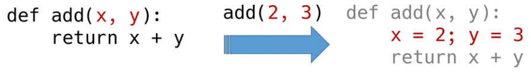
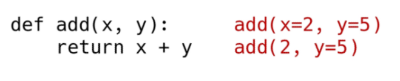
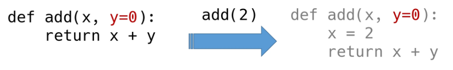
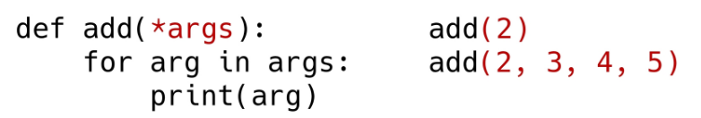
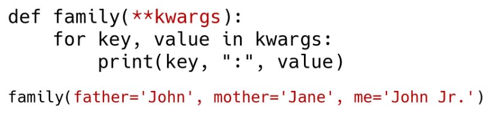
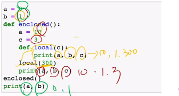
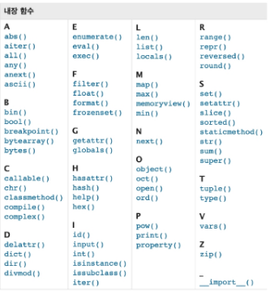

# 02_01. 함수 Function

[강의자료](https://edu.ssafy.com/data/upload_files/crossUpload/openLrn/ebook/unzip/A2022011415270185600/index.html) 2022-01-19

- 함수 식은 대부분 구문으로 유도 가능

  - len([1, 2, 3]) 

    ```python
    numbers = [1, 2, 3]
    count = 0
    for i in [1, 2, 3]:
        count += 1
    print(count)
    ```

    3

  - sum([1, 2, 3])

    ```python
    numbers = [1, 2, 3]
    result = 0
    for i in [1, 2, 3]:
        result += i
    print(result)
    ```

    6

- 그렇다면, 왜 함수를 만들었을까?

  1) **Decomposition**

     - 기능을 분해하고 재사용 가능하게 만든다!
     - 더 간결하게 할 수 있으면서 행위를 분할하여, 다른 곳에서 할 수 있음
     - 로직을 분해하여 재사용하겠다!

  2) **Abstraction** 추상화

     - 추상(抽象): 사물이 지니고 있는 여러 가지 측면 가운데서 특정한 측면만을 가려내어 포착하는 것
     - 복잡한 내용을 모르더라도 사용할 수 있도록(블랙박스)
     - 재사용성과 가독성, 생산성

     - print 등의 함수는 우리가 구현하기 어려움 -> 하지만 사용 가능!

- 학습목표

  - 내장 함수

  - 사용자 정의 함수 

    

## 함수 기초

> 함수의 동작 원리를 이해하자!

### - 함수의 정의

- 함수(Function)	
  - 특정한 <u>기능</u>을 하는 코드의 조각(묶음)
  - 특정 명령을 수행하는 코드를 <u>매번 다시 작성하지 않고</u>, 필요 시에만 <u>호출</u>하여 간편히 사용
  - E = Mc^2  *Error  = More Code* ** 2

- **사용자 함수(Custom Function)**

  - 구현되어 있는 함수가 없는 경우 사용자가 직접 함수를 작성 가능

    ```python
    def function_name(parameter):
        # code block
        return returning_value
    ```

- 함수를 사용해야 하는 이유

  - 로직을 파악하는 데 시간이 오래 걸림

  - 재사용이 가능한가? -> 쉽지 않다!

  - 내장함수(Built-in Function 활용)

  - pstdev 함수(파이썬 표준 라이브러리 - statistics) -> 통계를 모르더라도 사용 가능

    ```python
    # 코드 중복 방지, 재사용 용이
    import statistics
    values = [100, 75, 85, 90, 65]
    statistics.pstdev(values)
    ```

- 함수의 기본 구조


## **선언과 호출 define & call** 

- 함수의 선언은 **def** 키워드를 활용함
  - 들여쓰기를 통해 **Function body**(실행될 코드 블록)를 작성함

    - Docstring은 함수 body 앞에 선택적으로 작성 가능
      - 작성 시에는 반드시 첫 번째 문장에 문자열 ''' '''


- 함수는 **parameter**를 넘겨줄 수 있음


- 함수는 동작 후에 **return**을 통해 결과값을 전달함

  - 함수는 함수명()으로 호출

    - parameter가 있는 경우, 함수명(값1, 값2, ... )로 호출

      ```python
      #정의(선언)
      def add(x, y):
          return x + y
      
      #호출 
      add(2, 3)
      ```


- 함수는 호출되면 코드를 실행하고 return 값을 반환하며 종료된다


- 실습 문제

  - 입력 받은 수를 세제곱하여 반환하는 함수 cube를 작성하시오.

    ```python
    # 숫자를 받아서 (input)
    # 세제곱 결과를 반환 (output)
    # 호출 : cube(2), cube(10)
    
    def cube(number):
        # n = 2 (cube(2)가 실행되었을 때 상상할 상황)
        return number ** 3
    ```

  - 함수 cube를 활용하여 2의 세제곱, 100의 세제곱을 구하시오.

    ```python
    print(cube(2))   # n에 2가 바인딩되었다고 생각!
    print(cube(100))
    ```

    

## 함수의 결과값 Output

> 반드시 '하나'의 객체 반환 (0? None / , , ? Tuple)

### - 값에 따른 함수의 종류

- **Void Function** : 빈 공간 / 무효
  
  - <u>명시적인 return 값</u>이 없는 경우, None을 반환하고 종료
  
- **Value returning function** : <u>값 자체</u>를 반환
  
  - 함수 실행 후, return문을 통해 값 반환
  - return을 하게 되면, 값 반환 후 함수가 바로 종료
  
  ```python
  # Value returning function
  float('3.14')
  ```
  
  3. 14
  
- 주의! return vs print
  - return은 <u>함수 안에서만</u> 사용되는 키워드
  - print는 <u>출력을 위해</u> 사용되는 함수 -> 직접 값을 보려고!
  - REPL(Read-Eval-Print Loop) 환경에서는 마지막으로 작성된 코드의 리턴 값을 보여주므로 같은 동작을 하는 것으로 착각할 수 있음 (Jupyter Notebook 등)

### - 두 개 이상의 값 반환

- 아래 코드의 문제점은 무엇일까?

  ```python
  def minus_and_product(x, y):
      return x - y
  	return x * y
  ```

  ```python
  # 파이썬은 위에서부터 동작한다. return을 만나면 종료!
  y = minus_and_product(4, 5)
  y
  ```

  -1

  - 함수는 항상 단일한 값만을 반환
  - 그렇다면, return문을 한번만 사용하면서 두 개 이상의 값을 반환하는 방법은?

### - 튜플 반환

- 반환 값으로 튜플 사용 (내부적으로 튜플이 많이 사용되고 있다!)

  ```python
  def minus_and_product(x, y):
      return x - y, x * y
  ```

  ```python
  y = minus_and_product(4, 5)
  y
  ```

  (-1, 20)

  ```python
  type(y)
  ```

  tuple

### - 값 반환 외 return문의 용도

- 함수 빠져나가기
  - <u>return을 하게 되면, 값 반환 후 함수가 바로 종료</u>
  - 함수를 빠져나갈 때, return문을 사용

- 실습 문제 - 사각형 넓이

  - 너비와 높이를 입력 받아 사각형의 넓이와 둘레를 튜플로 반환하는 함수 rectangle을 작성하시오.

  - 함수 rectangle을 활용하여 아래의 사각형의 넓이와 둘레를 구하시오.

    ```python
    def rectangle(width, height):
        return width * height, (width + height) * 2
    
    print(rectangle(30, 20))
    ```

    (600, 100)          # 하나의 튜플로 출력됨


## 함수의 입력 Input

> 호출 (위치, 키워드) / 정의 (필수, 선택, 多)

### - Parameter와 Argument

- **Parameter** : 함수를 실행할 때(<u>이름을 지어줄 때</u>), 함수 내부에서 사용되는 식별자
- **Argument** : 함수를 <u>호출할 때</u>, 넣어주는 값

```python
def function(ham): #parameter : ham
    return ham

function('spam') # argument : spam
```

- Argument란?
  - 함수 호출 시 함수의 parameter를 통해 전달되는 값
  - Argument는 소괄호 안에 할당 func_name(argument)
    - 필수 Argument : 반드시 전달되어야 하는 argument
    - 선택 Argument : 값을 전달하지 않아도 되는 경우는 기본 값이 전달

### - Positional Arguments

- 기본적으로 함수 호출 시 Argument는 <u>위치</u>에 따라 함수 내에 전달됨

  (위에서부터 순서대로 적용)

- 내부에서 바인딩된다고 생각



### - Keyword Arguments

- [호출]
- 직접 변수의 이름으로 특정 Argument를 전달할 수 있음
- <u>Keyword Argument 다음에  Positional Argument를 활용할 수 없음</u>



### - Default Arguments Values

- [정의]

- 기본값을 지정하여 함수 호출 시 argument 값을 설정하지 않도록 함

  (선택적으로 받을 수 있게 함)

  - 정의된 것 보다 더 적은 개수의 argument들로 호출될 수 있음



### - Positional Arguments Packing/Unpacking

- Positional Arguments Packing/Unpacking 연산자 (*)
  - 여러 개의 Positional Argument를 하나의 필수 parameter로 받아서 사용
- 언제 사용하는가?
  - 몇 개의 Positional Argument를 받을지 모르는 함수를 정의할 때 유용



### - Key Arguments Packing/Unpacking

- Key Arguments Packing/Unpacking 연산자(**)
  - 함수가 임의의 개수 Argument를 Keyword Argument로 호출될 수 있도록 지정
  - Argument들은 **딕셔너리**로 묶여 처리되며, Parameter에 **를 붙여 표현
  - Argument 입력 시 ''가 아닌 =임을 주의하자!



### - 주의 사항

- 함수 정의 주의 사항

  - 기본 argument값을 가지는 argument 다음에 기본 값이 없는 argument로 정의할 수 없음
  
  ```python
  def greeting(name : 'john doe', age):
  
  # SyntaxError: non-default argument follows default argument
  ```
  
- 함수 호출 주의 사항

  - keyword argument 다음에 positional argument를 활용할 수는 없음

  ```python
  add(X=3, 5)
  # SyntaxError: positional argument follows keyword argument
  ```

  

## 함수의 범위 Scope

- 함수는 코드 내부에 **local scope**를 생성하며, 그 외의 공간인 **global scope**로 구분
- scope
  - global scope: 코드 어디에서든 참조할 수 있는 공간
  - local scope: 함수가 만든 scope. <u>함수 내부</u>에서만 참조 가능

- variable
  - global variable: global scope에 정의된 변수
  - local variable: local scope에 정의된 변수

### - 변수 수명주기

- 변수는 각자의 수명주기(lifecycle)가 존재
  - built-in scope
    - 파이썬이 실행된 이후부터 영원히 유지
  - global scope
    - 모듈이 호출된 시점 이후 혹은 인터프리터가 끝날 때까지 유지
  - local scope
    - 함수가 호출될 때 생성되고, 함수가 종료될 때까지 유지

### - 이름 검색 규칙

- 파이썬에서 사용되는 이름(식별자)들은 이름공간(namespace)에 저장되어 있음

- 아래와 같은 순서로 이름을 찾아나가며, LEGB Rule이라고 부름

  - Local scope : 함수
  - Enclosed : 특정 함수의 상위 함수
  - Global scope : 함수 밖의 변수, Import 모듈
  - Built-in scope : 파이썬 안에 내장되어 있는 함수 또는 속성

- 즉, 함수 내에서는 바깥 Scope의 변수에 접근 가능하나 수정은 할 수 없음

  



### - global문

- 현재 코드 블록 전체에 적용되며, 나열된 식별자(이름)가 global variable임을 나타냄
  - global에 나열된 이름은 같은 코드 블록에서 global 앞에 등장할 수 없음
  - global에 나열된 이름은 parameter, for 루프 대상, 클래스/함수 정의 등으로 정의되지 않아야 함

```python
# 함수 내부에서 글로벌 변수 변경하기
a = 10
def funt1():
    global a
    a = 3
    
print(a)   # 10
func1()
print(a)   # 3
```


### - nonlocal

- global을 제외하고 가장 가까운 (둘러 싸고 있는) scope의 변수를 연결하도록 함
  - nonlocal에 나열된 이름은 같은 코드 블록에서 nonlocal 앞에 등장할 수 없음
  - nonlocal에 나열된 이름은 parameter, for 루프 대상, 클래스/함수 정의 등으로 정의되지 않아야 함
- global과는 달리 이미 존재하는 이름과의 연결만 가능함

- nonlocal은 이름공간상에 존재하는 변수만 가능

- 예시 : elclosed scope(func1)의 변수 x의 변경

  ```python
  x = 0
  def func1():
      x = 1
      def func2():
          nonlocal x
          x = 2
      func2()
      print(x)
      
  func1()
  prinx(x)
  ```

  

###  - 주의 

- 기본적으로 함수에서 선언된 변수는 Local scope에 생성되며, 함수 종료 시 사라짐
- 해당 scope에 변수가 없는 경우 LEGB rule에 의해 이름을 검색함
  - 변수에 접근은 가능하지만, 해당 변수를 수정할 수는 없음
  - 값을 할당하는 경우 해당 scope의 이름공간에 새롭게 생성되기 때문
  - 단, 함수 내에서 필요한 상위 scope 변수는 argument로 넘겨서 활용할 것 (클로저 제외)
    - 클로저 : 어떤 함수 내부에 중첩된 형태로써 외부 scope 변수에 접근 가능한 함수
- 상위 scope에 있는 변수를 수정하고 싶다면 global, nonlocal 키워드를 활용 가능
  - 단, 코드가 복잡해지면서 변수의 변경을 추적하기 어렵고, 예기치 못한 오류가 발생
  - 가급적 사용하지 않는 것을 권장하며, 함수로 값을 바꾸고자 한다면 항상 argument로 넘기고 리턴 값을 사용하는 것을 추천


### - 범위 확인하기

- globals()와 locals()
  - namespace(global, locala, builtin)을 딕셔너리(dict)으로 정리
    - locals(): locals()가 실행되어지는 함수 내의 local namespace들을 정리
    - globals(): global, local, buitin 정보 모두 dict 형태로 정리
    - 

## 함수의 문서화 Doc-string

- Document String
  - 함수나 클래스의 설명
  - Jupyter notebook에서 함수에 커서를 놓고 `shift` + `tab`


### - Naming Convention

- 좋은 함수와 parameter 이름을 짓는 방법
  - 상수 이름은 영문 전체를 대문자
  - 클래스 및 예외의 이름은 각 단어의 첫 글자만 영문 대문자
  - 이외 나머지는 소문자 또는 밑줄로 구분한 소문자 사용 -> 함수

- 스스로를 설명
  - 함수의 이름만으로 어떠한 역할을 하는 함수인지 파악 가능해야 함
  - 어떤 기능을 수행하는지, 결과 값으로 무엇을 반환하는지 등
- 약어 사용을 지양
  - 보편적으로 사용하는 약어를 제외하고 가급적 약어 사용을 지양


## 함수 응용

### - 내장 함수

> Built-in Functions

- 파이썬 인터프리터에는 항상 사용할 수 있는 많은 함수와 형(type)이 내장되어 있음




#### 1) map

```python
map(function, iterable)
# function : 각 요소에 적용하고 싶은 함수의 이름을 넣는다.
```

- 순회 가능한 데이터구조(iterable)의 모든 요소에 함수(function) 적용하고, 그 결과를 map object로 반환

  ```python
  numbers = [1, 2, 3]
  result = map(str, numbers)
  print(result, type(result))
  ```

  <  map object at 0x10e2ca100 > < class 'map'  >

  ```python
  # 리스트 형 변환을 통해 결과 직접 확인
  list(result)
  ```

  ['1', '2', '3']

- 활용 사례

  - 알고리즘 문제 풀이 시 input 값들을 숫자로 바로 활용하고 싶을 때

    ```python
    n, m = map(int, input().split())
    ```

    

#### 2) filter

```python
filter(function, iterable)
```

- 순회 가능한 데이터구조(iterable)의 모든 요소에 함수(function) 적용하고, 그 결과가 <u>True</u>인 것들을 filter object로 반환

  ```python
  def odd(n):
      return n % 2
  numbers = [1, 2, 3]
  result = filter(odd, numbers)
  print(result, type(result))
  ```

  <filter object at 0x10e4dfc10>  <class 'filter'>

  ```python
  # 리스트 형 변환을 통해 결과 직접 확인
  list(result)
  ```

  [1, 3]

  

#### 3) zip

```python
zip(*iterables)
```

- 복수의 iterable을 모아 튜플을 원소로 하는 zip object를 반환

  ```python
  girls = ['jane', 'ashley']
  boys = ['justin', 'eric']
  pair = zip(girls, boys)
  print(pair, type(pair))
  ```

  <zip object at 0x10e500c80> <class 'zip'>

  ```python
  # 리스트 형 변환을 통해 결과 직접 확인
  list(pair)
  ```

  [('jane', 'justin'), ('ashley', 'eric')]


### - lambda 함수

```python
lambda [parameter] : 표현식
```

- 람다 함수

  - 표현식을 계산한 결과값을 반환하는 함수로, 이름이 없는 함수여서 익명함수라고도 불림

    ```python
    # 삼각형의 넓이를 구하는 공식 - 람다
    triangle_area = lambda b, h : 0.5 * b * h
    triangle_area(5, 6)
    ```

    15.0
    
  - 특징
  
    - return문을 가질 수 없음
    - 간편 조건문 외 조건문이나 반복문을 가질 수 없음
  
  - 장점
  
    - 함수를 정의해서 사용하는 것보다 간결하게 사용 가능
  
    - def를 사용할 수 없는 곳에서도 사용 가능
  
      

### - 재귀 함수

> recursive function

- **자기 자신을 호출하는 함수**

- 무한한 호출을 목표로 하는 것이 아니며, 알고리즘 설계 및 구현에서 유용하게 활용
  - 알고리즘 중 재귀 함수로 로직을 표현하기 쉬운 경우가 있음(ex. 점화식)
  - 변수의 사용이 줄어들며, 코드의 가독성이 높아짐
  
- 1개 이상의 base case(종료되는 상황)가 존재하고, 수렴하도록 작성

- 예시: Factorial

  ```python
  def factorial(n):
      if n == 0 or n == 1:
          return 1
      else:
          return n * factorial(n-1)
  factorial(4)
  ```

  24

  

- 주의 사항
  - 재귀 함수는 base case에 도달할 때까지 함수를 호출함
  
  - 메모리 스택이 넘치게 되면(stack overflow) 프로그램이 동작하지 않게 됨
  
  - 파이썬에서는 최대 재귀 깊이(maximum recursion depth)가 1,000번으로, 호출 횟수가 이를 넘어가게 되면 Recursion Error 발생
  
    
  
- 반복문으로도 작성 가능
  
  ```python
  def fact(n):
      result = 1
      while n > 1:
          result *= n 
          n -= 1
      return result
  ```
  
  
  
- 반복문과 재귀 함수 비교
  - 알고리즘 자체가 재귀적인 표현이 자연스러운 경우 재귀함수를 사용함
  - 재귀 호출은 변수 사용을 줄여줄 수 있음
  - 재귀 호출은 입력 값이 커질수록 연산 속도가 오래 걸림


